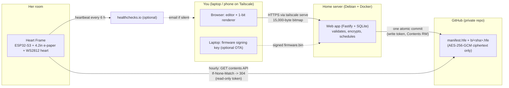
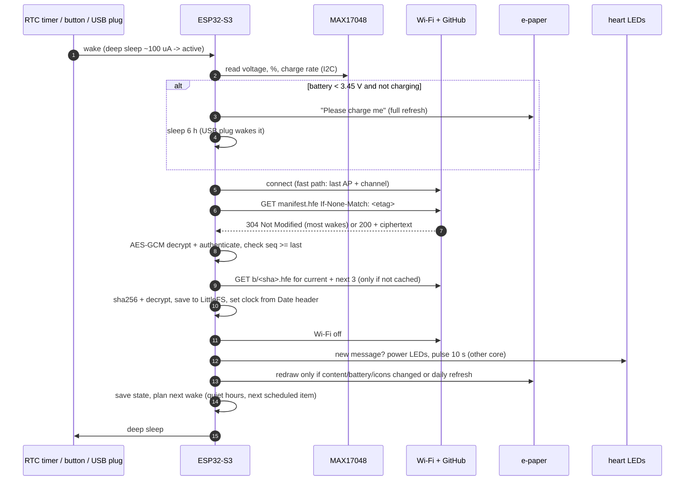

# Heart Frame: Build Guide

*A battery-powered e-paper message frame with a glowing pink heart. The project runs from September 23, 2026, when this guide was written. Everything should be finished and tested by early December, ready to give on December 25.*

This guide starts from your draft plan and corrects it. It has three kinds of content:

1. A **review of your plan** listing every problem I found and what I changed.
2. The **corrected design**: parts, wiring, power budget, the full firmware, the full web app, the GitHub setup, security and safety, and the enclosure.
3. The **process**: a build order with test milestones, a dated timeline, and a hand-off section for after she has it.

All the code is in this document. The same files are also in the `heartframe/` bundle next to it, laid out as the monorepo, so you don't have to copy and paste. Before writing this guide I verified the code as follows:

- **Firmware:** compiles cleanly (no warnings in our code) for both Feather variants with PlatformIO + pioarduino (Arduino-ESP32 3.3.11, ESP-IDF 5.5.5).
- **Firmware core logic** (file formats, AES-GCM, ECDSA, manifest parsing, DST-safe scheduling): about 50 checks pass on a PC under AddressSanitizer and UBSan. The C++ decryptor reads files produced by the web app's TypeScript encryptor, so the two sides are known to agree.
- **Web app:** type-checks, builds, and passes 27 tests. These include an end-to-end test that publishes to a fake GitHub and decrypts the result the way the frame would. I also drove the UI in a real Chromium browser and checked the rendering.
- **Provisioning script:** tested against a simulated serial device.
- **OTA signing tool:** tested on a real `firmware.bin`.
- **Enclosure:** every part and variant (inserts / nuts / self-tapping, 18650 / pouch, SLA / FDM clearances) renders to a watertight STL in OpenSCAD 2021.01, the version Fedora ships.

**Not tested:** real hardware. Everything that depends on the physical parts is gated by a test milestone in the build order.

## Assumptions (tell me if any are wrong)

| Assumption | If it's wrong |
|---|---|
| The frame lives at her family's home, on ordinary 2.4 GHz WPA2/WPA3-Personal Wi-Fi with no sign-in page. | Campus/eduroam (WPA2-Enterprise) or hotel-style sign-in pages don't work with ESP32 captive-portal setup. Fix: a small travel router (e.g. GL.iNet) in repeater mode that presents a normal WPA2 network. |
| Your always-on Debian/CasaOS box runs Docker, and you'll use Tailscale. | Any Docker host works. Without Tailscale, use LAN only with `COOKIE_SECURE=false`, which is weaker; see §9.6. |
| Your leftover LEDs are **5 V WS2812B** (3 pins: 5V, DIN, GND). | 12 V strips (WS2811/WS2815) won't run from a single Li-ion cell, so buy 4 WS2812B pixels. RGBW (SK6812) needs `LED_ORDER` changed plus small code changes, so avoid it. A 2-minute check is in §6. |
| Parts budget is about CAD $150–250 plus tools. | Cheaper alternatives are listed in the BOM. |

## Contents

1. [Review of your plan](#1-review-of-your-plan)
2. [Overview, architecture and final design decisions](#2-overview-architecture-and-final-design-decisions)
3. [Bill of materials](#3-bill-of-materials)
4. [Tools and a soldering primer](#4-tools-and-a-soldering-primer)
5. [Power budget and battery life](#5-power-budget-and-battery-life)
6. [Wiring, pinout and the LED power switch](#6-wiring-pinout-and-the-led-power-switch)
7. [Build order with test milestones](#7-build-order-with-test-milestones)
8. [Firmware (full source)](#8-firmware-full-source)
9. [Web app (full source, Docker)](#9-web-app-full-source-docker)
10. [GitHub: repos, formats, tokens](#10-github-repos-formats-tokens)
11. [Security and safety](#11-security-and-safety)
12. [Enclosure](#12-enclosure)
13. [Testing, failure modes and timeline](#13-testing-failure-modes-and-timeline)
14. [Hand-off: her Wi-Fi, daily use, adding messages](#14-hand-off-her-wi-fi-daily-use-adding-messages)
15. [Sources](#15-sources)

## 1. Review of your plan

Your plan's architecture holds up: a private GitHub repo as the mailbox, a sleepy ESP32, and pre-rendered 1-bit bitmaps. The frame then never depends on your home server being on, which matters given the auto-power-on trouble that box has had. Keep all of that.

What needed fixing is mostly in the details. Three items would have broken the gift outright:

- **Pinned root certificate.** GitHub's certificate authority is changing roots during 2026–27, so pinning today's root is a time bomb.
- **Token expiry with nothing but OTA to fix it.** A long-lived fine-grained token expires, and OTA itself needs that token to download anything.
- **Generic ESP32 dev boards.** They draw milliamps in "sleep" and flatten the battery in about two weeks.

Severity: **Critical** = would break the gift or be unsafe. **High** = likely to bite. **Medium** = worth doing. **Low** = polish or decision.

| # | Area | In your draft | Problem or gap | Severity | What I did |
|---|---|---|---|---|---|
| 1 | TLS | "root cert strategy" for GitHub HTTPS | Pinning one root CA is a time bomb. GitHub's current CA, Sectigo, is retiring its USERTrust roots: Chrome stops trusting new certificates from them after **2026-06-15** and fully distrusts them on **2027-04-15**. New certificates already come from different roots. A pinned root means the frame stops connecting on some future certificate renewal, and it can't receive a fix over the air either. | **Critical** | The firmware validates against the **full Mozilla root bundle** that ships inside the Arduino-ESP32 core (`esp_crt_bundle`), with hostname checks. Nothing is pinned. A firmware update built on a newer Arduino core refreshes the bundle (OTA, M8). |
| 2 | Tokens | Longest expiry + calendar reminders + replace via OTA/re-provisioning | A fine-grained token expires, and OTA is the "fix", but OTA needs that same token to download. If you miss the reminder, the only fix is visiting with a laptop. GitHub also auto-revokes a token that is pushed to a public repo, or that goes unused for a year. | **Critical** | **In-band rotation.** Paste a new token into the web app and it travels to the frame inside the *encrypted, authenticated* manifest. The frame tests it before switching. No OTA needed. Since Oct 2024, fine-grained tokens for personal repos may have **no expiration**. That's my recommendation for the read-only device token, for the reasons in §10. The server's write token gets 1 year, and the web app warns you 30 days before it expires. |
| 3 | Board | "ESP32" (unspecified) | Common dev boards draw **4.7–9.4 mA** in "deep sleep" (measured: NodeMCU-32S 4.7 mA, LilyGO OLED 9.4 mA) because of their always-on LDO, USB-UART chip and LEDs. That empties 2200 mAh in 8–17 days. | **Critical** | **Adafruit ESP32-S3 Feather**: LiPo charger, USB-C, **MAX17048 fuel gauge built in**, about 100 µA in deep sleep. Also buy a spare. §5 compares boards. |
| 4 | Heart LEDs | WS2812 on the battery, MOSFET "preferably" | WS2812B needs VDD ≥ 3.5 V, and a Li-ion cell ends around 3.3 V. Idle pixels draw about 0.5–1 mA each even when dark. Switching their **ground** with an N-MOSFET back-powers them through the data pin. | High | A **high-side P-MOSFET switch** (AO3401A driven by a 2N7000) with soft-start, and a resettable fuse on the LED line. The data line is held low or floating whenever power is off. The firmware skips the pulse below 3.6 V. The data signal at 3.3 V is within spec because the LEDs run from the battery (VIH = 0.7 × VDD ≤ 2.94 V). |
| 5 | Heart LEDs | "leftover RGB LEDs" | Leftovers might be 12 V strips (WS2811/WS2815) or RGBW (SK6812). Those won't work, or will show the wrong colours. | Medium | A 2-minute identification check (§6). You need 4 pixels. |
| 6 | Fuel gauge | MAX17048 or voltage lookup curve? | MAX17048 is right: roughly ±5 % instead of ±15 % from a voltage curve. But the popular Arduino library's `begin()` **resets the gauge** on every wake. That throws away its learned state, and the first reading after a reset can be wrong. | High | Use the Feather's built-in MAX17048, read its registers directly (about 30 lines, no library), and keep it in hibernate (3 µA). |
| 7 | Battery | Protected LiPo pouch | Pouch cells are easy to dent or puncture. Cheap ones often have **reversed JST polarity**, which can destroy the Feather or start a fire. | High | A **protected 18650 in a steel can** (Adafruit #1781, correct polarity) in a cradle with vents and nothing sharp nearby. The enclosure model has a pouch option with 10 % swelling room. Check polarity with a multimeter before connecting. |
| 8 | Battery life | Wake 1–2×/day for "weeks" | Too cautious. Twice a day means a "surprise" can take **12 hours or more** to show. The real budget allows hourly checks and still lasts **6–9 months**. | Medium | Hourly checks from 07:00–23:00, every 15 min while plugged in, no checks overnight. All adjustable from the web app. A surprise shows up within the hour. |
| 9 | Display | 4.2" B/W; is tri-colour worth it? | Tri-colour (B/W/red) panels take about 15 s per refresh with heavy flashing. They have no partial or fast refresh, need two bit-planes, and the red is brick red, not pink. | Low | **Stay black/white** (Waveshare 4.2" **V2**, SSD1683). The pink comes from the heart. |
| 10 | Display | Full vs partial refresh, ghosting | Waveshare modules cut the panel's power when RST goes low, so the controller forgets the old image during sleep and partial refreshes after a wake come out garbled. Waveshare also requires a refresh at least every 24 h and no more often than every 180 s. | Medium | **Only full refreshes** (about 4 s). One daily refresh after quiet hours. Battery % moves in 5-point steps with hysteresis. |
| 11 | Privacy | Private repo = private | A private repo is still readable by anyone who gets a token, and git history keeps **every message forever**. If the *server* token leaks, someone can also push arbitrary images to her screen. | High | Everything in the messages repo is **AES-256-GCM encrypted and authenticated** with a key that lives only on your server and in the frame. Without the key, nobody can read or inject content. The frame also rejects older manifests (rollback protection). |
| 12 | Device theft | Read-only token limits damage | True for the repo, but a flash dump of a stolen frame yields the token, the message key **and her family's Wi-Fi password**. | High | Response plan: revoke the token (one click), change the key, recommend a guest network. Flash encryption is explained and **not** enabled for v1 (irreversible eFuses; easy to brick). §11. |
| 13 | Fetching | Contents API, not raw.githubusercontent | Correct choice: the raw CDN caches for minutes. Missing details: GitHub rejects requests without a `User-Agent`, and conditional requests make hourly checks nearly free. | Low | `Accept: application/vnd.github.raw+json`, `User-Agent`, `If-None-Match` → **304** (doesn't count against the rate limit). Keep-alive reuses one TLS session per wake. |
| 14 | Publishing | Commit bitmap(s), then the manifest | Two separate commits create a window where the frame sees a manifest pointing at a bitmap that doesn't exist yet. | Medium | **One atomic commit** per publish via the Git Data API. Bitmap files are content-addressed, so republishing never makes the frame download something it already has. |
| 15 | Rendering | Server renders bitmaps | The preview wouldn't match the output unless the fonts match exactly. It also means image decoding on the server (libvips/ImageMagick bugs are a classic attack surface) and fonts inside Docker. | High | **The browser renders; the server validates.** The preview *is* the bitmap. The server only accepts exactly 15,000 bytes of pixels and never decodes a photo. It only encodes 1-bit PNG thumbnails of data it already validated. |
| 16 | Secrets | Write token in environment variables | Env vars leak through `docker inspect`, `/proc/*/environ` and crash dumps. | Medium | Docker Compose **file secrets**, read-only root filesystem, non-root user, `cap_drop: ALL`, port bound to 127.0.0.1, HTTPS via Tailscale Serve. |
| 17 | Web app | Auth not specified | A LAN/Tailscale app still needs auth and CSRF protection. | High | scrypt-hashed password, server-side sessions (only hashes stored), `SameSite=Strict`, a custom-header CSRF check plus Origin check, login rate limit, strict CSP, zod validation on every input. |
| 18 | Wi-Fi setup | WiFiManager captive portal | Its defaults are an **open** hotspot, a menu that includes a **firmware-upload page**, and auto-opening whenever Wi-Fi fails. That drains the battery, and anyone nearby could trigger it by jamming the Wi-Fi. | High | Password-protected hotspot (the password is set when you provision the frame), menu reduced to Wi-Fi/Exit, 10-minute timeout, opens only on first boot or a **5-second button hold**. A QR code on the e-paper joins her phone to it. |
| 19 | Wi-Fi limits | Not mentioned | The ESP32 is 2.4 GHz only and can't handle sign-in pages or WPA2-Enterprise. It stores her family's Wi-Fi password in flash. | Medium | Documented. Recommend the router's guest network if it has one. |
| 20 | Monitoring | None | After gifting you'd only learn the frame is dead when she tells you. | Medium | Optional **healthchecks.io heartbeat**: battery %, errors and token generation every 6 h, plus an email if it goes quiet. |
| 21 | UX | No button, no charging feedback | She needs a way to redo Wi-Fi setup, to check for messages now, and to see that it's charging. | Medium | One button: tap = check now + glow; hold 5 s = Wi-Fi setup. Plugging in USB wakes the frame and shows a ⚡. A "please charge me" pill at ≤ 15 %, then a full-screen "charge me" (which costs no power to keep showing). |
| 22 | OTA | Stretch goal | Unsigned OTA means anyone who can write to the repo, including your server, can flash her frame. A bad build must not brick it. | Medium | Pull-based OTA **signed with ECDSA P-256**. The private key stays on your laptop, never on the server. Monotonic build numbers, and bootloader rollback if the new build fails its self-test. |
| 23 | Firmware tooling | PlatformIO + Arduino | PlatformIO's official ESP32 platform is stuck on Arduino core 2.x. The Adafruit board file also flashes TinyUF2 at 0x2d0000, which would land **inside** the OTA app slot. | Medium | pioarduino platform (core 3.3.11), pinned library versions, TinyUF2 image removed in `platformio.ini`, custom OTA partition table. |
| 24 | Clock | Not mentioned | Schedules and quiet hours need the time, and the ESP32's RTC drifts during sleep. | Low | The time comes from the `Date` header of every GitHub response (no NTP). The POSIX time zone string comes from the manifest, so it's DST-safe. |
| 25 | Message logic | Queue, "push now", no repeats | Needs a design that works offline and when your server is off. | Medium | The server assigns exact show times (daily queue slots, pinned dates, surprises). The frame shows "the latest item whose time has passed", prefetches the next 3, and pulses only for IDs it has never shown. The manifest carries up to 40 items (the current message plus 39 upcoming), so the queue keeps playing for weeks with the server off. |
| 26 | Enclosure | White print with a diffused heart | Material choice matters: JLC's LEDO 6060 resin is yellowish, SLA is brittle (no heat-set inserts, no self-tapping screws), MJF nylon isn't white, and translucency varies. JLC's insert service has hard geometry rules (3 mm wall, 14 × 14 mm flat area, a drawing with the order). USB-C plugs need overmold clearance. And a first print that doesn't fit costs ~$80 and two weeks. | High | Parametric OpenSCAD model sized from your caliper measurements, with corner blocks that meet the insert rules and an auto-generated insert drawing. Recommended: **JLC 9600 matte-white resin**. **Three cheap gates before the real order:** a 1:1 paper template, a PLA dry run on a library printer, then one SLA order with four diffuser thicknesses to choose from. §12. |
| 27 | Safety | LiPo, heat, shorts, unattended | Covered only in general terms. | High | Specific steps: polarity check, heat-shrink everywhere, a fuse on the LED line, no screws near the cell, vents, a charging temperature test, storage advice, and what to do if the cell swells. §11. |
| 28 | Timeline | "Early December" | Ten weeks alongside a full-time co-op, overseas print shipping and a possible reprint leave little slack. Canada Post has had strikes in recent Novembers. | Medium | A dated plan with order-by deadlines, courier shipping, an Ontario fast-reprint fallback (Forge Labs), and a non-printed fallback enclosure. §13. |

## 2. Overview, architecture and final design decisions

### What she experiences

A white frame on her desk shows a message in your handwriting-style fonts, a drawing or a dithered photo. When a *new* message arrives, a heart below the screen glows hot pink and slowly "breathes" twice (about 10 s). A "surprise" message makes it beat like a heart instead. The screen then stays put with zero power, because e-paper holds its image.

A small battery indicator sits in the top-right corner. When the charge gets low, a "please charge me" note appears. She charges it over USB-C every few months. If she changes her Wi-Fi, she holds the button for 5 seconds and follows the QR code on the screen.

### What you do

You open `https://<server>.<tailnet>.ts.net` on your phone or laptop and write a message. You see exactly what the e-paper will show, 1-bit and pixel for pixel. Then you **Add to queue** (one per day at 7:30), **Schedule** it for a date (Christmas morning), or **Send now ♥**, which makes it appear within the hour.

### Architecture



Things to notice:

- **The frame never talks to your server**, so there is no inbound port on your network. If the server is off, the frame keeps showing already-published messages, including up to 39 future ones on schedule.
- **GitHub only ever holds ciphertext.** The key is on the server (a Docker secret file) and in the frame (NVS flash). That's all.
- **Two tokens, least privilege.** The frame's token can only read one repo. The server's can read and write that same repo and nothing else.

### One wake cycle



### Final design decisions

| Decision | Choice | Why |
|---|---|---|
| Microcontroller board | **Adafruit ESP32-S3 Feather, 8 MB flash, no PSRAM (#5323)**, plus a spare | Charger, USB-C, MAX17048 and switchable NeoPixel/I²C power built in. About 100 µA asleep. Well documented, in stock at PiShop.ca. 8 MB fits two 3 MB OTA slots plus a 1.9 MB cache. |
| Display | **Waveshare 4.2" e-Paper Module V2** (400×300, SSD1683 = Good Display GDEY042T81) | Pre-mounted on a PCB with a cable (beginner-proof), supported by GxEPD2, about 4 s full refresh. |
| Colour | Black/white, not tri-colour | See review #9. The pink lives in the heart. |
| Battery | **Protected 18650, 2200 mAh (Adafruit #1781)** | Steel can, built-in protection, correct JST-PH polarity. Costs about 9 mm of extra depth compared with a pouch cell. |
| Fuel gauge | Built-in **MAX17048**, raw registers, hibernate mode | More accurate than a voltage curve, and no reset on every wake. |
| Heart | 4 × WS2812B behind a 36 mm heart diffuser, **12 mm** away, inside a white light chamber | 10–15 mm with a white chamber gives an even glow. 4 LEDs cover a 36 mm heart without hot spots. |
| LED power | AO3401A P-MOSFET high-side switch + 2N7000 driver, soft-start, 0.5 A PTC fuse | Zero idle drain, and no back-powering. |
| Firmware | PlatformIO + **pioarduino** (Arduino-ESP32 3.3.11 / IDF 5.5.5), GxEPD2, Adafruit NeoPixel, ArduinoJson 7, WiFiManager; versions pinned | Boring, maintained, well documented. |
| Transport | GitHub **contents API**, raw media type, ETag/304, keep-alive; full Mozilla CA bundle | Fresh data, cheap checks, no pinning time bomb. |
| Message security | **AES-256-GCM** envelope (manifest and bitmaps), manifest sequence numbers (anti-rollback), content-addressed bitmaps | Privacy at rest; nothing can be injected without the key. |
| Provisioning | Secrets over **USB serial** into NVS (`tools/provision.py`), Wi-Fi via a password-protected portal | No secrets in firmware images, so OTA binaries are safe to publish. |
| Scheduling | The server computes exact times; the frame shows "latest item ≤ now" | Simple, testable on-device logic that works offline. |
| Web app | React + TS (Vite) frontend; Node 24 + Fastify + **SQLite** (better-sqlite3); rendering in the browser | Single file database, no Postgres to maintain; WYSIWYG preview. |
| Hosting | Docker Compose on your Debian box, **Tailscale Serve** for HTTPS inside your tailnet | Valid certificate, no port forwarding, no public exposure. |
| OTA (stretch) | Signed with ECDSA P-256 (key on your laptop), rollback-safe | A compromised server can't flash her frame. |
| Enclosure | Parametric **OpenSCAD**; SLA **9600 matte white** resin at JLC3DP, M3 threaded inserts; paper template and a cheap PLA dry run first | Smooth white finish, tight tolerances, cheap, ships to Ontario in about 1–2 weeks. |
| Size | About **119 × 149 × 35 mm** (W × H × D) plus stand fins | Driven by the module (103 × 78.5 mm), a centred window, the heart chamber and the 18650. |

## 3. Bill of materials

Prices are approximate CAD as of late September 2026. Check stock and landed cost (HST, brokerage) when you order. Order from Canadian stores or DigiKey.ca/Mouser.ca, which ship by courier in 1–3 days. For anything on the critical path, **avoid AliExpress** (2–4 weeks, variable quality) and **avoid Canada Post** in November (strikes in recent years).

"Solder?" = whether you'll solder this part.

### 3.1 Core electronics

| # | Part | Qty | Solder? | ≈ CAD | Where | Notes / cheaper alternatives |
|---|---|---|---|---|---|---|
| E1 | **Adafruit ESP32-S3 Feather, 8 MB flash, no PSRAM** (#5323) | **2** | yes (wires/headers) | 27.45 each | PiShop.ca, DigiKey.ca | One for the breadboard prototype (with headers), one for the final build (wires soldered straight on). The spare is insurance against ESD, a lifted pad or a late bug, and later it's your dev board. **Alt:** #5477 (4 MB + 2 MB PSRAM) works: use `pio run -e feather_s3_4mb`. **Cheaper alt (not covered here):** Seeed XIAO ESP32-S3 (~$11, ~14 µA sleep) + MAX17048 breakout (#5580). Needs pin changes and soldering battery pads. |
| E2 | **Waveshare 4.2inch e-Paper Module, V2** (400×300 B/W, SSD1683) | 1 | no | 35–45 | Amazon.ca (sold by Waveshare), DigiKey.ca, RobotShop | Check for a **"V2"/Rev 2.x** sticker on the back. V1 (UC8176) also works: set `EPD_IS_GDEY042T81 0`. Comes with an 8-wire cable. **Alt:** bare Good Display GDEY042T81 + DESPI-C02 adapter (cheaper, lower sleep current, fragile ribbon). |
| E3 | **Li-ion 18650 3.7 V 2200 mAh, protected, JST-PH** (Adafruit #1781) | 1 | no | ~14 | PiShop.ca, DigiKey.ca | Correct polarity for Feathers, 4.2 V/2.75 V/over-current protection built in. **Slim alt:** Adafruit 2000 mAh pouch (#2011), with `battery = "pouch"` in the enclosure (about 9 mm thinner). |
| E4 | WS2812B pixels | 4 | yes | (your leftovers) | – | Run the §6 check first. If they're 12 V or you'd rather not cut a strip: Adafruit NeoPixel Mini PCB 5-pack (#1612) or a 60 LED/m WS2812B strip. |
| E5 | **JST-PH battery extension cable, 500 mm** (Adafruit #1131) | 2 | cut + splice | ~4 each | PiShop.ca, Abra, DigiKey.ca | One gets cut open for the sleep-current measurement in M3 (meter in series). The other is a spare, or a longer battery lead if your layout needs it. |

### 3.2 LED switch / interface board

| # | Part | Qty | Solder? | ≈ CAD | Notes |
|---|---|---|---|---|---|
| S1 | **AO3401A** P-MOSFET, SOT-23 | 5 (spares) | yes (small SMD) | 3 | Or IRLML6402 (same pinout). Needs S2. |
| S2 | SOT-23 to DIP breakout board (e.g. SparkFun BOB-00717 or a generic 6-pack) | 2 | yes | 3–8 | Makes the tiny MOSFET breadboard-friendly. |
| S3 | **2N7000** N-MOSFET, TO-92 | 3 | yes | 2 | Level shifter for the P-MOSFET gate. |
| S4 | Resistors, 1/4 W: **100 kΩ ×5, 150 kΩ ×1, 1 kΩ ×3, 330 Ω ×2** | – | yes | 10 (kit) | A 1/4 W assortment kit is handy. |
| S5 | Capacitors: **100 nF ceramic ×3, 10 µF ceramic** (or 47 µF 10 V electrolytic) **×2** | – | yes | 5 | 100 nF = soft-start + decoupling. 10 µF sits at the LEDs. |
| S6 | **PTC resettable fuse, 0.5 A hold** (e.g. Bourns MF-R050) | 2 | yes | 2 | In the LED supply line, so a pinched wire in the heart can't short the battery. |
| S7 | Double-sided prototype board, 5 × 7 cm | 2 | yes | 6 (pack) | One cut down for the interface board (~25 × 30 mm), one for the heart board (44 × 40 mm). |
| S8 | **7 mm panel-mount momentary push button**, normally open (PBS-110 / R13-507 style) | 2 | yes (2 lugs) | 5 (pack) | Goes in the top edge. |
| S9 | Mini slide switch SPDT (SS12D00G4) | 2 | yes | 5 (pack) | On/off switch (Feather EN → GND). |
| S10 | Silicone stranded wire, 26 AWG, 4–6 colours | – | yes | 15 | Silicone insulation doesn't melt back under the iron. |
| S11 | Heat-shrink tubing assortment (1.5–6 mm) | – | – | 8 | Every joint that isn't on a board gets heat-shrink. |

### 3.3 Mechanical

| # | Part | Qty | ≈ CAD | Notes |
|---|---|---|---|---|
| M1 | Enclosure prints: front, back, 4 diffuser candidates, **SLA 9600 matte white resin** (JLC3DP), 4 × M3 threaded inserts fitted by the printer | 1 set | ≈ 60–110 landed (DHL, HST, brokerage). Get the instant quote. | §12.8 has the ordering guide. Before ordering: paper template (free) + a PLA dry run on a library 3D printer (≈ $15–40), §12.7. |
| M2 | M3 × 8 countersunk screws (ISO 10642), stainless | 4 (+spares) | 5 | Back cover into the inserts. (M3 × 12 + M3 nuts if you choose `fastener = "nut"`.) |
| M3 | M2.5 × 10 pan-head screws + M2.5 nuts (nylon or steel) | 4 + 4 | 5 | Feather standoffs. |
| M4 | EVA foam tape, 1.5–2 mm | small roll | 6 | Pads on the display pressers, under the battery. |
| M5 | Double-sided foam mounting tape (3M) | small roll | 6 | Heart board and interface board. |
| M6 | Hook-and-loop strap 10 mm, or a zip tie | 1 | 3 | Holds the battery in its cradle. |
| M7 | Clear UV-curing resin or clear epoxy | small | 8 | Fixes the diffuser (a dab at the flange). |
| M8 | Small silicone bumper feet | 4 | 4 | Bottom edge and stand fins. |
| M9 | **USB-C cable with a slim plug** (overmold ≤ 12 × 6.5 mm), white, 1–2 m | 1 | 10–15 | Include it with the gift. Chunky plugs won't reach the socket through the wall. |

### 3.4 Tools (see §4)

| Tool | ≈ CAD | Notes |
|---|---|---|
| Temperature-controlled soldering iron: **Pinecil V2** (USB-C powered) + a fine conical and a small chisel tip | 45–60 | PiShop.ca. A Hakko FX-888D is the classic bench alternative. |
| Solder: 0.6–0.8 mm, **63/37 leaded rosin-core** (easiest to learn) or SAC305 lead-free | 15 | With leaded solder: wash your hands, no food at the bench. |
| Flux pen (no-clean) + desoldering braid | 15 | Flux is what makes SMD and wire joints easy. |
| Brass-wool tip cleaner, helping hands / PCB holder, silicone mat | 25 | |
| Flush cutters, wire strippers (26 AWG), fine tweezers | 30 | |
| **Multimeter with a µA range** (e.g. UNI-T UT139C, Kaiweets HT118A) | 40–70 | Needed for polarity checks and the **sleep-current milestone**. |
| **Digital calipers** (150 mm) | 20–30 | For the measurement checklist (§12.6). |
| USB-C power meter ("USB tester") | 15 | Shows charging current and confirms the charger works. |
| Small desk fan or fume extractor, safety glasses | – | |
| Breadboard (830 points) + jumper wires (M-M, M-F) | 15 | For milestones 1–4. |

### 3.5 Services (free)

GitHub (personal account with 2FA), Tailscale (Personal plan), healthchecks.io (free tier, optional).

### 3.6 What to buy first (this week)

1. **Today:** 2 × Feather (E1), 18650 (E3), display (E2), Pinecil + solder + flux + braid, multimeter, calipers, breadboard + jumpers. These gate Milestones 1–3.
2. **Same order or next day:** everything in 3.2 (small parts, all cheap), USB-C cable, foam tapes, heat-shrink, silicone wire.
3. **Mid-October:** PLA dry run on a library 3D printer (after you've measured your parts, §12.6).
4. **By Nov 1:** final enclosure print from JLC3DP (§12.8). Screws now.
5. Optional practice: a "learn to solder" kit (≈ $10) if you've never soldered. Do it on the first evening.

**Rough totals:** parts about $180–260 including prints and shipping, tools about $150–200 (reusable).

## 4. Tools and a soldering primer

### 4.1 Set up once

- **Iron temperature:** 320 °C for leaded solder, 350 °C for lead-free. Hotter isn't better: it burns flux away and lifts pads.
- **Tinning:** when the iron is hot, melt a little solder onto the tip. A shiny tip moves heat; a grey tip doesn't. Wipe on brass wool and re-tin often. Tin the tip again before switching the iron off.
- **Ventilation:** a desk fan blowing the flux smoke *away* from you (not onto the joint).
- **Safety:** glasses on when trimming leads (they fly). The iron stays in its stand. Wash your hands after handling leaded solder.
- **Static:** touch something grounded before handling the Feather or the display.

### 4.2 How a good joint is made

1. **Heat the joint, not the solder.** Touch the tip so it contacts *both* the pad and the pin or wire.
2. After about 1 s, feed solder into the joint on the side opposite the tip, not onto the tip.
3. When it flows around (about 1–2 s more), remove the solder, then the iron.
4. Don't move anything for 2 s while it solidifies.

A good through-hole joint is a **shiny concave "volcano"** that wets both pad and pin. A ball sitting on top (cold joint), a dull grainy surface, or a bridge to a neighbour are bad joints. Fix them by adding flux and reheating. Remove excess with braid.

### 4.3 The specific joints in this build

| Joint | Where | How |
|---|---|---|
| **Header pins** (practice, dev Feather only) | Milestone 1 | Push the headers into a breadboard, lay the Feather on top (this keeps them straight). Solder one pin at each end first, check alignment, then the rest. 28 joints of practice. |
| **Wire into a through-hole pad** (final Feather) | Milestone 6 | Strip 3 mm, twist, **tin the wire**. Insert from the component side, bend slightly to hold, solder from the underside. Trim flush. Pull gently to test. Leave slack and route along the board. |
| **SOT-23 MOSFET onto a breakout** | Milestone 2 | Flux the pads. Put a tiny blob on **one** pad. Hold the MOSFET with tweezers and reflow that pad to tack it, then check alignment (pin 1 dot). Solder the other two pads with a little solder each. Inspect with your phone's camera zoom; clear bridges with flux + braid. Buy 5, because one may die while you learn. |
| **Perfboard parts** (resistors, 2N7000, caps, PTC) | Milestone 2 | Bend leads, insert, splay the leads on the back to hold them, solder, trim. Make connections by bending trimmed leads along the pads or with short wire links. Follow the layout in §6. |
| **Wires onto WS2812 strip pads** | Milestone 2 | Cut the strip only on the copper cut lines. Flux, pre-tin the pads (a thin dome), pre-tin the wire, lay the wire on the pad and press with the iron until both melt together (about 1 s). Add strain relief with a dab of hot glue or UV resin over the joints. Check the **arrow direction** (DIN → DOUT). |
| **Button and switch lugs** | Milestone 6 | Slide heat-shrink onto the wire *first*. Tin the lug and the wire, join, then shrink the tubing over the lug. |
| **Display cable** | Milestone 6 | Cut the Dupont ends off the Waveshare cable, strip and tin, and solder directly into the final Feather's holes. Dupont connectors come loose in a gift. |

### 4.4 Rules that prevent the classic beginner disasters

- **Never let battery leads touch each other or anything metal.** When the battery is unplugged, keep its JST plug in its bag.
- **Measure polarity before plugging any battery into the Feather** (red lead = +, and on the Feather the JST's + is marked). Wrong polarity destroys the charger.
- Solder with **the battery unplugged and USB unplugged**.
- After soldering a board, **check with the multimeter for shorts** between power and GND before powering it (continuity mode must not beep; resistance should be kilohms or more).
- When something doesn't work, re-flow suspicious joints with flux before rewriting code.

## 5. Power budget and battery life

### 5.1 Why the board choice matters most

The frame spends more than 99.9 % of its life asleep, so **sleep current dominates**. Measured deep-sleep currents of common boards:

| Board | Deep sleep | Days of sleep alone on 1870 mAh usable |
|---|---|---|
| NodeMCU ESP-32S (AMS1117 + CP2102) | **4.7 mA** | ~17 days |
| LilyGO ESP32 OLED | **9.4 mA** | ~8 days |
| WEMOS LOLIN32 on a 3.7 V battery | 0.13 mA | ~1.6 years |
| **Adafruit ESP32-S3 Feather** (NeoPixel + I²C power off) | **~0.1 mA** (Adafruit's figure) | ~2 years |
| Adafruit ESP32-C6 Feather | 0.072 mA (Adafruit measurement) | ~3 years |
| 4 × WS2812B left powered (no MOSFET) | +2.4–4 mA | ~3 weeks |

So the two things that matter are a board designed for batteries and a MOSFET that actually cuts the LEDs off.

### 5.2 Current in each state

| State | Current | Time | Charge |
|---|---|---|---|
| Deep sleep: Feather ~100 µA + e-paper module ~10 µA + cell protection ~3 µA + LED switch <1 µA | **~115 µA** | ~24 h/day | **2.8 mAh/day** |
| Check with no news: boot, Wi-Fi (fast reconnect), TLS, one conditional GET (304) | ~100–130 mA avg | 3–6 s | **0.15–0.2 mAh** |
| New message: + 1–2 bitmap downloads + 4 s e-paper refresh + 10 s heart pulse | ~40–120 mA | +15 s | **+0.3 mAh** |
| Daily full refresh (no Wi-Fi) | ~45 mA | ~4 s | 0.05 mAh |
| Heartbeat (one extra HTTPS POST, every 6 h) | ~100 mA | ~1 s | 0.03 mAh |
| Heart pulse alone (4 LEDs, pink, 160/255 cap, sine-shaped) | ~25 mA avg, 45 mA peak | 10 s | 0.07 mAh |

### 5.3 Battery life (2200 mAh cell, 85 % usable = 1870 mAh)

| Schedule | Checks/day | mAh/day | Battery life (before self-discharge) |
|---|---|---|---|
| Your draft: 2 checks/day | 2 | ≈ 3.7 | ~16 months, so in practice **self-discharge sets the limit (about a year)** |
| **Default: hourly 07:00–23:00, 15 min on USB** | 16 | ≈ 6.5 | **~9 months** |
| Pessimistic router (slow DHCP, 8 s per check) | 16 | ≈ 9 | ~7 months |
| Every 15 min, 07:00–23:00 | 64 | ≈ 16 | ~4 months |
| Default, but a board with 4.7 mA sleep | 16 | ≈ 118 | **~16 days** |

Li-ion cells lose roughly 2–3 % a month on their own. **Expect 6–9 months per charge with the defaults.** The heartbeat reports battery % so you'll know long before she does.

**Charging:** the Feather's charger is a linear CC/CV Li-ion charger. It charges gently, so a full charge of 2200 mAh takes several hours: plug it in overnight. Measure the actual charging current with the USB power meter in Milestone 3. The frame works normally while charging and checks every 15 minutes.

**Low-battery behaviour:** at ≤ 15 % a "please charge me ♥" pill appears. Below **3.45 V** at rest, a full-screen "Please charge me" is drawn and Wi-Fi stops. E-paper keeps that picture with zero power. The protection circuit disconnects the cell at 2.75 V, but that point should never be reached. Plugging in USB wakes the frame immediately and shows the ⚡.

## 6. Wiring, pinout and the LED power switch

### 6.1 Identify your leftover LEDs (2 minutes)

1. **Look at the strip's printing.** "5V" plus "WS2812B" or "SK6812" is good. "12V" means WS2811/WS2815, which won't work on one Li-ion cell: buy 4 WS2812B pixels instead.
2. **Count the pads:** 3 pads (5V, DIN/DO, GND) = RGB, good. 4 pads with "BI" or "DI/BI" = WS2813 (works; ignore BI and tie it to GND). An "RGBW" label means SK6812 RGBW: change `LED_ORDER` to `NEO_GRBW` and it will need small code changes. Avoid it.
3. **Arrows** show data direction: DIN is where the arrow starts.
4. You'll power them from the battery (3.5–4.2 V). WS2812B are specified from 3.5 V. At 3.7 V the blue and green channels can be slightly dimmer, which hot pink tolerates well because it's mostly red.

### 6.2 Pin map (Adafruit ESP32-S3 Feather)

| Feather pin | GPIO | Connects to | Notes |
|---|---|---|---|
| **3V** | 3.3 V | e-paper VCC; one side of the button | 3.3 V rail (stays on in deep sleep) |
| **GND** | – | e-paper GND, interface board GND | common ground |
| **SCK** | 36 | e-paper CLK | hardware SPI |
| **MO** | 35 | e-paper DIN | hardware SPI (MOSI) |
| **D10** | 10 | e-paper CS | |
| **D9** | 9 | e-paper DC | |
| **D6** | 6 | e-paper RST | held LOW in deep sleep (powers the module's level shifter down) |
| **D5** | 5 | e-paper BUSY | input |
| **D12** | 12 | 330 Ω → heart DIN | WS2812 data |
| **D11** | 11 | 1 kΩ → 2N7000 gate | HIGH = heart LEDs powered |
| **A1** | 17 | button (other side to 3V) + 100 kΩ to GND | HIGH = pressed. RTC pin: wakes from sleep |
| **A2** | 16 | USB-sense divider midpoint | HIGH = USB present. RTC pin: wakes on plug-in |
| **BAT** | VBAT | P-MOSFET source (heart power) | battery voltage (3.3–4.2 V) |
| **USB** | VBUS | 100 kΩ → A2 | 5 V only when USB is plugged in |
| **EN** | EN | slide switch → GND | switch closed = everything off (charging still works) |
| (built in) | 3, 4, 7, 21, 33 | SDA, SCL, I²C power, NeoPixel power, NeoPixel | MAX17048 is on I²C 0x36; the firmware turns these rails off for sleep |

### 6.3 Whole system

```
              ┌──────────────────────────────────────────────┐
  USB-C ─────►│         Adafruit ESP32-S3 Feather            │◄── JST-PH ── 18650, protected, 2200 mAh
 (right side) │   charger · MAX17048 gauge · 3.3 V regulator │
              └────┬───────────────────┬──────────────────┬──┘
                   │                   │                  │
        8-wire cable:          BAT, USB, GND, 3V,       EN ── on/off slide switch ── GND
        3V GND MO SCK          D11, D12, A1, A2          (back cover)
        D10 D9 D6 D5                   │
                   │                   ▼
                   ▼          ┌─────────────────────┐   LED+, DATA, GND   ┌──────────────────────┐
         ┌─────────────────┐  │  interface board    │────────────────────►│ heart board          │
         │ 4.2" e-paper    │  │  Q1 Q2 F1 R1–R8 C1  │                     │ 4 × WS2812B + 10 µF  │
         │ module (V2)     │  └──────────┬──────────┘                     └──────────────────────┘
         └─────────────────┘             │ 2 wires
                                   [push button] (top edge)
```

### 6.4 Interface board schematic (LED power switch, USB sense, button pull-down)

```
 VBAT (Feather BAT)
   │
   ├───────────────┬──────────────┐
   │               │              │ S
 C1 100nF       R1 100k      ┌────┴────┐
   │               │         │   Q1    │  AO3401A P-MOSFET (SOT-23 on breakout)
   └───────┬───────┘         │  G    D │
           │                 └──┬───┬──┘
      gate node ────────────────┘   │ D
           │                        └──[F1 0.5 A PTC]────────────► LED+  (to heart board)
          R2 1k
           │
           │ D
      ┌────┴────┐
      │   Q2    │  2N7000 N-MOSFET (TO-92)
      │  G   S  │
      └──┬───┬──┘
         │   └──────────────────────────────────────────────────► GND
 D11 ──R3 1k──┤
              R4 100k
              │
             GND

 D12 ──R5 330Ω──────────────────────────────────────────────────► DATA (heart DIN)

 USB (5V) ──R6 100k──┬──► A2 (GPIO16)          5 V × 150/250 = 3.0 V when plugged in
                     R7 150k
                     │
                    GND

 3V ──── [button] ───┬──► A1 (GPIO17)          HIGH while pressed
                     R8 100k
                     │
                    GND
```

How it works:

- **Off (default, and in deep sleep):** R4 holds Q2 off, so R1 pulls Q1's gate up to VBAT and Q1 is off. The LEDs get no power at all and draw zero current.
- **On:** D11 goes HIGH, Q2 conducts, and Q1's gate is pulled low through R2, so Q1 connects VBAT to the LEDs. R2 and C1 slow the switch-on to about 0.1 ms. That avoids a current spike which could reset the ESP32, or trip the cell's protection when the 10 µF capacitor charges.
- The firmware drives DATA low *before* removing power and leaves it floating while off, so the LEDs can't be powered backwards through their data pin.
- **F1** limits a short in the heart wiring to a fraction of an amp. It resets itself when cool.
- Pin-out reminder: **AO3401A** (SOT-23, marking up, two pins towards you): left = 1 = **G**, right = 2 = **S**, and the single pin on the far side = 3 = **D**. **2N7000** (TO-92, flat face towards you, legs down): **S, G, D** from left to right. Always check against your part's datasheet.
- **Can't solder SOT-23?** All-through-hole fallback: replace Q1 with a **BC327** PNP (emitter to VBAT, collector to LED+ via F1, base via 470 Ω to Q2's drain, 10 kΩ from base to emitter). It drops about 0.1 V more; still fine.

### 6.5 Heart board

A 44 × 40 mm piece of perfboard. The four WS2812Bs sit roughly under the heart's two lobes and centre, facing forward. From a strip, cut 4 single pixels (on the cut lines) and chain them with short wires: DOUT of one → DIN of the next, all VDD together, all GND together. Put the 10 µF (and a 100 nF if your pixels don't have their own) across VDD/GND right at the first pixel.

```
        heart outline (36 mm) seen from the front
          ____     ____
        /  [1]  \ /  [2]  \          [1] (x=-8, y=+5)   [2] (x=+8, y=+5)
       |          ▼        |         [3] (x=-6, y=-4)   [4] (x=+6, y=-4)
        \   [3]      [4]  /          positions in mm from the heart centre
          \             /            DIN -> 1 -> 2 -> 4 -> 3
            \         /
              \     /
                \ /
```

The firmware treats all four pixels identically, so their order doesn't matter as long as the chain is continuous.

### 6.6 Colour: hot pink, not pale

LEDs don't render colour like screens do. The screen colour "hot pink" (255, 105, 180) looks pale on WS2812 because green mixes in white. The default is **R 255, G 8, B 72**, with green near zero. Tune it through the actual diffuser (Milestone 2):

```
led 255 8 72 160      (r g b brightness)  - try G 0..20, B 50..110
led off
```

Copy your favourite into the web app's Settings → Heart colour (hex, e.g. `#ff0848`) and Brightness.

## 7. Build order with test milestones

Never add a new subsystem until the previous milestone passes. Every milestone has a **pass test**: if it fails, stop and fix it there, where the cause is obvious. It gets much harder to find once the parts are glued into a box.

### M0: Accounts, software, repos (evening 1)

1. **GitHub:** turn on 2FA (passkey or authenticator app). Create:
   - `heartframe` (the code monorepo, public or private, your choice). Push the `heartframe/` bundle.
   - `heartframe-messages`: **Private**, empty.
2. Create the two fine-grained tokens exactly as in §10.4. Store them in your password manager.
3. **Fedora laptop tooling:**
   ```bash
   sudo dnf install -y git python3 pipx nodejs tio openscad
   pipx install platformio && pipx ensurepath        # or VS Code + the "pioarduino IDE" extension
   sudo usermod -aG dialout "$USER"                  # serial port access; log out and back in
   curl -fsSL https://raw.githubusercontent.com/platformio/platformio-core/develop/platformio/assets/system/99-platformio-udev.rules \
     | sudo tee /etc/udev/rules.d/99-platformio-udev.rules && sudo udevadm control --reload-rules && sudo udevadm trigger
   ```
   Fedora's `nodejs` package may be older than 22. If `node -v` says < 22, use `sudo dnf module`/`nvm` or just do web app work in Docker.
4. **First firmware build** (downloads about 1 GB of toolchain once): `cd heartframe/firmware && pio run`. It must end with `SUCCESS`.

### M1: E-paper bench test (dev Feather, breadboard)

1. Solder the headers onto the **dev** Feather (§4.3). Put it in the breadboard.
2. Wire the Waveshare cable to the Feather using the pin map in §6.2 (VCC→3V, GND, DIN→MO, CLK→SCK, CS→D10, DC→D9, RST→D6, BUSY→D5).
   Also put three resistors on the breadboard now (they move to the interface board in M2): **100 kΩ from USB to A2** and **150 kΩ from A2 to GND** (the USB-sense divider), and **100 kΩ from A1 to GND** (the button pull-down). The firmware only opens its console when A2 sees USB power, and a floating A1 can look like a held button.
3. Flash. The ESP32-S3 spends most of its life asleep, so its USB port disappears. **To flash, put it in download mode:** hold **BOOT**, tap **RESET**, release BOOT, then:
   ```bash
   pio run -t upload
   ```
   Press **RESET** afterwards.
4. Open a terminal that survives USB reconnects: `tio /dev/ttyACM0`. Press **RESET**, and when you see `Press Enter within 3 s`, press Enter. Type `epd`.

**Pass:** within about 5 s the screen shows nested rectangles, a checkerboard, a heart, "e-paper OK" and a battery box in the top-right. It does one clean black↔white flash cycle, with no stripes or noise.

**Orientation:** hold the module with the flex cable at the **bottom** (where it goes in the frame). "e-paper OK" must read the right way up. If it's upside down, set `EPD_ROTATION 2` in `config.h` and re-flash. (If you'd rather mount it the other way round, keep rotation 0 and set `fpc_edge = "top"` in the enclosure model instead.)

**Measure now (for the enclosure):** the outermost rectangle marks the **exact edge of the active area**. With calipers, record its distance from the left and bottom edges of the glass and of the PCB (§12.6).

Troubleshooting: all white or no refresh → BUSY/RST/CS wiring. Stripes → wrong panel class: you might have a V1 (set `EPD_IS_GDEY042T81 0`). `BUSY timeout` in the log → the module isn't powered, or RST is wrong.

### M2: Interface board + heart LEDs

1. Build the interface board (§6.4) on perfboard. Before connecting anything: continuity check that VBAT, LED+, 3V and GND are not shorted to each other.
2. Build the heart board: 4 pixels, 10 µF, 3 wires (LED+, DATA, GND).
3. Connect to the dev Feather: BAT, GND, D11, D12 (plus USB/A2 and 3V/A1 for the divider and the button). Power from USB only; no battery yet.
4. In the console:
   ```
   led 255 8 72 160     -> hot pink
   led 255 0 40 200     -> try variations; hold a sheet of paper 12 mm in front to preview diffusion
   led off
   pulse                -> 10 s breathing
   beat                 -> surprise heartbeat
   ```

**Pass:**
- All 4 LEDs show the same colour.
- `led off` makes them **completely dark**. With the multimeter, measure **LED+ to GND: 0.0 V when off** and ~4–5 V when on (on USB, BAT sits at ~4.2 V).
- Switching the LEDs on **never resets the ESP32**: the console must not reboot.
- Pressing the button shows `button=1` in `status`.

Note the pink you like. It goes into the web app later.

### M3: Battery, fuel gauge, charging, sleep current

1. **Polarity check:** with the meter on the battery's JST plug, red must be **+** and must match the **+** marking next to the Feather's JST socket. Then plug it in.
2. `status` → `battery: gauge=ok 3.9xx V xx %`. Unplug USB and the frame keeps running.
3. **Charging:** put the USB power meter between the charger and the Feather. You should see 5 V and some hundreds of mA while charging, dropping near zero when full. Feel the Feather: warm is fine, hot is not.
4. **Sleep current** (the most important measurement in the project):
   - Cut one wire of a JST-PH extension (BOM: Adafruit #1131) and put the multimeter in series. Or insert it between the battery lead and the plug with clips. Start on the **mA/A range**.
   - Put a **jumper wire across the meter** while the ESP32 is awake. Wake peaks of about 500 mA through the µA range's shunt would brown it out.
   - In the console type `sleep 600`, then unplug USB (the `sleep` command doesn't wake on USB changes). Or just unplug USB and let it finish a normal wake.
   - Once it's asleep: switch the meter to **µA**, then remove the jumper. Read it.

**Pass:** **≤ 150 µA**. About 100–120 µA is expected.

Then try `EPD_HOLD_RST_LOW_IN_SLEEP 0` in `config.h`, re-flash and re-measure. Keep whichever setting reads lower.

If it's 1–5 mA, something is still powered:
- LEDs: is LED+ really 0 V?
- NeoPixel/I²C power: did you change `power.cpp`?
- A pin floating into the display's level shifter.
- The breadboard LED from a meter.

### M4: End-to-end messages (Wi-Fi, GitHub, web app)

1. Run the web app (Docker on the server, §9.5, or locally for now: `npm run dev:server` + `npm run dev:web`).
2. Web app → Settings: set your heart colour, keep other defaults. Write "hello from the server". **Send now ♥**. Settings → Publishing log must show `1 message(s) live … commit abc1234`. On GitHub the messages repo should contain only `README.md`, `manifest.hfe` and `b/<sha>.hfe`, and opening them shows gibberish (encrypted).
3. **Provision the frame** (repo, device token, message key, portal password):
   ```bash
   ~/.platformio/penv/bin/python tools/provision.py --port /dev/ttyACM0 \
     --owner <you> --repo heartframe-messages \
     --key-file <path to webapp/secrets/message_key> --portal-pass '<8+ chars>'
   ```
   Paste the device token at the prompt, and press RESET when asked.
4. Reset the frame: first boot with no Wi-Fi opens the **setup portal**. Scan the QR code with your phone, pick your home Wi-Fi, and enter the password.

**Pass:**
- Within about 20 s the e-paper shows your message and the heart glows pink in the heartbeat pattern (**Send now ♥** always counts as a surprise).
- In `tio`, the log shows `manifest: seq …`, `bitmap … cached`, and `sleeping 900 s` (15 minutes because USB is plugged in; 3600 s on battery).
- **Send another message** from the web app, then press the button: it appears within about 20 s with the heartbeat pattern.
- **Offline test:** turn off your Wi-Fi and press the button. The frame keeps the message, shows no error, and retries in 5 min.
- **Auth test:** revoke the device token on GitHub and press the button. The small cloud-off icon appears. Rotate to a new token via the web app (it can't reach the frame now, so re-provision over USB) and it recovers.
- **Quiet hours:** set quiet hours to cover "now" in Settings, publish, press the button. No glow. The glow happens at the end of quiet hours.

### M5: Enclosure dry run (paper template + PLA print)

1. Fill in the caliper measurements (§12.6) in `heartframe.scad` and run `./export.sh`. Look at `part="section"` in the GUI for collisions.
2. **Gate 1, paper template** (§12.7): the window shows the whole test pattern.
3. **Gate 2, PLA dry run** (§12.7): submit `front` and `back` exported with `-D 'fit=0.45' -D 'fastener="selftap"'` to a library 3D printer in mid-October. When they're printed, fit the **working** electronics (the dev Feather on its wires is fine).

**Pass:**
- **Display:** the module drops into the rim with a slight gap on all sides (not tight, not rattling). With `epd` running, the **window shows the outermost rectangle** with an even border: no hidden pixels.
- **USB-C:** the slim cable plugs in fully through the side opening.
- **Inside:** the battery sits in its cradle without pressure; wires reach with 20–30 mm of slack; the back closes without force; the button clicks; the switch slides.
- **Heart:** with `led 255 8 72 160`, light comes only through the heart (no leaks around the chamber). The PLA diffuser doesn't predict the resin glow; that's gate 3.
- **Stand:** it stands steadily on the fins.

Fix the model (offsets, `fit`, part positions), re-export with the **SLA settings**, and order the final set by **Nov 1** (§12.8). No PLA access? Use path B, the SLA test kit (§12.7).

### M6: Final assembly (final Feather, soldered wires)

1. Flash the **final** Feather (same firmware), provision it, and do the M1 `epd` test with the display cable soldered directly.
2. Solder the wires. Lengths: measure in the printed back cover and leave 20–30 mm of slack. Heat-shrink every exposed joint.
3. Mount parts on the back cover:
   - Feather on its standoffs with M2.5 screws and nuts.
   - Battery in its cradle on 1–2 mm EVA foam, held by the velcro strap.
   - Interface board and heart board on foam tape. LEDs face forward, and the board covers the light chamber.
   - Slide switch in its pocket with a dab of hot glue.
   - Button in the top wall (nut inside).
4. Put 1.5–2 mm EVA foam pads on the four display pressers.
5. **Glow test** (§12.7, gate 3): in a dim room, hold each of the four diffusers in the heart opening with `led 255 8 72 160` on. Pick the thinnest one that shows no separate dots and glue it in from the inside: a thin bead of clear UV resin or epoxy on the flange. Set `diffuser_face` in the model to match.
6. Seat the display in the front shell rim, **glass down on a clean microfibre cloth**, flex cable at the relief notch.
7. Close with 4 × M3 countersunk screws. Snug them, don't crank them: resin cracks.

**Pass:**
- Power on (switch ON): the frame syncs, shows the message, and glows.
- USB-C plugs in fully.
- The button clicks and works.
- Nothing rattles when you tilt it.
- The screen shows the whole active area.
- Switch OFF → the frame stops waking, but plugging in USB still charges it (USB meter shows current).

### M7: Burn-in (at least 7 days, starting by Nov 23)

- Leave it running on battery with the defaults. Check the healthchecks.io log daily: battery %, errors, RSSI.
- One full charge inside the closed enclosure. After 1 h of charging, the case near the battery should feel no more than warm (< 35 °C; an IR thermometer or a kitchen probe taped on works).
- Test scheduled delivery (schedule for tomorrow 07:00), a surprise, reordering the queue, a photo and a drawing.
- DST: the clocks go back at 2:00 on **Sunday Nov 1, 2026**, before this burn-in. Keep the bench (or PLA-cased) frame running that weekend. The host tests cover DST, but it's a nice real check that quiet hours still end at 07:00 that Sunday morning.

**Pass:** 7 days with no manual intervention, messages on time, the battery dropping about 1 % per day or less.

### M8 (stretch): signed OTA

1. `~/.platformio/penv/bin/python tools/ota_keys.py keygen`. Back up `~/.heartframe/ota_private.pem` in your password manager. This writes `include/ota_pubkey.h`.
2. Flash that firmware over USB **before gifting**. Only builds that carry the key can accept OTA.
3. For an update:
   - Bump `FW_BUILD` in `config.h`.
   - `pio run`.
   - `~/.platformio/penv/bin/python tools/ota_keys.py sign .pio/build/feather_s3/firmware.bin`.
   - Upload `firmware.bin` and `firmware.bin.json` in the web app → Settings → Firmware.
4. Optional: let the web app check signatures before it publishes. Save the public key that `keygen` printed as `webapp/secrets/ota_public_key` on the server (same owner and mode as the other secrets: `sudo chown 1000:1000` and `chmod 600`), uncomment the two `ota_public_key` lines in `docker-compose.yml`, and `docker compose up -d`. Without it the web app skips that check; the frame always verifies.

**Pass:** at the next check the frame downloads about 1.5 MB, reboots, and the heartbeat shows the new `build=`. A deliberately broken build (e.g. wrong key) is rejected, and the frame stays on the old one.

## 8. Firmware (full source)

### 8.1 Layout

```
firmware/
├── platformio.ini            pinned platform + libraries, two board variants
├── partitions_8mb.csv        2 × 3 MB OTA app slots + 1.9 MB LittleFS cache (+ coredump)
├── partitions_4mb.csv        for the 4 MB/PSRAM Feather
├── include/
│   ├── config.h              pins, timings, battery thresholds  <- edit this
│   └── ota_pubkey.h          OTA public key (empty = OTA disabled; generated by tools/ota_keys.py)
├── lib/hfcore/src/           portable C++ (no Arduino): tested on a PC in test_host/
│   ├── hf_format.*           HFE1 envelope + HFB1 bitmap headers
│   ├── hf_crypto.*           AES-256-GCM, SHA-256, ECDSA P-256 (mbedTLS)
│   ├── hf_manifest.*         manifest JSON parsing/validation, current/next item
│   ├── hf_schedule.*         quiet hours, DST-safe local time, next-wake planning
│   └── hf_time.*             HTTP Date header -> Unix time
├── src/
│   ├── main.cpp              one wake cycle: the whole flow in ~170 lines
│   ├── power.*               MAX17048 (raw registers), USB sense, button, deep sleep + wake sources
│   ├── display.*             GxEPD2: message + battery overlay, welcome/setup/portal/charge screens, QR
│   ├── leds.*                WS2812 animations on core 0 + MOSFET power control
│   ├── net.*                 Wi-Fi fast reconnect, WiFiManager portal (locked down)
│   ├── github.*              HTTPS contents API client (Mozilla CA bundle, ETag, keep-alive)
│   ├── sync.*                one network session: manifest, bitmaps, token rotation, OTA, heartbeat
│   ├── store.*               LittleFS cache (atomic writes)
│   ├── state.*               NVS state (anti-rollback, what's on screen) + RTC retry state
│   ├── secrets.*             NVS secrets + provisioning
│   ├── ota.*                 signed OTA + rollback bookkeeping (stretch)
│   ├── console.*             USB serial console (bench tests, provisioning)
│   └── log.h
├── tools/
│   ├── provision.py          writes secrets over USB (run with PlatformIO's Python)
│   └── ota_keys.py           OTA keygen + signing
└── test_host/                host tests (make) using vectors from the web app's tests
```

### 8.2 Behaviour summary

- **Wake sources:**
  - The timer. Planned as either a "check" or a "show the scheduled message now" wake.
  - The button (tap = check now + short glow; hold 5 s = Wi-Fi setup).
  - USB plug-in, which shows the ⚡ right away.
- **A check:**
  1. Connect to Wi-Fi (the last access point and channel are cached in RTC memory, so this usually takes about 1 s).
  2. Fetch `manifest.hfe` with `If-None-Match` (normally a 304).
  3. On a 200, decrypt and authenticate the manifest, reject older `seq`, save it.
  4. Fetch and cache bitmaps for the current item and the next 3.
  5. Rotate the token if the manifest carries a newer one (tested first).
  6. Optional OTA, then the heartbeat, then Wi-Fi off.
- **Display:** redraw only when content, battery step or icons change, plus once a day. Always a full refresh.
- **Heart:** pulse only for message IDs never shown before; during quiet hours the pulse waits until morning. A breathing pulse for normal messages, a heartbeat for surprises. Skipped below 3.6 V.
- **Next wake:** the next check (60 min; 15 min on USB; 5/15/30 min after failures; 3 h after a day of failures), pushed past quiet hours, or earlier if a scheduled message is due sooner.

### 8.3 Build, flash, console

```bash
cd firmware
pio run                                  # build the default env (feather_s3)
# download mode: hold BOOT, tap RESET, release BOOT
pio run -t upload
tio /dev/ttyACM0                         # press RESET, then Enter at the prompt
```

Console commands (only when a terminal is attached over USB):

| Command | What it does |
|---|---|
| `status` | Firmware and build, battery (V, %, rate, USB), button, Wi-Fi saved, provisioning (**secrets redacted**), state, cache |
| `prov {json}` | Store secrets (use `tools/provision.py` instead of typing it) |
| `led r g b [br]` / `led off` | Light the heart in a colour: tune your pink |
| `pulse` / `beat` | Play the new-message / surprise animation |
| `epd` | Test pattern (outer rectangle = active-area edge) |
| `sync` | Run a network check now with verbose logs |
| `portal` | Open the Wi-Fi setup hotspot |
| `sleep <s>` | Deep sleep now, for measuring sleep current |
| `wifi-forget`, `factory-reset`, `reboot`, `exit` | – |

### 8.4 Host tests (optional, no hardware)

```bash
cd webapp && npm ci && npm test          # also (re)writes firmware/test_host/vectors
git clone --depth 1 -b v3.6.6 https://github.com/Mbed-TLS/mbedtls.git ~/src/mbedtls
cmake -S ~/src/mbedtls -B ~/src/mbedtls/build -DENABLE_TESTING=OFF -DENABLE_PROGRAMS=OFF && make -C ~/src/mbedtls/build -j
cd ../firmware && pio run && make -C test_host MBEDTLS=~/src/mbedtls   # -> "all hfcore host tests passed"
```

### 8.5 Source

**`firmware/platformio.ini`**

```ini
; Heart Frame firmware.
; pioarduino = the community PlatformIO platform that ships the current Arduino-ESP32
; core (3.3.x on ESP-IDF 5.5). Versions are pinned so a rebuild next year is identical.

[platformio]
default_envs = feather_s3

[common]
platform = https://github.com/pioarduino/platform-espressif32/releases/download/55.03.311/platform-espressif32.zip
framework = arduino
board_build.filesystem = littlefs
; The Adafruit board file also flashes the TinyUF2 bootloader at 0x2d0000, which
; would land inside our app0 partition. We don't use UF2, so drop it.
board_upload.arduino.flash_extra_images =
monitor_speed = 115200
build_flags =
  -DCORE_DEBUG_LEVEL=1
  -Wall
; Dependencies first so PlatformIO doesn't go looking for them elsewhere.
lib_deps =
  https://github.com/adafruit/Adafruit_BusIO.git#1.17.4
  https://github.com/adafruit/Adafruit-GFX-Library.git#1.12.6
  https://github.com/ZinggJM/GxEPD2.git#1.6.9
  https://github.com/adafruit/Adafruit_NeoPixel.git#1.15.5
  https://github.com/bblanchon/ArduinoJson.git#v7.4.3
  https://github.com/tzapu/WiFiManager.git#v2.0.17

; Adafruit ESP32-S3 Feather, 8 MB flash, no PSRAM (#5323) - recommended
[env:feather_s3]
extends = common
board = adafruit_feather_esp32s3_nopsram
board_build.partitions = partitions_8mb.csv

; Adafruit ESP32-S3 Feather, 4 MB flash + 2 MB PSRAM (#5477)
[env:feather_s3_4mb]
extends = common
board = adafruit_feather_esp32s3
board_build.partitions = partitions_4mb.csv
```


**`firmware/partitions_8mb.csv`**

```text
# Heart Frame - 8 MB flash (Adafruit Feather ESP32-S3 #5323)
# Name,   Type, SubType,  Offset,   Size
nvs,      data, nvs,      0x9000,   0x5000
otadata,  data, ota,      0xe000,   0x2000
app0,     app,  ota_0,    0x10000,  0x300000
app1,     app,  ota_1,    0x310000, 0x300000
spiffs,   data, spiffs,   0x610000, 0x1E0000
coredump, data, coredump, 0x7F0000, 0x10000
```


**`firmware/partitions_4mb.csv`**

```text
# Heart Frame - 4 MB flash (Adafruit Feather ESP32-S3 #5477, 2 MB PSRAM)
# Name,   Type, SubType,  Offset,   Size
nvs,      data, nvs,      0x9000,   0x5000
otadata,  data, ota,      0xe000,   0x2000
app0,     app,  ota_0,    0x10000,  0x1C0000
app1,     app,  ota_1,    0x1D0000, 0x1C0000
spiffs,   data, spiffs,   0x390000, 0x60000
coredump, data, coredump, 0x3F0000, 0x10000
```


**`firmware/include/config.h`**

```cpp
// config.h - everything you might want to change lives here.
#pragma once
#include <Arduino.h>

// ----------------------------------------------------------------------------
// Firmware identity. Bump FW_BUILD by 1 for every build you publish over the air.
// tools/ota_keys.py reads the "HFBUILD:<n>;" marker from the .bin, so the two
// can never disagree.
// ----------------------------------------------------------------------------
#define FW_NAME "1.0.0"
#define FW_BUILD 1

// ----------------------------------------------------------------------------
// Pins - Adafruit ESP32-S3 Feather (#5323 8 MB / #5477 4 MB+PSRAM)
//   e-paper SCK  -> SCK  (GPIO36)      e-paper DIN -> MO (GPIO35)
// ----------------------------------------------------------------------------
static constexpr int PIN_EPD_CS = 10;      // D10
static constexpr int PIN_EPD_DC = 9;       // D9
static constexpr int PIN_EPD_RST = 6;      // D6
static constexpr int PIN_EPD_BUSY = 5;     // D5
static constexpr int PIN_LED_DATA = 12;    // D12 -> 330 ohm -> first WS2812 DIN
static constexpr int PIN_LED_PWR = 11;     // D11 -> 2N7000 gate; HIGH = heart LEDs powered
static constexpr int PIN_BUTTON = 17;      // A1: button to 3V3, 100k pull-down; HIGH = pressed (RTC GPIO, wakes from sleep)
static constexpr int PIN_VBUS_SENSE = 16;  // A2: USB 5V via 100k/150k divider; HIGH = USB power present (RTC GPIO)

// ----------------------------------------------------------------------------
// Heart LEDs (your leftover WS2812B). Colour/brightness come from the manifest,
// these are only defaults and limits.
// ----------------------------------------------------------------------------
static constexpr int LED_COUNT = 4;
#define LED_ORDER NEO_GRB           // WS2812B = GRB. SK6812 RGBW would be NEO_GRBW (and code changes).
static constexpr uint8_t LED_ABS_MAX = 200;  // hard ceiling regardless of manifest (current + heat)

// ----------------------------------------------------------------------------
// E-paper panel. Waveshare 4.2" V2 (sticker "V2" / Rev 2.x, SSD1683) = GDEY042T81.
// If you somehow get an old V1 (UC8176), change to 0 and it uses GxEPD2_420.
// ----------------------------------------------------------------------------
#define EPD_IS_GDEY042T81 1
// Hold the panel's RST low during deep sleep. On Waveshare "5V-compatible"
// modules this also powers down the level shifter (lower sleep current).
// Measure both ways in Milestone 3 and keep whichever reads lower.
#define EPD_HOLD_RST_LOW_IN_SLEEP 1
// 0 or 2 (upside down). Pick whichever shows the `epd` test pattern the right way up
// with the flex cable on the edge where it sits in the enclosure (fpc_edge in the .scad).
#define EPD_ROTATION 0

// Top-right corner reserved for the battery overlay (the web app greys it out).
static constexpr int OVERLAY_X = 318, OVERLAY_Y = 2, OVERLAY_W = 80, OVERLAY_H = 22;

// ----------------------------------------------------------------------------
// Battery policy (volts are measured at rest, before Wi-Fi is switched on).
// ----------------------------------------------------------------------------
static constexpr float BATT_CRITICAL_V = 3.45f;  // show "charge me" screen, stop using Wi-Fi
static constexpr float BATT_LED_MIN_V = 3.60f;   // below this, skip the heart pulse (WS2812 min is 3.5 V)
static constexpr int BATT_LOW_PCT = 15;          // show the small "charge me" pill
static constexpr int BATT_OTA_MIN_PCT = 40;      // firmware updates only above this (or on USB)
static constexpr int BATT_STEP_PCT = 5;          // redraw the % only when it moves this much

// ----------------------------------------------------------------------------
// Timing
// ----------------------------------------------------------------------------
static constexpr uint32_t WIFI_TIMEOUT_MS = 15000;
static constexpr uint32_t HTTP_TIMEOUT_MS = 15000;
static constexpr uint32_t BUTTON_LONG_MS = 5000;        // hold to open Wi-Fi setup
static constexpr uint32_t PORTAL_TIMEOUT_S = 600;       // Wi-Fi setup page closes after 10 min
static constexpr uint32_t FULL_REFRESH_EVERY_S = 20 * 3600;  // Waveshare: refresh at least every 24 h
static constexpr uint32_t OFFLINE_ICON_AFTER_S = 48 * 3600;  // small cloud icon if no sync for 2 days
static constexpr uint32_t SETUP_SLEEP_S = 6 * 3600;

// Shown when there is no message yet (keep it short, drawn with a built-in font).
#define WELCOME_LINE1 "Hi you"
#define WELCOME_LINE2 "Your first message is on its way"

#define HF_USER_AGENT "heart-frame/" FW_NAME
```


**`firmware/include/ota_pubkey.h`**

```cpp
// ota_pubkey.h - ECDSA P-256 public key that firmware updates must be signed with.
// Regenerate with:  python tools/ota_keys.py keygen   (writes this file + a private key
// that stays on your laptop). An empty key disables over-the-air updates entirely.
#pragma once
#include <stddef.h>
#include <stdint.h>

static const uint8_t OTA_PUBKEY_DER[] = {0x00};
static const size_t OTA_PUBKEY_DER_LEN = 0;  // 0 = OTA disabled
```


**`firmware/lib/hfcore/library.json`**

```json
{
  "name": "hfcore",
  "version": "1.0.0",
  "description": "Heart Frame platform-independent core: file formats, crypto, manifest parsing, wake scheduling. Compiles on the ESP32 and on a Linux PC (see test_host/).",
  "frameworks": "*",
  "platforms": "*"
}
```


**`firmware/lib/hfcore/src/hf_format.h`**

```cpp
// hf_format.h - on-the-wire formats shared with the web app (webapp/src/shared/format.ts).
//
// Two layers:
//   HFE1 "envelope": AES-256-GCM encrypted + authenticated container.
//        [0..3]  "HFE1"
//        [4]     version = 1
//        [5]     kind: 1 = manifest (UTF-8 JSON), 2 = bitmap (HFB1)
//        [6..7]  reserved = 0
//        [8..19] 12-byte random nonce
//        [20..n-17] ciphertext
//        [n-16..n-1] 16-byte GCM tag
//        AAD = bytes [0..19] (so "kind" cannot be swapped without detection)
//   HFB1 "bitmap": the plaintext inside a kind=2 envelope.
//        [0..3]  "HFB1"
//        [4..5]  width  (uint16 little-endian) = 400
//        [6..7]  height (uint16 little-endian) = 300
//        [8]     format = 1 (1 bit per pixel, row-major, MSB = leftmost pixel, 1 = BLACK)
//        [9]     flags = 0
//        [10..11] reserved = 0
//        [12..]  width*height/8 = 15000 bytes of pixel data
#pragma once
#include <stddef.h>
#include <stdint.h>

namespace hf {

constexpr uint16_t kWidth = 400;
constexpr uint16_t kHeight = 300;
constexpr size_t kBitmapDataLen = (size_t)kWidth * kHeight / 8;       // 15000
constexpr size_t kBitmapHdrLen = 12;
constexpr size_t kBitmapFileLen = kBitmapHdrLen + kBitmapDataLen;      // 15012

constexpr size_t kEnvHdrLen = 20;
constexpr size_t kEnvTagLen = 16;
constexpr size_t kEnvOverhead = kEnvHdrLen + kEnvTagLen;              // 36
constexpr uint8_t kKindManifest = 1;
constexpr uint8_t kKindBitmap = 2;

constexpr size_t kMaxManifestJson = 12 * 1024;                          // plaintext cap
constexpr size_t kMaxManifestEnv = kMaxManifestJson + kEnvOverhead;
constexpr size_t kBitmapEnvLen = kBitmapFileLen + kEnvOverhead;        // 15048

// True if env looks like a well-formed envelope of the expected kind.
bool envelopeHeaderOk(const uint8_t* env, size_t len, uint8_t expectKind);

// True if bmp is a valid 400x300 1-bpp HFB1 bitmap of exactly kBitmapFileLen bytes.
bool bitmapHeaderOk(const uint8_t* bmp, size_t len);

// Pixel data pointer inside a valid HFB1 buffer.
inline const uint8_t* bitmapPixels(const uint8_t* bmp) { return bmp + kBitmapHdrLen; }

}  // namespace hf
```


**`firmware/lib/hfcore/src/hf_format.cpp`**

```cpp
#include "hf_format.h"

#include <string.h>

namespace hf {

bool envelopeHeaderOk(const uint8_t* env, size_t len, uint8_t expectKind) {
  if (env == nullptr || len < kEnvOverhead + 1) return false;
  if (memcmp(env, "HFE1", 4) != 0) return false;
  if (env[4] != 1) return false;              // version
  if (env[5] != expectKind) return false;     // kind
  if (env[6] != 0 || env[7] != 0) return false;
  return true;
}

bool bitmapHeaderOk(const uint8_t* bmp, size_t len) {
  if (bmp == nullptr || len != kBitmapFileLen) return false;
  if (memcmp(bmp, "HFB1", 4) != 0) return false;
  const uint16_t w = (uint16_t)(bmp[4] | (bmp[5] << 8));
  const uint16_t h = (uint16_t)(bmp[6] | (bmp[7] << 8));
  if (w != kWidth || h != kHeight) return false;
  if (bmp[8] != 1) return false;  // 1 bpp
  return true;
}

}  // namespace hf
```


**`firmware/lib/hfcore/src/hf_crypto.h`**

```cpp
// hf_crypto.h - thin wrappers over mbedTLS (built into ESP-IDF; on a PC use mbedTLS 3.6).
#pragma once
#include <stddef.h>
#include <stdint.h>

#include "mbedtls/sha256.h"

namespace hf {

constexpr size_t kKeyLen = 32;  // AES-256

// Decrypt + authenticate an HFE1 envelope (see hf_format.h).
// Writes the plaintext to `out` (needs envLen - 36 bytes) and returns its length,
// or -1 if the header is wrong, the buffer is too small, or authentication fails
// (wrong key, corrupted download, or tampering).
int envelopeOpen(const uint8_t key[kKeyLen], const uint8_t* env, size_t envLen,
                 uint8_t expectKind, uint8_t* out, size_t outCap);

// One-shot SHA-256.
void sha256(const uint8_t* data, size_t len, uint8_t out[32]);

// Streaming SHA-256 (used while downloading firmware).
class Sha256 {
 public:
  Sha256();
  ~Sha256();
  void update(const uint8_t* data, size_t len);
  void finish(uint8_t out[32]);
 private:
  mbedtls_sha256_context ctx_;
};

// Verify an ECDSA P-256 signature (DER encoded) over a SHA-256 hash, using a
// DER SubjectPublicKeyInfo public key. Returns true only if valid.
bool ecdsaP256Verify(const uint8_t* pubKeyDer, size_t pubKeyLen, const uint8_t hash[32],
                     const uint8_t* sigDer, size_t sigLen);

// Base64 decode. Returns decoded length, or 0 on error / overflow.
size_t base64Decode(const char* in, uint8_t* out, size_t outCap);

// Lower-case hex encoding; `out` must hold 2*n+1 chars.
void toHex(const uint8_t* in, size_t n, char* out);

// Constant-time comparison.
bool constTimeEq(const uint8_t* a, const uint8_t* b, size_t n);

}  // namespace hf
```


**`firmware/lib/hfcore/src/hf_crypto.cpp`**

```cpp
#include "hf_crypto.h"

#include <string.h>

#include "hf_format.h"
#include "mbedtls/base64.h"
#include "mbedtls/gcm.h"
#include "mbedtls/pk.h"

namespace hf {

int envelopeOpen(const uint8_t key[kKeyLen], const uint8_t* env, size_t envLen,
                 uint8_t expectKind, uint8_t* out, size_t outCap) {
  if (!envelopeHeaderOk(env, envLen, expectKind)) return -1;
  const size_t ctLen = envLen - kEnvOverhead;
  if (ctLen > outCap) return -1;

  const uint8_t* nonce = env + 8;                   // 12 bytes
  const uint8_t* ct = env + kEnvHdrLen;
  const uint8_t* tag = env + envLen - kEnvTagLen;

  mbedtls_gcm_context gcm;
  mbedtls_gcm_init(&gcm);
  int rc = mbedtls_gcm_setkey(&gcm, MBEDTLS_CIPHER_ID_AES, key, kKeyLen * 8);
  if (rc == 0) {
    // AAD = the 20-byte header (magic, version, kind, reserved, nonce).
    rc = mbedtls_gcm_auth_decrypt(&gcm, ctLen, nonce, 12, env, kEnvHdrLen, tag, kEnvTagLen, ct, out);
  }
  mbedtls_gcm_free(&gcm);
  if (rc != 0) {
    memset(out, 0, ctLen);  // never leave unauthenticated plaintext around
    return -1;
  }
  return (int)ctLen;
}

void sha256(const uint8_t* data, size_t len, uint8_t out[32]) {
  mbedtls_sha256(data, len, out, 0 /* is224 = false */);
}

Sha256::Sha256() {
  mbedtls_sha256_init(&ctx_);
  mbedtls_sha256_starts(&ctx_, 0);
}
Sha256::~Sha256() { mbedtls_sha256_free(&ctx_); }
void Sha256::update(const uint8_t* data, size_t len) { mbedtls_sha256_update(&ctx_, data, len); }
void Sha256::finish(uint8_t out[32]) { mbedtls_sha256_finish(&ctx_, out); }

bool ecdsaP256Verify(const uint8_t* pubKeyDer, size_t pubKeyLen, const uint8_t hash[32],
                     const uint8_t* sigDer, size_t sigLen) {
  if (pubKeyDer == nullptr || pubKeyLen == 0 || sigDer == nullptr || sigLen == 0) return false;
  mbedtls_pk_context pk;
  mbedtls_pk_init(&pk);
  bool ok = false;
  if (mbedtls_pk_parse_public_key(&pk, pubKeyDer, pubKeyLen) == 0 &&
      mbedtls_pk_can_do(&pk, MBEDTLS_PK_ECDSA)) {
    ok = mbedtls_pk_verify(&pk, MBEDTLS_MD_SHA256, hash, 32, sigDer, sigLen) == 0;
  }
  mbedtls_pk_free(&pk);
  return ok;
}

size_t base64Decode(const char* in, uint8_t* out, size_t outCap) {
  size_t olen = 0;
  if (mbedtls_base64_decode(out, outCap, &olen, (const unsigned char*)in, strlen(in)) != 0) return 0;
  return olen;
}

void toHex(const uint8_t* in, size_t n, char* out) {
  static const char* digits = "0123456789abcdef";
  for (size_t i = 0; i < n; i++) {
    out[2 * i] = digits[in[i] >> 4];
    out[2 * i + 1] = digits[in[i] & 0x0f];
  }
  out[2 * n] = '\0';
}

bool constTimeEq(const uint8_t* a, const uint8_t* b, size_t n) {
  uint8_t diff = 0;
  for (size_t i = 0; i < n; i++) diff |= (uint8_t)(a[i] ^ b[i]);
  return diff == 0;
}

}  // namespace hf
```


**`firmware/lib/hfcore/src/hf_manifest.h`**

```cpp
// hf_manifest.h - the manifest the web app publishes (encrypted) to the messages repo.
//
// Plaintext JSON (inside an HFE1 kind=1 envelope), all times are Unix seconds UTC:
// {
//   "v": 1,                      format version
//   "seq": 1766500000123,        publish counter (ms since epoch); the frame rejects older seq (anti-rollback)
//   "gen": 1766500000,           server time when published
//   "cfg": { "tz": "EST5EDT,M3.2.0,M11.1.0", "chk": 60, "chkUsb": 15,
//            "qs": 1380, "qe": 420,           quiet hours start/end, minutes after local midnight
//            "led": [255, 8, 72], "ledMax": 160, "ledMs": 10000,
//            "hb": "https://hc-ping.com/<uuid>", "hbH": 6 },
//   "items": [ { "id": "k3v9x2", "at": 1766664000, "sha": "<64 hex of the .hfe file>",
//                "len": 15048, "s": 0 } ],          s = 1 for a "surprise" (different LED pattern)
//   "fw":  { "ver": 2, "name": "1.0.1", "path": "fw/2.bin", "len": 1234567,
//            "sha": "<64 hex of the .bin>", "sig": "<base64 DER ECDSA P-256>" },   optional
//   "tok": { "gen": 2, "val": "github_pat_..." }                                  optional
// }
// The bitmap for an item lives at "b/<sha>.hfe" in the repo.
#pragma once
#include <stddef.h>
#include <stdint.h>

namespace hf {

constexpr int kMaxItems = 40;

struct Item {
  char id[25];
  uint32_t at;
  char sha[65];
  uint32_t len;
  bool surprise;
};

struct Config {
  char tz[48];
  uint16_t checkMin;      // minutes between checks on battery
  uint16_t checkUsbMin;   // minutes between checks on USB power
  int16_t quietStart;     // minutes after local midnight; quietStart == quietEnd -> no quiet hours
  int16_t quietEnd;
  uint8_t led[3];         // RGB
  uint8_t ledMax;         // brightness cap 0..255
  uint16_t ledMs;         // pulse length
  char hb[112];           // heartbeat URL ("" = off)
  uint16_t hbHours;       // heartbeat every N hours
};

struct FwInfo {
  bool present;
  uint32_t ver;
  char name[16];
  char path[64];
  uint32_t len;
  char sha[65];
  char sig[160];
};

struct TokInfo {
  bool present;
  uint32_t gen;
  char val[128];
};

struct Manifest {
  uint32_t v;
  uint64_t seq;
  uint32_t gen;
  Config cfg;
  int count;
  Item items[kMaxItems];  // sorted by `at`, ascending
  FwInfo fw;
  TokInfo tok;
};

enum class ParseResult { Ok, BadJson, BadVersion, BadField, TooManyItems };
const char* parseResultName(ParseResult r);

void defaultConfig(Config& c);
ParseResult parseManifest(const char* json, size_t len, Manifest& out);

// Index of the item that should be on screen at `now` (latest item with at <= now), or -1.
int currentIndex(const Manifest& m, uint32_t now);
// Index of the first item with at > now, or -1.
int nextIndex(const Manifest& m, uint32_t now);

bool validId(const char* s);
bool validSha(const char* s);

}  // namespace hf
```


**`firmware/lib/hfcore/src/hf_manifest.cpp`**

```cpp
#include "hf_manifest.h"

#include <ArduinoJson.h>
#include <string.h>

namespace hf {

const char* parseResultName(ParseResult r) {
  switch (r) {
    case ParseResult::Ok: return "ok";
    case ParseResult::BadJson: return "bad-json";
    case ParseResult::BadVersion: return "bad-version";
    case ParseResult::BadField: return "bad-field";
    case ParseResult::TooManyItems: return "too-many-items";
  }
  return "?";
}

void defaultConfig(Config& c) {
  memset(&c, 0, sizeof(c));
  strcpy(c.tz, "EST5EDT,M3.2.0,M11.1.0");  // Toronto
  c.checkMin = 60;
  c.checkUsbMin = 15;
  c.quietStart = 23 * 60;
  c.quietEnd = 7 * 60;
  c.led[0] = 255; c.led[1] = 8; c.led[2] = 72;  // hot pink on WS2812 (tune with the `led` console command)
  c.ledMax = 160;
  c.ledMs = 10000;
  c.hb[0] = '\0';
  c.hbHours = 6;
}

static bool copyStr(char* dst, size_t cap, const char* src) {
  if (src == nullptr) return false;
  size_t n = strlen(src);
  if (n >= cap) return false;
  memcpy(dst, src, n + 1);
  return true;
}

static bool printable(const char* s) {
  for (; *s; s++) if (*s < 0x20 || *s > 0x7e) return false;
  return true;
}

bool validId(const char* s) {
  size_t n = strlen(s);
  if (n == 0 || n > 24) return false;
  for (size_t i = 0; i < n; i++) {
    char c = s[i];
    bool ok = (c >= 'a' && c <= 'z') || (c >= 'A' && c <= 'Z') || (c >= '0' && c <= '9') || c == '-' || c == '_';
    if (!ok) return false;
  }
  return true;
}

bool validSha(const char* s) {
  if (strlen(s) != 64) return false;
  for (int i = 0; i < 64; i++) {
    char c = s[i];
    if (!((c >= '0' && c <= '9') || (c >= 'a' && c <= 'f'))) return false;
  }
  return true;
}

template <typename T>
static T clampT(T v, T lo, T hi) { return v < lo ? lo : (v > hi ? hi : v); }

static void parseConfig(JsonObjectConst o, Config& c) {
  // Every field is optional; out-of-range values are clamped so a typo on the
  // server can never make the frame wake every few seconds and drain the battery.
  const char* tz = o["tz"] | (const char*)nullptr;
  if (tz && strlen(tz) > 2 && printable(tz)) copyStr(c.tz, sizeof(c.tz), tz);
  c.checkMin = clampT<int>(o["chk"] | (int)c.checkMin, 15, 720);
  c.checkUsbMin = clampT<int>(o["chkUsb"] | (int)c.checkUsbMin, 5, 720);
  c.quietStart = clampT<int>(o["qs"] | (int)c.quietStart, 0, 1439);
  c.quietEnd = clampT<int>(o["qe"] | (int)c.quietEnd, 0, 1439);
  JsonArrayConst led = o["led"];
  if (led.size() == 3) {
    for (int i = 0; i < 3; i++) c.led[i] = (uint8_t)clampT<int>(led[i] | 0, 0, 255);
  }
  c.ledMax = clampT<int>(o["ledMax"] | (int)c.ledMax, 0, 255);
  c.ledMs = clampT<int>(o["ledMs"] | (int)c.ledMs, 1000, 30000);
  const char* hb = o["hb"] | (const char*)nullptr;
  if (hb) {
    if (hb[0] == '\0') c.hb[0] = '\0';
    else if (strncmp(hb, "https://", 8) == 0 && printable(hb)) copyStr(c.hb, sizeof(c.hb), hb);
  }
  c.hbHours = clampT<int>(o["hbH"] | (int)c.hbHours, 1, 48);
}

ParseResult parseManifest(const char* json, size_t len, Manifest& m) {
  memset(&m, 0, sizeof(m));
  defaultConfig(m.cfg);

  JsonDocument doc;
  DeserializationError err = deserializeJson(doc, json, len);
  if (err) return ParseResult::BadJson;
  JsonObjectConst root = doc.as<JsonObjectConst>();
  if (root.isNull()) return ParseResult::BadJson;

  m.v = root["v"] | 0u;
  if (m.v != 1) return ParseResult::BadVersion;
  m.seq = root["seq"] | (uint64_t)0;
  m.gen = root["gen"] | 0u;
  if (m.seq == 0 || m.gen < 1700000000u) return ParseResult::BadField;

  if (root["cfg"].is<JsonObjectConst>()) parseConfig(root["cfg"].as<JsonObjectConst>(), m.cfg);

  JsonArrayConst items = root["items"];
  if (items.size() > (size_t)kMaxItems) return ParseResult::TooManyItems;
  for (JsonObjectConst it : items) {
    Item& d = m.items[m.count];
    const char* id = it["id"] | "";
    const char* sha = it["sha"] | "";
    if (!validId(id) || !validSha(sha)) return ParseResult::BadField;
    copyStr(d.id, sizeof(d.id), id);
    copyStr(d.sha, sizeof(d.sha), sha);
    d.at = it["at"] | 0u;
    d.len = it["len"] | 0u;
    d.surprise = (it["s"] | 0) != 0;
    if (d.at < 1700000000u || d.len < 36 || d.len > 16384) return ParseResult::BadField;
    m.count++;
  }
  // Keep sorted by time even if the server didn't (insertion sort, n <= 40).
  for (int i = 1; i < m.count; i++) {
    Item tmp = m.items[i];
    int j = i - 1;
    while (j >= 0 && m.items[j].at > tmp.at) { m.items[j + 1] = m.items[j]; j--; }
    m.items[j + 1] = tmp;
  }

  JsonObjectConst fw = root["fw"];
  if (!fw.isNull()) {
    FwInfo& f = m.fw;
    f.ver = fw["ver"] | 0u;
    f.len = fw["len"] | 0u;
    bool ok = f.ver > 0 && f.len > 1024 && f.len <= 0x300000 &&
              copyStr(f.name, sizeof(f.name), fw["name"] | "") &&
              copyStr(f.path, sizeof(f.path), fw["path"] | "") &&
              copyStr(f.sha, sizeof(f.sha), fw["sha"] | "") &&
              copyStr(f.sig, sizeof(f.sig), fw["sig"] | "") &&
              strncmp(f.path, "fw/", 3) == 0 && printable(f.path) && validSha(f.sha) && f.sig[0] != '\0';
    f.present = ok;  // a malformed fw entry is ignored, it does not invalidate the manifest
  }

  JsonObjectConst tok = root["tok"];
  if (!tok.isNull()) {
    TokInfo& t = m.tok;
    t.gen = tok["gen"] | 0u;
    bool ok = t.gen > 0 && copyStr(t.val, sizeof(t.val), tok["val"] | "") &&
              strncmp(t.val, "github_pat_", 11) == 0 && printable(t.val);
    t.present = ok;
  }
  return ParseResult::Ok;
}

int currentIndex(const Manifest& m, uint32_t now) {
  int best = -1;
  for (int i = 0; i < m.count; i++) {
    if (m.items[i].at <= now) best = i;  // sorted ascending: last match is the latest
  }
  return best;
}

int nextIndex(const Manifest& m, uint32_t now) {
  for (int i = 0; i < m.count; i++) {
    if (m.items[i].at > now) return i;
  }
  return -1;
}

}  // namespace hf
```


**`firmware/lib/hfcore/src/hf_schedule.h`**

```cpp
// hf_schedule.h - quiet hours and "when do I wake up next?" logic (pure, host-testable).
// Local time uses the POSIX TZ string from the manifest; call applyTimezone() first.
#pragma once
#include <stdint.h>
#include <time.h>

#include "hf_manifest.h"

namespace hf {

void applyTimezone(const char* posixTz);

// True if `t` looks like a real date (the RTC loses time after a power cut).
inline bool timeLooksValid(time_t t) { return t > 1700000000; }

// Minutes after local midnight (0..1439).
int localMinuteOfDay(time_t t);

// Quiet window is [qs, qe) in local minutes, possibly wrapping past midnight.
// qs == qe means "no quiet hours".
bool inQuiet(int minuteOfDay, int qs, int qe);

// Next time strictly after `after` whose local wall-clock time is `minuteOfDay` (DST-safe).
time_t nextLocalTime(time_t after, int minuteOfDay);

struct WakeInput {
  time_t now;
  bool timeValid;
  bool onUsb;
  const Config* cfg;
  int failStreak;        // consecutive failed syncs (0 = last sync fine)
  time_t nextShowAt;     // `at` of the next scheduled message, or 0
};

struct WakePlan {
  uint32_t sleepSec;     // how long to deep sleep
  bool isCheck;          // true = network check at wake; false = display-only wake for a scheduled message
};

WakePlan planWake(const WakeInput& in);

}  // namespace hf
```


**`firmware/lib/hfcore/src/hf_schedule.cpp`**

```cpp
#include "hf_schedule.h"

#include <stdlib.h>

namespace hf {

void applyTimezone(const char* posixTz) {
  setenv("TZ", posixTz, 1);
  tzset();
}

int localMinuteOfDay(time_t t) {
  struct tm tmv;
  localtime_r(&t, &tmv);
  return tmv.tm_hour * 60 + tmv.tm_min;
}

bool inQuiet(int m, int qs, int qe) {
  if (qs == qe) return false;
  if (qs < qe) return m >= qs && m < qe;  // e.g. 01:00-06:00
  return m >= qs || m < qe;               // wraps midnight, e.g. 23:00-07:00
}

time_t nextLocalTime(time_t after, int minuteOfDay) {
  struct tm tmv;
  localtime_r(&after, &tmv);
  for (int dayOffset = 0; dayOffset < 3; dayOffset++) {
    struct tm cand = tmv;
    cand.tm_mday += dayOffset;
    cand.tm_hour = minuteOfDay / 60;
    cand.tm_min = minuteOfDay % 60;
    cand.tm_sec = 0;
    cand.tm_isdst = -1;  // let mktime work out DST
    time_t t = mktime(&cand);
    if (t > after) return t;
  }
  return after + 24 * 3600;  // unreachable in practice
}

static const uint32_t kMinSleep = 60;
static const uint32_t kMaxSleep = 24 * 3600;

WakePlan planWake(const WakeInput& in) {
  const Config& c = *in.cfg;
  uint32_t interval = (uint32_t)(in.onUsb ? c.checkUsbMin : c.checkMin) * 60u;

  // After a failure retry sooner (5, 15, 30 min), then fall back to the normal
  // interval. After a full day of failures on battery, back off to 3 h so a dead
  // router cannot flatten the battery.
  if (in.failStreak > 0) {
    static const uint32_t retry[3] = {5 * 60, 15 * 60, 30 * 60};
    if (in.failStreak <= 3) {
      uint32_t r = retry[in.failStreak - 1];
      if (r < interval) interval = r;
    } else if (in.failStreak > 24 && !in.onUsb && interval < 3 * 3600u) {
      interval = 3 * 3600u;
    }
  }

  WakePlan plan{interval, true};
  if (!in.timeValid) {
    if (plan.sleepSec < kMinSleep) plan.sleepSec = kMinSleep;
    return plan;
  }

  time_t tCheck = in.now + interval;
  if (inQuiet(localMinuteOfDay(tCheck), c.quietStart, c.quietEnd)) {
    tCheck = nextLocalTime(tCheck, c.quietEnd);  // first moment the quiet window ends
  }
  time_t tWake = tCheck;
  if (in.nextShowAt > in.now && in.nextShowAt < tWake) {
    tWake = in.nextShowAt;  // wake exactly when a scheduled message is due
    plan.isCheck = false;
  }
  time_t delta = tWake - in.now;
  if (delta < (time_t)kMinSleep) delta = kMinSleep;
  if (delta > (time_t)kMaxSleep) delta = kMaxSleep;
  plan.sleepSec = (uint32_t)delta;
  return plan;
}

}  // namespace hf
```


**`firmware/lib/hfcore/src/hf_time.h`**

```cpp
// hf_time.h - parse the HTTP "Date" header (RFC 7231 IMF-fixdate) into Unix time.
// GitHub's API sends the exact time with every response, so the frame never needs NTP.
#pragma once
#include <stdint.h>
#include <time.h>

namespace hf {
// "Wed, 23 Sep 2026 23:07:34 GMT" -> 1790204854. Returns 0 if it can't parse.
time_t parseHttpDate(const char* s);
// Days since 1970-01-01 for a civil date (proleptic Gregorian), no timezone involved.
int64_t daysFromCivil(int y, unsigned m, unsigned d);
}  // namespace hf
```


**`firmware/lib/hfcore/src/hf_time.cpp`**

```cpp
#include "hf_time.h"

#include <stdio.h>
#include <string.h>

namespace hf {

int64_t daysFromCivil(int y, unsigned m, unsigned d) {
  // Howard Hinnant's algorithm.
  y -= m <= 2;
  const int64_t era = (y >= 0 ? y : y - 399) / 400;
  const unsigned yoe = (unsigned)(y - era * 400);
  const unsigned doy = (153 * (m + (m > 2 ? -3 : 9)) + 2) / 5 + d - 1;
  const unsigned doe = yoe * 365 + yoe / 4 - yoe / 100 + doy;
  return era * 146097 + (int64_t)doe - 719468;
}

time_t parseHttpDate(const char* s) {
  if (s == nullptr) return 0;
  char wday[4] = {0}, mon[4] = {0}, zone[4] = {0};
  int day, year, hh, mm, ss;
  if (sscanf(s, "%3s, %d %3s %d %d:%d:%d %3s", wday, &day, mon, &year, &hh, &mm, &ss, zone) != 8) return 0;
  if (strcmp(zone, "GMT") != 0) return 0;
  static const char* months = "JanFebMarAprMayJunJulAugSepOctNovDec";
  const char* p = strstr(months, mon);
  if (p == nullptr || strlen(mon) != 3) return 0;
  unsigned month = (unsigned)((p - months) / 3 + 1);
  if (day < 1 || day > 31 || year < 2020 || hh > 23 || mm > 59 || ss > 60) return 0;
  int64_t days = daysFromCivil(year, month, (unsigned)day);
  return (time_t)(days * 86400 + hh * 3600 + mm * 60 + ss);
}

}  // namespace hf
```


**`firmware/src/log.h`**

```cpp
// log.h - printf-style logging to USB serial (only when a computer is listening).
// Never log secrets: tokens, keys and Wi-Fi passwords are redacted before printing.
#pragma once
#include <Arduino.h>

#define LOGF(fmt, ...)                                                   \
  do {                                                                   \
    if (Serial) Serial.printf("[%6lu] " fmt "\n", millis(), ##__VA_ARGS__); \
  } while (0)
```


**`firmware/src/main.cpp`**

```cpp
// Heart Frame firmware - one wake cycle per boot:
//   wake -> battery -> (maybe) Wi-Fi + GitHub -> choose message -> e-paper + heart -> deep sleep
// Everything happens in setup(); loop() is never reached.
#include <Arduino.h>

#include "config.h"
#include "console.h"
#include "display.h"
#include "hf_format.h"
#include "hf_manifest.h"
#include "hf_schedule.h"
#include "leds.h"
#include "log.h"
#include "net.h"
#include "ota.h"
#include "power.h"
#include "secrets.h"
#include "state.h"
#include "store.h"
#include "sync.h"

static Persisted st;
static Secrets sec;
static hf::Manifest manifest;                 // ~5 kB, static on purpose
static uint8_t bitmap[hf::kBitmapFileLen];

static int stepPct(float pct) { return (int)((pct + BATT_STEP_PCT / 2.0f) / BATT_STEP_PCT) * BATT_STEP_PCT; }
static bool screenIs(const char* s) { return strcmp(st.screen, s) == 0; }
static void setScreen(const char* s) { strlcpy(st.screen, s, sizeof(st.screen)); }

[[noreturn]] static void sleepFor(uint32_t seconds) {
  Leds::waitDone();
  Display::sleep();
  StateStore::saveIfChanged(st);
  memset(&sec, 0, sizeof(sec));
  Power::deepSleep(seconds, true, true);
  for (;;) {}
}

void setup() {
  Power::earlyInit();
  Serial.begin(115200);
  StateStore::rtcInitIfNeeded();
  const WakeCause wake = Power::wakeCause();
  // Holding the button 5 s opens Wi-Fi setup; the heart glows once to say "got it".
  bool longPress = false;
  if (Power::buttonPressed() && Power::buttonHeldMs(BUTTON_LONG_MS) >= BUTTON_LONG_MS) {
    longPress = true;
    hf::Config d;
    hf::defaultConfig(d);
    Leds::start(Pattern::Ack, d.led, d.ledMax, 1500);
  }
  StateStore::load(st);
  Ota::onBoot(st);
  Store::begin();
  Console::maybeRun(st);  // no-op unless a terminal is attached over USB

  const bool provisioned = SecretStore::load(sec);
  Battery batt = Power::readBattery();
  bool haveManifest = Store::loadManifest(manifest);
  hf::Config cfg;
  if (haveManifest) cfg = manifest.cfg; else hf::defaultConfig(cfg);
  hf::applyTimezone(cfg.tz);
  LOGF("wake=%d battery %.2f V %.0f%% usb=%d manifest=%d", (int)wake, batt.volts, batt.pct, batt.usb, haveManifest);

  // 1) Never provisioned: say so on screen and wait for USB / the button.
  if (!provisioned) {
    if (!screenIs("setup")) { Display::showSetupNeeded(); setScreen("setup"); }
    sleepFor(0);
  }

  // 2) Battery nearly empty: leave a "charge me" picture (e-paper keeps it with zero
  //    power) and stop using Wi-Fi. Plugging in USB wakes us immediately.
  if (batt.ok && !batt.usb && batt.volts < BATT_CRITICAL_V) {
    if (!screenIs("charge")) { Display::showChargeMe(); setScreen("charge"); }
    sleepFor(SETUP_SLEEP_S);
  }

  // 3) Wi-Fi setup: hold the button 5 s, or first power-on with no saved network.
  bool portal = longPress;
  if (!portal && wake == WakeCause::PowerOn && !Net::hasSavedCredentials()) portal = true;
  if (portal) {
    String ap = Net::apName();
    Display::showPortal(ap.c_str(), sec.portalPass);
    setScreen("portal");
    if (!Net::runPortal(ap.c_str(), sec.portalPass)) Net::off();
  }

  // 4) Network check? (Timer wakes planned as "display a scheduled message" skip it
  //    when that message is already cached.)
  time_t now = time(nullptr);
  bool timeValid = hf::timeLooksValid(now);
  bool doSync = portal || wake != WakeCause::Timer || rtc.plannedCheck || !haveManifest || !timeValid;
  if (!doSync) {
    int i = hf::currentIndex(manifest, (uint32_t)now);
    char s16[17];
    if (i >= 0) { sha16(manifest.items[i].sha, s16); doSync = !Store::hasBitmap(s16); }
  }
  SyncResult sr;
  if (doSync) {
    sr = Sync::run(sec, st, manifest, haveManifest, batt, !Ota::pendingVerify());
    if (sr.otaInstalled) { StateStore::saveIfChanged(st); ESP.restart(); }
    if (sr.err == SyncErr::None) { rtc.failStreak = 0; rtc.lastSyncOk = (uint32_t)time(nullptr); }
    else rtc.failStreak++;
    rtc.lastErr = (uint8_t)sr.err;
    LOGF("sync: %s (fail streak %ld)", syncErrName(sr.err), (long)rtc.failStreak);
    if (haveManifest) { cfg = manifest.cfg; hf::applyTimezone(cfg.tz); }
    now = time(nullptr);
    timeValid = hf::timeLooksValid(now);
  }

  // A freshly installed update confirms itself only if it got this far and either
  // synced or simply had no Wi-Fi. TLS/decrypt/HTTP failures mean "roll back".
  if (Ota::pendingVerify()) {
    bool ok = sr.err == SyncErr::None || sr.err == SyncErr::NoWifi;
    Ota::confirm(ok);  // reboots into the previous firmware if !ok
    st.fwTrying = 0;
  }

  // 5) Which message belongs on screen right now?
  const uint32_t eff = timeValid ? (uint32_t)now : (haveManifest ? manifest.gen : 0);
  const int idx = haveManifest ? hf::currentIndex(manifest, eff) : -1;
  const hf::Item* target = nullptr;
  char targetS16[17] = "";
  if (idx >= 0) {
    size_t len = 0;
    sha16(manifest.items[idx].sha, targetS16);
    if (Store::loadBitmap(targetS16, bitmap, sizeof(bitmap), len)) target = &manifest.items[idx];
    else LOGF("message %s not downloaded yet, keeping the current screen", manifest.items[idx].id);
  }
  // Message: draw target.  Welcome: nothing due yet.  Keep: due message missing, keep the old one.
  enum class Want { Message, Welcome, Keep } want = target ? Want::Message : (idx < 0 ? Want::Welcome : Want::Keep);

  const bool quiet = timeValid && hf::inQuiet(hf::localMinuteOfDay(now), cfg.quietStart, cfg.quietEnd);
  uint8_t icons = 0;
  if (batt.usb) icons |= Icons::CHARGING;
  if (batt.ok && batt.pct <= BATT_LOW_PCT) icons |= Icons::LOW_BATT;
  const bool offline = (timeValid && rtc.lastSyncOk && (uint32_t)now - rtc.lastSyncOk > OFFLINE_ICON_AFTER_S) ||
                       rtc.failStreak >= 24 || sr.err == SyncErr::Auth || sr.err == SyncErr::NotFound;
  if (offline) icons |= Icons::OFFLINE;
  const int pct = batt.ok ? stepPct(batt.pct) : -1;
  // Hysteresis: redraw the number only when the charge really moved (not 44.9 <-> 45.1).
  const bool pctMoved = pct != st.shownPct && (st.shownPct < 0 || abs((int)batt.pct - st.shownPct) >= BATT_STEP_PCT || pct == 100);

  bool contentChanged = false;
  if (want == Want::Message) contentChanged = !screenIs("msg") || strcmp(st.shownId, target->id) != 0 || strcmp(st.shownSha16, targetS16) != 0;
  else if (want == Want::Welcome) contentChanged = !screenIs("welcome");
  else contentChanged = !screenIs("msg");  // a status screen is up: put the old message back
  const bool daily = timeValid && !quiet && (uint32_t)now - st.lastFull >= FULL_REFRESH_EVERY_S;
  const bool redraw = contentChanged || pctMoved || icons != st.shownIcons || daily || wake == WakeCause::PowerOn;

  // 6) Heart: pulse for a message she has never seen; if it arrived during quiet
  //    hours, save the pulse for the morning. A button press gets a short glow.
  const bool isNew = target && !StateStore::wasShown(st, target->id);
  const bool ledPowerOk = batt.usb || !batt.ok || batt.volts >= BATT_LED_MIN_V;
  bool pulse = false;
  Pattern pattern = Pattern::Breathe;
  if (isNew) {
    pattern = target->surprise ? Pattern::Heartbeat : Pattern::Breathe;
    if (quiet) st.pendingPulse = 1; else pulse = true;
  } else if (st.pendingPulse && !quiet) {
    pulse = true;
    st.pendingPulse = 0;
  } else if (wake == WakeCause::Button && !longPress) {
    pulse = true;
    pattern = Pattern::Ack;
  }
  if (pulse && ledPowerOk) Leds::start(pattern, cfg.led, cfg.ledMax, pattern == Pattern::Ack ? 2500 : cfg.ledMs);

  if (redraw) {
    const Overlay ov{pct, icons};
    size_t len = 0;
    if (want == Want::Message) {
      Display::showMessage(hf::bitmapPixels(bitmap), ov);
      strlcpy(st.shownId, target->id, sizeof(st.shownId));
      strlcpy(st.shownSha16, targetS16, sizeof(st.shownSha16));
      setScreen("msg");
    } else if (want == Want::Keep && st.shownSha16[0] && Store::loadBitmap(st.shownSha16, bitmap, sizeof(bitmap), len)) {
      Display::showMessage(hf::bitmapPixels(bitmap), ov);
      setScreen("msg");
    } else {
      Display::showWelcome(ov);
      setScreen("welcome");
    }
    st.shownPct = (int8_t)pct;
    st.shownIcons = icons;
    if (timeValid) st.lastFull = (uint32_t)now;
  }
  if (isNew) StateStore::markShown(st, target->id);  // quiet-hours pulse is remembered in pendingPulse
  Leds::waitDone();

  // 7) Plan the next wake and sleep.
  const int nidx = haveManifest ? hf::nextIndex(manifest, eff) : -1;
  hf::WakeInput wi{now, timeValid, batt.usb, &cfg, (int)rtc.failStreak, nidx >= 0 ? (time_t)manifest.items[nidx].at : 0};
  const hf::WakePlan plan = hf::planWake(wi);
  rtc.plannedCheck = plan.isCheck;
  LOGF("awake %lu ms, next wake in %lu s (%s)", (unsigned long)millis(), (unsigned long)plan.sleepSec,
       plan.isCheck ? "check" : "scheduled message");
  sleepFor(plan.sleepSec);
}

void loop() {}
```


**`firmware/src/power.h`**

```cpp
// power.h - battery gauge, USB detection, button, and deep sleep.
#pragma once
#include <Arduino.h>

struct Battery {
  bool ok;        // fuel gauge answered
  float volts;    // cell voltage
  float pct;      // state of charge 0..100 (clamped)
  float rate;     // %/hour, positive while charging
  bool usb;       // USB power present
};

enum class WakeCause { PowerOn, Timer, Button, UsbPlugged, Other };

namespace Power {
void earlyInit();                    // first thing in setup(): make every output safe
WakeCause wakeCause();
bool usbPresent();
bool buttonPressed();
uint32_t buttonHeldMs(uint32_t maxMs);  // how long the button stays pressed (up to maxMs)
Battery readBattery();
// Configure wake sources and sleep. Never returns.
void deepSleep(uint32_t seconds, bool wakeOnButton, bool wakeOnUsb);
}  // namespace Power
```


**`firmware/src/power.cpp`**

```cpp
#include "power.h"

#include <WiFi.h>
#include <Wire.h>
#include <driver/gpio.h>
#include <driver/rtc_io.h>
#include <esp_sleep.h>

#include "config.h"
#include "log.h"

// MAX17048 fuel gauge (on the Feather, powered straight from the battery).
// We talk to its registers directly instead of using a library because the
// common library's begin() sends a reset command, which would throw away the
// gauge's learned state on every wake (and the first reading after a reset
// can be garbage).
static const uint8_t GAUGE_ADDR = 0x36;
static const uint8_t REG_VCELL = 0x02;  // 78.125 uV per LSB
static const uint8_t REG_SOC = 0x04;    // 1/256 % per LSB
static const uint8_t REG_VERSION = 0x08;
static const uint8_t REG_HIBRT = 0x0A;  // 0xFFFF = always hibernate (~3 uA)
static const uint8_t REG_CRATE = 0x16;  // signed, 0.208 %/h per LSB

static bool gaugeRead(uint8_t reg, uint16_t& out) {
  Wire.beginTransmission(GAUGE_ADDR);
  Wire.write(reg);
  if (Wire.endTransmission(false) != 0) return false;
  if (Wire.requestFrom(GAUGE_ADDR, (uint8_t)2) != 2) return false;
  uint8_t msb = Wire.read(), lsb = Wire.read();
  out = (uint16_t)((msb << 8) | lsb);
  return true;
}

static bool gaugeWrite(uint8_t reg, uint16_t value) {
  Wire.beginTransmission(GAUGE_ADDR);
  Wire.write(reg);
  Wire.write((uint8_t)(value >> 8));
  Wire.write((uint8_t)(value & 0xff));
  return Wire.endTransmission() == 0;
}

namespace Power {

void earlyInit() {
  // Release pins we latched before the last sleep, then force everything off.
  gpio_hold_dis((gpio_num_t)PIN_EPD_RST);
  gpio_hold_dis((gpio_num_t)PIN_LED_PWR);
  gpio_hold_dis((gpio_num_t)NEOPIXEL_POWER);

  pinMode(PIN_LED_PWR, OUTPUT);
  digitalWrite(PIN_LED_PWR, LOW);        // heart LEDs unpowered
  pinMode(PIN_LED_DATA, OUTPUT);
  digitalWrite(PIN_LED_DATA, LOW);       // never drive DIN high while LEDs are unpowered
  pinMode(NEOPIXEL_POWER, OUTPUT);
  digitalWrite(NEOPIXEL_POWER, LOW);     // on-board NeoPixel off
  pinMode(LED_BUILTIN, OUTPUT);
  digitalWrite(LED_BUILTIN, LOW);        // red LED off
  pinMode(PIN_BUTTON, INPUT);            // external 100k pull-down
  pinMode(PIN_VBUS_SENSE, INPUT);        // external divider
}

WakeCause wakeCause() {
  switch (esp_sleep_get_wakeup_cause()) {
    case ESP_SLEEP_WAKEUP_TIMER: return WakeCause::Timer;
    case ESP_SLEEP_WAKEUP_EXT1: {
      uint64_t mask = esp_sleep_get_ext1_wakeup_status();
      if (mask & (1ULL << PIN_BUTTON)) return WakeCause::Button;
      if (mask & (1ULL << PIN_VBUS_SENSE)) return WakeCause::UsbPlugged;
      return WakeCause::Other;
    }
    case ESP_SLEEP_WAKEUP_UNDEFINED: return WakeCause::PowerOn;  // reset, power-on, first flash
    default: return WakeCause::Other;
  }
}

bool usbPresent() { return digitalRead(PIN_VBUS_SENSE) == HIGH; }
bool buttonPressed() { return digitalRead(PIN_BUTTON) == HIGH; }

uint32_t buttonHeldMs(uint32_t maxMs) {
  uint32_t start = millis();
  while (buttonPressed() && millis() - start < maxMs) delay(20);
  return millis() - start;
}

Battery readBattery() {
  Battery b{};
  b.usb = usbPresent();
  pinMode(PIN_I2C_POWER, OUTPUT);
  digitalWrite(PIN_I2C_POWER, HIGH);  // I2C pull-ups live on this switched rail
  delay(3);
  Wire.begin();
  uint16_t version = 0, vcell = 0, soc = 0, crate = 0, hibrt = 0;
  if (gaugeRead(REG_VERSION, version) && (version & 0xFFF0) == 0x0010 &&
      gaugeRead(REG_VCELL, vcell) && gaugeRead(REG_SOC, soc) && gaugeRead(REG_CRATE, crate)) {
    b.ok = true;
    b.volts = vcell * 78.125e-6f;
    float pct = soc / 256.0f;
    b.pct = pct < 0 ? 0 : (pct > 100 ? 100 : pct);  // can read 100-104 % when full
    b.rate = (int16_t)crate * 0.208f;
    // Hibernate: ~3 uA instead of ~23 uA; it still tracks charge (samples every 45 s).
    if (gaugeRead(REG_HIBRT, hibrt) && hibrt != 0xFFFF) gaugeWrite(REG_HIBRT, 0xFFFF);
  } else {
    LOGF("fuel gauge not answering at 0x36 (version=0x%04x)", version);
  }
  return b;
}

static void pinsSafeForSleep() {
  // Heart LEDs: gate pulled low by its own 100k, but latch it low as well.
  digitalWrite(PIN_LED_PWR, LOW);
  gpio_hold_en((gpio_num_t)PIN_LED_PWR);
  pinMode(PIN_LED_DATA, INPUT);            // hi-Z so nothing back-powers the LEDs

  // On-board NeoPixel power and I2C rail off (the I2C rail has a 10k pull-down;
  // leaving it high costs ~330 uA).
  digitalWrite(NEOPIXEL_POWER, LOW);
  gpio_hold_en((gpio_num_t)NEOPIXEL_POWER);
  Wire.end();
  digitalWrite(PIN_I2C_POWER, LOW);

  // E-paper: SPI lines floating, RST optionally held low (see config.h).
  pinMode(PIN_EPD_CS, INPUT);
  pinMode(PIN_EPD_DC, INPUT);
  pinMode(SCK, INPUT);
  pinMode(MOSI, INPUT);
#if EPD_HOLD_RST_LOW_IN_SLEEP
  pinMode(PIN_EPD_RST, OUTPUT);
  digitalWrite(PIN_EPD_RST, LOW);
  gpio_hold_en((gpio_num_t)PIN_EPD_RST);
#else
  pinMode(PIN_EPD_RST, INPUT);
#endif
}

void deepSleep(uint32_t seconds, bool wakeOnButton, bool wakeOnUsb) {
  LOGF("sleeping %lu s (button=%d usb=%d)", (unsigned long)seconds, wakeOnButton, wakeOnUsb);
  if (Serial) Serial.flush();
  WiFi.mode(WIFI_OFF);
  btStop();
  pinsSafeForSleep();

  if (seconds > 0) esp_sleep_enable_timer_wakeup((uint64_t)seconds * 1000000ULL);

  // Both wake pins are active-HIGH with external pull-downs, so one EXT1 group
  // (ANY_HIGH) covers them and the RTC peripherals can stay powered down.
  uint64_t mask = 0;
  if (wakeOnButton) mask |= 1ULL << PIN_BUTTON;
  if (wakeOnUsb && !usbPresent()) mask |= 1ULL << PIN_VBUS_SENSE;  // only arm if not already high
  if (mask) {
    rtc_gpio_pullup_dis((gpio_num_t)PIN_BUTTON);
    rtc_gpio_pulldown_dis((gpio_num_t)PIN_BUTTON);
    rtc_gpio_pullup_dis((gpio_num_t)PIN_VBUS_SENSE);
    rtc_gpio_pulldown_dis((gpio_num_t)PIN_VBUS_SENSE);
    esp_sleep_enable_ext1_wakeup(mask, ESP_EXT1_WAKEUP_ANY_HIGH);
  }
  esp_deep_sleep_start();
}

}  // namespace Power
```


**`firmware/src/display.h`**

```cpp
// display.h - the 4.2" e-paper. Every visible change is a FULL refresh (about 4 s,
// flashes black/white once). No partial refreshes: they ghost, and on Waveshare
// modules the controller forgets the old image during deep sleep anyway.
#pragma once
#include <Arduino.h>

namespace Icons {
static constexpr uint8_t CHARGING = 1 << 0;
static constexpr uint8_t OFFLINE = 1 << 1;  // no successful sync for a while
static constexpr uint8_t LOW_BATT = 1 << 2;
}  // namespace Icons

struct Overlay {
  int pct;        // battery percent to print (-1 = gauge missing)
  uint8_t icons;  // Icons::*
};

namespace Display {
void begin();
void showMessage(const uint8_t* pixels /*15000 bytes, 1 = black*/, const Overlay& ov);
void showWelcome(const Overlay& ov);
void showSetupNeeded();
void showPortal(const char* apName, const char* apPass);
void showChargeMe();
void showTestPattern();
void sleep();  // hibernate the controller (call after every refresh)
}  // namespace Display
```


**`firmware/src/display.cpp`**

```cpp
#include "display.h"

#include <Fonts/FreeSans9pt7b.h>
#include <Fonts/FreeSansBold12pt7b.h>
#include <Fonts/FreeSansBold9pt7b.h>
#include <GxEPD2_BW.h>
#include <qrcode.h>  // ESP-IDF "espressif/qrcode" component, already inside the Arduino core

#include "config.h"
#include "log.h"

#if EPD_IS_GDEY042T81
using Panel = GxEPD2_420_GDEY042T81;
#else
using Panel = GxEPD2_420;
#endif

// Full-screen buffer: 400*300/8 = 15 kB of RAM, fine on the ESP32-S3.
static GxEPD2_BW<Panel, Panel::HEIGHT> epd(Panel(PIN_EPD_CS, PIN_EPD_DC, PIN_EPD_RST, PIN_EPD_BUSY));
static bool g_begun = false;

namespace {

void centered(const char* text, int y, const GFXfont* font) {
  int16_t x1, y1;
  uint16_t w, h;
  epd.setFont(font);
  epd.getTextBounds(text, 0, y, &x1, &y1, &w, &h);
  epd.setCursor((epd.width() - (int)w) / 2 - x1, y);
  epd.print(text);
}

void heart(int cx, int cy, int size, uint16_t color) {
  // Two circles + a triangle: a classic heart, `size` is the total width.
  int r = size / 4;
  epd.fillCircle(cx - r, cy, r, color);
  epd.fillCircle(cx + r, cy, r, color);
  epd.fillTriangle(cx - 2 * r, cy + r / 3, cx + 2 * r, cy + r / 3, cx, cy + 2 * r + r / 2, color);
}

void batteryIcon(int x, int y, int pct, bool charging) {
  // 24x12 body + 2x6 nub, fill proportional to charge.
  epd.drawRect(x, y, 24, 12, GxEPD_BLACK);
  epd.fillRect(x + 24, y + 3, 2, 6, GxEPD_BLACK);
  int fill = pct < 0 ? 0 : (pct * 20 + 50) / 100;
  if (fill > 0) epd.fillRect(x + 2, y + 2, fill, 8, GxEPD_BLACK);
  if (charging) {
    // Lightning bolt drawn in white over the fill, outlined in black.
    epd.fillTriangle(x + 13, y + 1, x + 8, y + 7, x + 12, y + 7, GxEPD_WHITE);
    epd.fillTriangle(x + 11, y + 5, x + 16, y + 5, x + 11, y + 11, GxEPD_WHITE);
    epd.drawLine(x + 13, y + 1, x + 8, y + 7, GxEPD_BLACK);
    epd.drawLine(x + 16, y + 5, x + 11, y + 11, GxEPD_BLACK);
  }
}

void cloudOff(int x, int y) {
  // Small cloud with a slash: "haven't reached the internet for a while".
  epd.fillCircle(x + 6, y + 8, 4, GxEPD_BLACK);
  epd.fillCircle(x + 11, y + 6, 5, GxEPD_BLACK);
  epd.fillCircle(x + 16, y + 8, 4, GxEPD_BLACK);
  epd.fillRect(x + 6, y + 8, 10, 5, GxEPD_BLACK);
  epd.drawLine(x + 2, y + 1, x + 20, y + 13, GxEPD_WHITE);
  epd.drawLine(x + 2, y + 2, x + 20, y + 14, GxEPD_BLACK);
}

void drawOverlay(const Overlay& ov) {
  char txt[12];
  if (ov.pct >= 0) snprintf(txt, sizeof(txt), "%d%%", ov.pct);
  else strcpy(txt, "?");
  epd.setFont(&FreeSansBold9pt7b);
  int16_t x1, y1;
  uint16_t tw, th;
  epd.getTextBounds(txt, 0, 0, &x1, &y1, &tw, &th);

  const bool offline = ov.icons & Icons::OFFLINE;
  const bool low = ov.icons & Icons::LOW_BATT;
  int boxW = 6 + 26 + 4 + (int)tw + 6 + (offline ? 26 : 0);
  int boxX = OVERLAY_X + OVERLAY_W - boxW;
  const int boxY = OVERLAY_Y, boxH = OVERLAY_H;
  epd.fillRoundRect(boxX, boxY, boxW, boxH, 6, GxEPD_WHITE);  // readable over any picture
  epd.drawRoundRect(boxX, boxY, boxW, boxH, 6, GxEPD_BLACK);
  int x = boxX + 6;
  if (offline) { cloudOff(x, boxY + 4); x += 26; }
  batteryIcon(x, boxY + 5, ov.pct, ov.icons & Icons::CHARGING);
  x += 30;
  epd.setTextColor(GxEPD_BLACK);
  epd.setCursor(x - x1, boxY + 16);
  epd.print(txt);

  if (low && !(ov.icons & Icons::CHARGING)) {
    // Black pill with white text under the battery: hard to miss, easy to read.
    const char* msg = "please charge me";
    epd.setFont(&FreeSans9pt7b);
    epd.getTextBounds(msg, 0, 0, &x1, &y1, &tw, &th);
    int pw = (int)tw + 28, ph = 22;
    int px = OVERLAY_X + OVERLAY_W - pw, py = boxY + boxH + 4;
    epd.fillRoundRect(px, py, pw, ph, 11, GxEPD_BLACK);
    epd.setTextColor(GxEPD_WHITE);
    epd.setCursor(px + 8 - x1, py + 16);
    epd.print(msg);
    heart(px + pw - 12, py + 8, 10, GxEPD_WHITE);
    epd.setTextColor(GxEPD_BLACK);
  }
}

void refresh() {
  uint32_t t = millis();
  epd.display(false);  // false = full refresh
  LOGF("e-paper refresh %lu ms", (unsigned long)(millis() - t));
  epd.hibernate();
}

// esp_qrcode calls back into a plain function, so pass placement through statics.
int g_qrX, g_qrY, g_qrScale;
void qrDraw(esp_qrcode_handle_t qr) {
  int n = esp_qrcode_get_size(qr);
  epd.fillRect(g_qrX - 2 * g_qrScale, g_qrY - 2 * g_qrScale, (n + 4) * g_qrScale, (n + 4) * g_qrScale, GxEPD_WHITE);
  for (int y = 0; y < n; y++)
    for (int x = 0; x < n; x++)
      if (esp_qrcode_get_module(qr, x, y))
        epd.fillRect(g_qrX + x * g_qrScale, g_qrY + y * g_qrScale, g_qrScale, g_qrScale, GxEPD_BLACK);
}

}  // namespace

namespace Display {

void begin() {
  if (g_begun) return;
  // 2 ms reset pulse suits Waveshare modules with the "clever" reset circuit.
  epd.init(0, true, 2, false);
  static_assert(EPD_ROTATION == 0 || EPD_ROTATION == 2, "bitmaps are 400x300 landscape: use 0 or 2");
  epd.setRotation(EPD_ROTATION);
  epd.setTextWrap(false);
  epd.setFullWindow();
  g_begun = true;
}

void sleep() { if (g_begun) epd.hibernate(); }

void showMessage(const uint8_t* pixels, const Overlay& ov) {
  begin();
  epd.fillScreen(GxEPD_WHITE);
  epd.drawBitmap(0, 0, pixels, 400, 300, GxEPD_BLACK);
  drawOverlay(ov);
  refresh();
}

void showWelcome(const Overlay& ov) {
  begin();
  epd.fillScreen(GxEPD_WHITE);
  heart(200, 105, 90, GxEPD_BLACK);
  epd.setTextColor(GxEPD_BLACK);
  centered(WELCOME_LINE1, 215, &FreeSansBold12pt7b);
  centered(WELCOME_LINE2, 250, &FreeSans9pt7b);
  drawOverlay(ov);
  refresh();
}

void showSetupNeeded() {
  begin();
  epd.fillScreen(GxEPD_WHITE);
  epd.setTextColor(GxEPD_BLACK);
  centered("Heart Frame - setup needed", 60, &FreeSansBold12pt7b);
  centered("Connect USB and run tools/provision.py", 120, &FreeSans9pt7b);
  centered("(stores the repo, token and message key)", 150, &FreeSans9pt7b);
  heart(200, 205, 50, GxEPD_BLACK);
  refresh();
}

void showPortal(const char* apName, const char* apPass) {
  begin();
  epd.fillScreen(GxEPD_WHITE);
  epd.setTextColor(GxEPD_BLACK);
  epd.setFont(&FreeSansBold12pt7b);
  epd.setCursor(12, 32);
  epd.print("Wi-Fi setup");
  epd.setFont(&FreeSans9pt7b);
  const char* lines[] = {"1. Scan code, or join Wi-Fi:", "", "", "2. A page opens (or visit", "    192.168.4.1)", "3. Choose your home Wi-Fi", "    and type its password.", "Closes after 10 minutes."};
  int y = 70;
  for (int i = 0; i < 8; i++) {
    epd.setCursor(12, y);
    if (i == 1) { epd.setFont(&FreeSansBold9pt7b); epd.print(apName); epd.setFont(&FreeSans9pt7b); }
    else if (i == 2) { epd.print("password: "); epd.setFont(&FreeSansBold9pt7b); epd.print(apPass); epd.setFont(&FreeSans9pt7b); }
    else epd.print(lines[i]);
    y += 26;
  }
  // QR code that makes a phone join the setup hotspot ("WIFI:" URI format).
  char uri[128];
  snprintf(uri, sizeof(uri), "WIFI:T:WPA;S:%s;P:%s;;", apName, apPass);
  esp_qrcode_config_t cfg = ESP_QRCODE_CONFIG_DEFAULT();
  cfg.display_func = qrDraw;
  cfg.max_qrcode_version = 8;
  cfg.qrcode_ecc_level = ESP_QRCODE_ECC_MED;
  g_qrScale = 4;
  g_qrX = 262;
  g_qrY = 96;
  if (esp_qrcode_generate(&cfg, uri) != ESP_OK) LOGF("QR generation failed");
  refresh();
}

void showChargeMe() {
  begin();
  epd.fillScreen(GxEPD_WHITE);
  heart(200, 95, 110, GxEPD_BLACK);
  epd.setTextColor(GxEPD_BLACK);
  centered("Please charge me", 225, &FreeSansBold12pt7b);
  centered("Plug in USB-C. I'll wake up by myself.", 260, &FreeSans9pt7b);
  refresh();
}

void showTestPattern() {
  begin();
  epd.fillScreen(GxEPD_WHITE);
  for (int i = 0; i < 10; i++) epd.drawRect(i * 4, i * 4, 400 - i * 8, 300 - i * 8, GxEPD_BLACK);
  for (int x = 0; x < 16; x++)
    for (int y = 0; y < 4; y++)
      if ((x + y) % 2 == 0) epd.fillRect(80 + x * 15, 60 + y * 15, 15, 15, GxEPD_BLACK);
  heart(200, 170, 80, GxEPD_BLACK);
  epd.setTextColor(GxEPD_BLACK);
  centered("e-paper OK", 270, &FreeSansBold12pt7b);
  Overlay ov{100, 0};
  drawOverlay(ov);
  refresh();
}

}  // namespace Display
```


**`firmware/src/leds.h`**

```cpp
// leds.h - the pink heart. LEDs are powered only while animating (P-MOSFET high-side
// switch), because idle WS2812s draw ~0.5-1 mA each even when "off".
#pragma once
#include <Arduino.h>

enum class Pattern { Breathe, Heartbeat, Ack };

namespace Leds {
// Start an animation on the other CPU core; returns immediately.
void start(Pattern p, const uint8_t rgb[3], uint8_t maxBrightness, uint32_t durationMs);
void waitDone();                                                // block until finished + power off
void solid(uint8_t r, uint8_t g, uint8_t b, uint8_t bright);    // console colour tuning
void off();
}  // namespace Leds
```


**`firmware/src/leds.cpp`**

```cpp
#include "leds.h"

#include <Adafruit_NeoPixel.h>
#include <math.h>

#include "config.h"
#include "log.h"

static Adafruit_NeoPixel g_strip(LED_COUNT, PIN_LED_DATA, LED_ORDER + NEO_KHZ800);
static TaskHandle_t g_task = nullptr;
static volatile bool g_running = false;

struct Job {
  Pattern pattern;
  uint8_t rgb[3];
  uint8_t maxB;
  uint32_t ms;
};
static Job g_job;

static void powerOn() {
  digitalWrite(PIN_LED_PWR, HIGH);  // 2N7000 pulls the P-MOSFET gate low -> LEDs get VBAT
  delay(10);                        // let the soft-start RC settle and the LEDs reset
  g_strip.begin();
  g_strip.clear();
  g_strip.show();
}

static void powerOff() {
  g_strip.clear();
  g_strip.show();
  delay(1);
  pinMode(PIN_LED_DATA, OUTPUT);
  digitalWrite(PIN_LED_DATA, LOW);   // data low BEFORE removing power (no back-powering via DIN)
  digitalWrite(PIN_LED_PWR, LOW);
}

// level 0..1 -> perceptually smooth brightness, capped.
static void setLevel(const Job& j, float level) {
  if (level < 0) level = 0;
  if (level > 1) level = 1;
  uint8_t cap = j.maxB > LED_ABS_MAX ? LED_ABS_MAX : j.maxB;
  uint8_t g = Adafruit_NeoPixel::gamma8((uint8_t)(level * 255.0f + 0.5f));
  uint32_t scale = (uint32_t)g * cap;  // 0..255*255
  uint8_t r = (uint8_t)(j.rgb[0] * scale / 65025);
  uint8_t gg = (uint8_t)(j.rgb[1] * scale / 65025);
  uint8_t b = (uint8_t)(j.rgb[2] * scale / 65025);
  for (int i = 0; i < LED_COUNT; i++) g_strip.setPixelColor(i, r, gg, b);
  g_strip.show();
}

static float heartbeatLevel(uint32_t t) {
  // "lub-dub" every 1.4 s: strong beat, short gap, softer beat, rest.
  const uint32_t cycle = 1400, ph = t % cycle;
  auto bump = [](float x) { return x <= 0 || x >= 1 ? 0.0f : sinf((float)M_PI * x); };
  return bump((float)ph / 260.0f) + 0.6f * bump(((int)ph - 330) / 260.0f);
}

static void task(void*) {
  const Job j = g_job;
  powerOn();
  const uint32_t start = millis();
  for (;;) {
    uint32_t t = millis() - start;
    if (t >= j.ms) break;
    float level;
    switch (j.pattern) {
      case Pattern::Heartbeat: level = heartbeatLevel(t); break;
      case Pattern::Ack: level = sinf((float)M_PI * t / j.ms); break;
      case Pattern::Breathe:
      default: {
        // Two slow breaths across the whole duration (5 s each for 10 s).
        float x = (float)t / (j.ms / 2.0f);
        level = 0.5f - 0.5f * cosf(2.0f * (float)M_PI * x);
      }
    }
    setLevel(j, level);
    vTaskDelay(pdMS_TO_TICKS(15));
  }
  powerOff();
  g_running = false;
  g_task = nullptr;
  vTaskDelete(nullptr);
}

namespace Leds {

void start(Pattern p, const uint8_t rgb[3], uint8_t maxBrightness, uint32_t durationMs) {
  if (g_running) return;
  g_job = Job{p, {rgb[0], rgb[1], rgb[2]}, maxBrightness, durationMs};
  g_running = true;
  // Core 0: the main code (e-paper refresh) keeps running on core 1 meanwhile.
  if (xTaskCreatePinnedToCore(task, "heart", 4096, nullptr, 1, &g_task, 0) != pdPASS) {
    g_running = false;
    LOGF("could not start LED task");
  }
}

void waitDone() {
  while (g_running) delay(10);
}

void solid(uint8_t r, uint8_t g, uint8_t b, uint8_t bright) {
  waitDone();
  powerOn();
  if (bright > LED_ABS_MAX) bright = LED_ABS_MAX;
  for (int i = 0; i < LED_COUNT; i++)
    g_strip.setPixelColor(i, (uint8_t)(r * bright / 255), (uint8_t)(g * bright / 255), (uint8_t)(b * bright / 255));
  g_strip.show();
}

void off() {
  waitDone();
  powerOff();
}

}  // namespace Leds
```


**`firmware/src/net.h`**

```cpp
// net.h - Wi-Fi: fast reconnect using the credentials saved by the setup portal.
#pragma once
#include <Arduino.h>

namespace Net {
bool connect(uint32_t timeoutMs);     // uses saved credentials; false if none or failed
void off();
bool hasSavedCredentials();
bool runPortal(const char* apName, const char* apPass);  // blocking captive portal
void forgetCredentials();
String apName();                      // "HeartFrame-1A2B"
int rssi();
}  // namespace Net
```


**`firmware/src/net.cpp`**

```cpp
#include "net.h"

#include <WiFi.h>
#include <WiFiManager.h>
#include <esp_mac.h>
#include <esp_wifi.h>

#include "config.h"
#include "log.h"
#include "state.h"

namespace {

bool waitConnected(uint32_t ms) {
  uint32_t start = millis();
  while (WiFi.status() != WL_CONNECTED && millis() - start < ms) delay(50);
  return WiFi.status() == WL_CONNECTED;
}

bool loadSaved(char ssid[33], char pass[65]) {
  wifi_config_t conf;
  memset(&conf, 0, sizeof(conf));
  if (esp_wifi_get_config(WIFI_IF_STA, &conf) != ESP_OK) return false;
  memcpy(ssid, conf.sta.ssid, 32);  // may be exactly 32 chars without a terminator
  ssid[32] = '\0';
  memcpy(pass, conf.sta.password, 64);
  pass[64] = '\0';
  memset(&conf, 0, sizeof(conf));
  return ssid[0] != '\0';
}

void staInit() {
  // RAM storage for anything we set here (no flash writes on every wake); the
  // credentials saved by the portal are still loaded from NVS at init.
  WiFi.persistent(false);
  WiFi.mode(WIFI_STA);
  WiFi.setHostname("heart-frame");
}

}  // namespace

namespace Net {

bool hasSavedCredentials() {
  staInit();
  char ssid[33], pass[65];
  bool ok = loadSaved(ssid, pass);
  memset(pass, 0, sizeof(pass));
  return ok;
}

bool connect(uint32_t timeoutMs) {
  if (WiFi.status() == WL_CONNECTED) return true;  // e.g. right after the portal
  staInit();
  char ssid[33], pass[65];
  if (!loadSaved(ssid, pass)) {
    LOGF("wifi: no saved network");
    return false;
  }
  const uint32_t start = millis();
  bool ok = false;
  if (rtc.channel > 0) {
    // Fast path: skip the scan by going straight to the last access point.
    WiFi.begin(ssid, pass, rtc.channel, rtc.bssid, true);
    ok = waitConnected(timeoutMs < 5000 ? timeoutMs : 5000);
    if (!ok) WiFi.disconnect();
  }
  if (!ok) {
    WiFi.begin(ssid, pass);  // full scan, any access point with this SSID
    uint32_t used = millis() - start;
    ok = waitConnected(used < timeoutMs ? timeoutMs - used : 1000);
  }
  memset(pass, 0, sizeof(pass));
  if (ok) {
    rtc.channel = WiFi.channel();
    memcpy(rtc.bssid, WiFi.BSSID(), 6);
    LOGF("wifi: connected in %lu ms, rssi %d, ch %ld", (unsigned long)(millis() - start), WiFi.RSSI(), (long)rtc.channel);
  } else {
    rtc.channel = 0;
    LOGF("wifi: failed (status %d)", (int)WiFi.status());
  }
  return ok;
}

void off() {
  WiFi.disconnect(true);
  WiFi.mode(WIFI_OFF);
}

bool runPortal(const char* ap, const char* pass) {
  WiFi.mode(WIFI_OFF);  // re-initialise with flash storage so the new network is saved
  delay(50);
  WiFi.persistent(true);
  WiFiManager wm;
  wm.setDebugOutput(false);         // it would print the password you type
  wm.setTitle("Heart Frame");
  std::vector<const char*> menu = {"wifi", "exit"};
  wm.setMenu(menu);                 // no "update" page: nobody can upload firmware through the portal
  wm.setShowInfoUpdate(false);
  wm.setConfigPortalTimeout(PORTAL_TIMEOUT_S);
  wm.setConnectTimeout(20);
  wm.setMinimumSignalQuality(10);
  wm.setHostname("heart-frame");
  bool ok = wm.startConfigPortal(ap, pass);
  LOGF("portal: %s", ok ? "connected" : "timed out / cancelled");
  return ok;
}

void forgetCredentials() {
  WiFi.mode(WIFI_OFF);
  WiFi.persistent(true);
  WiFi.mode(WIFI_STA);
  WiFi.disconnect(true, true);  // erase saved config
  WiFi.mode(WIFI_OFF);
}

String apName() {
  uint8_t mac[6];
  esp_read_mac(mac, ESP_MAC_WIFI_STA);
  char buf[20];
  snprintf(buf, sizeof(buf), "HeartFrame-%02X%02X", mac[4], mac[5]);
  return String(buf);
}

int rssi() { return WiFi.status() == WL_CONNECTED ? WiFi.RSSI() : 0; }

}  // namespace Net
```


**`firmware/src/github.h`**

```cpp
// github.h - read files from the private messages repo through the GitHub REST
// "contents" API (api.github.com), NOT raw.githubusercontent.com, whose CDN can
// serve stale files for minutes. TLS is verified against the Mozilla root
// bundle that ships inside the ESP32 Arduino core (no single pinned root that
// can expire or be distrusted - Sectigo's old roots are being retired right now).
#pragma once
#include <Arduino.h>
#include <HTTPClient.h>
#include <NetworkClientSecure.h>

#include "secrets.h"

class RepoClient {
 public:
  explicit RepoClient(const Secrets& s);
  ~RepoClient();

  // GET `path` into buf. Returns the HTTP status (200, 304, 401, 404, ...) or a
  // negative number for network/TLS errors. On 200, outLen = bytes received.
  int fetch(const char* path, uint8_t* buf, size_t cap, size_t& outLen,
            const char* ifNoneMatch = nullptr, String* etagOut = nullptr);

  // GET `path` and pass the body to `sink` chunk by chunk (firmware updates).
  int stream(const char* path, Stream& sink);

  void setToken(const char* token) { token_ = token; }
  time_t serverTime() const { return serverTime_; }   // from the last "Date" header
  const String& tokenExpiry() const { return tokenExpiry_; }

 private:
  int begin(const char* path, const char* ifNoneMatch);
  void readHeaders();

  NetworkClientSecure tls_;
  HTTPClient http_;
  String base_;
  String branch_;
  String token_;
  time_t serverTime_ = 0;
  String tokenExpiry_;
};

// Global CA bundle hook, also used for the heartbeat request.
void useSystemRootCAs(NetworkClientSecure& client);
```


**`firmware/src/github.cpp`**

```cpp
#include "github.h"

#include "config.h"
#include "hf_time.h"
#include "log.h"

// The full Mozilla CA bundle compiled into the Arduino core's mbedTLS
// (CONFIG_MBEDTLS_CERTIFICATE_BUNDLE_DEFAULT_FULL). Updating the firmware with a
// newer core refreshes it.
extern const uint8_t x509_crt_bundle_start[] asm("_binary_x509_crt_bundle_start");
extern const uint8_t x509_crt_bundle_end[] asm("_binary_x509_crt_bundle_end");

void useSystemRootCAs(NetworkClientSecure& client) {
  client.setCACertBundle(x509_crt_bundle_start, x509_crt_bundle_end - x509_crt_bundle_start);
  client.setHandshakeTimeout(20);  // seconds
}

namespace {
// Stream adapter: collects a response body into a fixed buffer.
class BufferSink : public Stream {
 public:
  BufferSink(uint8_t* buf, size_t cap) : buf_(buf), cap_(cap) {}
  size_t write(uint8_t c) override { return write(&c, 1); }
  size_t write(const uint8_t* data, size_t n) override {
    if (len_ + n > cap_) { overflow_ = true; return 0; }
    memcpy(buf_ + len_, data, n);
    len_ += n;
    return n;
  }
  int available() override { return 0; }
  int read() override { return -1; }
  int peek() override { return -1; }
  void flush() override {}
  size_t len() const { return len_; }
  bool overflow() const { return overflow_; }
 private:
  uint8_t* buf_;
  size_t cap_;
  size_t len_ = 0;
  bool overflow_ = false;
};

const char* kHeaderKeys[] = {"ETag", "Date", "github-authentication-token-expiration"};
}  // namespace

RepoClient::RepoClient(const Secrets& s) {
  useSystemRootCAs(tls_);
  tls_.setTimeout(HTTP_TIMEOUT_MS);
  base_ = String("https://api.github.com/repos/") + s.owner + "/" + s.repo + "/contents/";
  branch_ = s.branch;
  token_ = s.token;
  http_.setReuse(true);  // one TLS handshake for all files of this wake (saves ~1 s each)
  http_.setConnectTimeout(10000);
  http_.setTimeout(HTTP_TIMEOUT_MS);
  http_.setFollowRedirects(HTTPC_DISABLE_FOLLOW_REDIRECTS);
}

RepoClient::~RepoClient() {
  http_.end();
  tls_.stop();
  token_ = "";
}

int RepoClient::begin(const char* path, const char* ifNoneMatch) {
  String url = base_ + path + "?ref=" + branch_;
  if (!http_.begin(tls_, url)) return -100;
  http_.collectHeaders(kHeaderKeys, 3);
  http_.addHeader("Authorization", String("Bearer ") + token_);
  http_.addHeader("Accept", "application/vnd.github.raw+json");  // raw bytes, not base64 JSON
  http_.addHeader("X-GitHub-Api-Version", "2022-11-28");
  http_.setUserAgent(HF_USER_AGENT);  // GitHub rejects requests without a User-Agent
  if (ifNoneMatch && ifNoneMatch[0]) http_.addHeader("If-None-Match", ifNoneMatch);
  return 0;
}

void RepoClient::readHeaders() {
  time_t t = hf::parseHttpDate(http_.header("Date").c_str());
  if (t) serverTime_ = t;
  String exp = http_.header("github-authentication-token-expiration");
  if (exp.length()) tokenExpiry_ = exp;
}

int RepoClient::fetch(const char* path, uint8_t* buf, size_t cap, size_t& outLen,
                      const char* ifNoneMatch, String* etagOut) {
  outLen = 0;
  int rc = begin(path, ifNoneMatch);
  if (rc < 0) return rc;
  int code = http_.GET();
  if (code > 0) readHeaders();
  if (code == 200) {
    BufferSink sink(buf, cap);
    int n = http_.writeToStream(&sink);
    if (n < 0 || sink.overflow()) {
      LOGF("github: body read failed for %s (%d%s)", path, n, sink.overflow() ? ", too big" : "");
      http_.end();
      tls_.stop();
      return -101;
    }
    outLen = sink.len();
    if (etagOut) *etagOut = http_.header("ETag");
  } else if (code > 0 && code != 304) {
    http_.getString();  // drain the small error body so the kept-alive connection stays usable
    LOGF("github: %s -> HTTP %d", path, code);
  } else if (code < 0) {
    LOGF("github: %s -> %s", path, HTTPClient::errorToString(code).c_str());
    tls_.stop();
  }
  http_.end();
  return code;
}

int RepoClient::stream(const char* path, Stream& sink) {
  int rc = begin(path, nullptr);
  if (rc < 0) return rc;
  int code = http_.GET();
  if (code > 0) readHeaders();
  if (code == 200) {
    int n = http_.writeToStream(&sink);
    if (n < 0) code = -102;
  } else if (code > 0) {
    http_.getString();
  }
  http_.end();
  return code;
}
```


**`firmware/src/sync.h`**

```cpp
// sync.h - one network session: manifest, missing bitmaps, token rotation,
// optional firmware update and heartbeat. Wi-Fi is on only inside run().
#pragma once
#include <Arduino.h>

#include "hf_manifest.h"
#include "power.h"
#include "secrets.h"
#include "state.h"

enum class SyncErr : uint8_t { None = 0, NoWifi, Network, Auth, NotFound, Http, Decrypt, BadManifest, Rollback, Storage };
const char* syncErrName(SyncErr e);

struct SyncResult {
  bool attempted = false;
  bool wifiUp = false;
  bool manifestChanged = false;
  bool otaInstalled = false;   // caller must reboot
  SyncErr err = SyncErr::None;
};

namespace Sync {
// `m` holds the cached manifest on entry (if `haveManifest`) and the newest one on exit.
SyncResult run(Secrets& sec, Persisted& st, hf::Manifest& m, bool& haveManifest,
               const Battery& batt, bool allowOta);
}  // namespace Sync
```


**`firmware/src/sync.cpp`**

```cpp
#include "sync.h"

#include <HTTPClient.h>
#include <sys/time.h>

#include "config.h"
#include "github.h"
#include "hf_crypto.h"
#include "hf_format.h"
#include "hf_schedule.h"
#include "log.h"
#include "net.h"
#include "ota.h"
#include "store.h"

const char* syncErrName(SyncErr e) {
  switch (e) {
    case SyncErr::None: return "none";
    case SyncErr::NoWifi: return "no-wifi";
    case SyncErr::Network: return "network";
    case SyncErr::Auth: return "auth";
    case SyncErr::NotFound: return "not-found";
    case SyncErr::Http: return "http";
    case SyncErr::Decrypt: return "decrypt";
    case SyncErr::BadManifest: return "bad-manifest";
    case SyncErr::Rollback: return "rollback";
    case SyncErr::Storage: return "storage";
  }
  return "?";
}

// Shared buffers (static so a long wake never fragments the heap).
static uint8_t g_env[hf::kBitmapEnvLen > hf::kMaxManifestEnv ? hf::kBitmapEnvLen : hf::kMaxManifestEnv];
static uint8_t g_plain[hf::kBitmapFileLen > hf::kMaxManifestJson ? hf::kBitmapFileLen : hf::kMaxManifestJson + 1];

static SyncErr httpErr(int code) {
  if (code < 0) return SyncErr::Network;
  if (code == 401) return SyncErr::Auth;      // token revoked / expired / wrong
  if (code == 404) return SyncErr::NotFound;  // wrong repo, or token lacks access to it
  return SyncErr::Http;                       // 403 rate limit, 5xx, ...
}

static void setClockFrom(time_t serverTime) {
  if (!serverTime) return;
  time_t now = time(nullptr);
  if (labs((long)(now - serverTime)) > 2) {
    struct timeval tv = {serverTime, 0};
    settimeofday(&tv, nullptr);
    LOGF("clock set from GitHub Date header (was off by %ld s)", (long)(serverTime - now));
  }
}

static SyncErr fetchManifest(RepoClient& gh, Secrets& sec, Persisted& st, hf::Manifest& m,
                             bool& haveManifest, bool& changed) {
  size_t len = 0;
  String etag;
  int code = gh.fetch("manifest.hfe", g_env, sizeof(g_env), len, haveManifest ? st.etag : nullptr, &etag);
  setClockFrom(gh.serverTime());
  if (code == 304) return SyncErr::None;  // unchanged since last time
  if (code != 200) return httpErr(code);

  int n = hf::envelopeOpen(sec.key, g_env, len, hf::kKindManifest, g_plain, sizeof(g_plain) - 1);
  if (n < 0) {
    LOGF("manifest: authentication failed (wrong key or tampered file)");
    return SyncErr::Decrypt;
  }
  g_plain[n] = '\0';
  hf::Manifest* fresh = new hf::Manifest;  // parse into a temp so a bad file can't clobber the cached one
  hf::ParseResult pr = hf::parseManifest((const char*)g_plain, n, *fresh);
  if (pr != hf::ParseResult::Ok || fresh->seq < st.seq) {
    if (pr != hf::ParseResult::Ok) LOGF("manifest: %s", hf::parseResultName(pr));
    else LOGF("manifest: seq went backwards (%llu < %llu), ignoring", fresh->seq, st.seq);
    SyncErr e = pr != hf::ParseResult::Ok ? SyncErr::BadManifest : SyncErr::Rollback;
    delete fresh;
    return e;
  }
  if (!Store::saveManifest((const char*)g_plain, n)) { delete fresh; return SyncErr::Storage; }
  memcpy(&m, fresh, sizeof(m));
  changed = fresh->seq != st.seq;
  delete fresh;
  haveManifest = true;
  st.seq = m.seq;
  strlcpy(st.etag, etag.c_str(), sizeof(st.etag));
  LOGF("manifest: seq %llu, %d item(s)", st.seq, m.count);
  return SyncErr::None;
}

static void maybeRotateToken(RepoClient& gh, Secrets& sec, const hf::Manifest& m) {
  if (!m.tok.present || m.tok.gen <= sec.tokGen || strcmp(m.tok.val, sec.token) == 0) return;
  // Prove the new token works before trusting it.
  gh.setToken(m.tok.val);
  size_t len = 0;
  int code = gh.fetch("manifest.hfe", g_env, sizeof(g_env), len);
  if (code == 200 && SecretStore::updateToken(m.tok.val, m.tok.gen)) {
    strlcpy(sec.token, m.tok.val, sizeof(sec.token));
    sec.tokGen = m.tok.gen;
    LOGF("token rotated to generation %lu", (unsigned long)sec.tokGen);
  } else {
    gh.setToken(sec.token);
    LOGF("new token (gen %lu) failed with HTTP %d, keeping the old one", (unsigned long)m.tok.gen, code);
  }
}

static SyncErr fetchBitmap(RepoClient& gh, const Secrets& sec, const hf::Item& it) {
  char s16[17];
  sha16(it.sha, s16);
  if (Store::hasBitmap(s16)) return SyncErr::None;
  String path = String("b/") + it.sha + ".hfe";
  size_t len = 0;
  int code = gh.fetch(path.c_str(), g_env, sizeof(g_env), len);
  if (code != 200) return httpErr(code);
  uint8_t digest[32];
  char hex[65];
  hf::sha256(g_env, len, digest);
  hf::toHex(digest, 32, hex);
  if (len != it.len || strcmp(hex, it.sha) != 0) {
    LOGF("bitmap %s: size/hash mismatch", it.id);
    return SyncErr::Decrypt;
  }
  int n = hf::envelopeOpen(sec.key, g_env, len, hf::kKindBitmap, g_plain, sizeof(g_plain));
  if (n < 0 || !hf::bitmapHeaderOk(g_plain, (size_t)n)) {
    LOGF("bitmap %s: authentication/format failed", it.id);
    return SyncErr::Decrypt;
  }
  if (!Store::saveBitmap(s16, g_plain, n)) return SyncErr::Storage;
  LOGF("bitmap %s cached", it.id);
  return SyncErr::None;
}

static void heartbeat(const hf::Manifest& m, const Persisted& st, const Secrets& sec, const Battery& b,
                      SyncErr err, const String& tokExp) {
  if (m.cfg.hb[0] == '\0') return;
  time_t now = time(nullptr);
  bool due = !hf::timeLooksValid(now) || now - (time_t)rtc.lastHeartbeat >= (time_t)m.cfg.hbHours * 3600;
  bool problem = err == SyncErr::Auth || err == SyncErr::NotFound || err == SyncErr::Decrypt;
  if (!due && !problem) return;

  NetworkClientSecure tls;
  useSystemRootCAs(tls);
  HTTPClient http;
  http.setConnectTimeout(8000);
  http.setTimeout(8000);
  String url = String(m.cfg.hb) + (problem ? "/fail" : "");
  if (!http.begin(tls, url)) return;
  http.addHeader("Content-Type", "text/plain");
  char body[400];
  snprintf(body, sizeof(body),
           "fw=%s build=%d battery=%.0f%% %.2fV usb=%d rssi=%d shown=%s seq=%llu items=%d err=%s "
           "fails=%ld tokgen=%lu tokexp=%s boots=%lu fwbad=%lu",
           FW_NAME, FW_BUILD, b.pct, b.volts, b.usb, Net::rssi(), st.shownId, st.seq, m.count,
           syncErrName(err), (long)rtc.failStreak, (unsigned long)sec.tokGen,
           tokExp.length() ? tokExp.c_str() : "none", (unsigned long)rtc.boots, (unsigned long)st.fwBad);
  int code = http.POST((uint8_t*)body, strlen(body));
  http.end();
  if (code == 200) rtc.lastHeartbeat = (uint32_t)now;
  LOGF("heartbeat -> %d", code);
}

namespace Sync {

SyncResult run(Secrets& sec, Persisted& st, hf::Manifest& m, bool& haveManifest,
               const Battery& batt, bool allowOta) {
  SyncResult r;
  r.attempted = true;
  if (!Net::connect(WIFI_TIMEOUT_MS)) {
    r.err = SyncErr::NoWifi;
    Net::off();
    return r;
  }
  r.wifiUp = true;
  String tokExp;
  {
    RepoClient gh(sec);
    r.err = fetchManifest(gh, sec, st, m, haveManifest, r.manifestChanged);
    tokExp = gh.tokenExpiry();

    if (r.err == SyncErr::None && haveManifest) {
      hf::applyTimezone(m.cfg.tz);
      maybeRotateToken(gh, sec, m);

      // Bitmaps: the one due now plus the next three, so scheduled messages
      // appear on time even if the Wi-Fi is down at that moment.
      time_t now = time(nullptr);
      uint32_t eff = hf::timeLooksValid(now) ? (uint32_t)now : m.gen;
      int cur = hf::currentIndex(m, eff);
      int first = cur >= 0 ? cur : hf::nextIndex(m, eff);
      if (first >= 0) {
        for (int i = first; i < m.count && i < first + 4; i++) {
          SyncErr e = fetchBitmap(gh, sec, m.items[i]);
          if (e != SyncErr::None && r.err == SyncErr::None) r.err = e;
        }
      }
      Store::prune(m, st.shownSha16);

      if (allowOta && r.err == SyncErr::None) r.otaInstalled = Ota::maybeUpdate(gh, m.fw, batt, st);
    }
  }  // RepoClient closes its TLS connection here
  if (haveManifest && !r.otaInstalled) heartbeat(m, st, sec, batt, r.err, tokExp);
  Net::off();
  return r;
}

}  // namespace Sync
```


**`firmware/src/store.h`**

```cpp
// store.h - LittleFS cache: the last good manifest (decrypted JSON) and the
// message bitmaps, so the frame keeps working with no Wi-Fi at all.
#pragma once
#include <Arduino.h>

#include "hf_manifest.h"

namespace Store {
bool begin();
bool saveManifest(const char* json, size_t len);
bool loadManifest(hf::Manifest& m);
bool hasBitmap(const char* sha16);
bool saveBitmap(const char* sha16, const uint8_t* data, size_t len);
bool loadBitmap(const char* sha16, uint8_t* buf, size_t cap, size_t& len);
// Delete cached bitmaps the manifest no longer mentions (keeps what is on screen).
void prune(const hf::Manifest& m, const char* keepSha16);
void wipe();
void list(Print& out);
}  // namespace Store

// First 16 hex chars of a sha256 - the cache file name.
inline void sha16(const char* sha, char out[17]) {
  memcpy(out, sha, 16);
  out[16] = '\0';
}
```


**`firmware/src/store.cpp`**

```cpp
#include "store.h"

#include <LittleFS.h>

#include "hf_format.h"
#include "log.h"

static const char* MANIFEST = "/manifest.json";
static const char* DIR = "/c";

static String bmpPath(const char* sha16) { return String(DIR) + "/" + sha16 + ".bmp"; }

// Write to a temp file then rename, so a power cut never leaves a half file.
static bool atomicWrite(const String& path, const uint8_t* data, size_t len) {
  String tmp = path + ".tmp";
  File f = LittleFS.open(tmp, "w");
  if (!f) return false;
  size_t n = f.write(data, len);
  f.close();
  if (n != len) { LittleFS.remove(tmp); return false; }
  LittleFS.remove(path);
  return LittleFS.rename(tmp, path);
}

namespace Store {

bool begin() {
  // Partition labelled "spiffs" in partitions_8mb.csv; formatted on first boot.
  if (!LittleFS.begin(true)) {
    LOGF("LittleFS mount failed");
    return false;
  }
  if (!LittleFS.exists(DIR)) LittleFS.mkdir(DIR);
  return true;
}

bool saveManifest(const char* json, size_t len) {
  return atomicWrite(MANIFEST, (const uint8_t*)json, len);
}

bool loadManifest(hf::Manifest& m) {
  File f = LittleFS.open(MANIFEST, "r");
  if (!f) return false;
  size_t size = f.size();
  if (size == 0 || size > hf::kMaxManifestJson) { f.close(); return false; }
  char* buf = (char*)malloc(size + 1);
  if (!buf) { f.close(); return false; }
  size_t n = f.read((uint8_t*)buf, size);
  f.close();
  buf[n] = '\0';
  bool ok = n == size && hf::parseManifest(buf, n, m) == hf::ParseResult::Ok;
  free(buf);
  return ok;
}

bool hasBitmap(const char* sha16) { return LittleFS.exists(bmpPath(sha16)); }

bool saveBitmap(const char* sha16, const uint8_t* data, size_t len) {
  return atomicWrite(bmpPath(sha16), data, len);
}

bool loadBitmap(const char* sha16, uint8_t* buf, size_t cap, size_t& len) {
  len = 0;
  File f = LittleFS.open(bmpPath(sha16), "r");
  if (!f) return false;
  size_t size = f.size();
  if (size > cap) { f.close(); return false; }
  len = f.read(buf, size);
  f.close();
  return len == size && hf::bitmapHeaderOk(buf, len);
}

void prune(const hf::Manifest& m, const char* keepSha16) {
  File dir = LittleFS.open(DIR);
  if (!dir) return;
  String toDelete[24];
  int nDel = 0;
  for (File f = dir.openNextFile(); f && nDel < 24; f = dir.openNextFile()) {
    String name = f.name();  // "<sha16>.bmp"
    f.close();
    String s16 = name.substring(0, 16);
    bool keep = keepSha16 && s16 == keepSha16;
    for (int i = 0; i < m.count && !keep; i++) keep = strncmp(m.items[i].sha, s16.c_str(), 16) == 0;
    if (!keep) toDelete[nDel++] = String(DIR) + "/" + name;
  }
  dir.close();
  for (int i = 0; i < nDel; i++) LittleFS.remove(toDelete[i]);
  if (nDel) LOGF("cache: pruned %d old bitmap(s)", nDel);
}

void wipe() { LittleFS.format(); }

void list(Print& out) {
  out.printf("fs: %u / %u bytes used\n", (unsigned)LittleFS.usedBytes(), (unsigned)LittleFS.totalBytes());
  File dir = LittleFS.open(DIR);
  for (File f = dir.openNextFile(); f; f = dir.openNextFile()) {
    out.printf("  %s  %u bytes\n", f.name(), (unsigned)f.size());
    f.close();
  }
}

}  // namespace Store
```


**`firmware/src/state.h`**

```cpp
// state.h - what the frame remembers between wakes.
//   Persisted (NVS, survives power loss): anti-rollback counter, what is on screen, shown-message history.
//   RtcState (RTC RAM, survives deep sleep only): retry counters, Wi-Fi fast-connect hints.
#pragma once
#include <Arduino.h>

static constexpr int SHOWN_RING = 16;

struct Persisted {
  uint32_t magic;
  uint16_t version;
  uint64_t seq;             // highest manifest seq accepted (anti-rollback)
  char etag[72];            // ETag of the manifest we have (for If-None-Match)
  char screen[10];          // what is on the e-paper: "msg", "welcome", "portal", "charge", "setup"
  char shownId[25];         // last message drawn (kept while a status screen is up)
  char shownSha16[17];      // first 16 hex chars of its sha (cache file name)
  int8_t shownPct;          // battery % drawn on screen (-1 = none)
  uint8_t shownIcons;       // status icons drawn (bit flags, see Icons in display.h)
  uint32_t lastFull;        // unix time of last full refresh
  uint32_t fwTrying;        // OTA build we rebooted into and have not confirmed yet
  uint32_t fwBad;           // OTA build that failed; never retried
  uint8_t pendingPulse;     // new message arrived during quiet hours; pulse later
  uint8_t ringPos;
  char ring[SHOWN_RING][25];  // recently shown message ids (no repeat pulses)
};

struct RtcState {
  uint32_t magic;
  uint32_t boots;
  int32_t failStreak;       // consecutive failed syncs
  uint32_t lastSyncOk;      // unix time of last good sync
  uint32_t lastHeartbeat;
  uint8_t lastErr;          // SyncErr of the last attempt
  uint8_t bssid[6];
  int32_t channel;          // 0 = unknown
  uint8_t plannedCheck;     // this timer wake was planned as a network check
};

extern RtcState rtc;

namespace StateStore {
void load(Persisted& p);
void saveIfChanged(const Persisted& p);
void wipe();
bool wasShown(const Persisted& p, const char* id);
void markShown(Persisted& p, const char* id);
void rtcInitIfNeeded();
}  // namespace StateStore
```


**`firmware/src/state.cpp`**

```cpp
#include "state.h"

#include <Preferences.h>

RTC_DATA_ATTR RtcState rtc;

static const char* NS = "hfst";
static const uint32_t kMagic = 0x48465354;  // "HFST"
static const uint16_t kVersion = 1;
static Persisted g_loaded;                  // copy of what is in NVS, to skip redundant writes

namespace StateStore {

static void defaults(Persisted& p) {
  memset(&p, 0, sizeof(p));
  p.magic = kMagic;
  p.version = kVersion;
  p.shownPct = -1;
}

void load(Persisted& p) {
  defaults(p);
  Preferences prefs;
  if (prefs.begin(NS, true)) {
    Persisted tmp;
    size_t n = prefs.getBytes("s", &tmp, sizeof(tmp));
    prefs.end();
    if (n == sizeof(tmp) && tmp.magic == kMagic && tmp.version == kVersion) p = tmp;
  }
  g_loaded = p;
}

void saveIfChanged(const Persisted& p) {
  if (memcmp(&p, &g_loaded, sizeof(p)) == 0) return;  // NVS wear: only write real changes
  Preferences prefs;
  if (prefs.begin(NS, false)) {
    prefs.putBytes("s", &p, sizeof(p));
    prefs.end();
    g_loaded = p;
  }
}

void wipe() {
  Preferences prefs;
  if (prefs.begin(NS, false)) { prefs.clear(); prefs.end(); }
  defaults(g_loaded);
}

bool wasShown(const Persisted& p, const char* id) {
  for (int i = 0; i < SHOWN_RING; i++) {
    if (p.ring[i][0] && strcmp(p.ring[i], id) == 0) return true;
  }
  return false;
}

void markShown(Persisted& p, const char* id) {
  if (wasShown(p, id)) return;
  strlcpy(p.ring[p.ringPos % SHOWN_RING], id, sizeof(p.ring[0]));
  p.ringPos = (uint8_t)((p.ringPos + 1) % SHOWN_RING);
}

void rtcInitIfNeeded() {
  if (rtc.magic != kMagic) {  // first boot after power loss / reset
    memset(&rtc, 0, sizeof(rtc));
    rtc.magic = kMagic;
  }
  rtc.boots++;
}

}  // namespace StateStore
```


**`firmware/src/secrets.h`**

```cpp
// secrets.h - provisioning data kept in NVS (namespace "hfsec").
// Written once over USB with tools/provision.py; the token can later be rotated
// through the (encrypted, authenticated) manifest. Never compiled into firmware,
// so the .bin files you publish for OTA contain no secrets.
#pragma once
#include <Arduino.h>

struct Secrets {
  char owner[40];        // GitHub user that owns the messages repo
  char repo[101];        // messages repo name (private)
  char branch[64];       // usually "main"
  char token[128];       // fine-grained PAT: Contents = read-only, this one repo only
  uint32_t tokGen;       // token generation (rotation counter)
  uint8_t key[32];       // AES-256 message key (shared with the web app only)
  char portalPass[64];   // password of the Wi-Fi setup hotspot (8..63 chars)
  bool valid;
};

namespace SecretStore {
bool load(Secrets& s);
bool save(const Secrets& s);
// Parse {"owner","repo","branch","token","key"(base64),"ppass"} and save. `err` gets a reason.
bool provisionFromJson(const char* json, String& err);
bool updateToken(const char* token, uint32_t gen);
void wipe();
String redact(const char* secret);  // "github_pat_1…wxyz"
}  // namespace SecretStore
```


**`firmware/src/secrets.cpp`**

```cpp
#include "secrets.h"

#include <ArduinoJson.h>
#include <Preferences.h>

#include "hf_crypto.h"

static const char* NS = "hfsec";

static bool validName(const char* s, size_t maxLen) {
  size_t n = strlen(s);
  if (n == 0 || n > maxLen) return false;
  for (size_t i = 0; i < n; i++) {
    char c = s[i];
    if (!(isalnum((unsigned char)c) || c == '-' || c == '_' || c == '.')) return false;
  }
  return true;
}

static bool validToken(const char* t) {
  size_t n = strlen(t);
  if (n < 40 || n > 127 || strncmp(t, "github_pat_", 11) != 0) return false;
  for (size_t i = 0; i < n; i++) {
    if (!(isalnum((unsigned char)t[i]) || t[i] == '_')) return false;
  }
  return true;
}

namespace SecretStore {

bool load(Secrets& s) {
  memset(&s, 0, sizeof(s));
  Preferences p;
  if (!p.begin(NS, true)) return false;  // read-only
  p.getString("owner", s.owner, sizeof(s.owner));
  p.getString("repo", s.repo, sizeof(s.repo));
  p.getString("branch", s.branch, sizeof(s.branch));
  p.getString("token", s.token, sizeof(s.token));
  p.getString("ppass", s.portalPass, sizeof(s.portalPass));
  s.tokGen = p.getUInt("tokgen", 1);
  size_t k = p.getBytes("key", s.key, sizeof(s.key));
  p.end();
  if (s.branch[0] == '\0') strcpy(s.branch, "main");
  s.valid = k == sizeof(s.key) && validName(s.owner, 39) && validName(s.repo, 100) &&
            validToken(s.token) && strlen(s.portalPass) >= 8;
  return s.valid;
}

bool save(const Secrets& s) {
  Preferences p;
  if (!p.begin(NS, false)) return false;
  bool ok = p.putString("owner", s.owner) && p.putString("repo", s.repo) &&
            p.putString("branch", s.branch) && p.putString("token", s.token) &&
            p.putString("ppass", s.portalPass) && p.putUInt("tokgen", s.tokGen) &&
            p.putBytes("key", s.key, sizeof(s.key)) == sizeof(s.key);
  p.end();
  return ok;
}

bool provisionFromJson(const char* json, String& err) {
  JsonDocument doc;
  if (deserializeJson(doc, json)) { err = "not valid JSON"; return false; }
  Secrets s;
  memset(&s, 0, sizeof(s));
  strlcpy(s.owner, doc["owner"] | "", sizeof(s.owner));
  strlcpy(s.repo, doc["repo"] | "", sizeof(s.repo));
  strlcpy(s.branch, doc["branch"] | "main", sizeof(s.branch));
  strlcpy(s.token, doc["token"] | "", sizeof(s.token));
  strlcpy(s.portalPass, doc["ppass"] | "", sizeof(s.portalPass));
  s.tokGen = doc["tokgen"] | 1;
  const char* keyB64 = doc["key"] | "";
  uint8_t key[48];
  size_t klen = hf::base64Decode(keyB64, key, sizeof(key));

  if (!validName(s.owner, 39)) { err = "bad owner"; return false; }
  if (!validName(s.repo, 100)) { err = "bad repo"; return false; }
  if (!validName(s.branch, 63)) { err = "bad branch"; return false; }
  if (!validToken(s.token)) { err = "token must be a fine-grained PAT (github_pat_...)"; return false; }
  if (klen != 32) { err = "key must be 32 bytes, base64"; return false; }
  size_t pl = strlen(s.portalPass);
  if (pl < 8 || pl > 63) { err = "ppass must be 8-63 chars"; return false; }
  memcpy(s.key, key, 32);
  memset(key, 0, sizeof(key));
  s.valid = true;
  if (!save(s)) { err = "NVS write failed"; return false; }
  memset(&s, 0, sizeof(s));
  return true;
}

bool updateToken(const char* token, uint32_t gen) {
  if (!validToken(token)) return false;
  Preferences p;
  if (!p.begin(NS, false)) return false;
  bool ok = p.putString("token", token) && p.putUInt("tokgen", gen);
  p.end();
  return ok;
}

void wipe() {
  Preferences p;
  if (p.begin(NS, false)) { p.clear(); p.end(); }
}

String redact(const char* secret) {
  size_t n = strlen(secret);
  if (n <= 16) return String("(") + n + " chars)";
  return String(secret).substring(0, 11) + "…" + String(secret + n - 4);
}

}  // namespace SecretStore
```


**`firmware/src/ota.h`**

```cpp
// ota.h - (stretch goal) signed firmware updates pulled from the messages repo.
// The .bin must be signed with the ECDSA P-256 key whose public half is in
// include/ota_pubkey.h. The web server cannot sign, so a hacked server can
// push messages but never firmware. The bootloader rolls back automatically
// if the new build crashes before it confirms itself.
#pragma once
#include <Arduino.h>

#include "github.h"
#include "hf_manifest.h"
#include "power.h"
#include "state.h"

namespace Ota {
bool enabled();
void onBoot(Persisted& st);        // bookkeeping after an update or a rollback
bool pendingVerify();              // running a fresh update that has not been confirmed yet
void confirm(bool ok);             // mark valid, or roll back (reboots)
// Download + verify + install. Returns true when the new image is ready (caller reboots).
bool maybeUpdate(RepoClient& gh, const hf::FwInfo& fw, const Battery& b, Persisted& st);
}  // namespace Ota
```


**`firmware/src/ota.cpp`**

```cpp
#include "ota.h"

#include <Update.h>
#include <esp_ota_ops.h>

#include "config.h"
#include "hf_crypto.h"
#include "log.h"
#include "ota_pubkey.h"

// Tells the Arduino core not to auto-confirm a fresh update at boot; we confirm
// it ourselves only after the new build has proven it can display and sync.
extern "C" bool verifyRollbackLater() { return true; }

// Marker the signing tool reads so the published version always matches the build.
#define HF_STR2(x) #x
#define HF_STR(x) HF_STR2(x)
extern "C" __attribute__((used)) const char HF_BUILD_MARKER[] = "HFBUILD:" HF_STR(FW_BUILD) ";HFNAME:" FW_NAME ";";

namespace {
class OtaSink : public Stream {
 public:
  size_t write(uint8_t c) override { return write(&c, 1); }
  size_t write(const uint8_t* d, size_t n) override {
    if (failed) return 0;
    sha.update(d, n);
    if (Update.write(const_cast<uint8_t*>(d), n) != n) { failed = true; return 0; }
    total += n;
    return n;
  }
  int available() override { return 0; }
  int read() override { return -1; }
  int peek() override { return -1; }
  void flush() override {}
  hf::Sha256 sha;
  size_t total = 0;
  bool failed = false;
};
}  // namespace

namespace Ota {

bool enabled() { return OTA_PUBKEY_DER_LEN > 0; }

void onBoot(Persisted& st) {
  if (st.fwTrying == 0) return;
  if ((uint32_t)FW_BUILD < st.fwTrying) {
    // We are the old firmware again: the update crashed, failed its self-test,
    // or was labelled with the wrong build number. Never try it again.
    LOGF("ota: build %lu did not stick, blacklisting it", (unsigned long)st.fwTrying);
    st.fwBad = st.fwTrying;
    st.fwTrying = 0;
  } else if ((uint32_t)FW_BUILD > st.fwTrying) {
    st.fwTrying = 0;
  }
  // FW_BUILD == fwTrying: we are the new build; main() confirms after a good wake.
}

bool pendingVerify() {
  esp_ota_img_states_t s;
  return esp_ota_get_state_partition(esp_ota_get_running_partition(), &s) == ESP_OK &&
         s == ESP_OTA_IMG_PENDING_VERIFY;
}

void confirm(bool ok) {
  if (ok) {
    esp_ota_mark_app_valid_cancel_rollback();
    LOGF("ota: new firmware confirmed");
  } else {
    LOGF("ota: self-test failed, rolling back");
    esp_ota_mark_app_invalid_rollback_and_reboot();  // does not return
  }
}

bool maybeUpdate(RepoClient& gh, const hf::FwInfo& fw, const Battery& b, Persisted& st) {
  if (!enabled() || !fw.present) return false;
  if (fw.ver <= (uint32_t)FW_BUILD || fw.ver == st.fwBad) return false;
  if (!b.usb && b.pct < BATT_OTA_MIN_PCT) {
    LOGF("ota: build %lu waiting for more battery", (unsigned long)fw.ver);
    return false;
  }
  const esp_partition_t* next = esp_ota_get_next_update_partition(nullptr);
  if (next == nullptr || fw.len > next->size) {
    st.fwBad = fw.ver;
    return false;
  }
  LOGF("ota: downloading build %lu (%lu bytes)", (unsigned long)fw.ver, (unsigned long)fw.len);
  if (!Update.begin(fw.len, U_FLASH)) return false;

  OtaSink sink;
  int code = gh.stream(fw.path, sink);
  uint8_t hash[32];
  sink.sha.finish(hash);
  char hex[65];
  hf::toHex(hash, 32, hex);

  if (code != 200 || sink.failed || sink.total != fw.len) {
    LOGF("ota: download failed (HTTP %d, %u/%lu bytes) - will retry later", code, (unsigned)sink.total, (unsigned long)fw.len);
    Update.abort();
    return false;  // network trouble: retry at a later wake
  }
  bool ok = strcmp(hex, fw.sha) == 0;
  if (ok) {
    uint8_t sig[96];
    size_t sigLen = hf::base64Decode(fw.sig, sig, sizeof(sig));
    ok = sigLen > 0 && hf::ecdsaP256Verify(OTA_PUBKEY_DER, OTA_PUBKEY_DER_LEN, hash, sig, sigLen);
  }
  if (!ok) {
    LOGF("ota: hash or signature mismatch - rejected");
    Update.abort();
    st.fwBad = fw.ver;
    return false;
  }
  if (!Update.end(false)) {  // also validates the ESP32 image checksum
    LOGF("ota: image rejected by the bootloader checks: %s", Update.errorString());
    st.fwBad = fw.ver;
    return false;
  }
  st.fwTrying = fw.ver;
  StateStore::saveIfChanged(st);
  LOGF("ota: installed build %lu, rebooting", (unsigned long)fw.ver);
  return true;
}

}  // namespace Ota
```


**`firmware/src/console.h`**

```cpp
// console.h - USB serial console for provisioning and bench tests.
// Only reachable with a cable and a terminal open (e.g. `tio /dev/ttyACM0`).
#pragma once
#include <Arduino.h>

#include "hf_manifest.h"
#include "state.h"

namespace Console {
// If a terminal is attached, offer the console for a few seconds. Returns when
// the user types `exit`, after 2 minutes of silence, or right away if nobody is there.
void maybeRun(Persisted& st);
}  // namespace Console
```


**`firmware/src/console.cpp`**

```cpp
#include "console.h"

#include "config.h"
#include "display.h"
#include "hf_format.h"
#include "leds.h"
#include "log.h"
#include "net.h"
#include "ota.h"
#include "power.h"
#include "secrets.h"
#include "store.h"
#include "sync.h"

extern "C" const char HF_BUILD_MARKER[];

namespace {

void help() {
  Serial.println(
      "commands:\n"
      "  status                  battery, secrets (redacted), cache, state\n"
      "  prov {json}             store repo/token/key/portal password (see tools/provision.py)\n"
      "  led <r> <g> <b> [br]    light the heart in a colour (tune your pink), `led off`\n"
      "  pulse | beat            play the new-message / surprise animation\n"
      "  epd                     draw a test pattern on the e-paper\n"
      "  sync                    connect and fetch now (verbose)\n"
      "  portal                  open the Wi-Fi setup hotspot\n"
      "  sleep <seconds>         deep sleep now (measure sleep current)\n"
      "  wifi-forget             erase saved Wi-Fi\n"
      "  factory-reset           erase secrets, state, cache and Wi-Fi\n"
      "  reboot | exit");
}

void status(Persisted& st) {
  Battery b = Power::readBattery();
  Secrets s;
  bool prov = SecretStore::load(s);
  Serial.printf("firmware %s build %d (%s)%s\n", FW_NAME, FW_BUILD, HF_BUILD_MARKER,
                Ota::pendingVerify() ? " [unconfirmed update]" : "");
  Serial.printf("battery: gauge=%s %.3f V %.1f %% rate %.1f %%/h usb=%d\n", b.ok ? "ok" : "MISSING", b.volts, b.pct, b.rate, b.usb);
  Serial.printf("button=%d  saved wifi=%d  ap=%s\n", Power::buttonPressed(), Net::hasSavedCredentials(), Net::apName().c_str());
  Serial.printf("provisioned=%d owner=%s repo=%s branch=%s token=%s tokgen=%lu portal-pass=%s\n", prov, s.owner, s.repo,
                s.branch, SecretStore::redact(s.token).c_str(), (unsigned long)s.tokGen,
                SecretStore::redact(s.portalPass).c_str());
  Serial.printf("state: seq=%llu shown=%s pct=%d icons=0x%02x lastFull=%lu fwBad=%lu fwTrying=%lu\n", st.seq, st.shownId,
                st.shownPct, st.shownIcons, (unsigned long)st.lastFull, (unsigned long)st.fwBad, (unsigned long)st.fwTrying);
  Serial.printf("rtc: boots=%lu fails=%ld lastSyncOk=%lu lastErr=%s time=%ld\n", (unsigned long)rtc.boots,
                (long)rtc.failStreak, (unsigned long)rtc.lastSyncOk, syncErrName((SyncErr)rtc.lastErr), (long)time(nullptr));
  Store::list(Serial);
  memset(&s, 0, sizeof(s));
}

void doSync(Persisted& st) {
  Secrets s;
  if (!SecretStore::load(s)) { Serial.println("not provisioned"); return; }
  hf::Manifest* m = new hf::Manifest;
  bool have = Store::loadManifest(*m);
  Battery b = Power::readBattery();
  SyncResult r = Sync::run(s, st, *m, have, b, false);
  Serial.printf("sync: wifi=%d changed=%d err=%s items=%d\n", r.wifiUp, r.manifestChanged, syncErrName(r.err), have ? m->count : 0);
  delete m;
  StateStore::saveIfChanged(st);
  memset(&s, 0, sizeof(s));
}

void handle(String line, Persisted& st, bool& done) {
  line.trim();
  if (line.length() == 0) return;
  int sp = line.indexOf(' ');
  String cmd = sp < 0 ? line : line.substring(0, sp);
  String arg = sp < 0 ? "" : line.substring(sp + 1);

  if (cmd == "help") help();
  else if (cmd == "status") status(st);
  else if (cmd == "prov") {
    String err;
    bool ok = SecretStore::provisionFromJson(arg.c_str(), err);
    Serial.println(ok ? "PROV OK" : ("PROV ERROR: " + err));
    arg = "";  // drop our copy of the secrets
  } else if (cmd == "led") {
    if (arg == "off") { Leds::off(); return; }
    int r = 0, g = 0, b = 0, br = 160;
    sscanf(arg.c_str(), "%d %d %d %d", &r, &g, &b, &br);
    Leds::solid(r, g, b, br);
    Serial.printf("heart = (%d,%d,%d) brightness %d - `led off` when done\n", r, g, b, br);
  } else if (cmd == "pulse" || cmd == "beat") {
    hf::Config c;
    hf::defaultConfig(c);
    hf::Manifest* m = new hf::Manifest;
    if (Store::loadManifest(*m)) c = m->cfg;
    delete m;
    Leds::start(cmd == "beat" ? Pattern::Heartbeat : Pattern::Breathe, c.led, c.ledMax, c.ledMs);
    Leds::waitDone();
  } else if (cmd == "epd") Display::showTestPattern();
  else if (cmd == "sync") doSync(st);
  else if (cmd == "portal") {
    Secrets s;
    SecretStore::load(s);
    String ap = Net::apName();
    const char* pass = strlen(s.portalPass) >= 8 ? s.portalPass : "heartframe";
    Display::showPortal(ap.c_str(), pass);
    Net::runPortal(ap.c_str(), pass);
    Net::off();
  } else if (cmd == "sleep") {
    uint32_t secs = arg.length() ? arg.toInt() : 600;
    Serial.println("sleeping - measure now. Press the button or reset to wake.");
    Power::deepSleep(secs, true, false);
  } else if (cmd == "wifi-forget") { Net::forgetCredentials(); Serial.println("wifi erased"); }
  else if (cmd == "factory-reset") {
    SecretStore::wipe();
    StateStore::wipe();
    Store::wipe();
    Net::forgetCredentials();
    Serial.println("erased; rebooting");
    delay(200);
    ESP.restart();
  } else if (cmd == "reboot") ESP.restart();
  else if (cmd == "exit") done = true;
  else Serial.println("unknown command - type help");
}

}  // namespace

namespace Console {

void maybeRun(Persisted& st) {
  // USB CDC needs a moment to enumerate after a reset; only wait when USB power is present.
  if (!Power::usbPresent()) return;
  uint32_t t0 = millis();
  while (!Serial && millis() - t0 < 2500) delay(20);
  if (!Serial) return;
  Serial.printf("\nHeart Frame %s (build %d). Press Enter within 3 s for the console.\n", FW_NAME, FW_BUILD);
  t0 = millis();
  while (millis() - t0 < 3000 && !Serial.available()) delay(20);
  if (!Serial.available()) return;
  while (Serial.available()) Serial.read();
  help();
  bool done = false;
  String line;
  uint32_t lastInput = millis();
  Serial.print("> ");
  while (!done && millis() - lastInput < 120000) {
    while (Serial.available()) {
      char c = (char)Serial.read();
      lastInput = millis();
      if (c == '\n' || c == '\r') {
        if (line.length()) {
          Serial.println();
          handle(line, st, done);
          line = "";
          if (!done) Serial.print("> ");
        }
      } else if (line.length() < 1024) {
        line += c;
        if (!line.startsWith("prov")) Serial.print(c);  // don't echo secrets back
      }
    }
    delay(5);
  }
  Serial.println("console closed, continuing normal wake");
}

}  // namespace Console
```


**`firmware/tools/provision.py`**

```python
#!/usr/bin/env python3
"""Store the Heart Frame's secrets in its NVS over USB serial.

Run it with PlatformIO's Python (it already has pyserial):
    ~/.platformio/penv/bin/python tools/provision.py --port /dev/ttyACM0 \
        --owner YOUR_GITHUB_USER --repo heartframe-messages \
        --key-file ../webapp/secrets/message_key --portal-pass 'pick-8+-chars'

The device token is asked for interactively (never put it in shell history).
When the script says "waiting for the frame", press the RESET button on the Feather.
Nothing secret is printed back; the frame only confirms "PROV OK".
"""
import argparse
import base64
import getpass
import json
import re
import sys
import time

try:
    import serial  # pyserial
except ImportError:
    sys.exit("pyserial missing - run this with ~/.platformio/penv/bin/python")


def open_port(port: str, timeout_s: float = 60.0) -> "serial.Serial":
    """The ESP32-S3's native USB disappears during reset, so keep retrying."""
    deadline = time.time() + timeout_s
    while time.time() < deadline:
        try:
            s = serial.Serial(port, 115200, timeout=0.2)
        except (serial.SerialException, OSError):
            time.sleep(0.3)
            continue
        try:
            s.dtr = True  # the firmware only opens its console when a terminal is attached
        except (serial.SerialException, OSError):
            pass
        return s
    sys.exit(f"could not open {port} - is the frame plugged in? (Fedora: add yourself to 'dialout')")


def read_until(s, pattern: str, timeout_s: float) -> str:
    buf = ""
    deadline = time.time() + timeout_s
    while time.time() < deadline:
        chunk = s.read(256).decode(errors="replace")
        if chunk:
            buf += chunk
            if re.search(pattern, buf):
                return buf
    return buf


def main() -> None:
    ap = argparse.ArgumentParser(description=__doc__, formatter_class=argparse.RawDescriptionHelpFormatter)
    ap.add_argument("--port", required=True, help="e.g. /dev/ttyACM0")
    ap.add_argument("--owner", required=True, help="GitHub user that owns the messages repo")
    ap.add_argument("--repo", required=True, help="private messages repo name")
    ap.add_argument("--branch", default="main")
    ap.add_argument("--key-file", required=True, help="base64 32-byte message key (same file the web app uses)")
    ap.add_argument("--portal-pass", required=True, help="password for the Wi-Fi setup hotspot (8-63 chars)")
    ap.add_argument("--token-gen", type=int, default=1, help="token generation number (bump when re-provisioning)")
    args = ap.parse_args()

    key_b64 = open(args.key_file).read().strip()
    if len(base64.b64decode(key_b64)) != 32:
        sys.exit("key file must contain 32 bytes, base64 encoded")
    if not 8 <= len(args.portal_pass) <= 63:
        sys.exit("portal password must be 8-63 characters")
    token = getpass.getpass("Device token (fine-grained, read-only, messages repo only): ").strip()
    if not token.startswith("github_pat_"):
        sys.exit("that doesn't look like a fine-grained token (github_pat_...)")

    payload = json.dumps({
        "owner": args.owner, "repo": args.repo, "branch": args.branch,
        "token": token, "key": key_b64, "ppass": args.portal_pass, "tokgen": args.token_gen,
    }, separators=(",", ":"))

    print(f"Waiting for the frame on {args.port} - press RESET on the Feather now...")
    s = open_port(args.port)
    out = read_until(s, r"Press Enter", 20)
    if "Press Enter" not in out:
        # Port may have been opened before the reset; reopen once and try again.
        s.close()
        s = open_port(args.port)
        out = read_until(s, r"Press Enter", 20)
        if "Press Enter" not in out:
            sys.exit("no console banner seen. Press RESET while this script is waiting, with USB connected.")
    s.write(b"\n")
    read_until(s, r"> ", 5)
    s.write(("prov " + payload + "\n").encode())
    payload = token = ""  # drop secrets from memory as soon as possible
    reply = read_until(s, r"PROV (OK|ERROR[^\r\n]*)", 10)
    m = re.search(r"PROV (OK|ERROR[^\r\n]*)", reply)
    if not m:
        sys.exit("no reply from the frame")
    print("frame says:", m.group(0))
    s.write(b"status\n")
    print(read_until(s, r"fs: ", 5).split("status", 1)[-1])
    s.write(b"exit\n")
    s.close()
    sys.exit(0 if m.group(1) == "OK" else 1)


if __name__ == "__main__":
    main()
```


**`firmware/tools/ota_keys.py`**

```python
#!/usr/bin/env python3
"""Firmware signing for over-the-air updates (stretch goal).

    keygen            create an ECDSA P-256 key pair. The private key goes to
                      ~/.heartframe/ota_private.pem (never commit it; back it up
                      somewhere safe), the public key into include/ota_pubkey.h.
    sign FIRMWARE.bin write FIRMWARE.bin.json {ver, name, len, sha, sig} next to it.
                      Upload both files on the web app's Firmware page.

Run with PlatformIO's Python, which already has the `cryptography` package:
    ~/.platformio/penv/bin/python tools/ota_keys.py keygen
    pio run && ~/.platformio/penv/bin/python tools/ota_keys.py sign .pio/build/feather_s3/firmware.bin
"""
import base64
import hashlib
import json
import os
import re
import stat
import sys
from pathlib import Path

from cryptography.hazmat.primitives import hashes, serialization
from cryptography.hazmat.primitives.asymmetric import ec
from cryptography.hazmat.primitives.asymmetric.utils import Prehashed

KEY_PATH = Path(os.environ.get("HF_OTA_KEY", Path.home() / ".heartframe" / "ota_private.pem"))
HEADER = Path(__file__).resolve().parent.parent / "include" / "ota_pubkey.h"


def keygen() -> None:
    if KEY_PATH.exists():
        sys.exit(f"{KEY_PATH} already exists - refusing to overwrite (devices trust the old key).")
    key = ec.generate_private_key(ec.SECP256R1())
    KEY_PATH.parent.mkdir(parents=True, exist_ok=True)
    KEY_PATH.write_bytes(key.private_bytes(serialization.Encoding.PEM, serialization.PrivateFormat.PKCS8,
                                           serialization.NoEncryption()))
    os.chmod(KEY_PATH, stat.S_IRUSR | stat.S_IWUSR)
    der = key.public_key().public_bytes(serialization.Encoding.DER, serialization.PublicFormat.SubjectPublicKeyInfo)
    pem = key.public_key().public_bytes(serialization.Encoding.PEM, serialization.PublicFormat.SubjectPublicKeyInfo)
    body = ",".join(f"0x{b:02x}" for b in der)
    HEADER.write_text(
        "// ota_pubkey.h - generated by tools/ota_keys.py keygen. Public key only; safe to commit.\n"
        "#pragma once\n#include <stddef.h>\n#include <stdint.h>\n\n"
        f"static const uint8_t OTA_PUBKEY_DER[] = {{{body}}};\n"
        f"static const size_t OTA_PUBKEY_DER_LEN = {len(der)};\n")
    print(f"private key: {KEY_PATH} (back it up; if you lose it you need USB to update)")
    print(f"wrote {HEADER}")
    print("optional, for the web app's signature pre-check: save this as webapp/secrets/ota_public_key\n" + pem.decode())


def sign(path: str) -> None:
    data = Path(path).read_bytes()
    m = re.search(rb"HFBUILD:(\d+);HFNAME:([0-9A-Za-z._-]{1,15});", data)
    if not m:
        sys.exit("build marker not found - is this a Heart Frame firmware.bin?")
    key = serialization.load_pem_private_key(KEY_PATH.read_bytes(), password=None)
    digest = hashlib.sha256(data).digest()
    sig = key.sign(digest, ec.ECDSA(Prehashed(hashes.SHA256())))  # DER encoded
    info = {"ver": int(m.group(1)), "name": m.group(2).decode(), "len": len(data),
            "sha": digest.hex(), "sig": base64.b64encode(sig).decode()}
    out = Path(path + ".json")
    out.write_text(json.dumps(info, indent=2) + "\n")
    print(f"signed build {info['ver']} ({info['name']}), {len(data)} bytes -> {out}")


if __name__ == "__main__":
    if len(sys.argv) == 2 and sys.argv[1] == "keygen":
        keygen()
    elif len(sys.argv) == 3 and sys.argv[1] == "sign":
        sign(sys.argv[2])
    else:
        sys.exit(__doc__)
```


**`firmware/test_host/Makefile`**

```makefile
# Host tests for lib/hfcore (no ESP32 needed).
# Needs mbedTLS 3.6 (same major version as ESP-IDF 5.5):
#   git clone --depth 1 -b v3.6.6 https://github.com/Mbed-TLS/mbedtls.git ~/src/mbedtls
#   cmake -S ~/src/mbedtls -B ~/src/mbedtls/build -DENABLE_TESTING=OFF -DENABLE_PROGRAMS=OFF && make -C ~/src/mbedtls/build -j
#   make -C test_host MBEDTLS=~/src/mbedtls
# ArduinoJson comes from PlatformIO's libdeps (run `pio run` once first).
MBEDTLS ?= $(HOME)/src/mbedtls
AJSON ?= ../.pio/libdeps/feather_s3/ArduinoJson/src
SRC = ../lib/hfcore/src

CXXFLAGS = -std=c++17 -O1 -g -Wall -Wextra -fsanitize=address,undefined -I$(SRC) -I$(AJSON) -I$(MBEDTLS)/include
LDFLAGS = -fsanitize=address,undefined -L$(MBEDTLS)/build/library -lmbedtls -lmbedx509 -lmbedcrypto

run: hfcore_tests
	./hfcore_tests

hfcore_tests: test_main.cpp $(wildcard $(SRC)/*.cpp) $(wildcard $(SRC)/*.h)
	$(CXX) $(CXXFLAGS) test_main.cpp $(SRC)/*.cpp -o $@ $(LDFLAGS)

clean:
	rm -f hfcore_tests

.PHONY: run clean
```


**`firmware/test_host/test_main.cpp`**

```cpp
// Host (Linux/macOS) tests for lib/hfcore - the logic that must match the web app.
// Vectors in ./vectors are produced by the web app's own encryptor (webapp/test/crypto.test.ts),
// so these tests prove the C++ decryptor and the TypeScript encryptor agree.
//   make -C test_host MBEDTLS=/path/to/mbedtls-3.6   (see Makefile)
#include <cassert>
#include <cstdio>
#include <cstdlib>
#include <cstring>
#include <fstream>
#include <iterator>
#include <string>
#include <vector>

#include "hf_crypto.h"
#include "hf_format.h"
#include "hf_manifest.h"
#include "hf_schedule.h"
#include "hf_time.h"

static int failures = 0;
#define CHECK(cond)                                                             \
  do {                                                                          \
    if (!(cond)) { std::printf("FAIL %s:%d  %s\n", __FILE__, __LINE__, #cond); failures++; } \
  } while (0)

static std::vector<uint8_t> readFile(const std::string& name) {
  std::ifstream f("vectors/" + name, std::ios::binary);
  if (!f) { std::printf("missing vector %s - run `npm test` in webapp/ first\n", name.c_str()); std::exit(2); }
  return std::vector<uint8_t>(std::istreambuf_iterator<char>(f), {});
}

static void testEnvelopes() {
  auto key = readFile("key.bin");
  auto menv = readFile("manifest.hfe");
  auto mplain = readFile("manifest_plain.json");
  std::vector<uint8_t> out(menv.size());
  int n = hf::envelopeOpen(key.data(), menv.data(), menv.size(), hf::kKindManifest, out.data(), out.size());
  CHECK(n == (int)mplain.size());
  CHECK(n > 0 && std::memcmp(out.data(), mplain.data(), n) == 0);
  // Same file presented as a bitmap must fail (kind is authenticated).
  CHECK(hf::envelopeOpen(key.data(), menv.data(), menv.size(), hf::kKindBitmap, out.data(), out.size()) == -1);

  auto benv = readFile("bitmap.hfe");
  auto bplain = readFile("bitmap_plain.bin");
  std::vector<uint8_t> bout(benv.size());
  n = hf::envelopeOpen(key.data(), benv.data(), benv.size(), hf::kKindBitmap, bout.data(), bout.size());
  CHECK(n == (int)hf::kBitmapFileLen);
  CHECK(std::memcmp(bout.data(), bplain.data(), hf::kBitmapFileLen) == 0);
  CHECK(hf::bitmapHeaderOk(bout.data(), n));

  // One flipped bit anywhere -> rejected, and the output buffer is wiped.
  auto bad = benv;
  bad[500] ^= 0x01;
  CHECK(hf::envelopeOpen(key.data(), bad.data(), bad.size(), hf::kKindBitmap, bout.data(), bout.size()) == -1);
  CHECK(bout[100] == 0);
  auto wrongKey = key;
  wrongKey[0] ^= 1;
  CHECK(hf::envelopeOpen(wrongKey.data(), benv.data(), benv.size(), hf::kKindBitmap, bout.data(), bout.size()) == -1);
  // Too-small output buffer is refused, not overflowed.
  CHECK(hf::envelopeOpen(key.data(), benv.data(), benv.size(), hf::kKindBitmap, bout.data(), 100) == -1);
}

static void testManifest() {
  auto mplain = readFile("manifest_plain.json");
  static hf::Manifest m;
  CHECK(hf::parseManifest((const char*)mplain.data(), mplain.size(), m) == hf::ParseResult::Ok);
  CHECK(m.seq == 1766500000123ULL);
  CHECK(m.gen == 1766500000u);
  CHECK(m.count == 1 && std::strcmp(m.items[0].id, "abc123") == 0 && m.items[0].surprise);
  CHECK(m.cfg.checkMin == 60 && m.cfg.quietStart == 1380 && m.cfg.quietEnd == 420);
  CHECK(m.cfg.led[0] == 255 && m.cfg.led[1] == 8 && m.cfg.led[2] == 72);
  CHECK(!m.fw.present && !m.tok.present);

  // Out-of-range config is clamped (a server typo can't drain the battery).
  const char* j1 = R"({"v":1,"seq":5,"gen":1800000000,"cfg":{"chk":1,"chkUsb":99999,"ledMs":5},"items":[]})";
  CHECK(hf::parseManifest(j1, std::strlen(j1), m) == hf::ParseResult::Ok);
  CHECK(m.cfg.checkMin == 15 && m.cfg.checkUsbMin == 720 && m.cfg.ledMs == 1000);

  // Bad inputs.
  const char* j2 = R"({"v":2,"seq":5,"gen":1800000000,"items":[]})";
  CHECK(hf::parseManifest(j2, std::strlen(j2), m) == hf::ParseResult::BadVersion);
  const char* j3 = R"({"v":1,"seq":5,"gen":1800000000,"items":[{"id":"../x","at":1800000000,"sha":"00","len":15048}]})";
  CHECK(hf::parseManifest(j3, std::strlen(j3), m) == hf::ParseResult::BadField);
  CHECK(hf::parseManifest("{not json", 9, m) == hf::ParseResult::BadJson);

  // Items are sorted and selected by time.
  std::string sha(64, 'a');
  std::string j4 = std::string(R"({"v":1,"seq":5,"gen":1800000000,"items":[)") +
                   R"({"id":"c","at":1800000300,"sha":")" + sha + R"(","len":15048},)" +
                   R"({"id":"a","at":1800000100,"sha":")" + sha + R"(","len":15048},)" +
                   R"({"id":"b","at":1800000200,"sha":")" + sha + R"(","len":15048,"s":1}]})";
  CHECK(hf::parseManifest(j4.c_str(), j4.size(), m) == hf::ParseResult::Ok);
  CHECK(std::strcmp(m.items[0].id, "a") == 0 && std::strcmp(m.items[2].id, "c") == 0);
  CHECK(hf::currentIndex(m, 1800000000) == -1);
  CHECK(hf::currentIndex(m, 1800000150) == 0);
  CHECK(hf::currentIndex(m, 1800000200) == 1);
  CHECK(hf::nextIndex(m, 1800000200) == 2);
  CHECK(hf::nextIndex(m, 1800000300) == -1);
}

static void testSignature() {
  auto pub = readFile("fw_pub.der");
  auto sig = readFile("fw_sig.der");
  auto fw = readFile("fw.bin");
  uint8_t hash[32];
  hf::sha256(fw.data(), fw.size(), hash);
  char hex[65];
  hf::toHex(hash, 32, hex);
  auto expectHex = readFile("fw_sha.hex");
  CHECK(std::string(hex) == std::string(expectHex.begin(), expectHex.end()));
  CHECK(hf::ecdsaP256Verify(pub.data(), pub.size(), hash, sig.data(), sig.size()));
  hash[0] ^= 1;
  CHECK(!hf::ecdsaP256Verify(pub.data(), pub.size(), hash, sig.data(), sig.size()));
  // Streaming hash == one-shot hash.
  hf::Sha256 s;
  s.update(fw.data(), 10);
  s.update(fw.data() + 10, fw.size() - 10);
  uint8_t h2[32];
  s.finish(h2);
  hash[0] ^= 1;
  CHECK(std::memcmp(hash, h2, 32) == 0);
}

static void testTime() {
  CHECK(hf::parseHttpDate("Wed, 23 Sep 2026 23:07:34 GMT") == 1790204854);
  CHECK(hf::parseHttpDate("Thu, 01 Jan 1970 00:00:00 GMT") == 0);  // rejected (year < 2020) -> 0
  CHECK(hf::parseHttpDate("garbage") == 0);
  CHECK(hf::parseHttpDate("Fri, 25 Dec 2026 12:00:00 GMT") == 1798200000);
}

static void testSchedule() {
  hf::applyTimezone("EST5EDT,M3.2.0,M11.1.0");
  CHECK(hf::inQuiet(23 * 60, 1380, 420) && hf::inQuiet(3 * 60, 1380, 420) && !hf::inQuiet(7 * 60, 1380, 420));
  CHECK(!hf::inQuiet(12 * 60, 600, 600));
  // 2026-11-01 01:30 EDT happens twice; asking for "next 07:00" from Oct 31 22:00 EDT
  // must give Nov 1 07:00 EST = 12:00 UTC.
  const time_t oct31_22h = 1793498400;  // 2026-11-01 02:00 UTC = Oct 31 22:00 EDT
  CHECK(hf::nextLocalTime(oct31_22h, 7 * 60) == 1793534400);  // 2026-11-01 12:00 UTC

  hf::Config c;
  hf::defaultConfig(c);
  // Mid-afternoon on battery: next check in 60 min.
  const time_t afternoon = 1798218000;  // 2026-12-25 12:00 EST = 17:00 UTC
  hf::WakePlan p = hf::planWake({afternoon, true, false, &c, 0, 0});
  CHECK(p.sleepSec == 3600 && p.isCheck);
  // On USB: every 15 min.
  p = hf::planWake({afternoon, true, true, &c, 0, 0});
  CHECK(p.sleepSec == 900);
  // After one failure: retry in 5 min.
  p = hf::planWake({afternoon, true, false, &c, 1, 0});
  CHECK(p.sleepSec == 300);
  // A scheduled message in 20 minutes wins, as a display-only wake.
  p = hf::planWake({afternoon, true, false, &c, 0, afternoon + 1200});
  CHECK(p.sleepSec == 1200 && !p.isCheck);
  // 22:30: next check would be 23:30 (quiet) -> sleep until 07:00 = 8.5 h.
  const time_t late = 1798255800;  // 2026-12-25 22:30 EST
  p = hf::planWake({late, true, false, &c, 0, 0});
  CHECK(p.sleepSec == 8 * 3600 + 1800);
  // No valid clock: plain interval.
  p = hf::planWake({0, false, false, &c, 0, 0});
  CHECK(p.sleepSec == 3600);
  // A day of failures on battery: back off to 3 h.
  p = hf::planWake({afternoon, true, false, &c, 30, 0});
  CHECK(p.sleepSec == 3 * 3600);
}

int main() {
  testEnvelopes();
  testManifest();
  testSignature();
  testTime();
  testSchedule();
  if (failures) { std::printf("%d check(s) failed\n", failures); return 1; }
  std::printf("all hfcore host tests passed\n");
  return 0;
}
```

## 9. Web app (full source, Docker)

### 9.1 What it does

- **Write** (the editor):
  - Text with 10 bundled fonts (7 script or handwriting), auto-fit, alignment, line spacing, "thicken" for thin scripts, a signature line.
  - 7 border templates (hearts, scallops, double line…).
  - Photos with Atkinson / Floyd–Steinberg / ordered / threshold dithering plus brightness, contrast, gamma, zoom and pan.
  - A drawing layer (black pen, white pen, eraser, ♥ stamps, undo).
  - The preview *is* the 1-bit output, with the battery corner shaded.
- **Queue:** what's on the frame now plus the upcoming list. Reorder with ↑/↓, "Send now", or remove. The queue plays one message per day at your chosen time, skipping days that have a pinned date.
- **Library:** every message with its status (draft / queued / scheduled / shown); edit, duplicate, queue or delete.
- **Settings:**
  - Frame behaviour (check intervals, quiet hours, time zone, heart colour/brightness/duration, queue cadence, heartbeat URL).
  - Publishing log and token expiry warnings.
  - Device-token rotation.
  - Firmware upload (OTA).

### 9.2 Layout

```
webapp/
├── package.json / package-lock.json   pinned deps (Fastify 5, better-sqlite3, zod 4, React 19, Vite 8)
├── tsconfig.json, tsconfig.server.json, vite.config.ts, vitest.config.ts
├── Dockerfile, docker-compose.yml, .dockerignore
├── scripts/init-secrets.mjs           creates message_key + admin_password_hash
├── secrets/                           (git-ignored) github_token, message_key, admin_password_hash
├── src/shared/   format.ts (bitmap format), types.ts (API types)
├── src/server/   index.ts config.ts db.ts auth.ts routes.ts crypto.ts github.ts manifest.ts publisher.ts schedule.ts png.ts
├── src/web/      index.html main.tsx App.tsx api.ts styles.css
│   ├── render/   compose.ts (layers -> 1-bit) dither.ts shapes.ts fonts.ts
│   └── components/ Editor.tsx Queue.tsx Library.tsx Settings.tsx Login.tsx
└── test/         format, crypto (+ firmware vectors), schedule, server (end-to-end with a fake GitHub)
```

### 9.3 Local development

```bash
cd webapp
npm ci
node scripts/init-secrets.mjs                     # creates secrets/message_key + admin_password_hash
printf '%s' 'github_pat_...WRITE token...' > secrets/github_token && chmod 600 secrets/*
export GITHUB_OWNER=<you> GITHUB_REPO=heartframe-messages COOKIE_SECURE=false DATA_DIR=./data \
       MESSAGE_KEY_FILE=secrets/message_key GITHUB_TOKEN_FILE=secrets/github_token \
       ADMIN_PASSWORD_HASH_FILE=secrets/admin_password_hash
npm run dev:server        # API on :8080
npm run dev:web           # UI on http://localhost:5173 (proxies /api)
npm test                  # 27 tests incl. end-to-end publish + decrypt
```

### 9.4 Security properties (what the code enforces)

| Area | Enforcement |
|---|---|
| Auth | One admin password (scrypt N=32768). Server-side sessions store only SHA-256 of the cookie token. Cookie is `HttpOnly; SameSite=Strict; Secure`. 14-day expiry. |
| CSRF | Every non-GET `/api/*` needs `X-HF-CSRF: 1`, which forces a CORS preflight that is never granted. The `Origin` must match `Host` / `X-Forwarded-Host`. |
| Brute force | 5 failures per IP → 15-minute lockout, plus a 400 ms delay per failure. |
| Input | Every body is validated with zod. Bitmap must be exactly 15,000 bytes. Photo must start with the JPEG magic bytes and be < 1.5 MB. Body size limits per route. |
| Uploaded images | **Never decoded on the server.** Served back only to you, with `Content-Type: image/jpeg`, `nosniff` and `CSP: sandbox`. Photos are re-encoded in *your browser* first, which strips EXIF/GPS. |
| XSS / framing | Strict CSP (`default-src 'self'`, no inline scripts, fonts self-hosted), `X-Frame-Options: DENY`, `Referrer-Policy: no-referrer`. |
| Secrets | Read from Docker secret files. Never logged, never sent to the browser. |
| GitHub | Fine-grained token, one repo, Contents RW. Its expiry date is read from GitHub's response header and shown in the UI. |
| Container | Non-root (uid 1000), read-only root FS, `cap_drop: ALL`, `no-new-privileges`, memory and PID limits, bound to 127.0.0.1. |

### 9.5 Deploy on the home server (Debian + CasaOS)

```bash
# 1) code
sudo mkdir -p /opt/heartframe && sudo chown "$USER" /opt/heartframe
git clone https://github.com/<you>/heartframe.git /opt/heartframe
cd /opt/heartframe/webapp

# 2) secrets (Node isn't needed on the server: run the script in a throwaway container)
docker run --rm -it -v "$PWD":/app -w /app node:24-bookworm-slim node scripts/init-secrets.mjs
printf '%s' 'github_pat_...SERVER WRITE token...' > secrets/github_token
mkdir -p data
sudo chown -R 1000:1000 secrets data && sudo chmod 600 secrets/* && sudo chmod 700 secrets

# 3) configure: edit GITHUB_OWNER / GITHUB_REPO in docker-compose.yml
nano docker-compose.yml

# 4) run
docker compose up -d --build
docker compose logs -f heartframe        # look for "Server listening" and "publish: ..."
curl -s http://127.0.0.1:8080/healthz    # {"ok":true}
```

CasaOS is a UI on top of plain Docker, so a CLI `docker compose` project runs fine alongside it and shows up in the CasaOS dashboard. Updating later: `git pull && docker compose up -d --build`.

**Back up** `webapp/secrets/message_key` (password manager) and `webapp/data/heartframe.sqlite` (your message library). Nextcloud or any off-box backup is fine. The key matters most: without it you'd have to re-provision the frame.

### 9.6 HTTPS with Tailscale Serve (tailnet only)

```bash
curl -fsSL https://tailscale.com/install.sh | sh     # on the server
sudo tailscale up
```

1. In the Tailscale admin console → DNS: enable **MagicDNS** and **HTTPS Certificates**.
2. On the server: `sudo tailscale serve --bg 8080`.
3. Open `https://<server-name>.<your-tailnet>.ts.net` on your laptop or phone. Both must have Tailscale installed and be logged in.

The certificate is a real Let's Encrypt one, issued for your tailnet name. Nothing is reachable from the internet or even from the LAN, because the container port is bound to 127.0.0.1. Optional extra lock: set `REQUIRE_TAILSCALE_LOGIN: "you@github"` in the compose file. Requests that didn't come through `tailscale serve` as you are then refused before the password check.

**Without Tailscale** (LAN only): change the port mapping to `"8080:8080"`, set `COOKIE_SECURE: "false"`, and accept that your password crosses the LAN in cleartext. Not recommended.

### 9.7 Source

**`webapp/package.json`**

```json
{
  "name": "heartframe-web",
  "version": "1.0.0",
  "private": true,
  "type": "module",
  "description": "Write, schedule and publish messages for the Heart Frame (runs on your home server).",
  "engines": {
    "node": ">=22.12"
  },
  "scripts": {
    "dev:server": "tsx watch src/server/index.ts",
    "dev:web": "vite",
    "build": "vite build && tsc -p tsconfig.server.json",
    "typecheck": "tsc -p tsconfig.json --noEmit && tsc -p tsconfig.server.json --noEmit",
    "test": "vitest run",
    "start": "node dist/node/server/index.js",
    "init-secrets": "node scripts/init-secrets.mjs"
  },
  "dependencies": {
    "@fastify/cookie": "^11.1.2",
    "@fastify/static": "^10.1.4",
    "better-sqlite3": "^13.0.3",
    "fastify": "^5.12.5",
    "zod": "^4.6.5"
  },
  "devDependencies": {
    "@fontsource/allura": "^5.3.0",
    "@fontsource/caveat": "^5.3.0",
    "@fontsource/dancing-script": "^5.3.0",
    "@fontsource/great-vibes": "^5.3.0",
    "@fontsource/nunito": "^5.3.0",
    "@fontsource/pacifico": "^5.3.0",
    "@fontsource/parisienne": "^5.3.0",
    "@fontsource/playfair-display": "^5.3.0",
    "@fontsource/quicksand": "^5.3.0",
    "@fontsource/sacramento": "^5.3.0",
    "@types/better-sqlite3": "^9.6.0",
    "@types/node": "^24.13.6",
    "@types/react": "^19.3.0",
    "@types/react-dom": "^19.3.0",
    "@vitejs/plugin-react": "^6.1.1",
    "react": "^19.3.0",
    "react-dom": "^19.3.0",
    "tsx": "^4.23.15",
    "typescript": "^6.0.3",
    "vite": "^8.3.0",
    "vitest": "^5.0.1"
  }
}
```


**`webapp/tsconfig.json`**

```json
{
  "compilerOptions": {
    "target": "ES2022",
    "lib": ["ES2023", "DOM", "DOM.Iterable"],
    "module": "ESNext",
    "moduleResolution": "Bundler",
    "jsx": "react-jsx",
    "strict": true,
    "noUncheckedIndexedAccess": false,
    "noFallthroughCasesInSwitch": true,
    "skipLibCheck": true,
    "isolatedModules": true,
    "noEmit": true,
    "types": ["node"]
  },
  "include": ["src/web", "src/shared", "test", "vite.config.ts", "vitest.config.ts"]
}
```


**`webapp/tsconfig.server.json`**

```json
{
  "compilerOptions": {
    "target": "ES2022",
    "lib": ["ES2023"],
    "module": "NodeNext",
    "moduleResolution": "NodeNext",
    "strict": true,
    "noFallthroughCasesInSwitch": true,
    "skipLibCheck": true,
    "rootDir": "src",
    "outDir": "dist/node",
    "types": ["node"],
    "sourceMap": false
  },
  "include": ["src/server", "src/shared"]
}
```


**`webapp/vite.config.ts`**

```ts
import react from "@vitejs/plugin-react";
import { defineConfig } from "vite";

// The web UI lives in src/web and is built into dist/web, which the Node server serves.
export default defineConfig({
  root: "src/web",
  plugins: [react()],
  // assetsInlineLimit 0: never inline fonts as data: URLs (the CSP only allows files from this server)
  build: { outDir: "../../dist/web", emptyOutDir: true, sourcemap: false, assetsInlineLimit: 0 },
  server: { port: 5173, proxy: { "/api": "http://127.0.0.1:8080" } },
});
```


**`webapp/vitest.config.ts`**

```ts
import { defineConfig } from "vitest/config";

export default defineConfig({
  test: { include: ["test/**/*.test.ts"], environment: "node", testTimeout: 20000, env: { LOG_LEVEL: "silent" } },
});
```


**`webapp/Dockerfile`**

```dockerfile
# syntax=docker/dockerfile:1
# Heart Frame web app. Two stages: build (has compilers) -> run (slim, non-root).

FROM node:24-bookworm-slim AS build
WORKDIR /app
# Compilers only for better-sqlite3 in case no prebuilt binary matches this CPU.
RUN apt-get update && apt-get install -y --no-install-recommends python3 make g++ \
    && rm -rf /var/lib/apt/lists/*
COPY package.json package-lock.json ./
RUN npm ci
COPY . .
RUN npm run build && npm prune --omit=dev

FROM node:24-bookworm-slim
ENV NODE_ENV=production \
    PORT=8080 \
    HOST=0.0.0.0 \
    DATA_DIR=/data \
    WEB_DIR=/app/dist/web
WORKDIR /app
COPY --from=build /app/node_modules ./node_modules
COPY --from=build /app/dist ./dist
COPY package.json ./
RUN mkdir -p /data && chown node:node /data
USER node
EXPOSE 8080
HEALTHCHECK --interval=60s --timeout=5s --start-period=20s \
  CMD node -e "fetch('http://127.0.0.1:8080/healthz').then(r=>process.exit(r.ok?0:1)).catch(()=>process.exit(1))"
CMD ["node", "dist/node/server/index.js"]
```


**`webapp/docker-compose.yml`**

```yaml
# docker compose up -d --build     (run from this folder on the home server)
# Then publish it to your tailnet only:  sudo tailscale serve --bg 8080
services:
  heartframe:
    build: .
    image: heartframe-web:local
    container_name: heartframe
    restart: unless-stopped
    # Loopback only: reachable from the server itself (and so from `tailscale serve`),
    # not from your LAN or the internet.
    ports:
      - "127.0.0.1:8080:8080"
    environment:
      GITHUB_OWNER: "your-github-username"     # <-- change
      GITHUB_REPO: "heartframe-messages"       # <-- the PRIVATE messages repo
      GITHUB_BRANCH: "main"
      COOKIE_SECURE: "true"                    # keep true behind tailscale serve (HTTPS)
      # REQUIRE_TAILSCALE_LOGIN: "you@github"  # optional extra lock, see guide
    secrets:
      - github_token
      - message_key
      - admin_password_hash
      # - ota_public_key                     # optional (OTA, M8): pre-checks firmware signatures
    volumes:
      - ./data:/data
    # Hardening: read-only root filesystem, no Linux capabilities, no privilege escalation.
    read_only: true
    tmpfs:
      - /tmp
    cap_drop: [ALL]
    security_opt:
      - no-new-privileges:true
    user: "1000:1000"
    mem_limit: 384m
    pids_limit: 128
    logging:
      driver: json-file
      options: { max-size: "5m", max-file: "3" }

secrets:
  github_token:
    file: ./secrets/github_token
  message_key:
    file: ./secrets/message_key
  admin_password_hash:
    file: ./secrets/admin_password_hash
  # ota_public_key:
  #   file: ./secrets/ota_public_key
```


**`webapp/.dockerignore`**

```text
node_modules
dist
data
secrets
.git
*.log
test
```


**`webapp/secrets/.gitignore`**

```text
# Never commit secrets. This folder is also excluded from the Docker build context.
*
!.gitignore
```


**`webapp/scripts/init-secrets.mjs`**

```js
#!/usr/bin/env node
// Creates the secret files the server reads (run once, on the server):
//   secrets/message_key          32 random bytes (base64) - also provisioned into the frame
//   secrets/admin_password_hash  scrypt hash of the web UI password
// You add secrets/github_token yourself (the fine-grained WRITE token, see the guide).
import { randomBytes, scryptSync } from "node:crypto";
import { chmodSync, existsSync, mkdirSync, writeFileSync } from "node:fs";
import { createInterface } from "node:readline";

const dir = new URL("../secrets/", import.meta.url).pathname;
mkdirSync(dir, { recursive: true, mode: 0o700 });

function write(name, value) {
  const file = dir + name;
  if (existsSync(file)) { console.log(`keep   ${file} (already exists)`); return; }
  writeFileSync(file, value + "\n", { mode: 0o600 });
  chmodSync(file, 0o600);
  console.log(`wrote  ${file}`);
}

function askHidden(prompt) {
  return new Promise((resolve) => {
    const rl = createInterface({ input: process.stdin, output: process.stdout, terminal: true });
    rl._writeToOutput = (s) => { if (s.includes(prompt)) rl.output.write(s); };
    rl.question(prompt, (a) => { rl.close(); process.stdout.write("\n"); resolve(a); });
  });
}

write("message_key", randomBytes(32).toString("base64"));

if (!existsSync(dir + "admin_password_hash")) {
  const pw = await askHidden("Web UI password (12+ characters): ");
  const again = await askHidden("Again: ");
  if (pw !== again || pw.length < 12) { console.error("passwords differ or too short"); process.exit(1); }
  const salt = randomBytes(16);
  const N = 32768, r = 8, p = 1;
  const hash = scryptSync(pw, salt, 32, { N, r, p, maxmem: 256 * 1024 * 1024 });
  write("admin_password_hash", `scrypt$${N}$${r}$${p}$${salt.toString("base64")}$${hash.toString("base64")}`);
} else {
  console.log("keep   admin_password_hash (already exists)");
}

if (!existsSync(dir + "github_token")) {
  console.log(`\nNext: paste the fine-grained WRITE token into ${dir}github_token (one line), then chmod 600 it.`);
}
console.log("Back up secrets/message_key somewhere safe (password manager): the frame needs the same key.");
```


**`webapp/src/shared/format.ts`**

```ts
// format.ts - the 1-bit bitmap format shared by browser, server and firmware.
// Mirrors firmware/lib/hfcore/src/hf_format.h. Keep the two in sync.
//
// Pixels: 400 x 300, row-major, 8 pixels per byte, most significant bit = leftmost
// pixel, bit value 1 = BLACK. That is exactly what Adafruit GFX drawBitmap() expects.

export const WIDTH = 400;
export const HEIGHT = 300;
export const PIXEL_BYTES = (WIDTH * HEIGHT) / 8; // 15000
export const BITMAP_HEADER = 12;
export const BITMAP_FILE_BYTES = BITMAP_HEADER + PIXEL_BYTES; // 15012

export const ENVELOPE_HEADER = 20; // "HFE1", version, kind, 2 reserved, 12-byte nonce
export const ENVELOPE_TAG = 16;
export const KIND_MANIFEST = 1;
export const KIND_BITMAP = 2;

// Area the firmware draws the battery indicator on (top-right). The editor greys it out.
export const OVERLAY = { x: 318, y: 2, w: 80, h: 22 } as const;

/** Pack a WIDTH*HEIGHT array of 0/1 (1 = black) into 15000 bytes. */
export function packBits(black: Uint8Array): Uint8Array {
  if (black.length !== WIDTH * HEIGHT) throw new Error("wrong pixel count");
  const out = new Uint8Array(PIXEL_BYTES);
  for (let i = 0; i < black.length; i++) {
    if (black[i]) out[i >> 3] |= 0x80 >> (i & 7);
  }
  return out;
}

/** Unpack 15000 bytes into WIDTH*HEIGHT values of 0/1 (1 = black). */
export function unpackBits(packed: Uint8Array): Uint8Array {
  if (packed.length !== PIXEL_BYTES) throw new Error("wrong byte count");
  const out = new Uint8Array(WIDTH * HEIGHT);
  for (let i = 0; i < out.length; i++) out[i] = (packed[i >> 3] >> (7 - (i & 7))) & 1;
  return out;
}

/** Wrap packed pixels in the 12-byte HFB1 header the firmware checks. */
export function makeBitmapFile(pixels: Uint8Array): Uint8Array {
  if (pixels.length !== PIXEL_BYTES) throw new Error("wrong byte count");
  const out = new Uint8Array(BITMAP_FILE_BYTES);
  out.set([0x48, 0x46, 0x42, 0x31], 0); // "HFB1"
  out[4] = WIDTH & 0xff;
  out[5] = WIDTH >> 8;
  out[6] = HEIGHT & 0xff;
  out[7] = HEIGHT >> 8;
  out[8] = 1; // 1 bpp
  out.set(pixels, BITMAP_HEADER);
  return out;
}

export function base64ToBytes(b64: string): Uint8Array {
  const bin = atob(b64);
  const out = new Uint8Array(bin.length);
  for (let i = 0; i < bin.length; i++) out[i] = bin.charCodeAt(i);
  return out;
}

export function bytesToBase64(bytes: Uint8Array): string {
  let s = "";
  for (let i = 0; i < bytes.length; i += 0x8000) {
    s += String.fromCharCode(...bytes.subarray(i, i + 0x8000));
  }
  return btoa(s);
}
```


**`webapp/src/shared/types.ts`**

```ts
// types.ts - shapes shared by the React UI and the server API.

export type Align = "left" | "center" | "right";
export type VAlign = "top" | "middle" | "bottom";
export type DitherAlgo = "atkinson" | "floyd" | "bayer" | "threshold";

export interface TextLayer {
  content: string;
  font: string;          // one of FONTS[].family
  size: number;          // px; 0 = auto-fit
  align: Align;
  valign: VAlign;
  lineHeight: number;    // multiple of font size
  stroke: number;        // 0-4 px faux-bold: thickens thin script fonts so 1-bit pixels don't break up
  whiteBehind: boolean;  // white box behind text (useful over photos)
}

export interface PhotoLayer {
  fit: "cover" | "contain";
  zoom: number;          // 1 = fit
  offsetX: number;       // -1..1 pan
  offsetY: number;
  brightness: number;    // -100..100
  contrast: number;      // -100..100
  gamma: number;         // 0.5..2.5
  algo: DitherAlgo;
  threshold: number;     // 0..255 (threshold algo)
  sharpen: boolean;
  invert: boolean;
}

export interface MessageDoc {
  v: 1;
  text: TextLayer;
  template: string;      // one of TEMPLATES[].id
  photo: PhotoLayer | null;
  drawing: { black: string; white: string } | null; // base64 packed 1-bit masks
  signature: string;     // small line bottom-right, e.g. "- M"
}

export type MessageStatus = "draft" | "queued" | "scheduled" | "shown";

export interface MessageSummary {
  id: string;
  title: string;
  status: MessageStatus;
  showAt: number | null;   // unix seconds
  surprise: boolean;
  queuePos: number | null;
  hasPhoto: boolean;
  createdAt: number;
  updatedAt: number;
}

export interface MessageFull extends MessageSummary {
  doc: MessageDoc;
}

export interface SaveMessageRequest {
  title: string;
  doc: MessageDoc;
  bitmap: string;          // base64 of 15000 packed bytes
  photo?: string | null;   // base64 JPEG (browser-normalised), null = remove, undefined = keep
}

export interface DeviceSettings {
  tzName: string;          // IANA, e.g. America/Toronto (server-side scheduling)
  checkMin: number;
  checkUsbMin: number;
  quietStart: string;      // "23:00"
  quietEnd: string;        // "07:00"
  ledColor: string;        // "#ff0848"
  ledMax: number;          // 0..255
  ledMs: number;
  heartbeatUrl: string;    // https://hc-ping.com/<uuid> or ""
  heartbeatHours: number;
  queueTime: string;       // "07:30" daily slot for queued messages
  queueEveryDays: number;
}

export interface StatusInfo {
  lastPublish: { at: number; ok: boolean; detail: string } | null;
  log: { at: number; ok: boolean; detail: string }[];
  serverTokenExpiry: string | null;
  deviceTokenGen: number;
  deviceTokenExpiry: string | null;
  firmware: { ver: number; name: string } | null;
  repo: string;
  pending: boolean;
}

export const TIMEZONES: { name: string; posix: string; label: string }[] = [
  { name: "America/Toronto", posix: "EST5EDT,M3.2.0,M11.1.0", label: "Eastern (Toronto)" },
  { name: "America/Halifax", posix: "AST4ADT,M3.2.0,M11.1.0", label: "Atlantic (Halifax)" },
  { name: "America/St_Johns", posix: "NST3:30NDT,M3.2.0,M11.1.0", label: "Newfoundland" },
  { name: "America/Winnipeg", posix: "CST6CDT,M3.2.0,M11.1.0", label: "Central (Winnipeg)" },
  { name: "America/Edmonton", posix: "MST7MDT,M3.2.0,M11.1.0", label: "Mountain (Edmonton)" },
  { name: "America/Vancouver", posix: "PST8PDT,M3.2.0,M11.1.0", label: "Pacific (Vancouver)" },
];
```


**`webapp/src/server/index.ts`**

```ts
// index.ts - Fastify server: API + the built React app. Meant to sit behind
// `tailscale serve` (HTTPS, tailnet-only). Never port-forward it to the internet.
import { existsSync } from "node:fs";

import cookie from "@fastify/cookie";
import fastifyStatic from "@fastify/static";
import Fastify from "fastify";
import { ZodError } from "zod";

import { registerAuth } from "./auth.js";
import { loadConfig, type Config } from "./config.js";
import { openDb, type DB } from "./db.js";
import { GitHub } from "./github.js";
import { Publisher } from "./publisher.js";
import { registerRoutes } from "./routes.js";

const CSP = [
  "default-src 'self'",
  "img-src 'self' blob: data:",
  "style-src 'self'",
  "font-src 'self'",
  "script-src 'self'",
  "connect-src 'self'",
  "object-src 'none'",
  "base-uri 'none'",
  "form-action 'self'",
  "frame-ancestors 'none'",
].join("; ");

export function buildApp(cfg: Config, db: DB, gh: GitHub) {
  const app = Fastify({ logger: { level: process.env.LOG_LEVEL ?? "info" }, bodyLimit: 1024 * 1024, trustProxy: false });
  const publisher = new Publisher(db, gh, cfg, (m) => app.log.info(m));

  app.register(cookie);
  app.addHook("onSend", async (_req, reply, payload) => {
    if (!reply.hasHeader("Content-Security-Policy")) reply.header("Content-Security-Policy", CSP);
    reply.header("X-Content-Type-Options", "nosniff");
    reply.header("Referrer-Policy", "no-referrer");
    reply.header("X-Frame-Options", "DENY");
    reply.header("Permissions-Policy", "camera=(), microphone=(), geolocation=()");
    return payload;
  });
  app.setErrorHandler((err, _req, reply) => {
    if (err instanceof ZodError) return reply.code(400).send({ error: "invalid input", issues: err.issues.slice(0, 5) });
    const e = err as Error & { statusCode?: number };
    const code = e.statusCode ?? 500;
    if (code >= 500) app.log.error(e);
    return reply.code(code).send({ error: code >= 500 ? "server error" : e.message });
  });

  app.get("/healthz", async () => ({ ok: true }));
  registerAuth(app, db, cfg);
  registerRoutes(app, db, cfg, gh, publisher);

  if (existsSync(cfg.webDir)) {
    app.register(fastifyStatic, { root: cfg.webDir, index: ["index.html"], maxAge: "1h" });
    app.setNotFoundHandler((req, reply) => {
      if (req.url.startsWith("/api/")) return reply.code(404).send({ error: "not found" });
      return reply.sendFile("index.html");
    });
  }
  return { app, publisher };
}

async function main() {
  const cfg = loadConfig();
  const db = openDb(cfg.dataDir);
  const gh = new GitHub(cfg.owner, cfg.repo, cfg.branch, cfg.githubToken);
  const { app, publisher } = buildApp(cfg, db, gh);
  await app.listen({ port: cfg.port, host: cfg.host });
  // Re-publish every 30 minutes: rolls the "current message" forward and keeps up to
  // 40 upcoming messages in the manifest. No-op commits are skipped.
  publisher.schedule(5000);
  setInterval(() => publisher.schedule(0), 30 * 60 * 1000).unref();
  for (const sig of ["SIGINT", "SIGTERM"] as const) {
    process.on(sig, () => { void app.close().then(() => { db.raw.close(); process.exit(0); }); });
  }
}

if (import.meta.url === `file://${process.argv[1]}`) {
  main().catch((e) => { console.error(e); process.exit(1); });
}
```


**`webapp/src/server/config.ts`**

```ts
// config.ts - settings from environment variables, secrets from files.
// Secrets are mounted as files (Docker Compose "secrets:") instead of env vars:
// env vars leak through `docker inspect`, /proc/<pid>/environ and crash reports.
import { existsSync, readFileSync } from "node:fs";
import path from "node:path";

function env(name: string, fallback?: string): string {
  const v = process.env[name];
  if (v !== undefined && v !== "") return v;
  if (fallback !== undefined) return fallback;
  throw new Error(`missing environment variable ${name}`);
}

/** Read a secret from $NAME_FILE, else /run/secrets/<name>, else $NAME (dev only). */
export function secret(name: string, required = true): string {
  const file = process.env[`${name.toUpperCase()}_FILE`] ?? path.join("/run/secrets", name.toLowerCase());
  if (existsSync(file)) return readFileSync(file, "utf8").trim();
  const direct = process.env[name.toUpperCase()];
  if (direct) return direct.trim();
  if (required) throw new Error(`secret ${name} not found (expected file ${file})`);
  return "";
}

export interface Config {
  port: number;
  host: string;
  dataDir: string;
  webDir: string;
  owner: string;
  repo: string;
  branch: string;
  githubToken: string;
  messageKey: Buffer;         // 32 bytes, shared with the frame only
  adminPasswordHash: string;  // scrypt$... from scripts/init-secrets.mjs
  otaPublicKeyPem: string;    // optional
  cookieSecure: boolean;
  requireTailscaleLogin: string; // optional: only accept requests Tailscale Serve tagged with this login
}

export function loadConfig(): Config {
  const key = Buffer.from(secret("message_key"), "base64");
  if (key.length !== 32) throw new Error("message_key must be 32 bytes, base64 encoded");
  const token = secret("github_token");
  if (!token.startsWith("github_pat_")) throw new Error("github_token must be a fine-grained token (github_pat_...)");
  return {
    port: Number(env("PORT", "8080")),
    host: env("HOST", "0.0.0.0"),
    dataDir: env("DATA_DIR", "./data"),
    webDir: env("WEB_DIR", path.resolve("dist/web")),
    owner: env("GITHUB_OWNER"),
    repo: env("GITHUB_REPO"),
    branch: env("GITHUB_BRANCH", "main"),
    githubToken: token,
    messageKey: key,
    adminPasswordHash: secret("admin_password_hash"),
    otaPublicKeyPem: secret("ota_public_key", false),
    cookieSecure: env("COOKIE_SECURE", "true") !== "false",
    requireTailscaleLogin: env("REQUIRE_TAILSCALE_LOGIN", ""),
  };
}
```


**`webapp/src/server/db.ts`**

```ts
// db.ts - SQLite (one file in the data volume). WAL mode, so a crash or power cut
// never corrupts it. Plenty for one user and a few hundred messages.
import { createHash, randomBytes } from "node:crypto";
import { mkdirSync } from "node:fs";
import path from "node:path";

import Database from "better-sqlite3";

import type { DeviceSettings, MessageDoc, MessageStatus, MessageSummary } from "../shared/types.js";

export interface MessageRow {
  id: string;
  title: string;
  doc: string;
  bitmap: Buffer;          // 15000 packed bytes
  photo: Buffer | null;    // browser-normalised JPEG, never decoded here
  status: "draft" | "queued" | "scheduled";
  show_at: number | null;
  queue_pos: number | null;
  surprise: number;
  created_at: number;
  updated_at: number;
}

export const DEFAULT_SETTINGS: DeviceSettings = {
  tzName: "America/Toronto",
  checkMin: 60,
  checkUsbMin: 15,
  quietStart: "23:00",
  quietEnd: "07:00",
  ledColor: "#ff0848",
  ledMax: 160,
  ledMs: 10000,
  heartbeatUrl: "",
  heartbeatHours: 6,
  queueTime: "07:30",
  queueEveryDays: 1,
};

export type DB = ReturnType<typeof openDb>;

export function openDb(dataDir: string) {
  let file = ":memory:";
  if (dataDir !== ":memory:") {
    mkdirSync(dataDir, { recursive: true });
    file = path.join(dataDir, "heartframe.sqlite");
  }
  const db = new Database(file);
  db.pragma("journal_mode = WAL");
  db.pragma("foreign_keys = ON");
  db.exec(`
    CREATE TABLE IF NOT EXISTS messages (
      id TEXT PRIMARY KEY,
      title TEXT NOT NULL,
      doc TEXT NOT NULL,
      bitmap BLOB NOT NULL,
      photo BLOB,
      status TEXT NOT NULL DEFAULT 'draft' CHECK (status IN ('draft','queued','scheduled')),
      show_at INTEGER,
      queue_pos REAL,
      surprise INTEGER NOT NULL DEFAULT 0,
      created_at INTEGER NOT NULL,
      updated_at INTEGER NOT NULL
    );
    CREATE INDEX IF NOT EXISTS messages_show_at ON messages(show_at);
    CREATE TABLE IF NOT EXISTS settings (key TEXT PRIMARY KEY, value TEXT NOT NULL);
    CREATE TABLE IF NOT EXISTS sessions (id_hash TEXT PRIMARY KEY, expires_at INTEGER NOT NULL);
    CREATE TABLE IF NOT EXISTS publish_log (
      id INTEGER PRIMARY KEY AUTOINCREMENT, at INTEGER NOT NULL, ok INTEGER NOT NULL, detail TEXT NOT NULL
    );
  `);

  const now = () => Math.floor(Date.now() / 1000);

  function status(r: MessageRow, t = now()): MessageStatus {
    if (r.status === "draft") return "draft";
    if (r.show_at !== null && r.show_at <= t) return "shown";
    return r.status;
  }

  function summary(r: MessageRow): MessageSummary {
    return {
      id: r.id, title: r.title, status: status(r), showAt: r.show_at, surprise: !!r.surprise,
      queuePos: r.queue_pos, hasPhoto: r.photo !== null, createdAt: r.created_at, updatedAt: r.updated_at,
    };
  }

  const q = {
    all: db.prepare<[], MessageRow>("SELECT * FROM messages ORDER BY COALESCE(show_at, 9e15) DESC, created_at DESC"),
    get: db.prepare<[string], MessageRow>("SELECT * FROM messages WHERE id = ?"),
    insert: db.prepare(`INSERT INTO messages (id,title,doc,bitmap,photo,status,show_at,queue_pos,surprise,created_at,updated_at)
                        VALUES (@id,@title,@doc,@bitmap,@photo,@status,@show_at,@queue_pos,@surprise,@created_at,@updated_at)`),
    del: db.prepare<[string]>("DELETE FROM messages WHERE id = ?"),
    setting: db.prepare<[string], { value: string }>("SELECT value FROM settings WHERE key = ?"),
    putSetting: db.prepare<[string, string]>("INSERT INTO settings(key,value) VALUES(?,?) ON CONFLICT(key) DO UPDATE SET value=excluded.value"),
    log: db.prepare<[number, number, string]>("INSERT INTO publish_log(at,ok,detail) VALUES(?,?,?)"),
    logs: db.prepare<[], { at: number; ok: number; detail: string }>("SELECT at, ok, detail FROM publish_log ORDER BY id DESC LIMIT 20"),
  };

  return {
    raw: db,
    now,
    status,
    summary,
    newId(): string {
      // 10 chars of [a-z0-9]: fits the firmware's id rules, unguessable enough for a label
      const alphabet = "abcdefghijklmnopqrstuvwxyz0123456789";
      const b = randomBytes(10);
      return Array.from(b, (x) => alphabet[x % 36]).join("");
    },
    list(): MessageRow[] { return q.all.all(); },
    get(id: string): MessageRow | undefined { return q.get.get(id); },
    insert(r: MessageRow) { q.insert.run(r); },
    update(id: string, fields: Partial<MessageRow>) {
      const allowed = ["title", "doc", "bitmap", "photo", "status", "show_at", "queue_pos", "surprise"];
      const keys = Object.keys(fields).filter((k) => allowed.includes(k));
      if (!keys.length) return;
      const sql = `UPDATE messages SET ${keys.map((k) => `${k} = @${k}`).join(", ")}, updated_at = @__now WHERE id = @__id`;
      db.prepare(sql).run({ ...fields, __now: now(), __id: id });
    },
    remove(id: string) { q.del.run(id); },
    parseDoc(r: MessageRow): MessageDoc { return JSON.parse(r.doc) as MessageDoc; },

    getSetting<T>(key: string, fallback: T): T {
      const row = q.setting.get(key);
      return row ? (JSON.parse(row.value) as T) : fallback;
    },
    putSetting(key: string, value: unknown) { q.putSetting.run(key, JSON.stringify(value)); },
    settings(): DeviceSettings { return { ...DEFAULT_SETTINGS, ...this.getSetting<Partial<DeviceSettings>>("device", {}) }; },

    logPublish(ok: boolean, detail: string) { q.log.run(now(), ok ? 1 : 0, detail.slice(0, 500)); },
    publishLog() { return q.logs.all().map((l) => ({ at: l.at, ok: !!l.ok, detail: l.detail })); },

    // Sessions: only a hash of the cookie value is stored.
    createSession(ttlSeconds: number): string {
      const token = randomBytes(32).toString("base64url");
      db.prepare("INSERT INTO sessions(id_hash, expires_at) VALUES(?, ?)").run(hashToken(token), now() + ttlSeconds);
      db.prepare("DELETE FROM sessions WHERE expires_at < ?").run(now());
      return token;
    },
    validSession(token: string | undefined): boolean {
      if (!token) return false;
      const row = db.prepare<[string], { expires_at: number }>("SELECT expires_at FROM sessions WHERE id_hash = ?").get(hashToken(token));
      return !!row && row.expires_at > now();
    },
    deleteSession(token: string) { db.prepare("DELETE FROM sessions WHERE id_hash = ?").run(hashToken(token)); },
  };
}

function hashToken(t: string): string {
  return createHash("sha256").update(t).digest("hex");
}
```


**`webapp/src/server/auth.ts`**

```ts
// auth.ts - one admin password, server-side sessions, CSRF defence.
//  - Session cookie: random 256-bit token, HttpOnly + SameSite=Strict (+ Secure on HTTPS).
//    Only its SHA-256 is stored, so a leaked database can't be replayed as a login.
//  - State-changing requests must carry `X-HF-CSRF: 1` (a custom header forces a CORS
//    preflight, which we never allow) and, if present, a matching Origin header.
//  - Login is rate limited per IP.
import type { FastifyInstance, FastifyReply, FastifyRequest } from "fastify";

import type { Config } from "./config.js";
import { verifyPassword } from "./crypto.js";
import type { DB } from "./db.js";

const COOKIE = "hf_session";
const SESSION_TTL = 14 * 24 * 3600;

export function registerAuth(app: FastifyInstance, db: DB, cfg: Config) {
  // Failed logins per IP: 5 tries, then locked for 15 minutes.
  const attempts = new Map<string, { count: number; until: number }>();
  const tooManyAttempts = (ip: string): boolean => {
    const a = attempts.get(ip);
    return !!a && a.count >= 5 && a.until > Date.now();
  };
  const recordFailure = (ip: string) => {
    const a = attempts.get(ip);
    attempts.set(ip, { count: a && a.until > Date.now() ? a.count + 1 : 1, until: Date.now() + 15 * 60 * 1000 });
  };

  // Optional: only accept requests that came through `tailscale serve` as you.
  app.addHook("onRequest", async (req, reply) => {
    if (cfg.requireTailscaleLogin && req.url !== "/healthz") {
      if (req.headers["tailscale-user-login"] !== cfg.requireTailscaleLogin) return reply.code(403).send({ error: "forbidden" });
    }
  });

  // CSRF: every non-GET API call needs the custom header and a same-origin Origin.
  app.addHook("preHandler", async (req, reply) => {
    if (!req.url.startsWith("/api/") || req.method === "GET" || req.method === "HEAD") return;
    if (req.headers["x-hf-csrf"] !== "1") return reply.code(403).send({ error: "missing CSRF header" });
    const origin = req.headers.origin;
    if (origin) {
      let host = "";
      try { host = new URL(origin).host; } catch { /* "null" or garbage */ }
      const allowed = [req.headers.host, req.headers["x-forwarded-host"]].filter(Boolean);
      if (!allowed.includes(host)) return reply.code(403).send({ error: "cross-origin request" });
    }
  });

  app.post("/api/login", async (req, reply) => {
    const ip = req.ip;
    if (tooManyAttempts(ip)) return reply.code(429).send({ error: "too many attempts, wait 15 minutes" });
    const password = (req.body as { password?: unknown } | undefined)?.password;
    if (typeof password !== "string" || password.length > 200 || !verifyPassword(cfg.adminPasswordHash, password)) {
      recordFailure(ip);
      await new Promise((r) => setTimeout(r, 400)); // slow down guessing
      return reply.code(401).send({ error: "wrong password" });
    }
    attempts.delete(ip);
    const token = db.createSession(SESSION_TTL);
    reply.setCookie(COOKIE, token, {
      path: "/", httpOnly: true, sameSite: "strict", secure: cfg.cookieSecure, maxAge: SESSION_TTL,
    });
    return { ok: true };
  });

  app.post("/api/logout", async (req, reply) => {
    const token = req.cookies[COOKIE];
    if (token) db.deleteSession(token);
    reply.clearCookie(COOKIE, { path: "/" });
    return { ok: true };
  });
}

/** preHandler for protected routes. */
export function requireSession(db: DB) {
  return async (req: FastifyRequest, reply: FastifyReply) => {
    if (!db.validSession(req.cookies[COOKIE])) return reply.code(401).send({ error: "login required" });
  };
}
```


**`webapp/src/server/routes.ts`**

```ts
// routes.ts - the JSON API used by the React UI. Every route below requires a session.
import { createPublicKey, verify as verifySig } from "node:crypto";
import { mkdirSync, writeFileSync } from "node:fs";
import path from "node:path";

import type { FastifyInstance } from "fastify";
import { z } from "zod";

import { PIXEL_BYTES } from "../shared/format.js";
import type { StatusInfo } from "../shared/types.js";
import { TIMEZONES } from "../shared/types.js";
import { requireSession } from "./auth.js";
import type { Config } from "./config.js";
import { sha256Hex } from "./crypto.js";
import type { DB, MessageRow } from "./db.js";
import type { GitHub } from "./github.js";
import { reflowQueue, type FirmwareInfo } from "./manifest.js";
import { bitmapToPng } from "./png.js";
import type { Publisher } from "./publisher.js";

const b64 = z.string().regex(/^[A-Za-z0-9+/]*={0,2}$/);
const hhmm = z.string().regex(/^([01]\d|2[0-3]):[0-5]\d$/);

const DocSchema = z.object({
  v: z.literal(1),
  text: z.object({
    content: z.string().max(2000),
    font: z.string().max(60),
    size: z.number().min(0).max(240),
    align: z.enum(["left", "center", "right"]),
    valign: z.enum(["top", "middle", "bottom"]),
    lineHeight: z.number().min(0.7).max(2.5),
    stroke: z.number().min(0).max(4),
    whiteBehind: z.boolean(),
  }),
  template: z.string().max(40),
  photo: z.object({
    fit: z.enum(["cover", "contain"]),
    zoom: z.number().min(0.2).max(5),
    offsetX: z.number().min(-1).max(1),
    offsetY: z.number().min(-1).max(1),
    brightness: z.number().min(-100).max(100),
    contrast: z.number().min(-100).max(100),
    gamma: z.number().min(0.3).max(3),
    algo: z.enum(["atkinson", "floyd", "bayer", "threshold"]),
    threshold: z.number().min(0).max(255),
    sharpen: z.boolean(),
    invert: z.boolean(),
  }).nullable(),
  drawing: z.object({ black: b64.max(20100), white: b64.max(20100) }).nullable(),
  signature: z.string().max(60),
});

const SaveSchema = z.object({
  title: z.string().trim().min(1).max(120),
  doc: DocSchema,
  bitmap: b64.max(20100),
  photo: b64.max(2_100_000).nullable().optional(),
});

const SettingsSchema = z.object({
  tzName: z.enum(TIMEZONES.map((t) => t.name) as [string, ...string[]]),
  checkMin: z.number().int().min(15).max(720),
  checkUsbMin: z.number().int().min(5).max(720),
  quietStart: hhmm,
  quietEnd: hhmm,
  ledColor: z.string().regex(/^#[0-9a-fA-F]{6}$/),
  ledMax: z.number().int().min(0).max(200),
  ledMs: z.number().int().min(1000).max(30000),
  heartbeatUrl: z.union([z.literal(""), z.string().url().startsWith("https://").max(110)]),
  heartbeatHours: z.number().int().min(1).max(48),
  queueTime: hhmm,
  queueEveryDays: z.number().int().min(1).max(14),
});

const FirmwareSchema = z.object({
  bin: b64.max(6_000_000),
  info: z.object({
    ver: z.number().int().min(1),
    name: z.string().regex(/^[0-9A-Za-z._-]{1,15}$/),
    len: z.number().int().min(1024).max(0x300000),
    sha: z.string().regex(/^[0-9a-f]{64}$/),
    sig: b64.max(150),
  }),
});

function decodeBitmap(s: string): Buffer {
  const b = Buffer.from(s, "base64");
  if (b.length !== PIXEL_BYTES) throw Object.assign(new Error(`bitmap must be ${PIXEL_BYTES} bytes`), { statusCode: 400 });
  return b;
}

function decodePhoto(s: string | null | undefined): Buffer | null | undefined {
  if (s === undefined) return undefined;
  if (s === null) return null;
  const b = Buffer.from(s, "base64");
  // Stored as-is and only ever sent back to you; never decoded on the server.
  if (b.length > 1_500_000 || b[0] !== 0xff || b[1] !== 0xd8 || b[2] !== 0xff) throw Object.assign(new Error("photo must be a JPEG under 1.5 MB"), { statusCode: 400 });
  return b;
}

export function registerRoutes(app: FastifyInstance, db: DB, cfg: Config, gh: GitHub, pub: Publisher) {
  const auth = { preHandler: requireSession(db) };
  const big = { ...auth, bodyLimit: 4 * 1024 * 1024 };

  const find = (id: string): MessageRow => {
    const r = db.get(id);
    if (!r) throw Object.assign(new Error("not found"), { statusCode: 404 });
    return r;
  };
  const isLive = (r: MessageRow) => r.status !== "draft";

  app.get("/api/me", auth, async () => ({ ok: true }));

  app.get("/api/messages", auth, async () => db.list().map((r) => db.summary(r)));

  app.get<{ Params: { id: string } }>("/api/messages/:id", auth, async (req) => {
    const r = find(req.params.id);
    return { ...db.summary(r), doc: db.parseDoc(r) };
  });

  app.get<{ Params: { id: string } }>("/api/messages/:id/preview.png", auth, async (req, reply) => {
    const r = find(req.params.id);
    reply.header("Content-Type", "image/png").header("Cache-Control", "private, max-age=30");
    return reply.send(bitmapToPng(new Uint8Array(r.bitmap)));
  });

  app.get<{ Params: { id: string } }>("/api/messages/:id/photo", auth, async (req, reply) => {
    const r = find(req.params.id);
    if (!r.photo) return reply.code(404).send({ error: "no photo" });
    reply.header("Content-Type", "image/jpeg")
      .header("Content-Security-Policy", "default-src 'none'; sandbox")
      .header("Content-Disposition", 'inline; filename="photo.jpg"')
      .header("Cache-Control", "private, no-store");
    return reply.send(r.photo);
  });

  app.post("/api/messages", big, async (req) => {
    const body = SaveSchema.parse(req.body);
    const now = db.now();
    const row: MessageRow = {
      id: db.newId(), title: body.title, doc: JSON.stringify(body.doc), bitmap: decodeBitmap(body.bitmap),
      photo: decodePhoto(body.photo) ?? null, status: "draft", show_at: null, queue_pos: null, surprise: 0,
      created_at: now, updated_at: now,
    };
    db.insert(row);
    return db.summary(row);
  });

  app.put<{ Params: { id: string } }>("/api/messages/:id", big, async (req) => {
    const r = find(req.params.id);
    const body = SaveSchema.parse(req.body);
    const photo = decodePhoto(body.photo);
    db.update(r.id, {
      title: body.title, doc: JSON.stringify(body.doc), bitmap: decodeBitmap(body.bitmap),
      ...(photo !== undefined ? { photo } : {}),
    });
    if (isLive(r)) pub.schedule();
    return db.summary(find(r.id));
  });

  app.post<{ Params: { id: string } }>("/api/messages/:id/duplicate", auth, async (req) => {
    const r = find(req.params.id);
    const now = db.now();
    const copy: MessageRow = { ...r, id: db.newId(), title: `${r.title} (copy)`, status: "draft", show_at: null, queue_pos: null, surprise: 0, created_at: now, updated_at: now };
    db.insert(copy);
    return db.summary(copy);
  });

  app.post<{ Params: { id: string } }>("/api/messages/:id/queue", auth, async (req) => {
    const r = find(req.params.id);
    if (db.status(r) === "shown") throw Object.assign(new Error("already shown - duplicate it to use it again"), { statusCode: 409 });
    const maxPos = Math.max(0, ...db.list().map((x) => x.queue_pos ?? 0));
    db.update(r.id, { status: "queued", show_at: null, queue_pos: maxPos + 1, surprise: 0 });
    reflowQueue(db);
    pub.schedule();
    return db.summary(find(r.id));
  });

  app.post<{ Params: { id: string } }>("/api/messages/:id/schedule", auth, async (req) => {
    const r = find(req.params.id);
    const { showAt } = z.object({ showAt: z.number().int() }).parse(req.body);
    if (db.status(r) === "shown") throw Object.assign(new Error("already shown - duplicate it to use it again"), { statusCode: 409 });
    if (showAt < db.now() - 60) throw Object.assign(new Error("that time is in the past"), { statusCode: 400 });
    db.update(r.id, { status: "scheduled", show_at: showAt, queue_pos: null, surprise: 0 });
    reflowQueue(db);
    pub.schedule();
    return db.summary(find(r.id));
  });

  // Surprise: goes live immediately with the "heartbeat" LED pattern. The frame picks it
  // up at its next check (every hour by default; every 15 min when plugged in).
  app.post<{ Params: { id: string } }>("/api/messages/:id/send-now", auth, async (req) => {
    let r = find(req.params.id);
    if (db.status(r) === "shown") {
      const now = db.now();
      r = { ...r, id: db.newId(), created_at: now, updated_at: now }; // new id so it counts as new on the frame
      db.insert({ ...r, status: "draft", show_at: null, queue_pos: null, surprise: 0 });
    }
    db.update(r.id, { status: "scheduled", show_at: db.now() - 5, queue_pos: null, surprise: 1 });
    reflowQueue(db);
    await pub.run(false);
    return db.summary(find(r.id));
  });

  app.post<{ Params: { id: string } }>("/api/messages/:id/unschedule", auth, async (req) => {
    const r = find(req.params.id);
    if (db.status(r) === "shown") throw Object.assign(new Error("already shown"), { statusCode: 409 });
    db.update(r.id, { status: "draft", show_at: null, queue_pos: null, surprise: 0 });
    reflowQueue(db);
    pub.schedule();
    return db.summary(find(r.id));
  });

  app.delete<{ Params: { id: string } }>("/api/messages/:id", auth, async (req) => {
    const r = find(req.params.id);
    db.remove(r.id);
    if (isLive(r)) { reflowQueue(db); pub.schedule(); }
    return { ok: true };
  });

  app.post("/api/queue/order", auth, async (req) => {
    const { ids } = z.object({ ids: z.array(z.string().max(24)).max(500) }).parse(req.body);
    const tx = db.raw.transaction(() => ids.forEach((id, i) => { if (db.get(id)?.status === "queued") db.update(id, { queue_pos: i + 1 }); }));
    tx();
    reflowQueue(db);
    pub.schedule();
    return { ok: true };
  });

  app.get("/api/settings", auth, async () => db.settings());
  app.put("/api/settings", auth, async (req) => {
    const s = SettingsSchema.parse(req.body);
    db.putSetting("device", s);
    reflowQueue(db);
    pub.schedule();
    return db.settings();
  });

  // Rotate the frame's read-only token: the new one travels inside the encrypted manifest.
  app.post("/api/device-token", auth, async (req, reply) => {
    const { token } = z.object({ token: z.string().regex(/^github_pat_[A-Za-z0-9_]{20,120}$/) }).parse(req.body);
    const probe = await gh.probeToken(token);
    if (!probe.ok) return reply.code(400).send({ error: `GitHub refused that token (HTTP ${probe.status}). Is it scoped to the messages repo with Contents: read?` });
    const cur = db.getSetting<{ gen: number; val: string } | null>("deviceToken", null);
    db.putSetting("deviceToken", { gen: (cur?.gen ?? 1) + 1, val: token });
    db.putSetting("deviceTokenExpiry", probe.expiry);
    pub.schedule(100);
    return { ok: true, expiry: probe.expiry };
  });

  app.get("/api/status", auth, async (): Promise<StatusInfo> => {
    const log = db.publishLog();
    const fw = db.getSetting<FirmwareInfo | null>("firmware", null);
    return {
      lastPublish: log[0] ?? null,
      log,
      serverTokenExpiry: gh.tokenExpiry,
      deviceTokenGen: db.getSetting<{ gen: number } | null>("deviceToken", null)?.gen ?? 1,
      deviceTokenExpiry: db.getSetting<string | null>("deviceTokenExpiry", null),
      firmware: fw ? { ver: fw.ver, name: fw.name } : null,
      repo: `${cfg.owner}/${cfg.repo}`,
      pending: pub.pending,
    };
  });

  app.post("/api/publish", auth, async () => {
    await pub.run(true);
    return { ok: true, log: db.publishLog()[0] ?? null };
  });

  // OTA (stretch goal): upload firmware.bin + the .json from tools/ota_keys.py sign.
  app.post("/api/firmware", { ...auth, bodyLimit: 8 * 1024 * 1024 }, async (req, reply) => {
    const { bin, info } = FirmwareSchema.parse(req.body);
    const data = Buffer.from(bin, "base64");
    if (data.length !== info.len || sha256Hex(data) !== info.sha) return reply.code(400).send({ error: "file does not match its .json (size/sha)" });
    if (!data.includes(Buffer.from(`HFBUILD:${info.ver};HFNAME:${info.name};`))) return reply.code(400).send({ error: "build marker does not match the version" });
    if (cfg.otaPublicKeyPem) {
      const ok = verifySig("sha256", data, createPublicKey(cfg.otaPublicKeyPem), Buffer.from(info.sig, "base64"));
      if (!ok) return reply.code(400).send({ error: "signature does not verify with secrets/ota_public_key" });
    }
    const dir = path.join(cfg.dataDir, "firmware");
    mkdirSync(dir, { recursive: true });
    writeFileSync(path.join(dir, `${info.ver}.bin`), data);
    const fw: FirmwareInfo = { ver: info.ver, name: info.name, path: `fw/${info.ver}.bin`, len: info.len, sha: info.sha, sig: info.sig };
    db.putSetting("firmware", fw);
    pub.schedule(100);
    return { ok: true };
  });

  app.delete("/api/firmware", auth, async () => {
    db.putSetting("firmware", null);
    pub.schedule(100);
    return { ok: true };
  });
}
```


**`webapp/src/server/crypto.ts`**

```ts
// crypto.ts - the HFE1 envelope (AES-256-GCM), mirrored in firmware/lib/hfcore/src/hf_crypto.cpp.
//
//   [0..3] "HFE1" [4] version=1 [5] kind [6..7] 0 [8..19] nonce | ciphertext | 16-byte tag
//   AAD = bytes 0..19.
//
// Bitmaps use a *deterministic* nonce = HMAC-SHA256(nonceKey, header || plaintext)[:12].
// Identical bitmaps therefore encrypt to identical files (same sha256, same repo path),
// so re-publishing never makes the frame download a message it already has. The nonce
// only repeats when the plaintext is identical, which is safe for GCM. The manifest,
// which changes every publish, uses a random nonce.
import { createCipheriv, createDecipheriv, createHash, createHmac, randomBytes, scryptSync, timingSafeEqual } from "node:crypto";

import { ENVELOPE_HEADER, ENVELOPE_TAG, KIND_BITMAP, KIND_MANIFEST } from "../shared/format.js";

function header(kind: number, nonce: Buffer): Buffer {
  const h = Buffer.alloc(ENVELOPE_HEADER);
  h.write("HFE1", 0, "ascii");
  h[4] = 1;
  h[5] = kind;
  nonce.copy(h, 8);
  return h;
}

function seal(key: Buffer, kind: number, nonce: Buffer, plaintext: Uint8Array): Buffer {
  const h = header(kind, nonce);
  const c = createCipheriv("aes-256-gcm", key, nonce);
  c.setAAD(h);
  const ct = Buffer.concat([c.update(plaintext), c.final()]);
  return Buffer.concat([h, ct, c.getAuthTag()]);
}

function nonceKey(key: Buffer): Buffer {
  return createHmac("sha256", key).update("heartframe nonce key v1").digest();
}

export function sealManifest(key: Buffer, json: string): Buffer {
  return seal(key, KIND_MANIFEST, randomBytes(12), Buffer.from(json, "utf8"));
}

export function sealBitmap(key: Buffer, bitmapFile: Uint8Array): Buffer {
  const mac = createHmac("sha256", nonceKey(key));
  mac.update(Buffer.from([KIND_BITMAP]));
  mac.update(bitmapFile);
  const nonce = mac.digest().subarray(0, 12);
  return seal(key, KIND_BITMAP, nonce, bitmapFile);
}

export function openEnvelope(key: Buffer, env: Uint8Array, kind: number): Buffer {
  const b = Buffer.from(env);
  if (b.length < ENVELOPE_HEADER + ENVELOPE_TAG + 1) throw new Error("envelope too short");
  if (b.toString("ascii", 0, 4) !== "HFE1" || b[4] !== 1 || b[5] !== kind) throw new Error("bad envelope header");
  const h = b.subarray(0, ENVELOPE_HEADER);
  const d = createDecipheriv("aes-256-gcm", key, h.subarray(8, 20));
  d.setAAD(h);
  d.setAuthTag(b.subarray(b.length - ENVELOPE_TAG));
  return Buffer.concat([d.update(b.subarray(ENVELOPE_HEADER, b.length - ENVELOPE_TAG)), d.final()]);
}

export function sha256Hex(data: Uint8Array): string {
  return createHash("sha256").update(data).digest("hex");
}

/** Git's blob id, so we can tell whether a file is already in the repo tree. */
export function gitBlobSha(data: Uint8Array): string {
  return createHash("sha1").update(`blob ${data.length}\0`).update(data).digest("hex");
}

// ---- admin password (scrypt) ------------------------------------------------
// Format: scrypt$N$r$p$saltB64$hashB64   (created by scripts/init-secrets.mjs)
export function verifyPassword(stored: string, password: string): boolean {
  const parts = stored.split("$");
  if (parts.length !== 6 || parts[0] !== "scrypt") return false;
  const [, n, r, p, saltB64, hashB64] = parts;
  const expected = Buffer.from(hashB64, "base64");
  const got = scryptSync(password, Buffer.from(saltB64, "base64"), expected.length, {
    N: Number(n), r: Number(r), p: Number(p), maxmem: 256 * 1024 * 1024,
  });
  return got.length === expected.length && timingSafeEqual(got, expected);
}
```


**`webapp/src/server/github.ts`**

```ts
// github.ts - minimal GitHub REST client for the PRIVATE messages repo.
// Uses the Git Data API so every publish is ONE atomic commit (manifest + bitmaps
// together): the frame can never see a manifest that points at a missing file.
// Needs a fine-grained token with "Contents: Read and write" on that one repo.

export interface Head { commitSha: string; treeSha: string }
export interface TreeChange { path: string; sha: string | null } // sha null = delete

type FetchFn = typeof fetch;

export class GitHub {
  tokenExpiry: string | null = null;

  constructor(
    private owner: string,
    private repo: string,
    private branch: string,
    private token: string,
    private fetchFn: FetchFn = fetch,
  ) {}

  private async req(method: string, path: string, body?: unknown, token = this.token): Promise<{ status: number; json: any }> {
    const res = await this.fetchFn(`https://api.github.com/repos/${this.owner}/${this.repo}${path}`, {
      method,
      headers: {
        Authorization: `Bearer ${token}`,
        Accept: "application/vnd.github+json",
        "X-GitHub-Api-Version": "2022-11-28",
        "User-Agent": "heart-frame-webapp",
        ...(body ? { "Content-Type": "application/json" } : {}),
      },
      body: body ? JSON.stringify(body) : undefined,
      signal: AbortSignal.timeout(30000),
    });
    const exp = res.headers.get("github-authentication-token-expiration");
    if (exp && token === this.token) this.tokenExpiry = exp;
    const text = await res.text();
    let json: any = null;
    try { json = text ? JSON.parse(text) : null; } catch { json = { raw: text.slice(0, 200) }; }
    return { status: res.status, json };
  }

  private fail(what: string, r: { status: number; json: any }): never {
    const msg = r.json?.message ?? "";
    const hint = r.status === 401 ? " (token expired or revoked?)" : r.status === 403 || r.status === 404 ? " (token lacks access to this repo?)" : "";
    throw new Error(`GitHub ${what} failed: HTTP ${r.status} ${msg}${hint}`);
  }

  /** null = the repository has no commits yet. */
  async getHead(): Promise<Head | null> {
    const ref = await this.req("GET", `/git/ref/heads/${this.branch}`);
    if (ref.status === 404 || ref.status === 409) return null;
    if (ref.status !== 200) this.fail("read branch", ref);
    const commitSha: string = ref.json.object.sha;
    const commit = await this.req("GET", `/git/commits/${commitSha}`);
    if (commit.status !== 200) this.fail("read commit", commit);
    return { commitSha, treeSha: commit.json.tree.sha };
  }

  /** First commit via the contents API (the Git Data API cannot start an empty repo). */
  async initRepo(): Promise<void> {
    const readme = "# Heart Frame messages\n\nWritten by the Heart Frame web app. Everything here is AES-256-GCM encrypted.\nKeep this repository private anyway.\n";
    const r = await this.req("PUT", `/contents/README.md`, {
      message: "init", content: Buffer.from(readme).toString("base64"), branch: this.branch,
    });
    if (r.status !== 201 && r.status !== 200) this.fail("initialise repo", r);
  }

  async listTree(treeSha: string): Promise<Map<string, string>> {
    const r = await this.req("GET", `/git/trees/${treeSha}?recursive=1`);
    if (r.status !== 200) this.fail("list tree", r);
    const map = new Map<string, string>();
    for (const e of r.json.tree as { path: string; type: string; sha: string }[]) if (e.type === "blob") map.set(e.path, e.sha);
    return map;
  }

  async createBlob(data: Uint8Array): Promise<string> {
    const r = await this.req("POST", `/git/blobs`, { content: Buffer.from(data).toString("base64"), encoding: "base64" });
    if (r.status !== 201) this.fail("upload blob", r);
    return r.json.sha;
  }

  async commit(head: Head, changes: TreeChange[], message: string): Promise<string | null> {
    const tree = await this.req("POST", `/git/trees`, {
      base_tree: head.treeSha,
      tree: changes.map((c) => ({ path: c.path, mode: "100644", type: "blob", sha: c.sha })),
    });
    if (tree.status !== 201) this.fail("create tree", tree);
    const commit = await this.req("POST", `/git/commits`, { message, tree: tree.json.sha, parents: [head.commitSha] });
    if (commit.status !== 201) this.fail("create commit", commit);
    const ref = await this.req("PATCH", `/git/refs/heads/${this.branch}`, { sha: commit.json.sha, force: false });
    if (ref.status === 422) return null; // someone else moved the branch: caller retries
    if (ref.status !== 200) this.fail("move branch", ref);
    return commit.json.sha;
  }

  /** Check a token (e.g. a new device token) can read the repo; returns its expiry header. */
  async probeToken(token: string): Promise<{ ok: boolean; status: number; expiry: string | null }> {
    const res = await this.fetchFn(`https://api.github.com/repos/${this.owner}/${this.repo}/contents/README.md?ref=${this.branch}`, {
      headers: { Authorization: `Bearer ${token}`, Accept: "application/vnd.github.raw+json", "X-GitHub-Api-Version": "2022-11-28", "User-Agent": "heart-frame-webapp" },
      signal: AbortSignal.timeout(20000),
    });
    await res.arrayBuffer();
    return { ok: res.status === 200, status: res.status, expiry: res.headers.get("github-authentication-token-expiration") };
  }
}
```


**`webapp/src/server/manifest.ts`**

```ts
// manifest.ts - turn the database into what the frame downloads:
//   manifest.hfe       encrypted JSON (see firmware/lib/hfcore/src/hf_manifest.h)
//   b/<sha256>.hfe     one encrypted bitmap per message in the manifest
import { createHash } from "node:crypto";

import { makeBitmapFile } from "../shared/format.js";
import { TIMEZONES } from "../shared/types.js";
import type { Config } from "./config.js";
import { sealBitmap, sealManifest, sha256Hex } from "./crypto.js";
import type { DB, MessageRow } from "./db.js";
import { dayKey, hhmmToMinutes, localDay, queueTimes } from "./schedule.js";

export const MAX_ITEMS = 40; // firmware limit (hf::kMaxItems)

export interface FirmwareInfo { ver: number; name: string; path: string; len: number; sha: string; sig: string }

export interface BuiltManifest {
  manifest: Buffer;                             // encrypted manifest.hfe
  blobs: { path: string; data: Buffer }[];      // encrypted bitmaps
  contentHash: string;                          // changes only when the frame would see a difference
  itemCount: number;
}

/** Re-assign dates to queued (not yet shown) messages, in queue order. */
export function reflowQueue(db: DB, now = db.now()): void {
  const s = db.settings();
  const rows = db.list();
  const queued = rows
    .filter((r) => r.status === "queued" && (r.show_at === null || r.show_at > now))
    .sort((a, b) => (a.queue_pos ?? 0) - (b.queue_pos ?? 0));
  const shown = rows.filter((r) => r.status === "queued" && r.show_at !== null && r.show_at <= now);
  const lastShownQueueAt = shown.length ? Math.max(...shown.map((r) => r.show_at as number)) : null;
  const pinnedDays = new Set(
    rows.filter((r) => r.status === "scheduled" && !r.surprise && r.show_at !== null && r.show_at > now)
      .map((r) => dayKey(localDay(r.show_at as number, s.tzName))),
  );
  const times = queueTimes({
    count: queued.length, now, lastShownQueueAt, time: s.queueTime, everyDays: s.queueEveryDays, tz: s.tzName, pinnedDays,
  });
  const tx = db.raw.transaction(() => {
    queued.forEach((r, i) => { if (r.show_at !== times[i]) db.update(r.id, { show_at: times[i] }); });
  });
  tx();
}

/** The message on screen now (latest past) + upcoming ones, oldest first. */
export function selectItems(rows: MessageRow[], now: number): MessageRow[] {
  const live = rows.filter((r) => r.status !== "draft" && r.show_at !== null);
  const past = live.filter((r) => (r.show_at as number) <= now)
    .sort((a, b) => (b.show_at as number) - (a.show_at as number) || b.created_at - a.created_at);
  const future = live.filter((r) => (r.show_at as number) > now).sort((a, b) => (a.show_at as number) - (b.show_at as number));
  const items = [...(past.length ? [past[0]] : []), ...future];
  return items.slice(0, MAX_ITEMS);
}

function hexToRgb(hex: string): [number, number, number] {
  const m = /^#?([0-9a-f]{6})$/i.exec(hex);
  if (!m) return [255, 8, 72];
  const n = parseInt(m[1], 16);
  return [(n >> 16) & 255, (n >> 8) & 255, n & 255];
}

export function buildManifest(db: DB, cfg: Config, now = db.now()): BuiltManifest {
  const s = db.settings();
  const items = selectItems(db.list(), now);
  const blobs: { path: string; data: Buffer }[] = [];
  const entries = items.map((r) => {
    const env = sealBitmap(cfg.messageKey, makeBitmapFile(new Uint8Array(r.bitmap)));
    const sha = sha256Hex(env);
    blobs.push({ path: `b/${sha}.hfe`, data: env });
    return { id: r.id, at: r.show_at as number, sha, len: env.length, s: r.surprise ? 1 : 0 };
  });

  const tz = TIMEZONES.find((t) => t.name === s.tzName) ?? TIMEZONES[0];
  const fw = db.getSetting<FirmwareInfo | null>("firmware", null);
  const tok = db.getSetting<{ gen: number; val: string } | null>("deviceToken", null);
  const body = {
    cfg: {
      tz: tz.posix,
      chk: s.checkMin,
      chkUsb: s.checkUsbMin,
      qs: hhmmToMinutes(s.quietStart),
      qe: hhmmToMinutes(s.quietEnd),
      led: hexToRgb(s.ledColor),
      ledMax: s.ledMax,
      ledMs: s.ledMs,
      hb: s.heartbeatUrl,
      hbH: s.heartbeatHours,
    },
    items: entries,
    ...(fw ? { fw } : {}),
    ...(tok ? { tok } : {}),
  };
  const contentHash = createHash("sha256").update(JSON.stringify(body)).digest("hex");
  const json = JSON.stringify({ v: 1, seq: Date.now(), gen: now, ...body });
  return { manifest: sealManifest(cfg.messageKey, json), blobs, contentHash, itemCount: entries.length };
}
```


**`webapp/src/server/publisher.ts`**

```ts
// publisher.ts - one publish at a time, debounced. Each publish = one atomic commit.
import { readFileSync } from "node:fs";
import path from "node:path";

import type { Config } from "./config.js";
import { gitBlobSha } from "./crypto.js";
import type { DB } from "./db.js";
import type { GitHub, TreeChange } from "./github.js";
import { buildManifest, reflowQueue, type FirmwareInfo } from "./manifest.js";

export class Publisher {
  private timer: NodeJS.Timeout | null = null;
  private running: Promise<void> | null = null;
  private again = false;
  private lastHash = "";
  pending = false;

  constructor(private db: DB, private gh: GitHub, private cfg: Config, private log: (msg: string) => void) {}

  /** Ask for a publish soon (edits in quick succession become one commit). */
  schedule(delayMs = 1500): void {
    this.pending = true;
    if (this.timer) clearTimeout(this.timer);
    this.timer = setTimeout(() => { this.timer = null; void this.run(false); }, delayMs);
  }

  async run(force: boolean): Promise<void> {
    if (this.running) { this.again = true; return this.running; }
    this.running = (async () => {
      do {
        this.again = false;
        try {
          const detail = await this.publishOnce(force);
          if (detail) { this.db.logPublish(true, detail); this.log(`publish: ${detail}`); }
        } catch (e) {
          const msg = e instanceof Error ? e.message : String(e);
          this.db.logPublish(false, msg);
          this.log(`publish failed: ${msg}`);
        }
      } while (this.again);
      this.pending = false;
      this.running = null;
    })();
    return this.running;
  }

  private async publishOnce(force: boolean): Promise<string | null> {
    reflowQueue(this.db);
    const built = buildManifest(this.db, this.cfg);
    if (!force && built.contentHash === this.lastHash) return null;

    const files = new Map<string, Buffer>();
    files.set("manifest.hfe", built.manifest);
    for (const b of built.blobs) files.set(b.path, b.data);
    const fw = this.db.getSetting<FirmwareInfo | null>("firmware", null);
    if (fw) files.set(fw.path, readFileSync(path.join(this.cfg.dataDir, "firmware", path.basename(fw.path))));

    for (let attempt = 0; attempt < 3; attempt++) {
      let head = await this.gh.getHead();
      if (!head) { await this.gh.initRepo(); head = await this.gh.getHead(); }
      if (!head) throw new Error("repository still empty after init");
      const tree = await this.gh.listTree(head.treeSha);

      const changes: TreeChange[] = [];
      for (const [p, data] of files) {
        if (tree.get(p) === gitBlobSha(data)) continue; // already there, byte for byte
        changes.push({ path: p, sha: await this.gh.createBlob(data) });
      }
      // Remove bitmaps / firmware the manifest no longer references (history keeps them, encrypted).
      for (const p of tree.keys()) {
        if ((p.startsWith("b/") || p.startsWith("fw/")) && !files.has(p)) changes.push({ path: p, sha: null });
      }
      if (!changes.length) { this.lastHash = built.contentHash; return null; }
      const sha = await this.gh.commit(head, changes, `publish ${new Date().toISOString()}`);
      if (sha) {
        this.lastHash = built.contentHash;
        return `${built.itemCount} message(s) live, ${changes.length} file change(s), commit ${sha.slice(0, 7)}`;
      }
    }
    throw new Error("branch kept moving; gave up after 3 attempts");
  }
}
```


**`webapp/src/server/schedule.ts`**

```ts
// schedule.ts - wall-clock time in a named timezone (DST-safe) and queue slots.
// No date library: Intl gives us the offset, two passes settle DST edges.

export interface LocalDate { y: number; mo: number; d: number }

const fmtCache = new Map<string, Intl.DateTimeFormat>();
function fmt(tz: string): Intl.DateTimeFormat {
  let f = fmtCache.get(tz);
  if (!f) {
    f = new Intl.DateTimeFormat("en-US", {
      timeZone: tz, hourCycle: "h23", year: "numeric", month: "2-digit", day: "2-digit",
      hour: "2-digit", minute: "2-digit", second: "2-digit",
    });
    fmtCache.set(tz, f);
  }
  return f;
}

export function localParts(epochSec: number, tz: string) {
  const p: Record<string, string> = {};
  for (const x of fmt(tz).formatToParts(new Date(epochSec * 1000))) p[x.type] = x.value;
  return { y: +p.year, mo: +p.month, d: +p.day, hh: +p.hour, mm: +p.minute, ss: +p.second };
}

function offsetMinutes(epochMs: number, tz: string): number {
  const p = localParts(Math.floor(epochMs / 1000), tz);
  const asUtc = Date.UTC(p.y, p.mo - 1, p.d, p.hh, p.mm, p.ss);
  return Math.round((asUtc - Math.floor(epochMs / 1000) * 1000) / 60000);
}

/** Unix seconds for local wall-clock y-mo-d hh:mm in `tz`. */
export function zonedToUtc(date: LocalDate, hh: number, mm: number, tz: string): number {
  const guess = Date.UTC(date.y, date.mo - 1, date.d, hh, mm);
  const off1 = offsetMinutes(guess, tz);
  let t = guess - off1 * 60000;
  const off2 = offsetMinutes(t, tz);
  if (off2 !== off1) t = guess - off2 * 60000;
  return Math.floor(t / 1000);
}

export function addDays(date: LocalDate, n: number): LocalDate {
  const x = new Date(Date.UTC(date.y, date.mo - 1, date.d + n));
  return { y: x.getUTCFullYear(), mo: x.getUTCMonth() + 1, d: x.getUTCDate() };
}

export function dayKey(date: LocalDate): string {
  return `${date.y}-${String(date.mo).padStart(2, "0")}-${String(date.d).padStart(2, "0")}`;
}

export function localDay(epochSec: number, tz: string): LocalDate {
  const p = localParts(epochSec, tz);
  return { y: p.y, mo: p.mo, d: p.d };
}

export function parseHHMM(s: string): { hh: number; mm: number } {
  const m = /^(\d{1,2}):(\d{2})$/.exec(s);
  if (!m) throw new Error(`bad time ${s}`);
  const hh = Number(m[1]), mm = Number(m[2]);
  if (hh > 23 || mm > 59) throw new Error(`bad time ${s}`);
  return { hh, mm };
}

export function hhmmToMinutes(s: string): number {
  const { hh, mm } = parseHHMM(s);
  return hh * 60 + mm;
}

/**
 * Times for the queued messages, in queue order: one every `everyDays` days at
 * `time` local, starting after `now` and after the last queued message that was
 * already shown, skipping days that have a pinned (explicitly scheduled) message.
 */
export function queueTimes(opts: {
  count: number;
  now: number;
  lastShownQueueAt: number | null;
  time: string;
  everyDays: number;
  tz: string;
  pinnedDays: Set<string>;
}): number[] {
  const { hh, mm } = parseHHMM(opts.time);
  const every = Math.max(1, Math.floor(opts.everyDays));
  let day = localDay(opts.now, opts.tz);
  if (opts.lastShownQueueAt !== null) {
    const next = addDays(localDay(opts.lastShownQueueAt, opts.tz), every);
    if (zonedToUtc(next, hh, mm, opts.tz) > zonedToUtc(day, hh, mm, opts.tz)) day = next;
  }
  if (zonedToUtc(day, hh, mm, opts.tz) <= opts.now) day = addDays(day, 1);
  const out: number[] = [];
  let guard = 0;
  while (out.length < opts.count && guard++ < 5000) {
    if (!opts.pinnedDays.has(dayKey(day))) out.push(zonedToUtc(day, hh, mm, opts.tz));
    day = addDays(day, every);
  }
  return out;
}
```


**`webapp/src/server/png.ts`**

```ts
// png.ts - encode our 1-bit bitmap as a tiny 1-bit greyscale PNG for thumbnails.
// The server never decodes images; it only ENCODES data it produced/validated itself.
import { crc32, deflateSync } from "node:zlib";

import { HEIGHT, PIXEL_BYTES, WIDTH } from "../shared/format.js";

function chunk(type: string, data: Buffer): Buffer {
  const len = Buffer.alloc(4);
  len.writeUInt32BE(data.length);
  const td = Buffer.concat([Buffer.from(type, "ascii"), data]);
  const crc = Buffer.alloc(4);
  crc.writeUInt32BE(crc32(td) >>> 0);
  return Buffer.concat([len, td, crc]);
}

export function bitmapToPng(pixels: Uint8Array): Buffer {
  if (pixels.length !== PIXEL_BYTES) throw new Error("bad bitmap");
  const rowBytes = WIDTH / 8;
  const raw = Buffer.alloc(HEIGHT * (rowBytes + 1));
  for (let y = 0; y < HEIGHT; y++) {
    raw[y * (rowBytes + 1)] = 0; // filter: none
    for (let x = 0; x < rowBytes; x++) {
      // our 1 = black; PNG greyscale 1 = white -> invert
      raw[y * (rowBytes + 1) + 1 + x] = ~pixels[y * rowBytes + x] & 0xff;
    }
  }
  const ihdr = Buffer.alloc(13);
  ihdr.writeUInt32BE(WIDTH, 0);
  ihdr.writeUInt32BE(HEIGHT, 4);
  ihdr[8] = 1; // bit depth
  ihdr[9] = 0; // greyscale
  return Buffer.concat([
    Buffer.from([0x89, 0x50, 0x4e, 0x47, 0x0d, 0x0a, 0x1a, 0x0a]),
    chunk("IHDR", ihdr),
    chunk("IDAT", deflateSync(raw)),
    chunk("IEND", Buffer.alloc(0)),
  ]);
}
```


**`webapp/src/web/index.html`**

```html
<!doctype html>
<html lang="en">
  <head>
    <meta charset="UTF-8" />
    <meta name="viewport" content="width=device-width, initial-scale=1.0" />
    <meta name="referrer" content="no-referrer" />
    <title>Heart Frame</title>
  </head>
  <body>
    <div id="root"></div>
    <script type="module" src="./main.tsx"></script>
  </body>
</html>
```


**`webapp/src/web/vite-env.d.ts`**

```ts
/// <reference types="vite/client" />
```


**`webapp/src/web/main.tsx`**

```tsx
import { StrictMode } from "react";
import { createRoot } from "react-dom/client";

import { App } from "./App";
import "./styles.css";

createRoot(document.getElementById("root")!).render(
  <StrictMode>
    <App />
  </StrictMode>,
);
```


**`webapp/src/web/App.tsx`**

```tsx
import { useEffect, useState } from "react";

import { api } from "./api";
import { Editor } from "./components/Editor";
import { Library } from "./components/Library";
import { Login } from "./components/Login";
import { Queue } from "./components/Queue";
import { Settings } from "./components/Settings";
import { loadFonts } from "./render/fonts";

type View = "compose" | "queue" | "library" | "settings";

export function App() {
  const [authed, setAuthed] = useState<boolean | null>(null);
  const [fontsReady, setFontsReady] = useState(false);
  const [view, setView] = useState<View>("compose");
  const [editingId, setEditingId] = useState<string | null>(null);
  const [refresh, setRefresh] = useState(0);

  useEffect(() => {
    api.me().then(() => setAuthed(true)).catch(() => setAuthed(false));
    loadFonts().finally(() => setFontsReady(true));
    const onLogout = () => setAuthed(false);
    window.addEventListener("hf-logout", onLogout);
    return () => window.removeEventListener("hf-logout", onLogout);
  }, []);

  if (authed === null || !fontsReady) return <div className="center muted">loading…</div>;
  if (!authed) return <Login onDone={() => setAuthed(true)} />;

  const edit = (id: string | null) => { setEditingId(id); setView("compose"); };
  const changed = () => setRefresh((n) => n + 1);

  return (
    <div className="app">
      <header>
        <h1><span className="heart">♥</span> Heart Frame</h1>
        <nav>
          {(["compose", "queue", "library", "settings"] as View[]).map((v) => (
            <button key={v} className={view === v ? "tab active" : "tab"} onClick={() => (v === "compose" ? edit(null) : setView(v))}>
              {v === "compose" ? "Write" : v[0].toUpperCase() + v.slice(1)}
            </button>
          ))}
          <button className="tab" onClick={() => api.logout().finally(() => setAuthed(false))}>Log out</button>
        </nav>
      </header>
      <main>
        {view === "compose" && <Editor key={editingId ?? "new"} id={editingId} onSaved={changed} onDone={() => setView("queue")} />}
        {view === "queue" && <Queue refresh={refresh} onEdit={edit} onChanged={changed} />}
        {view === "library" && <Library refresh={refresh} onEdit={edit} onChanged={changed} />}
        {view === "settings" && <Settings />}
      </main>
    </div>
  );
}
```


**`webapp/src/web/api.ts`**

```ts
// api.ts - tiny fetch wrapper. Every mutating call sends X-HF-CSRF (see server/auth.ts).
import type { DeviceSettings, MessageFull, MessageSummary, SaveMessageRequest, StatusInfo } from "../shared/types";

export class ApiError extends Error {
  constructor(message: string, public status: number) { super(message); }
}

async function call<T>(method: string, url: string, body?: unknown): Promise<T> {
  const res = await fetch(url, {
    method,
    credentials: "same-origin",
    headers: { "X-HF-CSRF": "1", ...(body !== undefined ? { "Content-Type": "application/json" } : {}) },
    body: body !== undefined ? JSON.stringify(body) : undefined,
  });
  if (res.status === 401 && url !== "/api/login") window.dispatchEvent(new Event("hf-logout"));
  const data = await res.json().catch(() => ({}));
  if (!res.ok) throw new ApiError((data as { error?: string }).error ?? res.statusText, res.status);
  return data as T;
}

export const api = {
  login: (password: string) => call<{ ok: true }>("POST", "/api/login", { password }),
  logout: () => call<{ ok: true }>("POST", "/api/logout", {}),
  me: () => call<{ ok: true }>("GET", "/api/me"),
  list: () => call<MessageSummary[]>("GET", "/api/messages"),
  get: (id: string) => call<MessageFull>("GET", `/api/messages/${id}`),
  create: (m: SaveMessageRequest) => call<MessageSummary>("POST", "/api/messages", m),
  update: (id: string, m: SaveMessageRequest) => call<MessageSummary>("PUT", `/api/messages/${id}`, m),
  duplicate: (id: string) => call<MessageSummary>("POST", `/api/messages/${id}/duplicate`, {}),
  queue: (id: string) => call<MessageSummary>("POST", `/api/messages/${id}/queue`, {}),
  schedule: (id: string, showAt: number) => call<MessageSummary>("POST", `/api/messages/${id}/schedule`, { showAt }),
  sendNow: (id: string) => call<MessageSummary>("POST", `/api/messages/${id}/send-now`, {}),
  unschedule: (id: string) => call<MessageSummary>("POST", `/api/messages/${id}/unschedule`, {}),
  remove: (id: string) => call<{ ok: true }>("DELETE", `/api/messages/${id}`),
  reorder: (ids: string[]) => call<{ ok: true }>("POST", "/api/queue/order", { ids }),
  settings: () => call<DeviceSettings>("GET", "/api/settings"),
  saveSettings: (s: DeviceSettings) => call<DeviceSettings>("PUT", "/api/settings", s),
  rotateToken: (token: string) => call<{ ok: true; expiry: string | null }>("POST", "/api/device-token", { token }),
  status: () => call<StatusInfo>("GET", "/api/status"),
  publish: () => call<{ ok: true }>("POST", "/api/publish", {}),
  uploadFirmware: (bin: string, info: unknown) => call<{ ok: true }>("POST", "/api/firmware", { bin, info }),
  removeFirmware: () => call<{ ok: true }>("DELETE", "/api/firmware"),
};

export function when(ts: number | null): string {
  if (ts === null) return "-";
  return new Date(ts * 1000).toLocaleString(undefined, { weekday: "short", month: "short", day: "numeric", hour: "numeric", minute: "2-digit" });
}
```


**`webapp/src/web/styles.css`**

```css
:root {
  --pink: #ff4f9a;
  --pink-deep: #e6005c;
  --pink-soft: #ffe3ef;
  --ink: #2b2230;
  --muted: #7a6b76;
  --paper: #fff8fb;
  --card: #ffffff;
  --line: #f3c6da;
  font-family: "Quicksand", system-ui, sans-serif;
  color: var(--ink);
  background: var(--paper);
}
* { box-sizing: border-box; }
body { margin: 0; }
h1 { font-family: "Dancing Script", cursive; font-size: 2rem; margin: 0; color: var(--pink-deep); }
h2 { font-size: 1.05rem; margin: 0 0 0.6rem; }
.heart { color: var(--pink); }
.app { max-width: 1200px; margin: 0 auto; padding: 16px; }
header { display: flex; flex-wrap: wrap; gap: 12px; align-items: center; justify-content: space-between; margin-bottom: 16px; }
nav { display: flex; gap: 6px; flex-wrap: wrap; }
button, select, input, textarea { font: inherit; }
button { border: 1px solid var(--line); background: #fff; border-radius: 999px; padding: 6px 14px; cursor: pointer; color: var(--ink); }
button:hover { background: var(--pink-soft); }
button:disabled { opacity: 0.5; cursor: default; }
button.primary { background: var(--pink); color: #fff; border-color: var(--pink); font-weight: 700; }
button.primary:hover { background: var(--pink-deep); }
.tab.active { background: var(--pink-soft); border-color: var(--pink); font-weight: 700; }
input, select, textarea { border: 1px solid var(--line); border-radius: 10px; padding: 7px 10px; background: #fff; width: 100%; }
input[type="range"] { padding: 0; }
input[type="checkbox"] { width: auto; }
input[type="color"] { width: 56px; height: 36px; padding: 2px; }
label { display: flex; flex-direction: column; gap: 4px; font-size: 0.9rem; }
label.check { flex-direction: row; align-items: center; gap: 8px; }
.card { background: var(--card); border: 1px solid var(--line); border-radius: 18px; padding: 16px; box-shadow: 0 2px 10px rgba(230, 0, 92, 0.05); }
.stack { display: flex; flex-direction: column; gap: 10px; }
.row { display: flex; gap: 8px; flex-wrap: wrap; align-items: center; }
.row > label { flex: 1; min-width: 120px; }
.grow { flex: 1; min-width: 0; }
.muted { color: var(--muted); font-size: 0.85rem; }
.error { color: #b00020; }
.warn { color: #a15c00; font-size: 0.9rem; }
.note { color: var(--pink-deep); font-weight: 700; }
.center { display: grid; place-items: center; min-height: 60vh; }
.login { max-width: 360px; margin: 12vh auto; display: flex; flex-direction: column; gap: 12px; }
.editor { display: grid; grid-template-columns: minmax(280px, 360px) 1fr; gap: 16px; align-items: start; }
.tabs { display: flex; gap: 6px; margin: 10px 0; flex-wrap: wrap; }
.title { font-weight: 700; }
.preview { display: flex; flex-direction: column; gap: 10px; align-items: center; }
canvas.epaper { width: 100%; max-width: 800px; aspect-ratio: 4 / 3; image-rendering: pixelated; border-radius: 6px; border: 10px solid #fdfdfd; outline: 1px solid var(--line); touch-action: none; }
canvas.epaper.drawing { cursor: crosshair; }
.actions { display: flex; flex-wrap: wrap; gap: 8px; justify-content: center; }
.actions input[type="datetime-local"] { width: auto; }
.item { display: flex; gap: 12px; align-items: center; padding: 8px 0; border-top: 1px solid var(--pink-soft); flex-wrap: wrap; }
.thumb { width: 160px; aspect-ratio: 4 / 3; image-rendering: pixelated; border: 1px solid var(--line); border-radius: 4px; background: #eceae2; }
.grid { display: grid; grid-template-columns: repeat(auto-fill, minmax(220px, 1fr)); gap: 12px; }
.tile { display: flex; flex-direction: column; gap: 6px; }
.tile .thumb { width: 100%; }
.badge { align-self: flex-start; font-size: 0.75rem; padding: 2px 8px; border-radius: 999px; background: var(--pink-soft); }
.badge.shown { background: #eee; }
.settings { display: grid; grid-template-columns: repeat(auto-fit, minmax(340px, 1fr)); gap: 16px; align-items: start; }
.log { margin: 0; padding-left: 18px; font-size: 0.82rem; max-height: 220px; overflow: auto; }
code { background: var(--pink-soft); padding: 1px 5px; border-radius: 4px; }
@media (max-width: 800px) {
  .editor { grid-template-columns: 1fr; }
  .preview { order: -1; }
}
```


**`webapp/src/web/render/compose.ts`**

```ts
// compose.ts - MessageDoc (+ photo) -> the exact 1-bit image the frame will show.
// Layers, bottom to top: photo (dithered) -> border template -> text -> signature -> your drawing.
// Line art and text are thresholded (crisp); only the photo is dithered.
import { HEIGHT, packBits, unpackBits, WIDTH, base64ToBytes } from "../../shared/format";
import type { MessageDoc, TextLayer } from "../../shared/types";
import { adjust, dither, sharpen, toGray } from "./dither";
import { cssFont, fontInfo } from "./fonts";
import { TEMPLATES } from "./shapes";

function canvas(): { c: HTMLCanvasElement; ctx: CanvasRenderingContext2D } {
  const c = document.createElement("canvas");
  c.width = WIDTH;
  c.height = HEIGHT;
  const ctx = c.getContext("2d", { willReadFrequently: true })!;
  return { c, ctx };
}

/** Black ink drawn on a white canvas -> 0/1 mask (1 = black) by 50 % threshold. */
function inkMask(draw: (ctx: CanvasRenderingContext2D) => void): Uint8Array {
  const { ctx } = canvas();
  ctx.fillStyle = "#fff";
  ctx.fillRect(0, 0, WIDTH, HEIGHT);
  ctx.fillStyle = "#000";
  ctx.strokeStyle = "#000";
  draw(ctx);
  const d = ctx.getImageData(0, 0, WIDTH, HEIGHT).data;
  const out = new Uint8Array(WIDTH * HEIGHT);
  for (let i = 0; i < out.length; i++) out[i] = d[i * 4] < 128 ? 1 : 0;
  return out;
}

function renderPhoto(img: CanvasImageSource & { width: number; height: number }, p: NonNullable<MessageDoc["photo"]>): Uint8Array {
  const { ctx } = canvas();
  ctx.fillStyle = "#fff";
  ctx.fillRect(0, 0, WIDTH, HEIGHT);
  const iw = img.width, ih = img.height;
  const base = p.fit === "cover" ? Math.max(WIDTH / iw, HEIGHT / ih) : Math.min(WIDTH / iw, HEIGHT / ih);
  const s = base * p.zoom;
  const dw = iw * s, dh = ih * s;
  const dx = (WIDTH - dw) / 2 + (p.offsetX * Math.abs(WIDTH - dw)) / 2;
  const dy = (HEIGHT - dh) / 2 + (p.offsetY * Math.abs(HEIGHT - dh)) / 2;
  ctx.imageSmoothingQuality = "high";
  ctx.drawImage(img, dx, dy, dw, dh);
  let g = toGray(ctx.getImageData(0, 0, WIDTH, HEIGHT).data);
  g = adjust(g, p.brightness, p.contrast, p.gamma, p.invert);
  if (p.sharpen) g = sharpen(g, WIDTH, HEIGHT);
  return dither(g, WIDTH, HEIGHT, p.algo, p.threshold);
}

interface Laid { lines: string[]; px: number; lineH: number; width: number }

function wrap(ctx: CanvasRenderingContext2D, text: string, maxW: number): string[] {
  const out: string[] = [];
  for (const para of text.split("\n")) {
    const words = para.split(/\s+/).filter(Boolean);
    if (!words.length) { out.push(""); continue; }
    let line = words[0];
    for (const w of words.slice(1)) {
      if (ctx.measureText(`${line} ${w}`).width <= maxW) line += ` ${w}`;
      else { out.push(line); line = w; }
    }
    out.push(line);
  }
  return out;
}

/** Word-wrap and, when size = 0, find the largest font size that fits the box. */
export function layoutText(ctx: CanvasRenderingContext2D, t: TextLayer, boxW: number, boxH: number): Laid {
  const f = fontInfo(t.font);
  const measure = (px: number): Laid => {
    ctx.font = cssFont(f, px);
    const lines = wrap(ctx, t.content, boxW);
    const width = Math.max(0, ...lines.map((l) => ctx.measureText(l).width));
    return { lines, px, lineH: px * t.lineHeight, width };
  };
  if (t.size > 0) return measure(t.size);
  let lo = 10, hi = 160, best = measure(lo);
  while (lo <= hi) {
    const mid = (lo + hi) >> 1;
    const m = measure(mid);
    const fits = m.lines.length * m.lineH <= boxH && m.width <= boxW;
    if (fits) { best = m; lo = mid + 1; } else hi = mid - 1;
  }
  return best;
}

export interface RenderResult {
  bits: Uint8Array;     // WIDTH*HEIGHT, 1 = black
  packed: Uint8Array;   // 15000 bytes, what gets uploaded
  fontPx: number;       // chosen size (for the "too small for this font" warning)
}

export function renderMessage(doc: MessageDoc, photo: (CanvasImageSource & { width: number; height: number }) | null): RenderResult {
  const bits = photo && doc.photo ? renderPhoto(photo, doc.photo) : new Uint8Array(WIDTH * HEIGHT);
  const tpl = TEMPLATES.find((x) => x.id === doc.template) ?? TEMPLATES[0];
  const or = (m: Uint8Array) => { for (let i = 0; i < bits.length; i++) if (m[i]) bits[i] = 1; };

  if (tpl.id !== "none") or(inkMask((ctx) => tpl.draw(ctx, WIDTH, HEIGHT)));

  let fontPx = 0;
  const t = doc.text;
  if (t.content.trim()) {
    const box = { x: tpl.inset.left, y: tpl.inset.top, w: WIDTH - tpl.inset.left - tpl.inset.right, h: HEIGHT - tpl.inset.top - tpl.inset.bottom };
    const { ctx: m } = canvas();
    const laid = layoutText(m, t, box.w - t.stroke * 2, box.h);
    fontPx = laid.px;
    const blockH = laid.lines.length * laid.lineH;
    let y0 = box.y;
    if (t.valign === "middle") y0 = box.y + (box.h - blockH) / 2;
    if (t.valign === "bottom") y0 = box.y + box.h - blockH;
    const xFor = (w: number) => (t.align === "left" ? box.x : t.align === "right" ? box.x + box.w - w : box.x + (box.w - w) / 2);

    if (t.whiteBehind) {
      // Clear a rounded box so text stays readable on top of a photo.
      const pad = 8;
      const bx = Math.max(0, Math.floor(xFor(laid.width) - pad)), by = Math.max(0, Math.floor(y0 - pad));
      const bw = Math.min(WIDTH - bx, Math.ceil(laid.width + pad * 2)), bh = Math.min(HEIGHT - by, Math.ceil(blockH + pad * 2));
      for (let y = by; y < by + bh; y++) for (let x = bx; x < bx + bw; x++) bits[y * WIDTH + x] = 0;
    }
    or(inkMask((ctx) => {
      const f = fontInfo(t.font);
      ctx.font = cssFont(f, laid.px);
      ctx.textBaseline = "middle";
      ctx.lineJoin = "round";
      ctx.lineWidth = t.stroke;
      laid.lines.forEach((line, i) => {
        const w = ctx.measureText(line).width;
        const x = xFor(w), y = y0 + laid.lineH * (i + 0.5);
        ctx.fillText(line, x, y);
        if (t.stroke > 0) ctx.strokeText(line, x, y);
      });
    }));
  }

  if (doc.signature.trim()) {
    or(inkMask((ctx) => {
      ctx.font = cssFont(fontInfo("Dancing Script"), 24);
      ctx.textAlign = "right";
      ctx.textBaseline = "alphabetic";
      ctx.fillText(doc.signature, WIDTH - tpl.inset.right + 6, HEIGHT - Math.max(10, tpl.inset.bottom - 16));
    }));
  }

  if (doc.drawing) {
    const black = unpackBits(base64ToBytes(doc.drawing.black));
    const white = unpackBits(base64ToBytes(doc.drawing.white));
    for (let i = 0; i < bits.length; i++) {
      if (black[i]) bits[i] = 1;
      else if (white[i]) bits[i] = 0;
    }
  }
  return { bits, packed: packBits(bits), fontPx };
}

/** Paint a 1-bit image on a visible canvas with e-paper-ish colours. */
export function paintEpaper(target: HTMLCanvasElement, bits: Uint8Array, showOverlay: boolean) {
  const ctx = target.getContext("2d")!;
  const img = ctx.createImageData(WIDTH, HEIGHT);
  for (let i = 0; i < bits.length; i++) {
    const v = bits[i] ? [38, 38, 42] : [236, 234, 226];
    img.data.set([v[0], v[1], v[2], 255], i * 4);
  }
  ctx.putImageData(img, 0, 0);
  if (showOverlay) {
    // Where the frame draws its battery indicator.
    ctx.fillStyle = "rgba(255, 64, 129, 0.35)";
    ctx.fillRect(318, 2, 80, 22);
  }
}
```


**`webapp/src/web/render/dither.ts`**

```ts
// dither.ts - photo -> 1-bit for e-paper. Pure functions on typed arrays (unit tested).
// Grey values are 0 (black) .. 255 (white). Output arrays use 1 = black.
import type { DitherAlgo } from "../../shared/types";

/** sRGB luma of RGBA pixels (alpha composited onto white). */
export function toGray(rgba: Uint8ClampedArray): Float32Array {
  const n = rgba.length / 4;
  const out = new Float32Array(n);
  for (let i = 0; i < n; i++) {
    const a = rgba[i * 4 + 3] / 255;
    const y = 0.2126 * rgba[i * 4] + 0.7152 * rgba[i * 4 + 1] + 0.0722 * rgba[i * 4 + 2];
    out[i] = y * a + 255 * (1 - a);
  }
  return out;
}

/** Brightness/contrast in -100..100, gamma 0.3..3 (>1 = brighter mid-tones). */
export function adjust(g: Float32Array, brightness: number, contrast: number, gamma: number, invert: boolean): Float32Array {
  const out = new Float32Array(g.length);
  const c = (100 + contrast) / 100;
  const cf = c * c; // gentle curve, 0 = unchanged
  for (let i = 0; i < g.length; i++) {
    let v = g[i] / 255;
    v = Math.pow(Math.min(1, Math.max(0, v)), 1 / gamma);
    v = (v - 0.5) * cf + 0.5 + brightness / 200;
    v = Math.min(1, Math.max(0, v));
    out[i] = (invert ? 1 - v : v) * 255;
  }
  return out;
}

/** Light 3x3 unsharp mask: e-paper photos look much crisper with it. */
export function sharpen(g: Float32Array, w: number, h: number, amount = 0.6): Float32Array {
  const out = new Float32Array(g.length);
  for (let y = 0; y < h; y++) {
    for (let x = 0; x < w; x++) {
      let sum = 0, n = 0;
      for (let dy = -1; dy <= 1; dy++) {
        for (let dx = -1; dx <= 1; dx++) {
          const xx = x + dx, yy = y + dy;
          if (xx >= 0 && yy >= 0 && xx < w && yy < h) { sum += g[yy * w + xx]; n++; }
        }
      }
      const i = y * w + x;
      out[i] = Math.min(255, Math.max(0, g[i] + amount * (g[i] - sum / n)));
    }
  }
  return out;
}

const BAYER4 = [0, 8, 2, 10, 12, 4, 14, 6, 3, 11, 1, 9, 15, 7, 13, 5];

export function dither(gray: Float32Array, w: number, h: number, algo: DitherAlgo, threshold = 128): Uint8Array {
  const out = new Uint8Array(w * h);
  if (algo === "threshold") {
    for (let i = 0; i < out.length; i++) out[i] = gray[i] < threshold ? 1 : 0;
    return out;
  }
  if (algo === "bayer") {
    for (let y = 0; y < h; y++)
      for (let x = 0; x < w; x++) {
        const t = ((BAYER4[(y & 3) * 4 + (x & 3)] + 0.5) / 16) * 255;
        out[y * w + x] = gray[y * w + x] < t ? 1 : 0;
      }
    return out;
  }
  const g = Float32Array.from(gray);
  const push = (x: number, y: number, e: number) => {
    if (x >= 0 && x < w && y < h) g[y * w + x] += e;
  };
  for (let y = 0; y < h; y++) {
    // Serpentine scan avoids the diagonal "worm" artefacts of plain left-to-right.
    const ltr = algo === "atkinson" || y % 2 === 0;
    for (let k = 0; k < w; k++) {
      const x = ltr ? k : w - 1 - k;
      const d = ltr ? 1 : -1;
      const i = y * w + x;
      const old = g[i];
      const nv = old < 128 ? 0 : 255;
      out[i] = nv === 0 ? 1 : 0;
      const err = old - nv;
      if (algo === "atkinson") {
        // Atkinson (classic Mac): spreads only 3/4 of the error -> punchier contrast,
        // which suits the stark black/white of e-paper.
        const e = err / 8;
        push(x + 1, y, e); push(x + 2, y, e);
        push(x - 1, y + 1, e); push(x, y + 1, e); push(x + 1, y + 1, e);
        push(x, y + 2, e);
      } else {
        push(x + d, y, (err * 7) / 16);
        push(x - d, y + 1, (err * 3) / 16);
        push(x, y + 1, (err * 5) / 16);
        push(x + d, y + 1, (err * 1) / 16);
      }
    }
  }
  return out;
}
```


**`webapp/src/web/render/shapes.ts`**

```ts
// shapes.ts - hearts and border templates, drawn with Canvas 2D in black.
// Everything is thresholded to 1 bit afterwards, so keep strokes >= 2 px.

/** Classic parametric heart centred on (cx, cy), `size` = total width in px. */
export function heartPath(ctx: CanvasRenderingContext2D, cx: number, cy: number, size: number) {
  const s = size / 34; // the curve is 32 units wide; /34 leaves ~6 % breathing room inside `size`
  ctx.beginPath();
  for (let i = 0; i <= 120; i++) {
    const t = (i / 120) * Math.PI * 2;
    const x = 16 * Math.sin(t) ** 3;
    const y = 13 * Math.cos(t) - 5 * Math.cos(2 * t) - 2 * Math.cos(3 * t) - Math.cos(4 * t);
    const px = cx + x * s, py = cy - y * s - s * 2;
    if (i === 0) ctx.moveTo(px, py); else ctx.lineTo(px, py);
  }
  ctx.closePath();
}

export function fillHeart(ctx: CanvasRenderingContext2D, cx: number, cy: number, size: number) {
  heartPath(ctx, cx, cy, size);
  ctx.fill();
}

function roundRect(ctx: CanvasRenderingContext2D, x: number, y: number, w: number, h: number, r: number, lw: number) {
  ctx.lineWidth = lw;
  ctx.beginPath();
  ctx.roundRect(x, y, w, h, r);
  ctx.stroke();
}

export interface Template {
  id: string;
  label: string;
  inset: { top: number; right: number; bottom: number; left: number }; // text box margins
  draw(ctx: CanvasRenderingContext2D, w: number, h: number): void;
}

const pad = (n: number) => ({ top: n, right: n, bottom: n, left: n });

export const TEMPLATES: Template[] = [
  { id: "none", label: "No border", inset: pad(18), draw() {} },
  {
    id: "simple", label: "Rounded border", inset: pad(26),
    draw(ctx, w, h) { roundRect(ctx, 8, 8, w - 16, h - 16, 18, 3); },
  },
  {
    id: "double", label: "Double border", inset: pad(30),
    draw(ctx, w, h) { roundRect(ctx, 6, 6, w - 12, h - 12, 20, 3); roundRect(ctx, 14, 14, w - 28, h - 28, 14, 1.6); },
  },
  {
    id: "corner-hearts", label: "Hearts in the corners", inset: { top: 34, right: 44, bottom: 30, left: 44 },
    draw(ctx, w, h) {
      roundRect(ctx, 10, 10, w - 20, h - 20, 16, 2);
      // top-right heart sits below the battery indicator (OVERLAY, y <= 24)
      for (const [x, y] of [[28, 30], [w - 28, 42], [28, h - 26], [w - 28, h - 26]]) fillHeart(ctx, x, y, 26);
    },
  },
  {
    id: "heart-border", label: "Border of little hearts", inset: pad(34),
    draw(ctx, w, h) {
      const step = 25;
      for (let x = 14; x <= w - 14; x += step) {
        if (x < 310) fillHeart(ctx, x, 13, 13); // leave the battery indicator's corner clear
        fillHeart(ctx, x, h - 11, 13);
      }
      for (let y = 14 + step; y <= h - 14 - step; y += step) { fillHeart(ctx, 12, y, 13); fillHeart(ctx, w - 12, y, 13); }
    },
  },
  {
    id: "big-heart", label: "Big heart outline", inset: { top: 76, right: 118, bottom: 86, left: 118 },
    draw(ctx, w, h) {
      ctx.lineWidth = 4;
      heartPath(ctx, w / 2, h / 2 + 10, 300);
      ctx.stroke();
    },
  },
  {
    id: "scallop", label: "Scalloped edge", inset: pad(34),
    draw(ctx, w, h) {
      ctx.lineWidth = 2.5;
      const r = 10;
      ctx.beginPath();
      for (let x = r + 4; x < w - r; x += 2 * r) { ctx.moveTo(x + r, 14); ctx.arc(x, 14, r, 0, Math.PI, true); }
      for (let x = r + 4; x < w - r; x += 2 * r) { ctx.moveTo(x - r, h - 14); ctx.arc(x, h - 14, r, Math.PI, 0, true); }
      ctx.stroke();
      roundRect(ctx, 14, 14, w - 28, h - 28, 4, 2);
    },
  },
];
```


**`webapp/src/web/render/fonts.ts`**

```ts
// fonts.ts - self-hosted fonts (bundled by Vite from @fontsource, no Google requests).
import "@fontsource/allura";
import "@fontsource/caveat/600.css";
import "@fontsource/dancing-script/700.css";
import "@fontsource/great-vibes";
import "@fontsource/nunito/800.css";
import "@fontsource/pacifico";
import "@fontsource/parisienne";
import "@fontsource/playfair-display/700.css";
import "@fontsource/quicksand/700.css";
import "@fontsource/sacramento";

export interface FontInfo { family: string; label: string; weight: number; minPx: number }

// minPx: below this the letters fall apart at 1 bit per pixel.
export const FONTS: FontInfo[] = [
  { family: "Dancing Script", label: "Dancing Script (script, bold)", weight: 700, minPx: 22 },
  { family: "Great Vibes", label: "Great Vibes (elegant script)", weight: 400, minPx: 34 },
  { family: "Pacifico", label: "Pacifico (round script)", weight: 400, minPx: 22 },
  { family: "Parisienne", label: "Parisienne (script)", weight: 400, minPx: 30 },
  { family: "Allura", label: "Allura (fine script)", weight: 400, minPx: 36 },
  { family: "Sacramento", label: "Sacramento (thin script)", weight: 400, minPx: 40 },
  { family: "Caveat", label: "Caveat (handwriting)", weight: 600, minPx: 22 },
  { family: "Playfair Display", label: "Playfair (serif)", weight: 700, minPx: 16 },
  { family: "Quicksand", label: "Quicksand (clean sans)", weight: 700, minPx: 14 },
  { family: "Nunito", label: "Nunito (rounded sans)", weight: 800, minPx: 14 },
];

export function fontInfo(family: string): FontInfo {
  return FONTS.find((f) => f.family === family) ?? FONTS[0];
}

export function cssFont(f: FontInfo, px: number): string {
  return `${f.weight} ${px}px "${f.family}"`;
}

/** Canvas can't use a web font until it has loaded; wait for all of them once. */
export async function loadFonts(): Promise<void> {
  await Promise.all(FONTS.map((f) => document.fonts.load(cssFont(f, 40), "Aa♥")));
}
```


**`webapp/src/web/components/Editor.tsx`**

```tsx
// Editor.tsx - write text, add a photo, draw; see exactly what the e-paper will show.
import { useEffect, useMemo, useRef, useState } from "react";

import { bytesToBase64, HEIGHT, packBits, unpackBits, WIDTH, base64ToBytes } from "../../shared/format";
import type { MessageDoc, PhotoLayer } from "../../shared/types";
import { api } from "../api";
import { paintEpaper, renderMessage } from "../render/compose";
import { FONTS, fontInfo } from "../render/fonts";
import { fillHeart, TEMPLATES } from "../render/shapes";

const DEFAULT_DOC: MessageDoc = {
  v: 1,
  text: { content: "Good morning, beautiful", font: "Dancing Script", size: 0, align: "center", valign: "middle", lineHeight: 1.15, stroke: 0, whiteBehind: false },
  template: "corner-hearts",
  photo: null,
  drawing: null,
  signature: "",
};

const DEFAULT_PHOTO: PhotoLayer = {
  fit: "cover", zoom: 1, offsetX: 0, offsetY: 0, brightness: 0, contrast: 10, gamma: 1, algo: "atkinson", threshold: 128, sharpen: true, invert: false,
};

type Tab = "text" | "photo" | "draw" | "style";
type Brush = "pen" | "white" | "erase" | "heart";

function loadImage(src: string): Promise<HTMLImageElement> {
  return new Promise((res, rej) => {
    const img = new Image();
    img.onload = () => res(img);
    img.onerror = () => rej(new Error("could not read that image"));
    img.src = src;
  });
}

/** Downscale to <= 1200 px and re-encode as JPEG in the browser (strips EXIF/GPS, HEIC fails here). */
async function normalisePhoto(file: File): Promise<{ img: HTMLImageElement; b64: string }> {
  const url = URL.createObjectURL(file);
  try {
    const src = await loadImage(url).catch(() => {
      throw new Error("Couldn't read this image. iPhone HEIC photos only open in Safari - export as JPEG or use Safari.");
    });
    const scale = Math.min(1, 1200 / Math.max(src.naturalWidth, src.naturalHeight));
    const c = document.createElement("canvas");
    c.width = Math.round(src.naturalWidth * scale);
    c.height = Math.round(src.naturalHeight * scale);
    c.getContext("2d")!.drawImage(src, 0, 0, c.width, c.height);
    const blob = await new Promise<Blob>((res, rej) => c.toBlob((b) => (b ? res(b) : rej(new Error("encode failed"))), "image/jpeg", 0.88));
    const b64 = bytesToBase64(new Uint8Array(await blob.arrayBuffer()));
    const img = await loadImage(URL.createObjectURL(blob));
    return { img, b64 };
  } finally {
    URL.revokeObjectURL(url);
  }
}

export function Editor({ id, onSaved, onDone }: { id: string | null; onSaved: () => void; onDone: () => void }) {
  const [msgId, setMsgId] = useState<string | null>(id);
  const [title, setTitle] = useState("");
  const [doc, setDoc] = useState<MessageDoc>(DEFAULT_DOC);
  const [photo, setPhoto] = useState<HTMLImageElement | null>(null);
  const [photoB64, setPhotoB64] = useState<string | null | undefined>(undefined); // undefined = unchanged
  const [tab, setTab] = useState<Tab>("text");
  const [brush, setBrush] = useState<Brush>("pen");
  const [brushSize, setBrushSize] = useState(4);
  const [showOverlay, setShowOverlay] = useState(true);
  const [busy, setBusy] = useState(false);
  const [note, setNote] = useState("");
  const [when, setWhen] = useState("");
  const [drawTick, setDrawTick] = useState(0);

  const canvasRef = useRef<HTMLCanvasElement>(null);
  const black = useRef<Uint8Array>(new Uint8Array(WIDTH * HEIGHT));
  const white = useRef<Uint8Array>(new Uint8Array(WIDTH * HEIGHT));
  const undo = useRef<{ b: Uint8Array; w: Uint8Array }[]>([]);
  const last = useRef<{ x: number; y: number } | null>(null);

  // Load an existing message.
  useEffect(() => {
    if (!id) return;
    api.get(id).then(async (m) => {
      setTitle(m.title);
      setDoc(m.doc);
      if (m.doc.drawing) {
        black.current = unpackBits(base64ToBytes(m.doc.drawing.black));
        white.current = unpackBits(base64ToBytes(m.doc.drawing.white));
      }
      if (m.hasPhoto) setPhoto(await loadImage(`/api/messages/${id}/photo`));
    }).catch((e: Error) => setNote(e.message));
  }, [id]);

  // Everything except your drawing; recomputed only when the design changes.
  const base = useMemo(() => renderMessage({ ...doc, drawing: null }, photo), [doc, photo]);

  const finalBits = () => {
    const bits = base.bits.slice();
    for (let i = 0; i < bits.length; i++) {
      if (black.current[i]) bits[i] = 1;
      else if (white.current[i]) bits[i] = 0;
    }
    return bits;
  };

  useEffect(() => {
    if (canvasRef.current) paintEpaper(canvasRef.current, finalBits(), showOverlay);
    // eslint-disable-next-line react-hooks/exhaustive-deps
  }, [base, showOverlay, drawTick]);

  const setText = (patch: Partial<MessageDoc["text"]>) => setDoc((d) => ({ ...d, text: { ...d.text, ...patch } }));
  const setPhotoLayer = (patch: Partial<PhotoLayer>) => setDoc((d) => ({ ...d, photo: { ...(d.photo ?? DEFAULT_PHOTO), ...patch } }));

  // ---- drawing -------------------------------------------------------------
  const paint = (x: number, y: number) => {
    const r = Math.max(1, brushSize / 2);
    for (let dy = -r; dy <= r; dy++) {
      for (let dx = -r; dx <= r; dx++) {
        if (dx * dx + dy * dy > r * r) continue;
        const px = Math.round(x + dx), py = Math.round(y + dy);
        if (px < 0 || py < 0 || px >= WIDTH || py >= HEIGHT) continue;
        const i = py * WIDTH + px;
        black.current[i] = brush === "pen" ? 1 : 0;
        white.current[i] = brush === "white" ? 1 : 0;
      }
    }
  };
  const stampHeart = (x: number, y: number) => {
    const c = document.createElement("canvas");
    c.width = WIDTH; c.height = HEIGHT;
    const ctx = c.getContext("2d", { willReadFrequently: true })!;
    fillHeart(ctx, x, y, brushSize * 6);
    const d = ctx.getImageData(0, 0, WIDTH, HEIGHT).data;
    for (let i = 0; i < WIDTH * HEIGHT; i++) if (d[i * 4 + 3] > 128) { black.current[i] = 1; white.current[i] = 0; }
  };
  const toPixel = (e: React.PointerEvent<HTMLCanvasElement>) => {
    const rect = e.currentTarget.getBoundingClientRect();
    return { x: ((e.clientX - rect.left) * WIDTH) / rect.width, y: ((e.clientY - rect.top) * HEIGHT) / rect.height };
  };
  const onDown = (e: React.PointerEvent<HTMLCanvasElement>) => {
    if (tab !== "draw") return;
    e.currentTarget.setPointerCapture(e.pointerId);
    undo.current.push({ b: black.current.slice(), w: white.current.slice() });
    if (undo.current.length > 20) undo.current.shift();
    const p = toPixel(e);
    if (brush === "heart") stampHeart(p.x, p.y); else paint(p.x, p.y);
    last.current = brush === "heart" ? null : p;
    setDrawTick((t) => t + 1);
  };
  const onMove = (e: React.PointerEvent<HTMLCanvasElement>) => {
    if (tab !== "draw" || !last.current) return;
    const p = toPixel(e);
    const steps = Math.ceil(Math.hypot(p.x - last.current.x, p.y - last.current.y));
    for (let s = 1; s <= steps; s++) paint(last.current.x + ((p.x - last.current.x) * s) / steps, last.current.y + ((p.y - last.current.y) * s) / steps);
    last.current = p;
    setDrawTick((t) => t + 1);
  };
  const onUp = () => { last.current = null; };

  const drawingForDoc = (): MessageDoc["drawing"] => {
    const any = black.current.some((v) => v) || white.current.some((v) => v);
    return any ? { black: bytesToBase64(packBits(black.current)), white: bytesToBase64(packBits(white.current)) } : null;
  };

  // ---- save & publish ---------------------------------------------------------
  const save = async (): Promise<string> => {
    const body = {
      title: title.trim() || doc.text.content.split("\n")[0].slice(0, 60) || "Untitled",
      doc: { ...doc, drawing: drawingForDoc() },
      bitmap: bytesToBase64(packBits(finalBits())),
      ...(photoB64 !== undefined ? { photo: photoB64 } : {}),
    };
    const saved = msgId ? await api.update(msgId, body) : await api.create(body);
    setMsgId(saved.id);
    setPhotoB64(undefined);
    onSaved();
    return saved.id;
  };
  const run = (label: string, fn: (id: string) => Promise<unknown>, done = false) => async () => {
    setBusy(true);
    setNote("");
    try {
      const sid = await save();
      await fn(sid);
      setNote(label);
      if (done) onDone();
    } catch (e) {
      setNote((e as Error).message);
    } finally {
      setBusy(false);
    }
  };

  const f = fontInfo(doc.text.font);
  const tooSmall = base.fontPx > 0 && base.fontPx < f.minPx;

  return (
    <div className="editor">
      <section className="controls card">
        <input className="title" placeholder="Title (only you see this)" value={title} onChange={(e) => setTitle(e.target.value)} />
        <div className="tabs">
          {(["text", "photo", "draw", "style"] as Tab[]).map((t) => (
            <button key={t} className={tab === t ? "tab active" : "tab"} onClick={() => setTab(t)}>{t[0].toUpperCase() + t.slice(1)}</button>
          ))}
        </div>

        {tab === "text" && (
          <div className="stack">
            <textarea rows={5} value={doc.text.content} onChange={(e) => setText({ content: e.target.value })} placeholder="Write your message…" />
            <label>Font
              <select value={doc.text.font} onChange={(e) => setText({ font: e.target.value })}>
                {FONTS.map((x) => <option key={x.family} value={x.family}>{x.label}</option>)}
              </select>
            </label>
            <label>Size {doc.text.size === 0 ? `(auto: ${base.fontPx}px)` : `${doc.text.size}px`}
              <input type="range" min={0} max={140} value={doc.text.size} onChange={(e) => setText({ size: +e.target.value })} />
            </label>
            {tooSmall && <p className="warn">This font breaks up below ~{f.minPx}px on e-paper. Use fewer words, a bolder font, or thicken it below.</p>}
            <label>Thicken (helps thin script fonts) {doc.text.stroke}px
              <input type="range" min={0} max={4} step={0.5} value={doc.text.stroke} onChange={(e) => setText({ stroke: +e.target.value })} />
            </label>
            <label>Line spacing {doc.text.lineHeight.toFixed(2)}
              <input type="range" min={0.8} max={2} step={0.05} value={doc.text.lineHeight} onChange={(e) => setText({ lineHeight: +e.target.value })} />
            </label>
            <div className="row">
              <select value={doc.text.align} onChange={(e) => setText({ align: e.target.value as MessageDoc["text"]["align"] })}>
                <option value="left">Left</option><option value="center">Centre</option><option value="right">Right</option>
              </select>
              <select value={doc.text.valign} onChange={(e) => setText({ valign: e.target.value as MessageDoc["text"]["valign"] })}>
                <option value="top">Top</option><option value="middle">Middle</option><option value="bottom">Bottom</option>
              </select>
            </div>
            <label className="check"><input type="checkbox" checked={doc.text.whiteBehind} onChange={(e) => setText({ whiteBehind: e.target.checked })} /> White box behind the text (for photos)</label>
            <label>Signature (bottom right)
              <input value={doc.signature} maxLength={40} onChange={(e) => setDoc({ ...doc, signature: e.target.value })} placeholder="- M" />
            </label>
          </div>
        )}

        {tab === "photo" && (
          <div className="stack">
            <input type="file" accept="image/jpeg,image/png,image/webp,image/gif" onChange={async (e) => {
              const file = e.target.files?.[0];
              if (!file) return;
              try {
                const { img, b64 } = await normalisePhoto(file);
                setPhoto(img);
                setPhotoB64(b64);
                if (!doc.photo) setDoc((d) => ({ ...d, photo: DEFAULT_PHOTO, template: d.template === "corner-hearts" ? "none" : d.template }));
              } catch (x) { setNote((x as Error).message); }
            }} />
            {photo && doc.photo && (
              <>
                <div className="row">
                  <select value={doc.photo.algo} onChange={(e) => setPhotoLayer({ algo: e.target.value as PhotoLayer["algo"] })}>
                    <option value="atkinson">Atkinson (best for faces)</option>
                    <option value="floyd">Floyd–Steinberg (smooth)</option>
                    <option value="bayer">Ordered (pattern)</option>
                    <option value="threshold">Threshold (line art)</option>
                  </select>
                  <select value={doc.photo.fit} onChange={(e) => setPhotoLayer({ fit: e.target.value as PhotoLayer["fit"] })}>
                    <option value="cover">Fill</option><option value="contain">Fit</option>
                  </select>
                </div>
                {([
                  ["brightness", -100, 100, 1], ["contrast", -100, 100, 1], ["gamma", 0.4, 2.5, 0.05],
                  ["zoom", 1, 4, 0.05], ["offsetX", -1, 1, 0.02], ["offsetY", -1, 1, 0.02],
                ] as const).map(([k, min, max, step]) => (
                  <label key={k}>{k} {Number(doc.photo![k]).toFixed(step < 1 ? 2 : 0)}
                    <input type="range" min={min} max={max} step={step} value={doc.photo![k]} onChange={(e) => setPhotoLayer({ [k]: +e.target.value })} />
                  </label>
                ))}
                {doc.photo.algo === "threshold" && (
                  <label>threshold {doc.photo.threshold}
                    <input type="range" min={0} max={255} value={doc.photo.threshold} onChange={(e) => setPhotoLayer({ threshold: +e.target.value })} />
                  </label>
                )}
                <label className="check"><input type="checkbox" checked={doc.photo.sharpen} onChange={(e) => setPhotoLayer({ sharpen: e.target.checked })} /> Sharpen</label>
                <label className="check"><input type="checkbox" checked={doc.photo.invert} onChange={(e) => setPhotoLayer({ invert: e.target.checked })} /> Invert</label>
                <button onClick={() => { setPhoto(null); setPhotoB64(null); setDoc({ ...doc, photo: null }); }}>Remove photo</button>
              </>
            )}
            <p className="muted">Photos are shrunk and re-encoded in your browser (location data stripped) before upload. The server never decodes them.</p>
          </div>
        )}

        {tab === "draw" && (
          <div className="stack">
            <div className="row">
              {(["pen", "white", "erase", "heart"] as Brush[]).map((b) => (
                <button key={b} className={brush === b ? "tab active" : "tab"} onClick={() => setBrush(b)}>
                  {b === "pen" ? "Black pen" : b === "white" ? "White pen" : b === "erase" ? "Eraser" : "♥ stamp"}
                </button>
              ))}
            </div>
            <label>Size {brushSize}
              <input type="range" min={1} max={16} value={brushSize} onChange={(e) => setBrushSize(+e.target.value)} />
            </label>
            <div className="row">
              <button onClick={() => { const u = undo.current.pop(); if (u) { black.current = u.b; white.current = u.w; setDrawTick((t) => t + 1); } }}>Undo</button>
              <button onClick={() => { undo.current.push({ b: black.current.slice(), w: white.current.slice() }); black.current.fill(0); white.current.fill(0); setDrawTick((t) => t + 1); }}>Clear drawing</button>
            </div>
            <p className="muted">Draw directly on the preview.</p>
          </div>
        )}

        {tab === "style" && (
          <div className="stack">
            <label>Border
              <select value={doc.template} onChange={(e) => setDoc({ ...doc, template: e.target.value })}>
                {TEMPLATES.map((t) => <option key={t.id} value={t.id}>{t.label}</option>)}
              </select>
            </label>
            <label className="check"><input type="checkbox" checked={showOverlay} onChange={(e) => setShowOverlay(e.target.checked)} /> Show where the battery indicator goes</label>
          </div>
        )}
      </section>

      <section className="preview card">
        <canvas
          ref={canvasRef}
          width={WIDTH}
          height={HEIGHT}
          className={tab === "draw" ? "epaper drawing" : "epaper"}
          onPointerDown={onDown}
          onPointerMove={onMove}
          onPointerUp={onUp}
          onPointerCancel={onUp}
        />
        <p className="muted">Exactly what the frame will show (1-bit, 400 × 300).</p>
        <div className="actions">
          <button disabled={busy} onClick={run("Saved as draft", async () => {})}>Save draft</button>
          <button disabled={busy} onClick={run("Added to the queue", (sid) => api.queue(sid), true)}>Add to queue</button>
          <span className="row">
            <input type="datetime-local" value={when} onChange={(e) => setWhen(e.target.value)} />
            <button disabled={busy || !when} onClick={run("Scheduled", (sid) => api.schedule(sid, Math.floor(new Date(when).getTime() / 1000)), true)}>Schedule</button>
          </span>
          <button className="primary" disabled={busy} onClick={run("Sent! It shows up at the frame's next check.", (sid) => api.sendNow(sid))}>Send now ♥</button>
        </div>
        {note && <p className="note">{note}</p>}
      </section>
    </div>
  );
}
```


**`webapp/src/web/components/Queue.tsx`**

```tsx
// Queue.tsx - what's on the frame now and what comes next.
import { useEffect, useState } from "react";

import type { MessageSummary } from "../../shared/types";
import { api, when } from "../api";

export function Thumb({ m }: { m: MessageSummary }) {
  return ;
}

export function Queue({ refresh, onEdit, onChanged }: { refresh: number; onEdit: (id: string) => void; onChanged: () => void }) {
  const [items, setItems] = useState<MessageSummary[]>([]);
  const [err, setErr] = useState("");

  const load = () => api.list().then(setItems).catch((e: Error) => setErr(e.message));
  useEffect(() => { void load(); }, [refresh]);

  const now = items.filter((m) => m.status === "shown").sort((a, b) => (b.showAt ?? 0) - (a.showAt ?? 0))[0];
  const upcoming = items.filter((m) => m.status === "queued" || m.status === "scheduled").sort((a, b) => (a.showAt ?? 9e15) - (b.showAt ?? 9e15));
  const queued = upcoming.filter((m) => m.status === "queued").sort((a, b) => (a.queuePos ?? 0) - (b.queuePos ?? 0));

  const act = (p: Promise<unknown>) => p.then(() => { onChanged(); return load(); }).catch((e: Error) => setErr(e.message));
  const move = (id: string, dir: -1 | 1) => {
    const ids = queued.map((m) => m.id);
    const i = ids.indexOf(id), j = i + dir;
    if (j < 0 || j >= ids.length) return;
    [ids[i], ids[j]] = [ids[j], ids[i]];
    void act(api.reorder(ids));
  };

  return (
    <div className="stack">
      {err && <p className="error">{err}</p>}
      <section className="card">
        <h2>On the frame now</h2>
        {now ? (
          <div className="item"><Thumb m={now} /><div><b>{now.title}</b><div className="muted">since {when(now.showAt)}</div></div></div>
        ) : <p className="muted">Nothing yet - the frame shows its welcome screen.</p>}
      </section>
      <section className="card">
        <h2>Coming up</h2>
        {!upcoming.length && <p className="muted">Empty. Write something and "Add to queue".</p>}
        {upcoming.map((m) => (
          <div className="item" key={m.id}>
            <Thumb m={m} />
            <div className="grow">
              <b>{m.title}</b>
              <div className="muted">{when(m.showAt)} · {m.status === "queued" ? "queue" : m.surprise ? "surprise" : "pinned date"}</div>
            </div>
            <div className="row">
              {m.status === "queued" && <button onClick={() => move(m.id, -1)} title="earlier">↑</button>}
              {m.status === "queued" && <button onClick={() => move(m.id, 1)} title="later">↓</button>}
              <button onClick={() => onEdit(m.id)}>Edit</button>
              <button onClick={() => act(api.sendNow(m.id))}>Send now</button>
              <button onClick={() => act(api.unschedule(m.id))}>Remove</button>
            </div>
          </div>
        ))}
        <p className="muted">Queued messages go out one per day at the time set in Settings. Pinned dates skip the queue for that day.</p>
      </section>
    </div>
  );
}
```


**`webapp/src/web/components/Library.tsx`**

```tsx
// Library.tsx - every message you've made, including drafts and history.
import { useEffect, useState } from "react";

import type { MessageSummary } from "../../shared/types";
import { api, when } from "../api";
import { Thumb } from "./Queue";

export function Library({ refresh, onEdit, onChanged }: { refresh: number; onEdit: (id: string) => void; onChanged: () => void }) {
  const [items, setItems] = useState<MessageSummary[]>([]);
  const [err, setErr] = useState("");
  const load = () => api.list().then(setItems).catch((e: Error) => setErr(e.message));
  useEffect(() => { void load(); }, [refresh]);
  const act = (p: Promise<unknown>) => p.then(() => { onChanged(); return load(); }).catch((e: Error) => setErr(e.message));

  return (
    <div className="stack">
      {err && <p className="error">{err}</p>}
      <div className="grid">
        {items.map((m) => (
          <div className="card tile" key={m.id}>
            <Thumb m={m} />
            <b>{m.title}</b>
            <span className={`badge ${m.status}`}>{m.status}{m.surprise ? " ♥" : ""}</span>
            <span className="muted">{m.showAt ? when(m.showAt) : "not scheduled"}</span>
            <div className="row">
              <button onClick={() => onEdit(m.id)}>Edit</button>
              <button onClick={() => act(api.duplicate(m.id))}>Duplicate</button>
              {m.status === "draft" && <button onClick={() => act(api.queue(m.id))}>Queue</button>}
              <button onClick={() => { if (confirm(`Delete "${m.title}"?`)) void act(api.remove(m.id)); }}>Delete</button>
            </div>
          </div>
        ))}
      </div>
      {!items.length && <p className="muted">No messages yet.</p>}
    </div>
  );
}
```


**`webapp/src/web/components/Settings.tsx`**

```tsx
// Settings.tsx - frame behaviour, tokens, publishing status, firmware (OTA).
import { useEffect, useState } from "react";

import { bytesToBase64 } from "../../shared/format";
import type { DeviceSettings, StatusInfo } from "../../shared/types";
import { TIMEZONES } from "../../shared/types";
import { api, when } from "../api";

function daysLeft(expiry: string | null): number | null {
  if (!expiry) return null;
  const t = Date.parse(expiry.replace(" UTC", "Z").replace(" ", "T"));
  return Number.isNaN(t) ? null : Math.floor((t - Date.now()) / 86400000);
}

function Expiry({ label, expiry }: { label: string; expiry: string | null }) {
  const d = daysLeft(expiry);
  const cls = d !== null && d < 30 ? "warn" : "muted";
  return <p className={cls}>{label}: {expiry ? `expires ${expiry} (${d} days)` : "no expiry reported"}</p>;
}

export function Settings() {
  const [s, setS] = useState<DeviceSettings | null>(null);
  const [st, setSt] = useState<StatusInfo | null>(null);
  const [msg, setMsg] = useState("");
  const [token, setToken] = useState("");
  const [fwBin, setFwBin] = useState<File | null>(null);
  const [fwJson, setFwJson] = useState<File | null>(null);

  const load = () => {
    api.settings().then(setS).catch((e: Error) => setMsg(e.message));
    api.status().then(setSt).catch(() => {});
  };
  useEffect(load, []);
  if (!s) return <p className="muted">loading…</p>;
  const set = (patch: Partial<DeviceSettings>) => setS({ ...s, ...patch });
  const num = (k: keyof DeviceSettings) => (e: React.ChangeEvent<HTMLInputElement>) => set({ [k]: +e.target.value } as Partial<DeviceSettings>);

  return (
    <div className="settings">
      <section className="card stack">
        <h2>Frame behaviour</h2>
        <label>Time zone
          <select value={s.tzName} onChange={(e) => set({ tzName: e.target.value })}>
            {TIMEZONES.map((t) => <option key={t.name} value={t.name}>{t.label}</option>)}
          </select>
        </label>
        <label>Check for messages every (minutes, on battery) <input type="number" min={15} max={720} value={s.checkMin} onChange={num("checkMin")} /></label>
        <label>…and when plugged in <input type="number" min={5} max={720} value={s.checkUsbMin} onChange={num("checkUsbMin")} /></label>
        <div className="row">
          <label>Quiet from <input type="time" value={s.quietStart} onChange={(e) => set({ quietStart: e.target.value })} /></label>
          <label>until <input type="time" value={s.quietEnd} onChange={(e) => set({ quietEnd: e.target.value })} /></label>
        </div>
        <p className="muted">No Wi-Fi checks and no glowing heart during quiet hours.</p>
        <div className="row">
          <label>Heart colour <input type="color" value={s.ledColor} onChange={(e) => set({ ledColor: e.target.value })} /></label>
          <label>Brightness <input type="range" min={20} max={200} value={s.ledMax} onChange={num("ledMax")} /></label>
          <label>Pulse (ms) <input type="number" min={1000} max={30000} step={500} value={s.ledMs} onChange={num("ledMs")} /></label>
        </div>
        <p className="muted">LEDs render colour differently from screens: keep green near 0 for hot pink. Tune it with the frame's <code>led r g b</code> console command, then copy the values here.</p>
        <div className="row">
          <label>Queue: one message every <input type="number" min={1} max={14} value={s.queueEveryDays} onChange={num("queueEveryDays")} /> day(s)</label>
          <label>at <input type="time" value={s.queueTime} onChange={(e) => set({ queueTime: e.target.value })} /></label>
        </div>
        <label>Heartbeat URL (healthchecks.io, optional) <input value={s.heartbeatUrl} placeholder="https://hc-ping.com/…" onChange={(e) => set({ heartbeatUrl: e.target.value.trim() })} /></label>
        <label>Heartbeat every (hours) <input type="number" min={1} max={48} value={s.heartbeatHours} onChange={num("heartbeatHours")} /></label>
        <button className="primary" onClick={() => api.saveSettings(s).then((x) => { setS(x); setMsg("Saved - the frame picks it up at its next check."); }).catch((e: Error) => setMsg(e.message))}>Save settings</button>
        {msg && <p className="note">{msg}</p>}
      </section>

      <section className="card stack">
        <h2>Publishing</h2>
        {st && (
          <>
            <p className="muted">Repo: {st.repo}{st.pending ? " · publish pending…" : ""}</p>
            <Expiry label="Server (write) token" expiry={st.serverTokenExpiry} />
            <Expiry label={`Frame (read) token, generation ${st.deviceTokenGen}`} expiry={st.deviceTokenExpiry} />
            <button onClick={() => api.publish().then(load).catch((e: Error) => setMsg(e.message))}>Publish now</button>
            <ul className="log">
              {st.log.map((l, i) => <li key={i} className={l.ok ? "" : "error"}>{when(l.at)} - {l.detail}</li>)}
            </ul>
          </>
        )}
      </section>

      <section className="card stack">
        <h2>Replace the frame's token</h2>
        <p className="muted">Create a new fine-grained token (read-only, messages repo only), paste it here. It travels to the frame inside the encrypted manifest; the frame tests it before switching. Do this before the old one expires, then revoke the old one on GitHub a few days later.</p>
        <input type="password" value={token} placeholder="github_pat_…" onChange={(e) => setToken(e.target.value.trim())} autoComplete="off" />
        <button disabled={!token} onClick={() => api.rotateToken(token).then((r) => { setToken(""); setMsg(`Token queued for the frame (expires ${r.expiry ?? "never"}).`); load(); }).catch((e: Error) => setMsg(e.message))}>Send new token to the frame</button>
      </section>

      <section className="card stack">
        <h2>Firmware update (optional)</h2>
        <p className="muted">Upload <code>firmware.bin</code> and the <code>firmware.bin.json</code> made by <code>tools/ota_keys.py sign</code>. The frame installs it only if the signature checks out, with at least 40 % battery or on USB.</p>
        {st?.firmware && <p>Published: build {st.firmware.ver} ({st.firmware.name}) <button onClick={() => api.removeFirmware().then(load)}>Withdraw</button></p>}
        <input type="file" accept=".bin" onChange={(e) => setFwBin(e.target.files?.[0] ?? null)} />
        <input type="file" accept=".json" onChange={(e) => setFwJson(e.target.files?.[0] ?? null)} />
        <button disabled={!fwBin || !fwJson} onClick={async () => {
          try {
            const info = JSON.parse(await fwJson!.text());
            const bin = bytesToBase64(new Uint8Array(await fwBin!.arrayBuffer()));
            await api.uploadFirmware(bin, info);
            setMsg("Firmware published.");
            load();
          } catch (e) { setMsg((e as Error).message); }
        }}>Publish firmware</button>
      </section>
    </div>
  );
}
```


**`webapp/src/web/components/Login.tsx`**

```tsx
import { useState } from "react";

import { api } from "../api";

export function Login({ onDone }: { onDone: () => void }) {
  const [pw, setPw] = useState("");
  const [err, setErr] = useState("");
  const [busy, setBusy] = useState(false);
  return (
    <form
      className="login card"
      onSubmit={(e) => {
        e.preventDefault();
        setBusy(true);
        api.login(pw).then(onDone).catch((x: Error) => setErr(x.message)).finally(() => setBusy(false));
      }}
    >
      <h1><span className="heart">♥</span> Heart Frame</h1>
      <input type="password" autoFocus placeholder="password" value={pw} onChange={(e) => setPw(e.target.value)} autoComplete="current-password" />
      <button className="primary" disabled={busy || !pw}>Log in</button>
      {err && <p className="error">{err}</p>}
    </form>
  );
}
```


**`webapp/test/format.test.ts`**

```ts
import { describe, expect, it } from "vitest";

import { BITMAP_FILE_BYTES, makeBitmapFile, packBits, PIXEL_BYTES, unpackBits, WIDTH, HEIGHT, bytesToBase64, base64ToBytes } from "../src/shared/format";
import { adjust, dither, toGray } from "../src/web/render/dither";

describe("bitmap format", () => {
  it("packs MSB-first with 1 = black and round-trips", () => {
    const px = new Uint8Array(WIDTH * HEIGHT);
    px[0] = 1;          // top-left pixel -> bit 7 of byte 0
    px[9] = 1;          // pixel 9 -> byte 1, bit 6
    px[WIDTH] = 1;      // first pixel of row 2 -> byte 50, bit 7
    const packed = packBits(px);
    expect(packed.length).toBe(PIXEL_BYTES);
    expect(packed[0]).toBe(0x80);
    expect(packed[1]).toBe(0x40);
    expect(packed[WIDTH / 8]).toBe(0x80);
    expect(Array.from(unpackBits(packed))).toEqual(Array.from(px));
  });

  it("wraps pixels in the HFB1 header the firmware checks", () => {
    const f = makeBitmapFile(new Uint8Array(PIXEL_BYTES));
    expect(f.length).toBe(BITMAP_FILE_BYTES);
    expect(String.fromCharCode(...f.subarray(0, 4))).toBe("HFB1");
    expect(f[4] | (f[5] << 8)).toBe(400);
    expect(f[6] | (f[7] << 8)).toBe(300);
    expect(f[8]).toBe(1);
  });

  it("base64 helpers round-trip large buffers", () => {
    const b = new Uint8Array(70000).map((_, i) => i * 7);
    expect(Array.from(base64ToBytes(bytesToBase64(b)))).toEqual(Array.from(b));
  });
});

describe("dithering", () => {
  const w = 64, h = 16;
  const gradient = new Float32Array(w * h).map((_, i) => ((i % w) / (w - 1)) * 255);

  for (const algo of ["atkinson", "floyd", "bayer"] as const) {
    it(`${algo}: dark left, light right, ~half black in the middle`, () => {
      const out = dither(gradient, w, h, algo);
      const col = (x: number) => Array.from({ length: h }, (_, y) => out[y * w + x]).reduce((a, b) => a + b, 0) / h;
      expect(col(0)).toBe(1);        // black
      expect(col(w - 1)).toBe(0);    // white
      const mid = (col(30) + col(31) + col(32) + col(33)) / 4;
      expect(mid).toBeGreaterThan(0.2);
      expect(mid).toBeLessThan(0.8);
    });
  }

  it("threshold and invert behave", () => {
    const g = adjust(new Float32Array([0, 255]), 0, 0, 1, true);
    expect(dither(g, 2, 1, "threshold", 128)).toEqual(new Uint8Array([0, 1]));
  });

  it("toGray composites transparency onto white", () => {
    expect(Array.from(toGray(new Uint8ClampedArray([0, 0, 0, 0, 0, 0, 0, 255])))).toEqual([255, 0]);
  });
});
```


**`webapp/test/crypto.test.ts`**

```ts
// Also writes cross-language test vectors for the firmware's host tests
// (firmware/test_host/vectors), so the C++ decryptor is checked against THIS encryptor.
import { createHash, generateKeyPairSync, sign } from "node:crypto";
import { mkdirSync, writeFileSync } from "node:fs";
import path from "node:path";

import { describe, expect, it } from "vitest";

import { KIND_BITMAP, KIND_MANIFEST, makeBitmapFile, PIXEL_BYTES } from "../src/shared/format";
import { gitBlobSha, openEnvelope, sealBitmap, sealManifest, sha256Hex, verifyPassword } from "../src/server/crypto";
import { scryptSync } from "node:crypto";

const key = Buffer.alloc(32, 7);

describe("HFE1 envelope", () => {
  it("round-trips and binds the kind", () => {
    const env = sealManifest(key, '{"v":1}');
    expect(env.subarray(0, 4).toString()).toBe("HFE1");
    expect(env[5]).toBe(KIND_MANIFEST);
    expect(openEnvelope(key, env, KIND_MANIFEST).toString()).toBe('{"v":1}');
    expect(() => openEnvelope(key, env, KIND_BITMAP)).toThrow();
  });

  it("rejects tampering and wrong keys", () => {
    const env = sealManifest(key, "hello");
    const bad = Buffer.from(env);
    bad[25] ^= 1;
    expect(() => openEnvelope(key, bad, KIND_MANIFEST)).toThrow();
    expect(() => openEnvelope(Buffer.alloc(32, 8), env, KIND_MANIFEST)).toThrow();
  });

  it("encrypts identical bitmaps identically (stable repo paths) and different ones differently", () => {
    const a = makeBitmapFile(new Uint8Array(PIXEL_BYTES).fill(0x0f));
    const b = makeBitmapFile(new Uint8Array(PIXEL_BYTES).fill(0xf0));
    expect(sha256Hex(sealBitmap(key, a))).toBe(sha256Hex(sealBitmap(key, a)));
    expect(sha256Hex(sealBitmap(key, a))).not.toBe(sha256Hex(sealBitmap(key, b)));
    expect(sealBitmap(key, a).subarray(8, 20).equals(sealBitmap(key, b).subarray(8, 20))).toBe(false);
  });

  it("computes git blob ids like git does", () => {
    // `printf 'hello\n' | git hash-object --stdin`
    expect(gitBlobSha(Buffer.from("hello\n"))).toBe("ce013625030ba8dba906f756967f9e9ca394464a");
  });

  it("verifies scrypt password hashes", () => {
    const salt = Buffer.alloc(16, 1);
    const h = scryptSync("correct horse", salt, 32, { N: 1024, r: 8, p: 1 });
    const stored = `scrypt$1024$8$1$${salt.toString("base64")}$${h.toString("base64")}`;
    expect(verifyPassword(stored, "correct horse")).toBe(true);
    expect(verifyPassword(stored, "wrong")).toBe(false);
  });

  it("writes vectors for the firmware host tests", () => {
    const dir = path.resolve(__dirname, "../../firmware/test_host/vectors");
    mkdirSync(dir, { recursive: true });
    const pixels = new Uint8Array(PIXEL_BYTES);
    for (let i = 0; i < pixels.length; i++) pixels[i] = (i * 31) & 0xff;
    const bmp = makeBitmapFile(pixels);
    const manifest = JSON.stringify({
      v: 1, seq: 1766500000123, gen: 1766500000,
      cfg: { tz: "EST5EDT,M3.2.0,M11.1.0", chk: 60, chkUsb: 15, qs: 1380, qe: 420, led: [255, 8, 72], ledMax: 160, ledMs: 10000, hb: "", hbH: 6 },
      items: [{ id: "abc123", at: 1766664000, sha: "0".repeat(64), len: 15048, s: 1 }],
    });
    writeFileSync(path.join(dir, "key.bin"), key);
    writeFileSync(path.join(dir, "bitmap_plain.bin"), bmp);
    writeFileSync(path.join(dir, "bitmap.hfe"), sealBitmap(key, bmp));
    writeFileSync(path.join(dir, "manifest_plain.json"), manifest);
    writeFileSync(path.join(dir, "manifest.hfe"), sealManifest(key, manifest));
    // ECDSA P-256 over SHA-256, DER signature - same as tools/ota_keys.py produces.
    const { publicKey, privateKey } = generateKeyPairSync("ec", { namedCurve: "P-256" });
    const fw = Buffer.from("pretend firmware image HFBUILD:2;HFNAME:1.0.1;");
    writeFileSync(path.join(dir, "fw.bin"), fw);
    writeFileSync(path.join(dir, "fw_sig.der"), sign("sha256", fw, privateKey));
    writeFileSync(path.join(dir, "fw_pub.der"), publicKey.export({ type: "spki", format: "der" }));
    writeFileSync(path.join(dir, "fw_sha.hex"), createHash("sha256").update(fw).digest("hex"));
    expect(bmp.length).toBe(15012);
  });
});
```


**`webapp/test/schedule.test.ts`**

```ts
import { describe, expect, it } from "vitest";

import { addDays, localParts, queueTimes, zonedToUtc } from "../src/server/schedule";
import { selectItems } from "../src/server/manifest";
import type { MessageRow } from "../src/server/db";

const TZ = "America/Toronto";
const iso = (t: number) => new Date(t * 1000).toISOString();

describe("time zones", () => {
  it("converts Toronto wall-clock to UTC on both sides of DST (2026: Mar 8, Nov 1)", () => {
    expect(iso(zonedToUtc({ y: 2026, mo: 3, d: 7 }, 7, 30, TZ))).toBe("2026-03-07T12:30:00.000Z"); // EST -5
    expect(iso(zonedToUtc({ y: 2026, mo: 3, d: 9 }, 7, 30, TZ))).toBe("2026-03-09T11:30:00.000Z"); // EDT -4
    expect(iso(zonedToUtc({ y: 2026, mo: 10, d: 31 }, 7, 30, TZ))).toBe("2026-10-31T11:30:00.000Z");
    expect(iso(zonedToUtc({ y: 2026, mo: 11, d: 2 }, 7, 30, TZ))).toBe("2026-11-02T12:30:00.000Z");
    expect(iso(zonedToUtc({ y: 2026, mo: 12, d: 25 }, 7, 0, TZ))).toBe("2026-12-25T12:00:00.000Z");
  });

  it("adds calendar days across month ends", () => {
    expect(addDays({ y: 2026, mo: 12, d: 31 }, 1)).toEqual({ y: 2027, mo: 1, d: 1 });
    expect(localParts(zonedToUtc({ y: 2026, mo: 11, d: 1 }, 7, 30, TZ), TZ)).toMatchObject({ hh: 7, mm: 30 });
  });
});

describe("queue", () => {
  const now = zonedToUtc({ y: 2026, mo: 12, d: 20 }, 9, 0, TZ); // Dec 20, 09:00
  it("starts tomorrow when today's slot has passed, one per day", () => {
    const t = queueTimes({ count: 3, now, lastShownQueueAt: null, time: "07:30", everyDays: 1, tz: TZ, pinnedDays: new Set() });
    expect(t.map((x) => localParts(x, TZ).d)).toEqual([21, 22, 23]);
    expect(t.every((x) => localParts(x, TZ).hh === 7 && localParts(x, TZ).mm === 30)).toBe(true);
  });
  it("skips days that have a pinned message (Christmas)", () => {
    const t = queueTimes({ count: 6, now, lastShownQueueAt: null, time: "07:30", everyDays: 1, tz: TZ, pinnedDays: new Set(["2026-12-25"]) });
    expect(t.map((x) => localParts(x, TZ).d)).toEqual([21, 22, 23, 24, 26, 27]);
  });
  it("respects the cadence after the last shown queued message", () => {
    const last = zonedToUtc({ y: 2026, mo: 12, d: 20 }, 7, 30, TZ);
    const t = queueTimes({ count: 2, now, lastShownQueueAt: last, time: "07:30", everyDays: 2, tz: TZ, pinnedDays: new Set() });
    expect(t.map((x) => localParts(x, TZ).d)).toEqual([22, 24]);
  });
});

describe("manifest item selection", () => {
  const row = (id: string, show_at: number | null, status: MessageRow["status"] = "queued"): MessageRow => ({
    id, title: id, doc: "{}", bitmap: Buffer.alloc(15000), photo: null, status, show_at, queue_pos: 0, surprise: 0, created_at: 1, updated_at: 1,
  });
  it("keeps only the current (latest past) item plus upcoming ones, oldest first", () => {
    const items = selectItems([row("old", 100), row("current", 200), row("next", 400), row("later", 300), row("draft", null, "draft")], 250);
    expect(items.map((r) => r.id)).toEqual(["current", "later", "next"]);
  });
  it("caps the list at 40 for the firmware", () => {
    const rows = Array.from({ length: 60 }, (_, i) => row(`m${i}`, 1000 + i));
    expect(selectItems(rows, 0)).toHaveLength(40);
  });
});
```


**`webapp/test/server.test.ts`**

```ts
// End-to-end: API -> publisher -> (fake) GitHub, then decrypt what landed in the repo
// exactly like the frame would.
import { createHash, scryptSync } from "node:crypto";
import { mkdtempSync } from "node:fs";
import { tmpdir } from "node:os";
import path from "node:path";

import { beforeEach, describe, expect, it } from "vitest";

import { KIND_BITMAP, KIND_MANIFEST, PIXEL_BYTES, bytesToBase64 } from "../src/shared/format";
import type { Config } from "../src/server/config";
import { openEnvelope, sha256Hex } from "../src/server/crypto";
import { openDb } from "../src/server/db";
import { GitHub } from "../src/server/github";
import { buildApp } from "../src/server/index";

class FakeRemote {
  blobs = new Map<string, Buffer>();
  trees = new Map<string, Map<string, string>>();
  commits = new Map<string, { tree: string; parents: string[] }>();
  ref: string | null = null;
  n = 0;

  private id(prefix: string) { return createHash("sha1").update(prefix + this.n++).digest("hex"); }
  private blob(data: Buffer) {
    const sha = createHash("sha1").update(`blob ${data.length}\0`).update(data).digest("hex");
    this.blobs.set(sha, data);
    return sha;
  }
  files(): Map<string, Buffer> {
    const tree = this.trees.get(this.commits.get(this.ref!)!.tree)!;
    return new Map([...tree].map(([p, s]) => [p, this.blobs.get(s)!]));
  }

  fetch = async (url: string | URL | Request, init?: RequestInit): Promise<Response> => {
    const u = new URL(String(url));
    const p = u.pathname.replace(/^\/repos\/me\/msgs/, "");
    const m = init?.method ?? "GET";
    const body = init?.body ? JSON.parse(String(init.body)) : null;
    const json = (status: number, obj: unknown) =>
      new Response(JSON.stringify(obj), { status, headers: { "github-authentication-token-expiration": "2027-09-01 00:00:00 UTC" } });
    const auth = new Headers(init?.headers).get("authorization");
    if (!auth?.startsWith("Bearer github_pat_")) return json(401, { message: "Bad credentials" });

    if (m === "GET" && p === "/git/ref/heads/main") return this.ref ? json(200, { object: { sha: this.ref } }) : json(409, { message: "Git Repository is empty." });
    if (m === "GET" && p.startsWith("/git/commits/")) return json(200, { tree: { sha: this.commits.get(p.split("/").pop()!)!.tree } });
    if (m === "PUT" && p === "/contents/README.md") {
      const tree = new Map([["README.md", this.blob(Buffer.from(body.content, "base64"))]]);
      const t = this.id("t"); this.trees.set(t, tree);
      const c = this.id("c"); this.commits.set(c, { tree: t, parents: [] });
      this.ref = c;
      return json(201, {});
    }
    if (m === "GET" && p.startsWith("/git/trees/")) {
      const t = this.trees.get(p.split("/").pop()!)!;
      return json(200, { tree: [...t].map(([path, sha]) => ({ path, type: "blob", sha })) });
    }
    if (m === "POST" && p === "/git/blobs") return json(201, { sha: this.blob(Buffer.from(body.content, "base64")) });
    if (m === "POST" && p === "/git/trees") {
      const t = new Map(this.trees.get(body.base_tree)!);
      for (const e of body.tree) { if (e.sha === null) t.delete(e.path); else t.set(e.path, e.sha); }
      const id = this.id("t"); this.trees.set(id, t);
      return json(201, { sha: id });
    }
    if (m === "POST" && p === "/git/commits") {
      const id = this.id("c"); this.commits.set(id, { tree: body.tree, parents: body.parents });
      return json(201, { sha: id });
    }
    if (m === "PATCH" && p === "/git/refs/heads/main") {
      if (this.commits.get(body.sha)!.parents[0] !== this.ref) return json(422, { message: "not fast forward" });
      this.ref = body.sha;
      return json(200, {});
    }
    if (m === "GET" && p === "/contents/README.md") return json(200, {});
    return json(404, { message: `unhandled ${m} ${p}` });
  };
}

const KEY = Buffer.alloc(32, 9);
const salt = Buffer.alloc(16, 2);
const HASH = `scrypt$1024$8$1$${salt.toString("base64")}$${scryptSync("pink-pink-pink", salt, 32, { N: 1024, r: 8, p: 1 }).toString("base64")}`;

function setup() {
  const remote = new FakeRemote();
  const cfg: Config = {
    port: 0, host: "127.0.0.1", dataDir: mkdtempSync(path.join(tmpdir(), "hf-")), webDir: "/nonexistent",
    owner: "me", repo: "msgs", branch: "main", githubToken: "github_pat_server", messageKey: KEY,
    adminPasswordHash: HASH, otaPublicKeyPem: "", cookieSecure: false, requireTailscaleLogin: "",
  };
  const db = openDb(":memory:");
  const gh = new GitHub("me", "msgs", "main", "github_pat_server", remote.fetch as typeof fetch);
  const { app, publisher } = buildApp(cfg, db, gh);
  return { app, db, remote, publisher };
}

const doc = {
  v: 1, template: "none", photo: null, drawing: null, signature: "",
  text: { content: "hi", font: "Dancing Script", size: 0, align: "center", valign: "middle", lineHeight: 1.2, stroke: 0, whiteBehind: false },
};
const pixels = new Uint8Array(PIXEL_BYTES).map((_, i) => i % 251);

describe("server", () => {
  let t: ReturnType<typeof setup>;
  let cookie = "";
  const H = () => ({ cookie, "x-hf-csrf": "1", "content-type": "application/json" });

  beforeEach(async () => {
    t = setup();
    const res = await t.app.inject({ method: "POST", url: "/api/login", headers: { "x-hf-csrf": "1" }, payload: { password: "pink-pink-pink" } });
    expect(res.statusCode).toBe(200);
    cookie = String(res.headers["set-cookie"]).split(";")[0];
  });

  it("requires a session and the CSRF header", async () => {
    expect((await t.app.inject({ method: "GET", url: "/api/messages" })).statusCode).toBe(401);
    const noCsrf = await t.app.inject({ method: "POST", url: "/api/messages", headers: { cookie }, payload: {} });
    expect(noCsrf.statusCode).toBe(403);
    const evil = await t.app.inject({ method: "POST", url: "/api/messages", headers: { ...H(), origin: "https://evil.example" }, payload: {} });
    expect(evil.statusCode).toBe(403);
  });

  it("rate-limits password guessing", async () => {
    let last = 0;
    for (let i = 0; i < 6; i++) {
      last = (await t.app.inject({ method: "POST", url: "/api/login", headers: { "x-hf-csrf": "1" }, payload: { password: "nope" } })).statusCode;
    }
    expect(last).toBe(429);
  });

  it("rejects malformed bitmaps and non-JPEG photos", async () => {
    const bad = await t.app.inject({ method: "POST", url: "/api/messages", headers: H(), payload: { title: "x", doc, bitmap: bytesToBase64(new Uint8Array(10)) } });
    expect(bad.statusCode).toBe(400);
    const svg = await t.app.inject({ method: "POST", url: "/api/messages", headers: H(),
      payload: { title: "x", doc, bitmap: bytesToBase64(pixels), photo: Buffer.from("<svg onload=alert(1)>").toString("base64") } });
    expect(svg.statusCode).toBe(400);
  });

  it("send-now publishes one atomic commit the frame can decrypt", async () => {
    const created = await t.app.inject({ method: "POST", url: "/api/messages", headers: H(), payload: { title: "morning", doc, bitmap: bytesToBase64(pixels) } });
    expect(created.statusCode).toBe(200);
    const { id } = created.json();
    const sent = await t.app.inject({ method: "POST", url: `/api/messages/${id}/send-now`, headers: H(), payload: {} });
    expect(sent.statusCode).toBe(200);

    const files = t.remote.files();
    const manifest = JSON.parse(openEnvelope(KEY, files.get("manifest.hfe")!, KIND_MANIFEST).toString());
    expect(manifest.v).toBe(1);
    expect(manifest.cfg.tz).toBe("EST5EDT,M3.2.0,M11.1.0");
    expect(manifest.items).toHaveLength(1);
    const item = manifest.items[0];
    expect(item).toMatchObject({ id, s: 1, len: 15048 });
    const blob = files.get(`b/${item.sha}.hfe`)!;
    expect(sha256Hex(blob)).toBe(item.sha);
    const bmp = openEnvelope(KEY, blob, KIND_BITMAP);
    expect(bmp.subarray(0, 4).toString()).toBe("HFB1");
    expect(Buffer.from(bmp.subarray(12)).equals(Buffer.from(pixels))).toBe(true);

    // Preview PNG for the library.
    const png = await t.app.inject({ method: "GET", url: `/api/messages/${id}/preview.png`, headers: { cookie } });
    expect(png.headers["content-type"]).toBe("image/png");
    expect(png.rawPayload.subarray(1, 4).toString()).toBe("PNG");
  });

  it("queues messages one per day and keeps paths stable across publishes", async () => {
    const ids: string[] = [];
    for (const title of ["a", "b", "c"]) {
      const r = await t.app.inject({ method: "POST", url: "/api/messages", headers: H(), payload: { title, doc, bitmap: bytesToBase64(pixels.map((x) => x ^ title.charCodeAt(0))) } });
      ids.push(r.json().id);
      expect((await t.app.inject({ method: "POST", url: `/api/messages/${r.json().id}/queue`, headers: H(), payload: {} })).statusCode).toBe(200);
    }
    const list = (await t.app.inject({ method: "GET", url: "/api/messages", headers: { cookie } })).json() as { id: string; showAt: number }[];
    const times = ids.map((id) => list.find((m) => m.id === id)!.showAt);
    expect(times[1] - times[0]).toBeGreaterThanOrEqual(23 * 3600);
    expect(times[2] - times[1]).toBeLessThanOrEqual(25 * 3600);

    await t.publisher.run(true);
    const first = [...t.remote.files().keys()].filter((p) => p.startsWith("b/")).sort();
    // Reorder: same set of bitmap files, new dates.
    await t.app.inject({ method: "POST", url: "/api/queue/order", headers: H(), payload: { ids: [ids[2], ids[0], ids[1]] } });
    await t.publisher.run(true);
    const second = [...t.remote.files().keys()].filter((p) => p.startsWith("b/")).sort();
    expect(second).toEqual(first);
    const manifest = JSON.parse(openEnvelope(KEY, t.remote.files().get("manifest.hfe")!, KIND_MANIFEST).toString());
    expect(manifest.items.map((i: { id: string }) => i.id)).toEqual([ids[2], ids[0], ids[1]]);
  });

  it("validates settings and publishes them into the manifest", async () => {
    const s = (await t.app.inject({ method: "GET", url: "/api/settings", headers: { cookie } })).json();
    const bad = await t.app.inject({ method: "PUT", url: "/api/settings", headers: H(), payload: { ...s, checkMin: 1 } });
    expect(bad.statusCode).toBe(400);
    const ok = await t.app.inject({ method: "PUT", url: "/api/settings", headers: H(), payload: { ...s, ledColor: "#ff0050", quietStart: "22:30" } });
    expect(ok.statusCode).toBe(200);
    await t.publisher.run(true);
    const manifest = JSON.parse(openEnvelope(KEY, t.remote.files().get("manifest.hfe")!, KIND_MANIFEST).toString());
    expect(manifest.cfg.led).toEqual([255, 0, 80]);
    expect(manifest.cfg.qs).toBe(22 * 60 + 30);
  });
});
```


The monorepo root also has a `README.md`, a `.gitignore` (secrets, build output), and an optional CI workflow:

**`.gitignore`**

```text
# --- secrets: never commit (GitHub revokes tokens it finds in public repos, and
#     that would silently break the frame) ---
webapp/secrets/*
!webapp/secrets/.gitignore
*.pem
*.key
.env
.env.*

# --- build output / local data ---
firmware/.pio/
firmware/.vscode/
firmware/test_host/hfcore_tests
firmware/test_host/vectors/
webapp/node_modules/
webapp/dist/
webapp/data/
enclosure/stl/
*.log
.DS_Store
```


**`.github/workflows/ci.yml`**

```yaml
# Builds everything on every push. Contains no secrets and never publishes anything.
name: ci
on: [push, pull_request]
permissions:
  contents: read

jobs:
  webapp:
    runs-on: ubuntu-latest
    defaults: { run: { working-directory: webapp } }
    steps:
      - uses: actions/checkout@v4
      - uses: actions/setup-node@v4
        with: { node-version: 24, cache: npm, cache-dependency-path: webapp/package-lock.json }
      - run: npm ci
      - run: npm run typecheck
      - run: npm test
      - run: npm run build

  firmware:
    runs-on: ubuntu-latest
    defaults: { run: { working-directory: firmware } }
    steps:
      - uses: actions/checkout@v4
      - uses: actions/setup-python@v5
        with: { python-version: "3.12" }
      - run: pip install platformio
      - run: pio run -e feather_s3 -e feather_s3_4mb
```

## 10. GitHub: repos, formats, tokens

### 10.1 Two repositories

**`heartframe`** (code monorepo). No secrets, no messages. Safe to make public if you like. The CI workflow builds everything on each push.

```
heartframe/
├── firmware/  webapp/  enclosure/  docs/BUILD_GUIDE.md
├── README.md  .gitignore  .github/workflows/ci.yml
```

**`heartframe-messages`** (**private**). Written only by the web app, one commit per publish. Everything except the README is ciphertext:

```
heartframe-messages/
├── README.md                      "Everything here is AES-256-GCM encrypted"
├── manifest.hfe                   encrypted manifest (changes every publish)
├── b/<sha256>.hfe                 one encrypted bitmap per message in the manifest
│                                  (named by the sha256 of the .hfe file itself)
└── fw/<build>.bin                 only if you publish an OTA update (signed, not secret)
```

Bitmaps no longer referenced are deleted from the tree. They stay in git history, but only as ciphertext. If you ever want the history gone too, delete and recreate the repo, then press Settings → **Publish now** (the automatic runs skip publishing when nothing has changed).

### 10.2 File formats

**HFE1 envelope** (AES-256-GCM, 36 bytes of overhead):

| Offset | Size | Field |
|---|---|---|
| 0 | 4 | `"HFE1"` |
| 4 | 1 | version = 1 |
| 5 | 1 | kind: 1 = manifest (UTF-8 JSON), 2 = bitmap (HFB1) |
| 6 | 2 | reserved = 0 |
| 8 | 12 | nonce |
| 20 | n | ciphertext |
| 20+n | 16 | GCM tag |

The AAD is bytes 0–19, so the kind and nonce are authenticated too: a bitmap can't be passed off as a manifest.

- **Manifest nonces:** random.
- **Bitmap nonces:** `HMAC-SHA256(HMAC(key,"heartframe nonce key v1"), kind ‖ plaintext)[0:12]`. This is deterministic, so identical bitmaps always produce the same file and the same path. That's safe for GCM because a nonce only repeats when the plaintext is identical.

**HFB1 bitmap** (15,012 bytes):

| Offset | Size | Field |
|---|---|---|
| 0 | 4 | `"HFB1"` |
| 4 | 2 | width = 400 (little-endian) |
| 6 | 2 | height = 300 (little-endian) |
| 8 | 1 | format = 1 (1 bpp) |
| 9 | 1 | flags = 0 |
| 10 | 2 | reserved |
| 12 | 15000 | pixels: row-major, MSB = leftmost pixel, **1 = black** |

A 1-bit format is exactly what Adafruit GFX `drawBitmap()` takes. It's also only 15 KB, and 12 KB as a PNG, so there's no reason to compress it.

**Manifest** (JSON inside a kind-1 envelope):

```json
{
  "v": 1,
  "seq": 1766500000123,
  "gen": 1766500000,
  "cfg": {
    "tz": "EST5EDT,M3.2.0,M11.1.0",
    "chk": 60, "chkUsb": 15,
    "qs": 1380, "qe": 420,
    "led": [255, 8, 72], "ledMax": 160, "ledMs": 10000,
    "hb": "https://hc-ping.com/<uuid>", "hbH": 6
  },
  "items": [
    { "id": "k3v9x2abcd", "at": 1766664000, "sha": "<64 hex of b/<sha>.hfe>", "len": 15048, "s": 0 },
    { "id": "p0q8r7stuv", "at": 1766750400, "sha": "…", "len": 15048, "s": 1 }
  ],
  "fw":  { "ver": 2, "name": "1.0.1", "path": "fw/2.bin", "len": 1478304, "sha": "…", "sig": "<base64 DER>" },
  "tok": { "gen": 2, "val": "github_pat_…" }
}
```

| Field | Meaning | Frame's validation |
|---|---|---|
| `v` | format version | must be 1 |
| `seq` | publish counter (ms since epoch) | must be ≥ the last accepted seq (**anti-rollback**) |
| `gen` | server time at publish | fallback clock when the frame's clock is unknown |
| `cfg.tz` | POSIX TZ string (DST rules included) | printable, < 48 chars |
| `cfg.chk` / `chkUsb` | check interval, minutes (battery / USB) | clamped to 15–720 / 5–720 |
| `cfg.qs` / `qe` | quiet hours, minutes after local midnight (qs = qe → none) | clamped 0–1439 |
| `cfg.led`, `ledMax`, `ledMs` | heart colour, brightness cap, pulse length | clamped; firmware hard cap 200/255 |
| `cfg.hb`, `hbH` | heartbeat URL (https only), interval in hours | `https://` prefix required |
| `items[]` | current item + upcoming, sorted by `at` (≤ 40) | id `[A-Za-z0-9_-]{1,24}`, sha 64 lowercase hex, `len` ≤ 16 KB |
| `items[].s` | 1 = surprise (heartbeat pattern) | |
| `fw` | optional OTA: build number, path, size, sha, ECDSA signature | ignored if malformed; applied only if `ver` > current build and the signature verifies |
| `tok` | optional device-token rotation | applied only if `gen` > current and a test request succeeds |

**Selection rule on the frame:** show the item with the latest `at` ≤ now. Pulse if its `id` has never been shown. Prefetch the next 3. Wake exactly at the next `at` if it's sooner than the next check. The server decides everything else (queue order, cadence, pinned dates, surprises = `at: now`), so the logic in the frame stays small and testable. It also keeps working when the server is off.

### 10.3 Why tokens and not something else

- **Deploy keys** never expire, but they only work with the git protocol (SSH). Implementing that on an ESP32 isn't practical.
- **GitHub Apps** need a private key on the device to mint 1-hour tokens, which is worse if the device is dumped.
- **Your own relay** (a Cloudflare Worker or similar) is another service to run.

**Fine-grained PATs** scoped to one repo, read-only, are the right tool. Combined with encryption, a leaked device token by itself reveals only ciphertext and timestamps.

### 10.4 Creating the two tokens (exact settings)

GitHub → avatar → **Settings** → **Developer settings** → **Personal access tokens** → **Fine-grained tokens** → **Generate new token**.

**Token 1: frame (read-only)**

| Field | Value |
|---|---|
| Token name | `heart-frame-device-read` |
| Resource owner | your personal account |
| Expiration | **No expiration** (recommended here; see below) or 366 days |
| Repository access | **Only select repositories** → `heartframe-messages` |
| Repository permissions | **Contents: Read-only** (Metadata: Read-only is added automatically). **Nothing else.** |

**Token 2: server (write)**

| Field | Value |
|---|---|
| Token name | `heart-frame-server-write` |
| Expiration | **366 days** (or custom). Add a calendar reminder 30 days before. The web app shows a warning too. |
| Repository access | **Only select repositories** → `heartframe-messages` |
| Repository permissions | **Contents: Read and write** (Metadata: Read-only automatic). **Nothing else.** |

**Why "no expiration" for the frame's token?** Expiry limits how long a *leaked* token is useful. This token:

- can only **read** one repo,
- that repo holds only **ciphertext**,
- can be **revoked in one click**, and
- is used hourly, so GitHub's one-year inactivity revocation never triggers.

Meanwhile, an expiring device token is the single most likely way this gift silently dies while you're busy. If you prefer hygiene, choose 366 days: rotation is a 2-minute job (below). Just don't let it lapse.

Test a token from your laptop (read-only check):

```bash
curl -s -o /dev/null -w "%{http_code}\n" -H "Authorization: Bearer $TOKEN" \
  -H "Accept: application/vnd.github.raw+json" -H "User-Agent: test" \
  https://api.github.com/repos/<you>/heartframe-messages/contents/README.md      # 200
```

**Never commit a token.** GitHub's secret scanning **automatically revokes** tokens pushed to public repos, which would break the frame. `.gitignore` covers `webapp/secrets/`.

### 10.5 Token lifecycle

| Event | What happens | What you do |
|---|---|---|
| Rotating the **frame** token (planned) | Paste the new token in Settings → "Replace the frame's token". It's sent inside the encrypted manifest (`tok.gen` + 1). The frame tests it, switches, and reports `tokgen=2` in its heartbeat. | After the heartbeat shows the new generation, revoke the old token on GitHub. |
| Frame token **expired / revoked** unexpectedly | Checks fail with HTTP 401. The frame keeps showing its last message, adds the small cloud icon, keeps retrying (5/15/30 min, then hourly, every 3 h after a day of failures), and sends `/fail` heartbeats, so you get an email. | Re-provision over USB (`provision.py`, 5 minutes) with a new token, and paste the **same** token into Settings → "Replace the frame's token", so the manifest and the frame agree (otherwise the frame keeps test-driving the dead token from the manifest). |
| **Server** token expiring | The web app shows days left in Settings (read from GitHub's `github-authentication-token-expiration` header). Warns under 30 days. | Create a new write token, `printf '%s' '<token>' > secrets/github_token`, `docker compose restart`. |
| Server token expired | Publishing fails, with a clear error in the publish log. The frame keeps playing the messages it already has (up to 39 upcoming). | Same as above. |
| Frame lost or stolen | See §11.3. | Revoke the device token, rotate the message key. |

## 11. Security and safety

### 11.1 Threat model

**What we protect:** your messages (privacy), her family's Wi-Fi password, what appears on her screen (integrity), your GitHub account, your home server, and physical safety.

| # | Threat | Likelihood | Impact | Mitigation in this design | Residual risk |
|---|---|---|---|---|---|
| T1 | Someone reads the messages repo: GitHub incident, accidental "make public", a leaked token, a future collaborator | low | high (privacy) | AES-256-GCM: the repo only holds ciphertext, sizes and commit times | Timing metadata |
| T2 | Someone pushes content to her frame (leaked write token, repo access) | low | high (it's her bedroom) | GCM authentication: without the key, anything injected fails to decrypt and is ignored. Old manifests are rejected (`seq`). | None without the key |
| T3 | Frame lost, stolen or flash-dumped (USB + `esptool read_flash`) | low | **high**: Wi-Fi password, device token, message key, portal password | Response plan in §11.3. Read-only single-repo token. Recommend a **guest network** for the frame. | Real. Flash encryption would fix it (see §11.3). |
| T4 | Your home server is compromised | low | medium: attacker can publish messages | Tailnet-only access, loopback port, non-root read-only container, scrypt password + rate limit, secrets as files, pinned dependencies. **The server cannot sign firmware.** | Messages can be forged; the frame can't be reflashed |
| T5 | Web app attacks: XSS, CSRF, malicious uploads, brute force | low | medium | Strict CSP, CSRF header + Origin check, SameSite=Strict, zod validation, **no server-side image decoding**, rate limit | Low |
| T6 | Man-in-the-middle on her Wi-Fi | low | medium | TLS with full chain + hostname validation (Mozilla bundle); GCM authentication even if TLS were broken; anti-rollback | Denial of service only (she keeps the last message) |
| T7 | Malicious OTA | very low | high | ECDSA P-256 signature with an **offline key on your laptop**, SHA-256 check, monotonic build numbers, bootloader rollback, never retries a rejected build | Loss of your laptop key → rotate by USB |
| T8 | Setup portal abuse (neighbour joins the hotspot) | very low | medium | WPA2 password on the hotspot, only opens on a 5 s button hold or first boot, 10 min timeout, **no firmware-upload page** | Low |
| T9 | GitHub account takeover | low | high | 2FA/passkey. Fine-grained tokens limit the damage from tokens. | – |
| T10 | Supply chain (a library update breaks or backdoors things) | low | medium | Exact versions pinned (`lib_deps` tags, `package-lock.json`). Update deliberately, then re-run the tests. | – |

### 11.2 Hardening checklist

- [ ] Both GitHub tokens: fine-grained, **only** `heartframe-messages`, only Contents (Read for the frame, Read/Write for the server).
- [ ] GitHub 2FA on. The messages repo is **private**.
- [ ] `webapp/secrets/*` has mode 600, owned by uid 1000. `.gitignore` in place. `git status` shows no secrets before every push.
- [ ] `message_key` backed up in your password manager (you need it to re-provision the frame).
- [ ] Web UI password: 12+ characters, unique, in your password manager.
- [ ] Container port bound to `127.0.0.1`. Reached only via `tailscale serve`. **No router port forwarding.**
- [ ] `COOKIE_SECURE=true` (the default).
- [ ] Portal password is not her Wi-Fi password and not guessable. Write it on the hand-off card.
- [ ] Heartbeat configured (optional, recommended).
- [ ] OTA key generated **before** gifting if you want OTA (M8). Back up `~/.heartframe/ota_private.pem`. Never copy it to the server.
- [ ] Update containers every few months (`git pull && docker compose up -d --build`). Check `npm audit` once in a while.
- [ ] Before gifting: `status` on the frame shows secrets **redacted** and the right owner/repo.

### 11.3 If the frame is lost, stolen, or you just want a clean slate

1. **Revoke the frame token** on GitHub (Settings → Fine-grained tokens → Revoke). From now on the device reads nothing new.
2. **Rotate the message key:**
   - Delete `secrets/message_key` and run `init-secrets.mjs` again (it keeps the files that already exist).
   - `docker compose restart`, then Settings → Publish now. The server re-encrypts everything with the new key.
   - Provision the replacement frame with the new key.
3. Ask her family to **change the Wi-Fi password**, or better, have the frame on a **guest network** from the start.
4. Create a new frame token and provision it.

**Flash encryption.** This is the ESP32 feature that makes flash dumps useless. It burns eFuses irreversibly. Done wrong, it can permanently prevent you from flashing over USB, and it needs a custom build configuration. For a first build with a Christmas deadline, the risk of bricking the gift outweighs the risk of her frame being stolen and dumped by someone who knows how. Revisit it for v2 (use a spare Feather to learn). NVS encryption with the HMAC peripheral is the gentler option on the S3.

### 11.4 Li-ion, charging and heat: bedroom-safe rules

| Risk | Design measure | Your job |
|---|---|---|
| Wrong polarity destroys the charger | Adafruit cell (correct JST polarity) | **Check with a meter anyway** before the first connection (M3). |
| Crush or puncture | 18650 in a steel can, in a cradle, on foam, with no screws or sharp edges within 5 mm | Don't substitute a bare pouch cell without the pouch cradle (10 % swelling room). |
| Over-charge or over-discharge, short circuit | Cell's protection circuit (4.2 V / 2.75 V / over-current). Feather's CC/CV charger. The firmware stops at 3.45 V. 0.5 A PTC fuse on the LED line. | Heat-shrink every joint. Tape off unused wire ends. |
| Heat while charging | Linear charger dissipates < 1 W. Vents in the back. The ESP32 sleeps. | **M7 temperature check** (case < 35 °C). Charge on a desk, **not under pillows or blankets**. |
| Charging in the cold | Li-ion must not charge below 0 °C | Indoors only (fine for a bedroom). Don't leave it in a car. |
| Cheap chargers | Uses standard 5 V USB | Recommend her phone charger or a reputable 5 V brick. Include a good cable. |
| Ageing or swelling | – | If the back cover bulges or the frame smells odd: unplug it, put it on a non-flammable surface, and don't charge it again. Recycle the cell at a **Call2Recycle** drop-off (Home Depot, Staples, etc.). Never put it in household trash. |
| Storage | – | If unused for months: charge to ~50 %, slide the switch OFF, or unplug the JST. |
| Shipping or travel | – | Switch OFF. Consider unplugging the battery. |

The LEDs run about 10 s a day at ≤ 45 mA and the e-paper draws nothing when idle, so the only meaningful energy in the box is the cell. Its protection circuit, the charger's CC/CV profile and the rules above are what make it safe to leave unattended.

## 12. Enclosure

### 12.1 The design

```
          ◄─────────────────── 118.9 mm ───────────────────►
        ╭──────────────────────────────────────[button]──────╮  ▲
        │                                                    │  │
        │    ┌──────────────────────────────────────────┐    │  │
        │    │                                          │    │  │
        │    │   window 86.4 × 65.2 mm                  │    ╞══ USB-C (right side)
        │    │   (active area 84.8 × 63.6 + 0.8 mm)     │    │  │
        │    │   45° bevel on the front edge            │    │ 148.6 mm
        │    │                                          │    │  │
        │    └──────────────────────────────────────────┘    │  │
        │                                                    │  │
        │                     ♥  36 mm                       │  │
        │              (diffuser, glows pink)                │  │
        │                                                    │  │
        ╰────────────────────────────────────────────────────╯  ▼
           Depth 35 mm (26.3 mm with the pouch cell). On the back: on/off slide
           switch, 3 vents by the battery, 4 countersunk M3 screws, 2 stand fins.
```

Three printed parts:

| Part | What it does |
|---|---|
| **Front shell** (`front.stl`) | Front plate with the bevelled window and heart opening, side walls, a 3 mm rim that locates the display module, the heart light chamber, 4 corner bosses with M3 brass inserts, USB-C opening (right side), button hole (top). |
| **Back cover** (`back.stl`) | Plate with an alignment lip, 4 posts that press the module forward (with foam pads), battery cradle with strap slots and end stops, Feather standoffs, a platform for the heart board, the switch pocket and slot, vents, 2 stand fins. |
| **Diffuser** (`diffuser_<t>.stl`) | A heart-shaped plug that sits flush with the front face. A flange behind the front plate stops it from being pushed out. The light-emitting face is `t` mm thick; four candidates are exported and you pick one after a glow test. |

Renders are in `enclosure/renders/` (`front.png`, `section.png`, `inside.png`) and `stl/assembly.png`.

### 12.2 Dimension logic (where every millimetre comes from)

Nothing in the model is a free-floating number: the outside is derived from your measured parts. Change a measurement and the box follows.

| Dimension | Stack-up | Value |
|---|---|---|
| **Width** | The window must be centred on the frame, but the active area is off-centre on the module PCB: its centre is 46.25 mm from the PCB's left edge and 56.75 mm from its right edge. So the **longer** side sets the width: 2 × (56.75 + 0.3 fit + 2.4 wall) | **118.9 mm** |
| **Height** | wall 2.4 + bottom margin 7 + heart chamber 39.7 + gap 5 + module 78.5 + 2 × 0.3 fit + top margin 13 (room for the insert corner blocks) + wall 2.4 | **148.6 mm** |
| **Depth** | front plate 2.4 + glass 1.2 + PCB 1.6 + module back parts 6 + battery 18.6 + 1.5 clearance + 1.5 + back plate 2.2 | **35.0 mm** (26.3 with the pouch) |
| Window | active area + 0.8 mm per side, so ±0.3 mm of print and assembly error never hides pixels. The 1.2 mm 45° bevel stops the front plate casting a shadow line on the image. | 86.4 × 65.2 mm |
| Heart | 36 mm wide. The LEDs sit **12 mm** behind the diffuser inside a closed white chamber, so the four points of light blur into one glow. | chamber 1.6 mm walls |
| Corner blocks | Insert hole Ø4.0 × 7.0 mm, centre 7.5 mm from both outer edges, ≥ 3 mm wall, **14 × 14 mm flat area** (JLC3DP's insert rules) | 12.1 × 12.1 mm blocks |
| USB-C opening | 12.6 × 7.2 mm; the Feather's receptacle sits 0.5 mm behind the inside of the wall | needs a **slim plug** (≤ 12 × 6.5 mm overmold, BOM M9) |

`openscad` prints `Outer size W x H x D = ...` every time it runs, so you see the effect of each change immediately.

### 12.3 Rules the model follows (and why)

| Rule | In the model | Source / reason |
|---|---|---|
| Wall ≥ 2.0 mm for a part this size (SLA) | walls and front 2.4 mm, back 2.2 mm | JLC3DP design guideline: 2.0 mm for 200 × 200 mm parts |
| Clearance ≥ 0.2 mm between assembled parts | `fit = 0.3` per side (use 0.45 for FDM/PLA) | JLC3DP guideline; SLA tolerance is ±0.2 mm up to 100 mm, ±0.3 % above |
| Embossed/engraved detail ≥ 0.8 mm | none on the outside (kept plain on purpose) | JLC3DP guideline |
| No closed hollow volumes | none; every cavity opens to the inside of the box | trapped resin can crack an SLA part; escape holes would otherwise be needed |
| Inserts: fixed types only, 3 mm wall, 14 × 14 mm flat area, 2D drawing with the order | square corner blocks + `insert_drawing.pdf` | JLC3DP threaded-insert service |
| LED to diffuser 10–15 mm | 12 mm | shorter shows dots, longer gets dim and needs a taller box |
| Battery: no screws or sharp edges within 5 mm, can't be squeezed | cradle saddles, foam underneath, strap; the closest screw (a Feather standoff) is ~20 mm away | §11.4 |
| Heat out, and gas out in the worst case | 3 vent slots right behind the battery | §11.4 |
| Almost nothing depends on glue (only the diffuser, and a dab of hot glue on the switch) | display clamped by the rim + foam pressers, boards screwed or taped | you can open it and fix things later |
| Resin: heat-deflection 59 °C (9600), not for sunlight/UV | – | tell her: not on a radiator, not in a sunny window (the e-paper doesn't like direct sun either) |

Weak spot: the two **stand fins** are 4 mm resin plates. They're fine on a desk but can snap if the frame falls. The back cover is the cheapest part to reprint; order a spare if the quote allows.

### 12.4 Process and material

| Option | Look | Fit/accuracy | Strength | Verdict |
|---|---|---|---|---|
| **SLA, 9600 resin** (JLC3DP) | **matte white**, smooth | ±0.2 mm | tensile 55 MPa, somewhat brittle (5.5 % elongation) | **Use this** for all parts. A true white that looks like a product. |
| SLA, LEDO 6060 (JLC3DP) | off-white: its datasheet says "a little yellow" from new | ±0.2 mm | tougher (10 % elongation) | Skip. It resists *further* yellowing well, but it doesn't start white, and next to a pink room that shows. |
| SLA, 8001 translucent | clear/frosted | ±0.2 mm | – | Not for the diffuser: clear-ish resin shows the 4 LEDs as dots. White resin at 0.8–2.2 mm diffuses better. |
| MJF PA12 / SLS nylon (JLC3DP) | grey or dyed black, grainy | ±0.2–0.3 mm | strongest | Wrong colour for this gift unless painted. |
| FDM PLA (public or university library, $0.10–0.25/g) | layer lines | ±0.3–0.5 mm | fine | **Perfect for the dry run** (§12.7), not for the final look. |
| Local SLA/MJF (e.g. Forge Labs, Toronto) | depends | good | – | 2–5 business days and next-day shipping in Ontario, no customs. Usually pricier. Your plan B if JLC is slow. |

**Diffuser:** the same 9600 white resin. The face thickness decides brightness vs evenness; that's what the four `diffuser_<t>.stl` files are for.

### 12.5 The parametric model (OpenSCAD)

OpenSCAD is a "CAD as code" tool: the enclosure is `enclosure/heartframe.scad` and every size is a named value at the top. It's the right tool here because the box is entirely driven by measurements.

**Install and run (Fedora):**

```bash
sudo dnf install -y openscad python3-matplotlib
cd heartframe/enclosure
openscad heartframe.scad &          # the GUI
```

In the GUI:

1. **Window → Customizer.** The measurement blocks ("MEASURED - e-paper module", "MEASURED - electronics", "Design") appear as editable fields. Change values there, or in the text.
2. **F5** = quick preview (the default `part` is a cut-away assembly: white shell, pink diffuser, black glass, green boards, blue battery).
3. To look at one part, set `part` in the Customizer (`front`, `back`, `diffuser`, `section`, `front_view`, …) and press F5.
4. **F6** = full render. **File → Export → STL** exports that single part.

**Export everything at once** (what you'll normally do):

```bash
./export.sh                                    # all STLs + template + insert drawing (~1 min)
./export.sh -D 'fit=0.45' -D 'fastener="selftap"'   # e.g. the PLA dry run
```

`export.sh` writes, into `enclosure/stl/`:

| File | Use |
|---|---|
| `front.stl`, `back.stl` | the enclosure |
| `diffuser_0.8.stl` … `diffuser_2.2.stl` | the four diffuser candidates |
| `test_display.stl`, `test_boss.stl` | the SLA test kit (path B in §12.7 only) |
| `front_template.svg` / `.dxf` | 1:1 paper template of the front with the module's PCB outline; the DXF is for Onshape |
| `insert_drawing.png/.pdf` | the drawing JLC3DP needs for the inserts |
| `assembly.png` | preview |

Fedora 44 packages OpenSCAD 2021.01, the current stable release. It renders this model in under a minute, which is fine. Development snapshots with the much faster Manifold engine exist (`--backend=manifold`), but you don't need one.

**Parameters you'll actually touch:**

| Parameter | When |
|---|---|
| everything under MEASURED | after §12.6 |
| `fit` | 0.3 for SLA; 0.45 for FDM; +0.1 if the test fit is tight |
| `diffuser_face` | after the glow test (only matters for `part="diffuser"`; `export.sh` exports all four anyway) |
| `battery` | `"pouch"` if you switch to the 2000 mAh pouch (box gets 8.7 mm thinner) |
| `fastener` | `"insert"` (JLC inserts), `"nut"` (M3 nut slid into a side slot, M3 × 12 screws), `"selftap"` (FDM/MJF only) |
| `led_gap`, `heart_w`, `corner_r` | taste |
| `top_margin` | only if an `assert` tells you the insert blocks would touch the module |

### 12.6 Measure your real parts first (calipers checklist)

Datasheet numbers are close, but "close" is how you get a window 1 mm off. Measure **your** parts, with digital calipers, to 0.1 mm, and write the numbers straight into the MEASURED block. Do it after M1, with the test pattern on the screen.

**Orientation for everything below:** screen side facing you, flex cable at the **bottom** (that's how it sits in the frame; check `EPD_ROTATION`, §7 M1). "Left" and "bottom" mean as you look at the screen.

| ✓ | Parameter | How to measure | Typical |
|---|---|---|---|
| ☐ | `pcb_w`, `pcb_h`, `pcb_t` | module PCB outline and thickness | 103.0, 78.5, 1.6 |
| ☐ | `panel_w`, `panel_h` | glass outline | 90.1, 77.0 |
| ☐ | `panel_t` | total thickness at the glass minus `pcb_t` | 1.2 |
| ☐ | `panel_x`, `panel_y` | glass left edge → PCB left edge; glass bottom edge → PCB bottom edge | 1.2, 0.75 |
| ☐ | `aa_x`, `aa_y` | run `epd`: the **outermost rectangle** is the edge of the active area. Glass left edge → rectangle; glass bottom edge → rectangle (the wide border is on the flex side) | 2.65, 10.4 |
| ☐ | `aa_w`, `aa_h` | outer rectangle size (sanity check) | 84.8, 63.6 |
| ☐ | `module_back` | tallest thing on the back of the module **with the cable plugged in** (connector + plug) | 6.0 |
| ☐ | `fpc_edge`, `fpc_len` | edge where the flex cable wraps around, and the width of the bulge | bottom, 40 |
| ☐ | `presser_xy` | 4 spots on the module's back with no components, as (x, y) from the PCB corner that is **lower-left when you look at the screen** (lower-right when you look at the back) | corners |
| ☐ | `feather_l`, `feather_pcb_l`, `feather_w` | length including the USB-C overhang; PCB alone; width | 52.3, 50.8, 22.9 |
| ☐ | `feather_top` | tallest part on the component side **including your soldered wires** | 5.8 |
| ☐ | `feather_holes` | the 4 mounting-hole centres, from the PCB corner **away** from USB-C | 2.54 / 20.32 / 48.26 |
| ☐ | `usbc_z_on_pcb` | centre of the USB-C opening above the PCB top surface | 1.6 |
| ☐ | `batt_d`, `batt_l` | 18650 **with its heat-shrink and the protection board at the end**, plus the wire exit | 18.6, 70 |
| ☐ | `pouch` | if used: L, W, T (the model adds room for swelling) | 60, 36, 7.5 |
| ☐ | `led_board_w/h`, `led_h` | your cut heart board; pixel height | 44, 40, 1.6 |
| ☐ | `button_hole` | button thread diameter; also check the body below the panel is < 13 mm long | 7.2 |
| ☐ | `switch_body`, `switch_slot` | slide-switch body L × W × H; knob width + travel | 8.7 × 3.7 × 3.8; 5.0 × 2.2 |
| ☐ | USB-C cable plug | overmold width × thickness ≤ 12 × 6.5 mm (the opening is 12.6 × 7.2 mm with rounded corners), or widen the opening | – |
| ☐ | M3 countersunk head | head diameter ≤ 6.6 mm (the countersink) | 5.5–6.0 |

Then: `./export.sh`, check the echoed outer size, and look at `part="section"` (side cut) in the GUI for collisions.

### 12.7 Don't pay for a bad print: three cheap gates

| Gate | Cost | Time | Catches |
|---|---|---|---|
| **1. Paper template** | free | 15 min | Window position vs the real active area, overall proportions |
| **2. PLA dry run** (library 3D printer) | ≈ $15–40 | 1–2 weekends | Everything inside: module seating, Feather + USB-C alignment, battery, button, switch, wire lengths, stand |
| **3. Final SLA order** with all four diffusers | ≈ $60–110 landed | 1–2 weeks | Diffuser choice, final look |

**Gate 1, paper.** Open `stl/front_template.svg` in Firefox or Inkscape and print at **100 % / "actual size"** (not "fit to page"). Measure the printed outer width with calipers: it must be 118.9 mm; if not, fix the print scaling. Cut out the window and the heart with a craft knife. Run `epd` on the display, lay the module face-up on the table, and lay the template on top with the thin **PCB outline** on the template matching the module's edges. **Pass:** the outermost test-pattern rectangle is fully visible inside the window, with a thin even border all round.

**Gate 2, PLA dry run.** Both parts together are about 150 g of PLA including supports. Three libraries near you can print them:

| Where | Cost | How it works | Fit for you |
|---|---|---|---|
| **King Township Public Library, Make-It Lab** (King City) | $0.25/g ≈ $38 | Get certified once, book printer time, stay for the first 20 minutes, pick up later. Cubicon Single Plus: 240 × 190 × 200 mm (the front fits). | Closest to home. **First choice.** |
| Ontario Tech library (Oshawa) | $0.10/g ≈ $15 | Submit a request form; they print it for you ("course-related work, research and personal learning"; they can decline). Reply within 3 business days, printed within ~7 more; colour is whatever is loaded. | Cheapest, if you're on campus anyway during your co-op term. |
| Toronto Public Library (e.g. Toronto Reference Library) | $0.15/g ≈ $23 | TPL card needed. You prepare the job with staff and watch it. Most jobs are limited to 2 hours; each branch has one printer for longer jobs, so book that one. | Near your office, but you have to babysit a 5–8 h print. |

```bash
./export.sh -D 'fit=0.45' -D 'fastener="selftap"'     # FDM clearances, M3 screws self-tap into PLA
cp stl/front.stl ~/front_pla.stl; cp stl/back.stl ~/back_pla.stl
./export.sh                                          # back to the SLA settings afterwards!
```

Slice (or ask for) 0.2 mm layers, 3 perimeters, 15 % infill, supports on. When the parts are ready, do M5 (§7) with the working electronics. Keep the PLA case: it's your burn-in housing and your emergency fallback.

**Gate 3, order the final set** (§12.8), with all four diffusers. When it arrives, do the glow test: in a dim room, hold each diffuser in the heart opening with `led 255 8 72 160` running. Pick the **thinnest one that shows no separate dots**. Set `diffuser_face` to it so the repo matches reality.

**Path B (no PLA access).** Order an SLA test kit first: `test_display.stl` (front plate + rim: window alignment and module fit), `test_boss.stl` (one real corner with its insert) and the four diffusers. It's cheap to print, but a second shipment adds roughly $35–45 of shipping and brokerage. Then order the final parts.

### 12.8 Ordering from JLC3DP (step by step)

1. `./export.sh` with your final measurements. Check `stl/insert_drawing.pdf` shows 4 holes in the corners.
2. jlc3dp.com → **3D Printing** → **Instant quote**. Upload `front.stl`, `back.stl` and the four `diffuser_*.stl` files. Check the units show **mm** and the sizes match (front 118.9 × 148.6 × 32.8 mm).
3. For each part: process **SLA**, material **9600 Resin**. Quantity 1. Default finish.
4. On `front.stl`, add **threaded inserts**: 4 × **Type 1 "TTH-M3\*6.25-HD4.7"** (matches the Ø4.0 × 7.0 mm holes), and upload `insert_drawing.pdf`. If you'd rather use Type 5 (M3\*4\*5), set `insert_hole = 3.6` first and re-export.
5. In the remarks (if there's a field): *"Please keep supports off the flat front face (the face with the window and heart opening) of front.stl; it is the visible face."*
6. Shipping: **DHL Express** (or FedEx). If a **duties prepaid (DDP)** option is offered, compare its extra cost with paying on delivery. Canadian hobbyists report about $20 of brokerage/clearance charges on DHL deliveries that weren't prepaid.
7. JLC reviews the files (you may get an email about thin areas: the stand fins and the diffuser flange are intentional). Pay. Production is typically 2–4 working days, then shipping. Budget **1–2 weeks** door to door.
8. On arrival: check the insert threads with a screw, look for cracks around the bosses, test the USB-C plug through the opening, and do the glow test.

**Fasteners.** Brass inserts + 4 × M3 × 8 countersunk screws are the most robust option: you can open and close the frame many times. If inserts aren't available or you want to save the insert fee: `fastener = "nut"` gives round bosses with a side slot. Slide an M3 nut in with tweezers before closing, and use M3 × 12 screws. Resin is brittle, so **don't use self-tapping screws** in SLA parts.

### 12.9 Plan B: no 3D print at all

If the prints go wrong late in November, a picture-frame build looks deliberate, not like a fallback:

- **IKEA SANNAHED** (white, 27 × 27 cm, 6 cm deep, about $10 at IKEA Vaughan), or a **5 × 7 in shadow box with ≥ 1.5 in (38 mm) inside depth** from Michaels.
- Cut a new mat from white mat board: a window of 86.4 × 65.2 mm placed like the template (print `front_template.svg` and use it as a stencil), and the heart below.
- Behind the heart: 2–3 layers of white printer paper or vellum, then a light chamber made from a short tube of white card (12 mm deep) with the heart board at its back.
- Stick the display module to the back of the mat with foam tape. Mount the Feather, battery (in an 18650 holder), interface board and switch on a piece of foam board that replaces the frame's backing, with a notch for USB-C.
- Tools: steel ruler, sharp craft knife or a mat cutter, cutting mat.

A third option is the **PLA dry-run case**: sand it (240 → 400 grit), filler primer, then two thin coats of satin white spray paint. It won't look injection-moulded, but it's tidy.

### 12.10 Enclosure timeline

| When | Step |
|---|---|
| Weekend Oct 3–4 (after M1) | Measure (§12.6), update the model, gate 1 (paper). Book the library's 3D printer certification. |
| Thanksgiving weekend Oct 10–12 | Certification session (or submit the Ontario Tech request) |
| Weekends Oct 17–25 | Print and collect the PLA parts → M5 test fit with the working electronics; fix the model |
| **by Sun Nov 1** (latest Nov 8) | Order the final SLA set from JLC3DP |
| ~Nov 12–20 | Parts arrive → glow test; M6 final assembly on the weekend of Nov 21–22 |
| by Nov 29 | Last safe date to reorder a bad part (arrives by mid-December) |
| any evening | Plan B (§12.9) takes one evening and a trip to IKEA Vaughan or Michaels |

### 12.11 No-code alternative: Onshape

You don't have to write OpenSCAD to change sizes: the **Customizer** panel (§12.5) is a form, with no code involved. Use Onshape if you want to **redesign the shape** (softer curves, a different heart position) with a mouse. Fusion 360 isn't an option on Fedora: it runs on Windows, macOS, and a limited browser version.

**Account:** the Free plan works, but it makes every document public (harmless for an enclosure, though you may prefer she doesn't stumble on it). As a university student you qualify for the free **Student** plan, which keeps documents private.

**Rebuild the front shell** (about 2 hours the first time):

1. Take the exact 2D outline from `stl/front_template.dxf` (written by `export.sh`).
2. Onshape → **Create → Document** → **+ → Import** the DXF.
3. **Part Studio** → **Sketch** on the Front plane → **Insert DXF/DWG** (units: millimetre). You get the outline, window, heart and PCB outline.
4. **Extrude** the outer outline 32.8 mm → **Shell**, remove the back face, thickness 2.4 mm.
5. **Extrude → Remove** the window and the heart through the front plate. **Chamfer** the window's front edge 1.2 mm.
6. Module rim: sketch on the inside of the front plate, offsets 0.3 mm outside and 1.5 mm outside the PCB outline, **Extrude** 4.2 mm.
7. Heart light chamber: sketch the heart **Offset** by 1.7 mm and 3.3 mm, **Extrude** the ring 14.1 mm.
8. Corner blocks: 12.1 × 12.1 mm squares in each inside corner, **Extrude** from the back rim to the front plate. **Hole**: Ø4.0 × 7.0 mm, 7.5 mm from both outer edges.
9. Side openings: USB-C slot 12.6 × 7.2 mm with 3 mm corner radius on the right wall at the Feather's height; Ø7.2 mm hole in the top wall.
10. Right-click the part → **Export** → STL, millimetre, fine resolution.

For the back cover, import `back.stl` from OpenSCAD and keep it: its features all come from your measurements, and it only has to match the front's outline and corner positions, which don't change.

### 12.12 Source

**`enclosure/heartframe.scad`**

```openscad
// =============================================================================
// Heart Frame enclosure - parametric OpenSCAD model (works in OpenSCAD 2021.01+)
//
//   openscad -D 'part="front"'          -o stl/front.stl          heartframe.scad
//   openscad -D 'part="back"'           -o stl/back.stl           heartframe.scad
//   openscad -D 'part="diffuser"' -D 'diffuser_face=1.6' -o stl/diffuser_1.6.stl heartframe.scad
//   openscad -D 'part="test_display"'   -o stl/test_display.stl   heartframe.scad
//   openscad -D 'part="test_boss"'      -o stl/test_boss.stl      heartframe.scad
//   openscad -D 'part="template"'       -o stl/front_template.svg heartframe.scad  (1:1 paper template)
//   (or just run ./export.sh, which also makes the insert drawing for the print shop)
//
// Coordinates: X = left->right, Y = bottom->top, Z = depth (0 = front face,
// increasing towards the back). All sizes in millimetres.
//
// STEP 1: measure YOUR parts with calipers and fill in the "MEASURED" block.
// The defaults are datasheet / typical values and WILL be slightly off.
// =============================================================================

part = "assembly";   // assembly | front | back | diffuser | test_display | test_boss | template | info | front_view | section

/* [MEASURED - e-paper module (Waveshare 4.2" V2)] */
pcb_w = 103.0;       // module PCB width (long side)
pcb_h = 78.5;        // module PCB height
pcb_t = 1.6;         // PCB thickness
panel_w = 90.1;      // glass panel width
panel_h = 77.0;      // glass panel height
panel_t = 1.2;       // glass + tape thickness (front of glass to front of PCB)
panel_x = 1.2;       // panel left edge  - PCB left edge   (MEASURE: looking at the screen side)
panel_y = 0.75;      // panel bottom edge - PCB bottom edge (MEASURE)
aa_w = 84.8;         // active (image) area width
aa_h = 63.6;         // active area height
aa_x = 2.65;         // active area left edge  - panel left edge   (MEASURE: draw a 1-px border with `epd`)
aa_y = 10.4;         // active area bottom edge - panel bottom edge (MEASURE; the FPC side has the wide border)
module_back = 6.0;   // tallest part on the back of the module (connector), from PCB back
fpc_edge = "bottom"; // edge where the flex cable wraps round: bottom | top | left | right
fpc_len = 40;        // length of that flex bulge along the edge
presser_xy = [[6, 6], [97, 6], [6, 72.5], [97, 72.5]]; // pads pressing the module PCB (from PCB lower-left). Keep off parts!

/* [MEASURED - electronics] */
feather_l = 52.3;    // Adafruit ESP32-S3 Feather length incl. the USB-C overhang
feather_pcb_l = 50.8;// PCB alone (2.0")
feather_w = 22.9;
feather_pcb_t = 1.6;
feather_top = 5.8;   // tallest part above the PCB
feather_holes = [[2.54, 2.54], [2.54, 20.32], [48.26, 2.54], [48.26, 20.32]]; // from the PCB corner away from USB-C (MEASURE)
feather_standoff = 4;// gap between back cover and the Feather's underside
usbc_z_on_pcb = 1.6; // USB-C receptacle centre height above the PCB top
batt_d = 18.6;       // 18650 cell (Adafruit #1781: 18 x 69) - add the heat-shrink!
batt_l = 70.0;
led_board_w = 44;    // heart LED perfboard, cut so it covers the light chamber
led_board_h = 40;
led_board_t = 1.6;
led_h = 1.6;         // WS2812B 5050 height
button_hole = 7.2;   // 7 mm panel-mount momentary button
switch_body = [8.7, 3.7, 3.8]; // SS12D00-style slide switch body (L, W, H)
switch_slot = [5.0, 2.2];      // knob slot through the back (travel + knob)

/* [Design] */
wall = 2.4;          // side walls
front_t = 2.4;       // front plate
back_t = 2.2;        // back cover plate
corner_r = 7;        // outer corner radius
edge_r = 2.5;        // rounding of the front edges
fit = 0.3;           // clearance per side for printed-to-part fits (SLA 0.2-0.3, MJF/FDM 0.4-0.5)
win_margin = 0.8;    // window is this much bigger than the active area on each side
win_bevel = 1.2;     // 45-degree bevel on the window's front edge
top_margin = 13;     // space above the module (the top screw bosses live here)
heart_w = 36;        // heart width on the front
heart_gap = 5;       // space between module and heart chamber
bottom_margin = 7;
led_gap = 12;        // LEDs to diffuser: 10-15 mm gives an even glow
baffle_t = 1.6;      // heart light-chamber wall
flange = 1.4;        // diffuser flange overlap behind the front plate
flange_t = 1.0;
diffuser_face = 1.6; // diffuser thickness where the light comes through (see test_diffusers)
battery = "18650";   // 18650 | pouch
pouch = [60, 36, 7.5];   // if battery = "pouch": L, W, T (+ allow 10% swelling!)
fastener = "insert"; // insert (M3 brass insert fitted by the print shop) | nut (M3 nut in a side slot) | selftap (FDM/MJF only)
insert_hole = 4.0;   // JLC3DP insert type 1 "TTH-M3*6.25-HD4.7" wants a 4.0 mm hole, 7.0 mm deep
insert_depth = 7.0;  //   (type 5 "M3*4*5": 3.6 mm x 7.0 mm). JLC also needs >= 3 mm of wall and a flat 14 x 14 mm area.
nut_af = 5.5;        // M3 nut across flats
nut_t = 2.4;         // M3 nut thickness
nut_depth = 5.0;     // nut slot starts this far below the rear face (use M3 x 12 screws with nuts)
foot_depth = 30;     // stand fins behind the frame
foot_height = 45;

$fn = 64;
eps = 0.01;

// ---------------------------------------------------------------- derived
aa_cx_on_pcb = panel_x + aa_x + aa_w / 2;
aa_cy_on_pcb = panel_y + aa_y + aa_h / 2;
half_span = max(aa_cx_on_pcb, pcb_w - aa_cx_on_pcb) + fit;  // keep the window centred left/right
W = 2 * (half_span + wall);
heart_hgt = heart_w * 0.92;
chamber_h = heart_hgt + 2 * (flange + fit + baffle_t);
H = wall + bottom_margin + chamber_h + heart_gap + pcb_h + 2 * fit + top_margin + wall;
pcb_x0 = W / 2 - aa_cx_on_pcb;
pcb_y0 = H - wall - top_margin - fit - pcb_h;
win_cx = W / 2;
win_cy = pcb_y0 + aa_cy_on_pcb;
heart_cx = W / 2;
heart_cy = wall + bottom_margin + chamber_h / 2;

stack_needed = battery == "18650" ? batt_d + 1.5 : pouch[2] + 2;
Df = front_t + panel_t + pcb_t + module_back + max(stack_needed, feather_top + feather_pcb_t + feather_standoff) + 1.5;  // front shell depth
D = Df + back_t;
z_led = front_t + flange_t + led_gap;           // top of the LEDs
z_board_front = z_led + led_h;
z_board_back = z_board_front + led_board_t;
z_pcb_back = front_t + panel_t + pcb_t;

// Screw bosses in the four corners. With inserts they are square corner blocks, so the
// rear face gives the print shop a flat area of 14 x 14 mm round each hole (walls included).
insert_flat = 14;
boss_d = fastener == "nut" ? 10 : 8;            // round bosses (nut / selftap)
boss_hole = fastener == "insert" ? insert_hole : fastener == "nut" ? 3.3 : 2.6;
boss_c = fastener == "insert" ? 7.5 : wall + boss_d / 2 + 0.6;  // hole centre from the two nearest outer edges
boss_pos = [[boss_c, H - boss_c], [W - boss_c, H - boss_c], [boss_c, boss_c], [W - boss_c, boss_c]];
assert(fastener != "insert" || boss_c + insert_flat / 2 < wall + top_margin + fit - 0.5,
       "top_margin too small: the insert blocks would touch the display module");

// Electronics placement on the back cover (X, Y of centres, front view)
batt_cx = W / 2;
batt_cy = pcb_y0 + 16;
feather_x1 = W - wall - 0.5;                    // USB-C face 0.5 mm from the inside of the right wall
feather_x0 = feather_x1 - feather_l;            // left end of the PCB
feather_cy = pcb_y0 + pcb_h - 24;
usb_z = Df - feather_standoff - feather_pcb_t - usbc_z_on_pcb; // Feather on standoffs, parts facing forward
button_x = W - 28;

echo(str("Outer size W x H x D = ", W, " x ", H, " x ", D, " mm"));

// ---------------------------------------------------------------- shapes
module rrect(w, h, r) {
  r2 = min(r, w / 2 - eps, h / 2 - eps);
  translate([r2, r2]) offset(r = r2) square([w - 2 * r2, h - 2 * r2]);
}

// Parametric heart (same curve as the web app), centred, exactly `w` wide
// (16*sin^3 spans 32 units) and 0.9 * w tall.
function heart_pts(w, n = 120) = [
  for (i = [0 : n - 1]) let(t = 360 * i / n, s = w / 32)
    [16 * pow(sin(t), 3) * s, (13 * cos(t) - 5 * cos(2 * t) - 2 * cos(3 * t) - cos(4 * t) + 2.5) * s]
];
module heart2d(w) { polygon(heart_pts(w)); }

// Solid body with rounded front edges (layered hull approximates a fillet).
module body(w, h, d, r, e) {
  steps = 6;
  hull() {
    for (i = [0 : steps]) {
      a = 90 * i / steps;
      inset = e * (1 - sin(a));
      z = e * (1 - cos(a));
      translate([0, 0, z]) linear_extrude(eps) translate([inset, inset]) rrect(w - 2 * inset, h - 2 * inset, r - inset);
    }
    translate([0, 0, e]) linear_extrude(d - e) rrect(w, h, r);
  }
}

module fastener_hole(depth) {
  cylinder(d = boss_hole, h = fastener == "insert" ? insert_depth : depth);
}

// Footprint of one boss (2D, front coordinates), p = hole centre.
module boss2d(p, grow = 0) {
  if (fastener == "insert") {
    // square block from the inside of the walls to 7 mm past the hole centre
    sx = p[0] < W / 2 ? 1 : -1;
    sy = p[1] < H / 2 ? 1 : -1;
    x0 = p[0] - sx * (boss_c - wall + eps);            // inner face of the side wall
    y0 = p[1] - sy * (boss_c - wall + eps);
    x1 = p[0] + sx * insert_flat / 2;
    y1 = p[1] + sy * insert_flat / 2;
    offset(delta = grow) translate([min(x0, x1), min(y0, y1)]) square([abs(x1 - x0), abs(y1 - y0)]);
  } else {
    translate(p) circle(d = boss_d + 2 * grow);
  }
}

// M3 nut slot, entered from the inside of the shell: the nut slides in towards the hole and
// the screw then clamps the boss between the nut and the back cover.
module nut_slot(p) {
  a = atan2(H / 2 - p[1], W / 2 - p[0]);
  ac = (nut_af + 0.3) / cos(30);                    // across corners incl. clearance
  translate([p[0], p[1], Df - nut_depth - nut_t - 0.3]) rotate([0, 0, a])
    hull() { cylinder(d = ac, h = nut_t + 0.3, $fn = 6); translate([boss_d, 0, 0]) cylinder(d = ac, h = nut_t + 0.3, $fn = 6); }
}

// ---------------------------------------------------------------- front shell
module front_shell() {
  difference() {
    union() {
      difference() {
        body(W, H, Df, corner_r, edge_r);
        translate([wall, wall, front_t]) linear_extrude(Df) rrect(W - 2 * wall, H - 2 * wall, corner_r - wall);
      }
      // module locating rim (3 mm tall) around the PCB
      translate([0, 0, front_t - eps]) difference() {
        translate([pcb_x0 - fit - 1.2, pcb_y0 - fit - 1.2]) cube([pcb_w + 2 * fit + 2.4, pcb_h + 2 * fit + 2.4, panel_t + 3]);
        translate([pcb_x0 - fit, pcb_y0 - fit, -1]) cube([pcb_w + 2 * fit, pcb_h + 2 * fit, 10]);
      }
      // heart light chamber (baffle)
      translate([heart_cx, heart_cy, front_t - eps]) linear_extrude(z_board_front - 0.5 - front_t)
        difference() { offset(r = flange + fit + baffle_t) heart2d(heart_w); offset(r = flange + fit) heart2d(heart_w); }
      // screw bosses
      for (p = boss_pos) translate([0, 0, front_t - eps]) linear_extrude(Df - front_t + eps) boss2d(p);
    }
    // display window with a bevelled front edge
    translate([win_cx, win_cy, 0]) {
      hull() {
        translate([0, 0, -eps]) linear_extrude(eps) square([aa_w + 2 * win_margin + 2 * win_bevel, aa_h + 2 * win_margin + 2 * win_bevel], center = true);
        translate([0, 0, win_bevel]) linear_extrude(eps) square([aa_w + 2 * win_margin, aa_h + 2 * win_margin], center = true);
      }
      translate([0, 0, -1]) linear_extrude(front_t + 2) square([aa_w + 2 * win_margin, aa_h + 2 * win_margin], center = true);
    }
    // flex-cable bulge relief in the rim
    fpc_relief();
    // heart opening
    translate([heart_cx, heart_cy, -1]) linear_extrude(front_t + 2) heart2d(heart_w);
    // screw holes in the bosses (from the back)
    for (p = boss_pos) translate([p[0], p[1], Df + eps]) mirror([0, 0, 1]) fastener_hole(Df - front_t - 2);
    if (fastener == "nut") for (p = boss_pos) nut_slot(p);
    // USB-C on the right side
    translate([W - wall - 1, feather_cy, usb_z]) rotate([0, 90, 0]) linear_extrude(wall + 2)
      rrect_centered(7.2, 12.6, 3.0);
    // button on the top
    translate([button_x, H - wall - 4, Df / 2]) rotate([-90, 0, 0]) cylinder(d = button_hole, h = wall + 10);
  }
}

module rrect_centered(w, h, r) { translate([-w / 2, -h / 2]) rrect(w, h, r); }

module fpc_relief() {
  depth = 2.2;
  z0 = front_t - 1;
  if (fpc_edge == "bottom") translate([pcb_x0 + pcb_w / 2 - fpc_len / 2, pcb_y0 - fit - depth, z0]) cube([fpc_len, depth + 1, panel_t + 5]);
  if (fpc_edge == "top") translate([pcb_x0 + pcb_w / 2 - fpc_len / 2, pcb_y0 + pcb_h + fit - 1, z0]) cube([fpc_len, depth + 1, panel_t + 5]);
  if (fpc_edge == "left") translate([pcb_x0 - fit - depth, pcb_y0 + pcb_h / 2 - fpc_len / 2, z0]) cube([depth + 1, fpc_len, panel_t + 5]);
  if (fpc_edge == "right") translate([pcb_x0 + pcb_w + fit - 1, pcb_y0 + pcb_h / 2 - fpc_len / 2, z0]) cube([depth + 1, fpc_len, panel_t + 5]);
}

// ---------------------------------------------------------------- back cover
// Modelled in assembly position (plate from Z = Df to D, features pointing to -Z).
module back_cover() {
  inner_w = W - 2 * wall - 2 * fit;
  inner_h = H - 2 * wall - 2 * fit;
  difference() {
    union() {
      translate([0, 0, Df]) linear_extrude(back_t) rrect(W, H, corner_r);
      // alignment lip
      translate([wall + fit, wall + fit, Df - 3]) difference() {
        linear_extrude(3 + eps) rrect(inner_w, inner_h, corner_r - wall);
        translate([1.2, 1.2, -1]) linear_extrude(5) rrect(inner_w - 2.4, inner_h - 2.4, corner_r - wall - 1.2);
      }
      // module pressers (put 1.5-2 mm EVA foam on top)
      for (p = presser_xy) translate([pcb_x0 + p[0], pcb_y0 + p[1], z_pcb_back + 1.5]) cylinder(d = 6, h = Df - z_pcb_back - 1.5 + eps);
      // battery cradle
      battery_cradle();
      // Feather standoffs (M2.5 x 10 screw from the back + nut on top of the Feather)
      for (h = feather_holes) translate([feather_x0 + h[0], feather_cy - feather_w / 2 + h[1], Df - feather_standoff])
        cylinder(d = 5, h = feather_standoff + eps);
      // LED board platform (hollow)
      translate([heart_cx, heart_cy, z_board_back]) difference() {
        translate([-led_board_w / 2 - 1, -led_board_h / 2 - 1, 0]) cube([led_board_w + 2, led_board_h + 2, Df - z_board_back + eps]);
        translate([-led_board_w / 2 + 2, -led_board_h / 2 + 2, 1.6]) cube([led_board_w - 4, led_board_h - 4, Df]);
        for (s = [-1, 1]) translate([s * (led_board_w / 2 - 3.5), 0, -1]) cylinder(d = 1.8, h = 6); // M2 self-tap pilot holes
      }
      // slide-switch holder
      translate([W / 2 - 22, feather_cy, Df - switch_body[2] - 1.2]) difference() {
        translate([-switch_body[0] / 2 - 1.6, -switch_body[1] / 2 - 1.6, 0]) cube([switch_body[0] + 3.2, switch_body[1] + 3.2, switch_body[2] + 1.2 + eps]);
        translate([-switch_body[0] / 2 - fit, -switch_body[1] / 2 - fit, -1]) cube([switch_body[0] + 2 * fit, switch_body[1] + 2 * fit, switch_body[2] + 1]);
      }
      // stand fins
      for (x = [W * 0.2, W * 0.8]) translate([x - 2, 0, D - eps]) rotate([0, 90, 0]) linear_extrude(4)
        polygon([[0, 0], [-foot_depth, 0], [0, foot_height]]);
    }
    // Feather screw holes through standoffs and plate
    for (h = feather_holes) translate([feather_x0 + h[0], feather_cy - feather_w / 2 + h[1], Df - feather_standoff - 1])
      cylinder(d = 2.8, h = feather_standoff + back_t + 2);
    // countersunk screw holes
    for (p = boss_pos) translate([p[0], p[1], Df - 1]) {
      cylinder(d = 3.4, h = back_t + 2);
      translate([0, 0, back_t + 1 - 1.8]) cylinder(d1 = 3.4, d2 = 6.6, h = 1.8 + eps);
    }
    // lip cut-outs around the bosses
    for (p = boss_pos) translate([0, 0, Df - 4]) linear_extrude(4 + eps) boss2d(p, grow = 0.6);
    // switch knob slot
    translate([W / 2 - 22, feather_cy, Df - 1]) linear_extrude(back_t + 2) square(switch_slot, center = true);
    // vents near the battery (heat and, in the worst case, gas can get out)
    for (i = [-1, 0, 1]) translate([batt_cx + i * 18, batt_cy - 7, Df - 1]) linear_extrude(back_t + 2) rrect_centered(2, 14, 1);
  }
}

module battery_cradle() {
  if (battery == "18650") {
    r = batt_d / 2 + fit;
    for (s = [-1, 1]) translate([batt_cx + s * (batt_l / 2 - 12), batt_cy, Df]) difference() {
      translate([-4, -r - 2, -r - 1]) cube([8, 2 * r + 4, r + 1 + eps]);
      translate([-5, 0, -r - 1]) rotate([0, 90, 0]) cylinder(r = r, h = 10);
      translate([-1.5, -r - 3, -r - 1 + 3]) cube([3, 2 * r + 6, 2]); // strap slot (velcro / zip tie)
    }
    // end stops (wire exit gap at the right end)
    for (s = [-1, 1]) translate([batt_cx + s * (batt_l / 2 + fit + 1), batt_cy, Df - 8]) difference() {
      translate([-1, -6, 0]) cube([2, 12, 8 + eps]);
      if (s > 0) translate([-2, -2.5, -1]) cube([4, 5, 6]);
    }
  } else {
    // pouch: a walled bay with 10 % extra room for swelling and no sharp edges
    translate([batt_cx - pouch[0] / 2 - 1.5 - fit, batt_cy - pouch[1] / 2 - 1.5 - fit, Df - pouch[2] - 1]) difference() {
      cube([pouch[0] + 3 + 2 * fit, pouch[1] + 3 + 2 * fit, pouch[2] + 1 + eps]);
      translate([1.5, 1.5, -1]) cube([pouch[0] + 2 * fit, pouch[1] + 2 * fit, pouch[2] + 3]);
      translate([pouch[0] - 2, pouch[1] / 2 - 3, -1]) cube([10, 6, 20]); // wire exit
    }
  }
}

// ---------------------------------------------------------------- diffuser
module diffuser(face = diffuser_face) {
  // Heart plug: its front sits flush with the front face; the flange behind the
  // front plate stops it from being pushed out. Glue with a drop of clear epoxy or UV resin.
  difference() {
    union() {
      linear_extrude(front_t) offset(delta = -fit) heart2d(heart_w);
      translate([0, 0, front_t]) linear_extrude(flange_t) offset(r = flange) heart2d(heart_w);
    }
    // thin the light-emitting face from behind
    translate([0, 0, face]) linear_extrude(front_t + flange_t) offset(delta = -1.2 - fit) heart2d(heart_w);
  }
}

// ---------------------------------------------------------------- test prints
module test_display() {
  // Front plate + the first 3 mm around the module: checks window alignment and module fit.
  intersection() {
    front_shell();
    translate([pcb_x0 - fit - 6, pcb_y0 - fit - 6, -1]) cube([pcb_w + 2 * fit + 12, pcb_h + 2 * fit + 12, front_t + panel_t + 3 + 1]);
  }
}

module test_boss() {
  // One real corner of the front shell (plate, two walls, boss, hole): checks the insert
  // (or nut) and the screw, and gives the print shop the same flat area as the real part.
  s = boss_c + max(insert_flat / 2, boss_d / 2) + 3;
  intersection() {
    phys() front_shell();
    translate([-1, -1, -1]) cube([s + 1, s + 1, Df + 2]);
  }
}

// 1:1 paper template of the front, as SHE sees it: outline, window, heart, and a thin gap
// where the module's PCB edge is. Print at 100 % and lay it over the running display.
module template2d() {
  difference() {
    rrect(W, H, corner_r);
    translate([win_cx, win_cy]) square([aa_w + 2 * win_margin, aa_h + 2 * win_margin], center = true);
    translate([heart_cx, heart_cy]) heart2d(heart_w);
    translate([pcb_x0, pcb_y0]) difference() { square([pcb_w, pcb_h]); offset(delta = -0.4) square([pcb_w, pcb_h]); }
  }
}

// ---------------------------------------------------------------- output
// Everything above is modelled "as seen from the front" (X = your left -> right
// when you face the screen) but with depth Z pointing away from you, which is a
// mirrored coordinate system. phys() mirrors it back so the printed parts have
// the USB-C port on the RIGHT and the screen offsets exactly as you measured them.
module phys() translate([W, 0, 0]) mirror([1, 0, 0]) children();

// Printable parts are laid flat, outside face down (rotations only, never mirrors).
if (part == "front") phys() front_shell();
else if (part == "back") translate([0, H, D]) rotate([180, 0, 0]) phys() back_cover();
else if (part == "diffuser") diffuser();
else if (part == "test_display") phys() test_display();
else if (part == "test_boss") test_boss();
else if (part == "template") template2d();
else if (part == "info") {
  // read by insert_drawing.py (hole positions as seen from the BACK, i.e. physical X)
  echo(str("HF_INFO W=", W, " H=", H, " D=", D, " Df=", Df, " fastener=", fastener,
           " hole=", boss_hole, " depth=", insert_depth, " c=", boss_c, " flat=", insert_flat, " r=", corner_r));
  cube(0.01);
}
else if (part == "front_view") rotate([0, 180, 0]) phys() front_shell();   // what she sees (for renders)
else if (part != "section" && part != "info" && part != "template") {
  // assembly preview, left half of the shell cut away to show the inside
  phys() {
    color("white") difference() { front_shell(); translate([-1, -1, -1]) cube([W / 2 + 1, H + 2, Df + 2]); }
    color("pink") translate([heart_cx, heart_cy, 0]) diffuser();
    color("lightgrey", 0.9) back_cover();
    color("dimgray") translate([pcb_x0, pcb_y0, front_t + panel_t]) cube([pcb_w, pcb_h, pcb_t]);
    color("black") translate([pcb_x0 + panel_x, pcb_y0 + panel_y, front_t]) cube([panel_w, panel_h, panel_t]);
    color("seagreen") translate([feather_x0, feather_cy - feather_w / 2, Df - feather_standoff - feather_pcb_t]) cube([feather_pcb_l, feather_w, feather_pcb_t]);
    color("silver") translate([feather_x1 - 7.4, feather_cy - 4.5, Df - feather_standoff - feather_pcb_t - 3.2]) cube([7.4, 9, 3.2]);
    if (battery == "18650") color("royalblue") translate([batt_cx - batt_l / 2, batt_cy, Df - batt_d / 2 - 1]) rotate([0, 90, 0]) cylinder(d = batt_d, h = batt_l);
    color("green") translate([heart_cx - led_board_w / 2, heart_cy - led_board_h / 2, z_board_front]) cube([led_board_w, led_board_h, led_board_t]);
  }
}

// Side cross-section through the middle (for checking the depth stack-up in renders).
if (part == "section") intersection() {
  translate([W / 2 - 0.4, -50, -50]) cube([0.8, H + 100, D + 100]);
  phys() union() {
    front_shell();
    back_cover();
    translate([heart_cx, heart_cy, 0]) diffuser();
    translate([pcb_x0, pcb_y0, front_t + panel_t]) cube([pcb_w, pcb_h, pcb_t]);
    translate([pcb_x0 + panel_x, pcb_y0 + panel_y, front_t]) cube([panel_w, panel_h, panel_t]);
    if (battery == "18650") translate([batt_cx - batt_l / 2, batt_cy, Df - batt_d / 2 - 1]) rotate([0, 90, 0]) cylinder(d = batt_d, h = batt_l);
    translate([heart_cx - led_board_w / 2, heart_cy - led_board_h / 2, z_board_front]) cube([led_board_w, led_board_h, led_board_t]);
  }
}
```


**`enclosure/export.sh`**

```bash
#!/usr/bin/env bash
# Render every printable part to STL, the 1:1 paper template (SVG), a preview PNG,
# and the insert drawing the print shop asks for.
# OpenSCAD 2021.01 works (a few minutes). A development snapshot with the Manifold
# backend is much faster: ./export.sh --backend=manifold
# Overrides go straight to OpenSCAD:  ./export.sh -D 'fit=0.45' -D 'fastener="nut"'
set -euo pipefail
cd "$(dirname "$0")"
mkdir -p stl
EXTRA=("$@")
scad() { openscad "${EXTRA[@]}" "$@" heartframe.scad; }

for p in front back test_display test_boss; do
  echo "rendering $p..."
  scad -D "part=\"$p\"" -o "stl/$p.stl"
done
for t in 0.8 1.2 1.6 2.2; do               # diffuser face thickness candidates (pick one after the glow test)
  echo "rendering diffuser $t mm..."
  scad -D 'part="diffuser"' -D "diffuser_face=$t" -o "stl/diffuser_$t.stl"
done
scad -D 'part="template"' -o stl/front_template.svg
scad -D 'part="template"' -o stl/front_template.dxf     # for Onshape (Insert DXF)
scad -D 'part="assembly"' --imgsize=1600,1200 --viewall --autocenter \
  --camera=0,0,0,235,0,205,0 --colorscheme=Tomorrow -o stl/assembly.png \
  || { rm -f stl/assembly.png; echo "(PNG preview needs a display; skipped)"; }
if python3 -c 'import matplotlib' 2>/dev/null; then
  python3 insert_drawing.py "${EXTRA[@]}"
else
  echo "(insert drawing skipped: sudo dnf install python3-matplotlib)"
fi
ls -la stl
```


**`enclosure/insert_drawing.py`**

```python
#!/usr/bin/env python3
"""Make the 2D drawing JLC3DP asks for when you order threaded inserts.

Reads the real dimensions from heartframe.scad (part="info"), so it always matches
your STL. Writes stl/insert_drawing.png and stl/insert_drawing.pdf. Any extra
arguments (e.g. -D 'fit=0.4') are passed to OpenSCAD, like export.sh does.

    python3 insert_drawing.py
"""
import os
import re
import subprocess
import sys
import tempfile

import matplotlib

matplotlib.use("Agg")
import matplotlib.pyplot as plt  # noqa: E402
from matplotlib.patches import Circle, FancyBboxPatch, Rectangle  # noqa: E402

HERE = os.path.dirname(os.path.abspath(__file__))
INSERT_NAME = {4.0: 'Type 1 "TTH-M3*6.25-HD4.7"', 3.6: 'Type 5 "M3*4*5"'}


def read_info(extra):
    with tempfile.TemporaryDirectory() as tmp:
        out = os.path.join(tmp, "info.echo")
        subprocess.run(["openscad", *extra, "-D", 'part="info"', "-o", out, "heartframe.scad"],
                       cwd=HERE, check=True, capture_output=True)
        text = open(out).read()
    m = re.search(r'HF_INFO ([^"]+)', text)
    if not m:
        sys.exit("could not read HF_INFO from OpenSCAD")
    info = dict(kv.split("=", 1) for kv in m.group(1).split())
    return {k: (v if k == "fastener" else float(v)) for k, v in info.items()}


def main():
    extra = sys.argv[1:]
    i = read_info(extra)
    if i["fastener"] != "insert":
        print(f'fastener = "{i["fastener"]}": no insert drawing needed')
        return
    W, H, c, hole, depth = i["W"], i["H"], i["c"], i["hole"], i["depth"]
    name = INSERT_NAME.get(round(hole, 1), f"M3 insert for a {hole} mm hole")

    fig, ax = plt.subplots(figsize=(8.27, 11.69))  # A4 portrait
    ax.set_aspect("equal")
    ax.axis("off")
    ax.add_patch(FancyBboxPatch((0, 0), W, H, boxstyle=f"round,pad=0,rounding_size={i['r']}",
                                fill=False, lw=1.6))
    ax.add_patch(Rectangle((2.4, 2.4), W - 4.8, H - 4.8, fill=False, lw=0.6, ls="--", color="grey"))
    for x, y in [(c, c), (W - c, c), (c, H - c), (W - c, H - c)]:
        ax.add_patch(Circle((x, y), hole / 2, fill=True, color="red"))
        ax.add_patch(Rectangle((x - i["flat"] / 2, y - i["flat"] / 2), i["flat"], i["flat"],
                               fill=False, lw=0.5, color="red", ls=":"))
        ax.annotate("M3 insert", (x, y), xytext=(x + (12 if x < W / 2 else -12), y + (12 if y < H / 2 else -12)),
                    ha="center", fontsize=8, color="red", arrowprops=dict(arrowstyle="->", color="red", lw=0.8))
    # dimensions
    ax.annotate("", (0, -6), (W, -6), arrowprops=dict(arrowstyle="<->", lw=0.8))
    ax.text(W / 2, -10, f"{W:.1f} mm", ha="center", fontsize=9)
    ax.annotate("", (-6, 0), (-6, H), arrowprops=dict(arrowstyle="<->", lw=0.8))
    ax.text(-10, H / 2, f"{H:.1f} mm", va="center", rotation=90, fontsize=9)
    ax.annotate("", (0, H + 5), (c, H + 5), arrowprops=dict(arrowstyle="<->", lw=0.6))
    ax.text(c / 2, H + 7, f"{c:.1f}", ha="center", fontsize=8)
    ax.annotate("", (W + 5, H), (W + 5, H - c), arrowprops=dict(arrowstyle="<->", lw=0.6))
    ax.text(W + 7, H - c / 2, f"{c:.1f}", va="center", fontsize=8)
    ax.text(W / 2, H + 22, "front.stl: view from the BACK (open side)", ha="center", fontsize=13, weight="bold")
    notes = (
        f"4 x M3 threaded insert, {name}\n"
        f"Holes: {hole:.1f} mm diameter x {depth:.1f} mm deep, in the rear face (this face), 4 corners,\n"
        f"centres {c:.1f} mm from both outer edges. Insert flush with the face.\n"
        f"Flat area around each hole >= {i['flat']:.0f} x {i['flat']:.0f} mm (dotted). Wall around each hole >= 3 mm.\n"
        "Screws come from the back cover (M3 x 8 countersunk)."
    )
    ax.text(W / 2, -18, notes, ha="center", va="top", fontsize=9, family="monospace")
    ax.set_xlim(-25, W + 25)
    ax.set_ylim(-60, H + 35)
    os.makedirs(os.path.join(HERE, "stl"), exist_ok=True)
    for ext in ("png", "pdf"):
        fig.savefig(os.path.join(HERE, "stl", f"insert_drawing.{ext}"), dpi=200, bbox_inches="tight")
    print("wrote stl/insert_drawing.png and stl/insert_drawing.pdf")


if __name__ == "__main__":
    main()
```

## 13. Testing, failure modes and timeline

### 13.1 Acceptance checklist (run it in the week of Nov 30)

Every box is something that has broken a real project like this. Tick them on the **final** assembly, not the breadboard.

**Power and safety**

- [ ] Sleep current ≤ 150 µA, measured in the final assembly before the back cover goes on (M3 method).
- [ ] Plug in USB: ⚡ appears within seconds, the USB meter shows charging current, % rises over the next hours.
- [ ] After 1 h of charging inside the closed case, the case is < 35 °C near the battery.
- [ ] Switch OFF: the frame stops waking (heartbeats stop), but USB still charges it.
- [ ] Burn-in (M7): battery drops about 1 %/day or less on the defaults.
- [ ] No rattle when tilted, no sharp edges, vents not blocked, all four screws snug, stands steadily.

**Display**

- [ ] Whole active area visible in the window (run `epd`: the outer rectangle shows with an even border).
- [ ] Right way up (`EPD_ROTATION`).
- [ ] After 7 days: no ghosting (the daily full refresh is doing its job).
- [ ] Battery corner readable over a dark photo.
- [ ] Low-battery UI: in `config.h` temporarily set `BATT_LOW_PCT = 100` → flash → unplug USB → the "please charge me" pill appears → set it back to 15 and re-flash.
- [ ] Critical screen: temporarily set `BATT_CRITICAL_V = 4.5f` → flash → unplug USB → "Please charge me" full screen → plug USB back in → it wakes and recovers → set it back to `3.45f` and re-flash.

**Heart**

- [ ] New message → two slow breaths. Surprise ("Send now ♥") → heartbeat. Button tap → one short glow.
- [ ] A message published during quiet hours glows at the **end** of quiet hours, not at night.
- [ ] Between pulses the LEDs are completely dark: 0.0 V on LED+.

**Wi-Fi and sync**

- [ ] Portal: switch on with no saved Wi-Fi (`wifi-forget` first) → QR joins the hotspot on **both** an iPhone and an Android phone → setup page opens → saves → message appears within ~30 s.
- [ ] Portal left alone: it closes after 10 minutes and the frame goes back to sleep.
- [ ] Hold the button 5 s → portal opens again (her "new Wi-Fi" path).
- [ ] Router off for an hour: the frame keeps its message and recovers by itself (retries at 5/15/30 min).
- [ ] Internet off for more than 48 h (or a revoked token): the small cloud icon appears, and disappears after the next good sync.
- [ ] Revoked token: a `/fail` heartbeat email arrives; re-provisioning fixes it.
- [ ] Token rotation from the web app: the heartbeat shows `tokgen=2`; revoke the old token and the frame keeps working.

**Messages and scheduling**

- [ ] Queue: three queued messages appear on three consecutive mornings at the queue time.
- [ ] A scheduled message appears at its exact time (the frame wakes for it, it doesn't wait for the next check).
- [ ] "Send now ♥" + button tap → appears in about 20 s. Without the tap → within the check interval (60 min on battery, 15 on USB).
- [ ] Server off for 3 days (`docker compose stop`): queued messages keep appearing on time.
- [ ] Settings → time zone is **hers**; quiet hours make sense for her.
- [ ] A photo, a drawing, and a long text with a script font all look right on the real screen, not just in the preview.

**Server and security**

- [ ] The web app opens over Tailscale; from a phone *off* Tailscale it doesn't; `http://<server-LAN-IP>:8080` is refused.
- [ ] `status` on the frame shows secrets **redacted**.
- [ ] The messages repo is private and every file except the README is gibberish.
- [ ] `git grep -nE 'github_pat_[A-Za-z0-9_]{30,}'` in the code repo finds nothing (the bare prefix appears in validation code; a real token is much longer). `webapp/secrets/` is not tracked.
- [ ] `message_key`, the web password and (if used) `ota_private.pem` are in your password manager.
- [ ] The server write token's expiry date is in your calendar, 30 days early.
- [ ] Healthchecks.io emails you when you stop the frame for a day (test it once).

### 13.2 Failure modes: symptom → likely cause → fix

| Symptom | Likely cause | Fix |
|---|---|---|
| Can't flash; no serial port | The ESP32 is asleep, so its USB port is gone | Download mode: hold BOOT, tap RESET, release BOOT |
| Screen blank or never refreshes; `BUSY timeout` in the log | Wiring (BUSY/RST/CS), or no power to the module | Recheck the §6.2 pin map with a meter |
| Stripes or noise | Wrong panel driver (V1 vs V2) | `EPD_IS_GDEY042T81 0` for a V1 panel |
| Picture upside down | Rotation | `EPD_ROTATION 2` |
| Faint ghost of the old picture | Too few full refreshes, or a cold room (< 5 °C) | The firmware refreshes fully once a day. Check the log for `e-paper refresh`; keep it indoors |
| Battery lasts weeks, not months | Sleep current in the mA range | Measure (M3). Usual culprits: LED+ not at 0 V, NeoPixel/I²C power left on, a floating pin |
| % jumps or is wrong after a battery swap | The MAX17048 is re-learning | Give it a full charge cycle. The heartbeat's voltage is the ground truth |
| Heart doesn't glow for a new message | Quiet hours (it waits for morning), battery < 3.6 V, or the message was already shown | Check `status` and the log. `pulse` in the console tests the LEDs |
| The ESP32 resets when the LEDs turn on | Inrush current | Check R1/C1 soft-start, the 10 µF at the LEDs, the PTC fuse |
| LEDs glow faintly when "off", or wrong colours | Back-powering through DATA, or colour order | DATA must be low/input when off (it is in the firmware). Try `NEO_RGB` if red/green are swapped |
| Cloud-off icon | No successful sync for 48 h, 24 failed tries, or an auth error | Heartbeat email says which. New Wi-Fi → hold the button 5 s. Auth → rotate or re-provision the token |
| Won't join her Wi-Fi | 5 GHz-only network, sign-in page, WPA2-Enterprise, MAC filter, weak signal | Use a 2.4 GHz (or dual-band) **guest** network with WPA2/WPA3-Personal; move the frame closer |
| QR code doesn't join the hotspot | Old phone camera app | Join `HeartFrame-XXXX` by hand with the password on the screen, then open `192.168.4.1` |
| Message "late" | Hourly checks by design | Tap the button, or use **Schedule** for timed moments |
| Message never appears | Not published (check the publish log), or it's queued for a later slot | Settings → Publishing log; Queue tab shows each message's time |
| Web app: "publish failed … 401" | Server token expired or revoked | New write token → `secrets/github_token` → `docker compose restart` |
| Web app unreachable | Phone not on Tailscale, or the server didn't power back on after an outage | The frame doesn't care: it holds up to 39 upcoming messages. Fix the server when you're home (UPS + NUT is the real fix) |
| OTA never happens | Battery < 40 % (and not on USB), build number not higher, unsigned build | Charge; bump `FW_BUILD`; sign with `ota_keys.py` |
| Reboot loop after an OTA | New build fails its self-test | The bootloader rolls back automatically, and that build is never retried. If both images are bad: USB re-flash |
| USB-C cable won't seat | Plug overmold too thick for the opening | Slim cable (BOM M9), or file the opening 0.5 mm |
| Back cover bulges, frame hot or smells odd | Battery fault | §11.4: unplug, switch off, non-flammable surface, recycle the cell |
| Cracked boss or loose insert | Over-tightened screw in brittle resin | Glue the insert with epoxy; next time "snug, not tight" |

### 13.3 Timeline (Sept 23 → Dec 25)

Your co-op runs to Dec 31, so this plan assumes **evenings for small jobs and weekends for building**. Every week ends with a milestone you can test.

| Week | Dates | Do | Done when |
|---|---|---|---|
| 0 | **Wed Sep 23 – Sun Sep 27** | Order everything in §3.6 by courier. M0: GitHub repos + tokens, Fedora tooling, first `pio run`. Deploy the web app on the server (§9.5) and Tailscale Serve (§9.6). | Parts ordered; `pio run` → SUCCESS; web app opens at `https://<server>.<tailnet>.ts.net` |
| 1 | Sep 28 – Oct 4 | Parts arrive. Soldering practice kit. **M1** e-paper. Measure the module (§12.6), paper template (gate 1). Book the library 3D printer certification. | Test pattern OK, window aligned on paper |
| 2 | Oct 5 – Oct 12 (Thanksgiving Mon) | **M2** interface board + heart. **M3** battery, charging, **sleep current**. 3D printer certification (or submit the Ontario Tech request). | ≤ 150 µA asleep |
| 3 | Oct 13 – Oct 18 | **M4** end-to-end: provision, publish, offline/auth/quiet-hours tests. PLA print (gate 2). | A message appears ~20 s after a button tap |
| 4 | Oct 19 – Oct 25 | **M5** dry run in the PLA case. Fix the model. Start writing messages. | All M5 pass items |
| 5 | Oct 26 – Nov 1 | **Order the final SLA set by Sun Nov 1.** DST weekend (clocks go back Nov 1): check quiet hours on the bench frame. | Order placed |
| 6 | Nov 2 – Nov 8 | Final Feather: flash, provision, solder the harness (M6 steps 1–2); run it in the PLA case. Optional: M8 OTA key. | Final electronics running |
| 7 | Nov 9 – Nov 15 | Buffer while the print ships. Hand-off card (§14.3). Queue up message ideas. | – |
| 8 | Nov 16 – Nov 22 | Prints arrive → glow test → **M6** final assembly (weekend of Nov 21–22). | M6 pass |
| 9 | Nov 23 – Nov 29 | **M7** burn-in, 7 days. **Nov 29: last safe date to reorder** a bad part. | No manual intervention for 7 days |
| 10 | **Nov 30 – Dec 6** | Acceptance checklist (§13.1). Fix list. **Done.** | Every box ticked |
| – | Dec 7 – Dec 20 | Buffer: reprint or plan B enclosure if needed. The frame keeps running on your desk (longer burn-in). | – |
| – | Dec 21 – Dec 23 | Pre-gift steps (§14.1): charge to 100 %, messages ready, Wi-Fi forgotten, switch OFF, wrap. | – |
| – | **Dec 25** | Gift + 5-minute setup at her place (§14.2). | The first message glows |

**If you fall behind, cut in this order:** OTA (M8) → the SLA print (use the PLA case or plan B, §12.9) → heartbeat → photo polish. **Never cut:** the polarity check, the sleep-current measurement, the temperature check, or the burn-in.

## 14. Hand-off: her Wi-Fi, daily use, adding messages

### 14.1 Before you wrap it (Dec 21–23)

1. **Settings → time zone:** hers. Check the quiet hours suit her (default 23:00–07:00).
2. **Messages:**
   - Schedule the Christmas message for the moment she'll open it (e.g. Dec 25, 08:00).
   - Keep the rest as **drafts** for now. Queued messages get daily slots starting tomorrow, and the frame only ever shows the *latest* one whose time has passed. Anything queued for Dec 21–24 would be skipped while the frame sits in wrapping paper. Queue them on Dec 25.
3. Charge to **100 %** (the corner shows 100 %). Run the §13.1 checklist one last time, and check that `status` shows the right repo and redacted secrets.
4. **The picture she unwraps:** e-paper keeps its image with the power off, so choose it. With USB **unplugged** (otherwise the ⚡ is drawn too), **Send now** something like "Merry Christmas ♥ Switch me on (back)", and tap the button so it shows.
5. **Forget your Wi-Fi without redrawing the screen:** slide the switch **OFF**, plug in USB, start `tio /dev/ttyACM0`, slide the switch **ON**, and press Enter at the 3-second prompt. Then:
   ```
   wifi-forget
   sleep 3600
   ```
   Unplug USB and slide the switch **OFF**. (`sleep` goes to sleep without drawing anything; `exit` would open the Wi-Fi setup screen right away.) If you miss the 3-second prompt, the frame redraws with a ⚡: repeat step 4, then this step. At her place, switching on opens Wi-Fi setup by itself, whether or not you're there.
6. Pack the slim USB-C cable and the hand-off card (§14.3). Add a 5 V USB charger if she doesn't have a spare.

### 14.2 Setup at her place (5 minutes)

1. Put it on a desk or shelf: **out of direct sun, away from radiators**, within reach of the Wi-Fi (2.4 GHz reaches further than 5 GHz).
2. Slide the switch on the back to **ON**. The screen changes to **"Wi-Fi setup"** with a QR code (after about 5 s).
3. Scan the QR code with her phone's camera. The phone joins `HeartFrame-XXXX` and a setup page opens. If not, open `192.168.4.1` in the browser.
4. **Configure WiFi** → pick the home network → type its password → **Save**.
5. Within about 30 s the screen redraws with the Christmas message and the heart glows.

If you're there: after step 5, press **Send now ♥** on your phone with a second message and tap the frame's button. It arrives in about 20 s with the heartbeat pattern. It's a nice way to show her how it works.

**Which network?** If her family's router has a **guest network** (most Bell and Rogers gateways do), use it. It keeps the family's main password off a device that sits in a bedroom, and nothing about the frame needs the home network. The network must be 2.4 GHz or dual-band, WPA2 or WPA3 **Personal**, with no sign-in page.

**If setup fails:** wrong password (try again: hold the button 5 s), a 5 GHz-only network (use the guest or a dual-band one), or weak signal (move the frame closer for setup; it can stay there).

### 14.3 Hand-off card (print it, put it in the box)

> **♥ Your Heart Frame**
>
> It shows messages from me. When a new one arrives, the heart glows. A heartbeat means a surprise.
>
> - **Charging:** when it says *"please charge me"* (every few months), plug in the USB-C cable. A ⚡ shows while it charges; overnight is plenty. It keeps working while plugged in.
> - **Button (top):** tap = check for new messages now. Hold 5 seconds (until the heart glows) = Wi-Fi setup.
> - **Switch (back):** ON/OFF. OFF keeps the picture on the screen; it just stops checking.
> - **New Wi-Fi or password:** hold the button 5 seconds, scan the QR code on the screen, choose your Wi-Fi, type its password. Setup hotspot password: `________________`
> - **Small cloud icon** in the corner: it hasn't reached the internet for 2 days. Usually the Wi-Fi changed: do Wi-Fi setup.
> - Keep it out of direct sun and off radiators. If it ever gets hot, bulges or smells odd: unplug it, switch it off, and tell me.

### 14.4 Adding messages after Christmas

Nothing changes on your side: open the web app over Tailscale and write.

| You want | Do | She sees |
|---|---|---|
| A message every day or two | **Add to queue** (Settings → queue time and cadence) | The next one each morning at the queue time, with a breathing glow |
| A message at an exact moment (birthday, anniversary, "good luck on your exam") | **Schedule** | Exactly then: the frame wakes for it |
| Something right now | **Send now ♥** | Within the hour (60-min checks on battery, 15 on USB), or immediately if she taps the button. Heartbeat glow |
| To fix a typo in a queued message | Library → edit → save | The corrected version; the web app republishes by itself |

Things to know:

- The frame holds **up to 39 upcoming messages** (40 including the one on screen). With the queue filled, it keeps delivering for weeks even if your server is off.
- A message only glows the **first** time it appears. Sending the same text again makes a new copy, so it glows again.
- Messages that arrive at night wait for the end of quiet hours to glow.
- **What you can see:** the heartbeat reports battery, Wi-Fi signal, errors and the (random) ID of the message on screen. It can't tell whether she looked at it, and there's no camera or microphone. If she asks what it knows about her, that's the honest answer.

### 14.5 Maintenance calendar (yours)

| When | What |
|---|---|
| Any healthchecks.io email | Read the last heartbeat body: `err=` and `battery=` tell you what's wrong |
| Monthly glance | Battery trend in healthchecks.io; publish log in Settings |
| Battery ≤ 20 % | Gently remind her, or wait for the pill: it's designed to be self-explanatory |
| 30 days before the **server** token expires | New write token → `secrets/github_token` → `docker compose restart` (§10.5). Settings shows the days left |
| If the **frame** token has an expiry | Rotate it from Settings a month early; revoke the old one after the heartbeat shows the new `tokgen` |
| Every few months | `git pull && docker compose up -d --build` on the server; `npm audit` now and then |
| Once a year (if you set up OTA) | Bump the pinned platform and library versions in `platformio.ini`, rebuild, run the tests, and publish the build via OTA. A newer Arduino core brings a newer root-certificate bundle (a rebuild with the same pins doesn't) |
| After a power cut at your place | Check the server came back (it has auto-power-on trouble). The frame doesn't care |
| After ~3–5 years | The 18650 cell fades. It's a standard cell in a cradle: swap it (same Adafruit part) and recycle the old one |

### 14.6 End of life

The 18650 is replaceable, so the frame should outlive several cells. If it's ever retired or passed on, run `factory-reset` over USB (wipes Wi-Fi, token, key), revoke its GitHub token, and recycle the cell at a Call2Recycle drop-off.

## 15. Sources

All checked on September 23, 2026. Prices, stock and service rules change: re-check anything before you pay for it.

**Boards, battery, LEDs, power**

- Adafruit ESP32-S3 Feather guide: [overview](https://learn.adafruit.com/adafruit-esp32-s3-feather/overview), [pinouts](https://learn.adafruit.com/adafruit-esp32-s3-feather/pinouts), [power management](https://learn.adafruit.com/adafruit-esp32-s3-feather/power-management), [full guide](https://learn.adafruit.com/adafruit-esp32-s3-feather?view=all)
- [PiShop.ca: ESP32-S3 Feather 8 MB no PSRAM](https://www.pishop.ca/product/adafruit-esp32-s3-feather-with-stemma-qt-qwiic-8mb-flash-no-psram/) · [Adafruit #5477](https://www.adafruit.com/product/5477) · [Adafruit #1781 (18650)](https://www.adafruit.com/product/1781) · [Adafruit #1131 (JST-PH extension)](https://www.adafruit.com/product/1131)
- [Feather specification](https://learn.adafruit.com/adafruit-feather/feather-specification)
- ESP32-C6 Feather comparison: [low power use](https://learn.adafruit.com/adafruit-esp32-c6-feather/low-power-use), [power management](https://learn.adafruit.com/adafruit-esp32-c6-feather/power-management)
- [WUSTL NeurotechHub: low deep-sleep current on the Feather ESP32-S3](https://neurotechhub.wustl.edu/achieving-super-low-deep-sleep-current-with-adafruit-feather-esp32-s3-with-i2c-enabled/)
- [grillbaer/esp32-power-consumption-test](https://github.com/grillbaer/esp32-power-consumption-test) (dev-board sleep currents)
- Unexpected Maker FeatherS3: [datasheet](https://www.mouser.com/datasheet/2/1362/Unexpected_Maker_Datasheet_FeatherS3-3395032.pdf), [product page](https://esp32s3.com/feathers3.html)
- [WS2812B datasheet](https://cdn-shop.adafruit.com/datasheets/WS2812B.pdf)

**E-paper**

- [Waveshare 4.2" e-Paper Module manual](https://www.waveshare.com/wiki/4.2inch_e-Paper_Module_Manual) (dimensions, refresh rules, sunlight/storage precautions)
- GxEPD2: [README](https://github.com/ZinggJM/GxEPD2/blob/master/README.md), [ConnectingHardware](https://github.com/ZinggJM/GxEPD2/blob/master/ConnectingHardware.md)
- Arduino forum: [Waveshare "5V-compatible" modules and deep-sleep current](https://forum.arduino.cc/t/howto-fix-5v-compatible-waveshare-e-papers-to-allow-minimum-current-in-deep-sleep-mode-with-partial-update-afterwards-though/1025243), [GDEY042T81 partial update after deep sleep](https://forum.arduino.cc/t/gxepd2-gdey042t81-waveshare-4-2-bw-v2-2-partial-update-and-esp32-deep-sleep-how-to/1231233)

**Firmware toolchain and libraries**

- [pioarduino platform-espressif32 releases](https://github.com/pioarduino/platform-espressif32/releases)
- arduino-esp32 issues [#10949](https://github.com/espressif/arduino-esp32/issues/10949), [#12368](https://github.com/espressif/arduino-esp32/issues/12368)
- Pinned libraries: [GxEPD2](https://github.com/ZinggJM/GxEPD2), [Adafruit GFX](https://github.com/adafruit/Adafruit-GFX-Library), [Adafruit BusIO](https://github.com/adafruit/Adafruit_BusIO), [Adafruit NeoPixel](https://github.com/adafruit/Adafruit_NeoPixel), [ArduinoJson](https://github.com/bblanchon/ArduinoJson), [WiFiManager](https://github.com/tzapu/WiFiManager), [Mbed TLS](https://github.com/Mbed-TLS/mbedtls) (host tests); [Adafruit_MAX1704X](https://github.com/adafruit/Adafruit_MAX1704X) (reviewed, not used: `begin()` resets the gauge)

**GitHub, TLS, tokens**

- [REST API: repository contents](https://docs.github.com/en/rest/repos/contents)
- [Token expiration and revocation](https://docs.github.com/en/authentication/keeping-your-account-and-data-secure/token-expiration-and-revocation)
- [GitHub changelog: optional expiration for fine-grained PATs (Oct 2024)](https://github.blog/changelog/2024-10-18-new-pat-rotation-policies-preview-and-optional-expiration-for-fine-grained-pats/)
- [Sectigo: changes to root CA hierarchies and trust status](https://www.sectigo.com/resource-library/changes-to-root-ca-hierarchies-and-trust-status)
- [github.com certificate chain](https://guardssl.info/ssl/github.com)

**Server side**

- [Tailscale Serve](https://tailscale.com/kb/1312/serve)
- [healthchecks.io HTTP API](https://healthchecks.io/docs/http_api/)
- [better-sqlite3](https://www.npmjs.com/package/better-sqlite3)

**Enclosure: printing services and materials**

- JLC3DP: [3D printing design guideline](https://jlc3dp.com/help/article/3d-printing-design-guideline), [SLA service](https://jlc3dp.com/3d-printing/stereolithography), [9600 resin](https://jlc3dp.com/help/article/photosensitive-9600-resin), [9600 vs 8111X](https://jlc3dp.com/blog/resin-9600-vs-8111x), [LEDO 6060](https://jlc3dp.com/help/article/ledo-6060---photosensitive-resin), [8001 resin](https://jlc3dp.com/help/article/photosensitive-8001-resin), [8228 resin](https://jlc3dp.com/help/article/photosensitive-8228-resin), [comparing SLA resins](https://jlc3dp.com/help/article/comparing-sla-resin-materials), [MJF PA12 vs SLS nylon](https://jlc3dp.com/help/article/What-are-the-differences-between-MJF-PA12-Nylon-and-SLS-3201PA-F-Nylon), [resin yellowing](https://jlc3dp.com/blog/resin-yellowing)
- JLC3DP inserts: [threaded insert service (types, 3 mm wall, 14 × 14 mm flat area, drawing)](https://jlc3dp.com/help/article/threaded-insert-service), [inserts design guide](https://jlc3dp.com/blog/threaded-inserts-3d-printing), [inserts in electronics housings](https://jlc3dp.com/blog/threaded-inserts-3d-prints), [JLCHUB announcement (supported materials)](https://jlchub.com/posts/18915-%F0%9F%94%A9Threaded%20Inserts%20Service%20Now%20Available%20on%20JLC3DP)
- [Somos LEDO 6060 datasheet](https://oversea.assets.unionfab.com/wp-content/uploads/2023/02/Somos_LEDO_6060.pdf) ("a little yellow")
- [Forge Labs Toronto](https://forgelabs.com/3d-printing/toronto)
- [KiCad forum: Canadian hobbyists on JLC shipping and brokerage](https://forum.kicad.info/t/alternatives-to-jlcpcb-or-pcbway-for-canadian-hobbyist/61624)
- Library 3D printing: [King Township PL Make-It Lab](https://www.kinglibrary.ca/Make-It-Lab/maker-equipment), [Ontario Tech library guidelines](https://guides.library.ontariotechu.ca/3dprinting/guidelines), [Ontario Tech printers](https://guides.library.ontariotechu.ca/3dprinting/printer-specs), [Toronto Public Library 3D printers](https://tpl.ca/using-the-library/computer-services/digital-innovation-services/3d-printers/)
- Plan B frames: [IKEA SANNAHED](https://www.ikea.com/ca/en/p/sannahed-frame-white-00459116/), [Michaels shadow boxes](https://canada.michaels.com/shop/frames/shadow-boxes)

**CAD tools**

- [OpenSCAD downloads](https://openscad.org/downloads.html) · [Fedora openscad package versions](https://packages.fedoraproject.org/pkgs/openscad/openscad/) · [Manifold backend flag (`--backend=manifold`)](https://gist.github.com/ochafik/95587ff653ecb708cbf9a735723b1478)
- [Onshape plans](https://www.onshape.com/en/pricing) · [Onshape student subscription](https://cad.onshape.com/help/Content/manage_student_account.htm)
- [Autodesk Fusion system requirements](https://www.autodesk.com/support/technical/article/caas/sfdcarticles/sfdcarticles/System-requirements-for-Autodesk-Fusion-360.html) (Windows/macOS/browser; no Linux)

**Logistics**

- [2024–2025 Canada Post labour dispute](https://en.wikipedia.org/wiki/2024%E2%80%932025_Canada_Post_labour_dispute)
