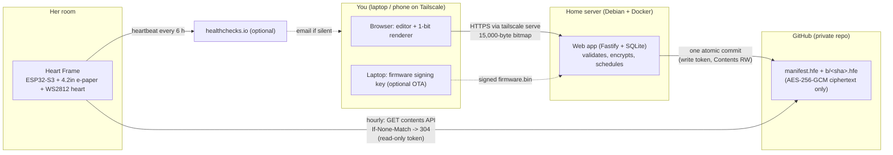
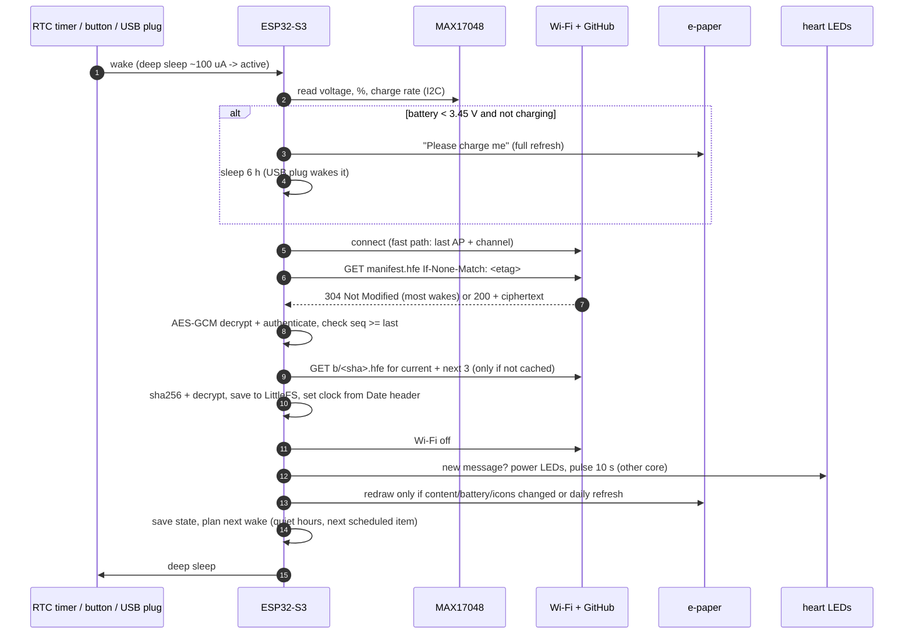

## 2. Overview, architecture and final design decisions

### What she experiences

A white frame on her desk shows a message in your handwriting-style fonts, a drawing or a dithered photo. When a *new* message arrives, a heart below the screen glows hot pink and slowly "breathes" twice (about 10 s). A "surprise" message makes it beat like a heart instead. The screen then stays put with zero power, because e-paper holds its image.

A small battery indicator sits in the top-right corner. When the charge gets low, a "please charge me" note appears. She charges it over USB-C every few months. If she changes her Wi-Fi, she holds the button for 5 seconds and follows the QR code on the screen.

### What you do

You open `https://<server>.<tailnet>.ts.net` on your phone or laptop and write a message. You see exactly what the e-paper will show, 1-bit and pixel for pixel. Then you **Add to queue** (one per day at 7:30), **Schedule** it for a date (Christmas morning), or **Send now ♥**, which makes it appear within the hour.

### Architecture

Things to notice:

- **The frame never talks to your server**, so there is no inbound port on your network. If the server is off, the frame keeps showing already-published messages, including up to 39 future ones on schedule.
- **GitHub only ever holds ciphertext.** The key is on the server (a Docker secret file) and in the frame (NVS flash). That's all.
- **Two tokens, least privilege.** The frame's token can only read one repo. The server's can read and write that same repo and nothing else.

### One wake cycle

### Final design decisions

| Decision | Choice | Why |
|---|---|---|
| Microcontroller board | **Adafruit ESP32-S3 Feather, 8 MB flash, no PSRAM (#5323)**, plus a spare | Charger, USB-C, MAX17048 and switchable NeoPixel/I²C power built in. About 100 µA asleep. Well documented, in stock at PiShop.ca. 8 MB fits two 3 MB OTA slots plus a 1.9 MB cache. |
| Display | **Waveshare 4.2" e-Paper Module V2** (400×300, SSD1683 = Good Display GDEY042T81) | Pre-mounted on a PCB with a cable (beginner-proof), supported by GxEPD2, about 4 s full refresh. |
| Colour | Black/white, not tri-colour | See review #9. The pink lives in the heart. |
| Battery | **Protected 18650, 2200 mAh (Adafruit #1781)** | Steel can, built-in protection, correct JST-PH polarity. Costs about 9 mm of extra depth compared with a pouch cell. |
| Fuel gauge | Built-in **MAX17048**, raw registers, hibernate mode | More accurate than a voltage curve, and no reset on every wake. |
| Heart | 4 × WS2812B behind a 36 mm heart diffuser, **12 mm** away, inside a white light chamber | 10–15 mm with a white chamber gives an even glow. 4 LEDs cover a 36 mm heart without hot spots. |
| LED power | AO3401A P-MOSFET high-side switch + 2N7000 driver, soft-start, 0.5 A PTC fuse | Zero idle drain, and no back-powering. |
| Firmware | PlatformIO + **pioarduino** (Arduino-ESP32 3.3.11 / IDF 5.5.5), GxEPD2, Adafruit NeoPixel, ArduinoJson 7, WiFiManager; versions pinned | Boring, maintained, well documented. |
| Transport | GitHub **contents API**, raw media type, ETag/304, keep-alive; full Mozilla CA bundle | Fresh data, cheap checks, no pinning time bomb. |
| Message security | **AES-256-GCM** envelope (manifest and bitmaps), manifest sequence numbers (anti-rollback), content-addressed bitmaps | Privacy at rest; nothing can be injected without the key. |
| Provisioning | Secrets over **USB serial** into NVS (`tools/provision.py`), Wi-Fi via a password-protected portal | No secrets in firmware images, so OTA binaries are safe to publish. |
| Scheduling | The server computes exact times; the frame shows "latest item ≤ now" | Simple, testable on-device logic that works offline. |
| Web app | React + TS (Vite) frontend; Node 24 + Fastify + **SQLite** (better-sqlite3); rendering in the browser | Single file database, no Postgres to maintain; WYSIWYG preview. |
| Hosting | Docker Compose on your Debian box, **Tailscale Serve** for HTTPS inside your tailnet | Valid certificate, no port forwarding, no public exposure. |
| OTA (stretch) | Signed with ECDSA P-256 (key on your laptop), rollback-safe | A compromised server can't flash her frame. |
| Enclosure | Parametric **OpenSCAD**; SLA **9600 matte white** resin at JLC3DP, M3 threaded inserts; paper template and a cheap PLA dry run first | Smooth white finish, tight tolerances, cheap, ships to Ontario in about 1–2 weeks. |
| Size | About **119 × 149 × 35 mm** (W × H × D) plus stand fins | Driven by the module (103 × 78.5 mm), a centred window, the heart chamber and the 18650. |
